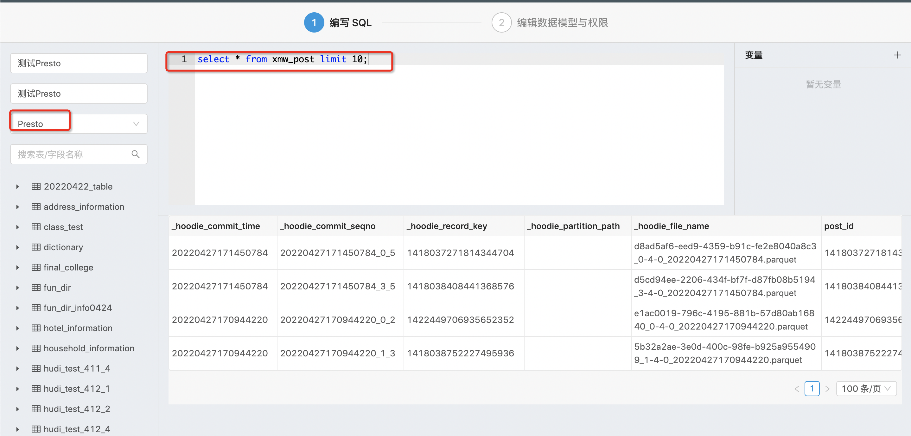

# Davinci本地开发-后端启动过程

参考:

https://github.com/edp963/davinci/blob/dev-0.3/CONTRIBUTING-CH.md#%E5%BC%80%E5%8F%91%E6%8C%87%E5%BC%95

https://edp963.github.io/davinci/docs/zh/1.1-deployment

## 参数
版本: davinci 0.3.1
mysql: 5.7.1
服务器: 172.16.10.206
操作系统: win10 2021
IDE: IDEA 社区版2021

## 拉取代码
git clone git@github.com:edp963/davinci.git

IDEA导入项目.
由于一些依赖阿里云仓库没有,因此需要切换到maven中央仓库下载.

## 配置环境变量
启动server模块的edp.DavinciServerApplication.
第一次启动失败,需要配置环境变量DAVINCI3_HOME.在IDEA的启动配置中设置即可.

## 去206服务器创建数据库
mysql -h 172.16.10.72 -u root -p123456
create database davinci charset utf8mb4;

## 修改数据库初始化脚本
cd /workspace/davinci-assembly_0.3.1-0.3.1-SNAPSHOT-dist-rc/bin
chmod u+x initdb.sh
# 将数据库的连接方式配置好, 数据库使用刚刚创建的.
nano bin/initdb.sh
./initdb.sh

## 回到IDEA,修改配置
cd conf
cp application.yml.example application.yml
对application.yml按要求做修改

### 配置server
```yaml
# 服务器
server:
  address: 172.16.10.206
  port: 8081

# 数据库
spring:
  datasource:
    url: jdbc:mysql://172.16.10.72:3306/davinci?useUnicode=true&characterEncoding=UTF-8&zeroDateTimeBehavior=convertToNull&allowMultiQueries=true
    password: 123456

# 邮件
spring:
  mail:
    host: smtp.163.com
    port: 25
    username: hc_zhongtai2022@163.com
    fromAddress: 
	# 这里需要填163的邮箱授权码,不是用户密码.
    password: YGRWRRBLAIHGYPXB
    nickname: Davinci
	
# 截图TODO:::::
screenshot:
  default_browser: CHROME
  timeout_second: 600
  chromedriver_path: $your_chromedriver_path$
```

## 补充
将前端打包后的代码,放到davinci-ui目录中,放回到后端根目录,后端运行需要它.
可以直接使用

## 运行
idea 运行项目即可

## swagger UI
http://localhost:8081/swagger-ui.html

# Davinci本地开发-前端启动过程
webapp这个目录就是前端代码.
为了防止安装node_modules后, 小文件太多IDEA性能下降.
将这个目录复制出来单独运行.

```bash
cp -r davinci/webapp webapp
cd webapp
# 可能需要挂梯子
npm install
# 启动会报错.多多尝试.只要可运行即可,具体的错误不影响运行可暂时不管.
npm start
```

# 使用

已注册用户
test/test1234
hc_zhongtai2022@163.com


# Davinci安装过程-服务器部署

## 参数
版本: davinci 0.3.1
mysql: 5.7.1
服务器: 172.16.10.206
操作系统: centos 7

安装包拷贝到172.16.10.206

## 解压
unzip /software/davinci-assembly_0.3.1-0.3.1-SNAPSHOT-dist-rc.zip
mv davinci-assembly_0.3.1-0.3.1-SNAPSHOT-dist-rc/ /workspace/

## 配置环境变量
export DAVINCI3_HOME=/workspace/davinci-assembly_0.3.1-0.3.1-SNAPSHOT-dist-rc

## 创建数据库
mysql -h 172.16.10.72 -u root -p123456
create database davinci charset utf8mb4;

## 修改数据库初始化脚本

cd /workspace/davinci-assembly_0.3.1-0.3.1-SNAPSHOT-dist-rc/bin
chmod u+x initdb.sh
# 将数据库的连接方式配置好, 数据库使用刚刚创建的.
nano bin/initdb.sh
./initdb.sh

## 初始化配置
cd /workspace/davinci-assembly_0.3.1-0.3.1-SNAPSHOT-dist-rc/config
cp application.yml.example application.yml
nano application.yml

### 配置server
```yaml
# 服务器
server:
  address: 172.16.10.206
  port: 8081

# 数据库
spring:
  datasource:
    url: jdbc:mysql://172.16.10.72:3306/davinci?useUnicode=true&characterEncoding=UTF-8&zeroDateTimeBehavior=convertToNull&allowMultiQueries=true
    password: 123456

# 邮件
spring:
  mail:
    host: smtp.163.com
    port: 25
    username: hc_zhongtai2022@163.com
    fromAddress: 
	# 这里需要填163的邮箱授权码,不是用户密码.
    password: YGRWRRBLAIHGYPXB
    nickname: Davinci
	
# 截图TODO:::::
screenshot:
  default_browser: CHROME
  timeout_second: 600
  chromedriver_path: $your_chromedriver_path$
```

## 运行
cd /workspace/davinci-assembly_0.3.1-0.3.1-SNAPSHOT-dist-rc/bin
sh start-server.sh

# FAQ

## （1）如何集成Presto？

需要下载presto-jdbc依赖放置到达芬奇的lib目录下即可，下载地址如下：

```
https://mvnrepository.com/artifact/com.facebook.presto/presto-jdbc/0.260
```

最后效果如下：

