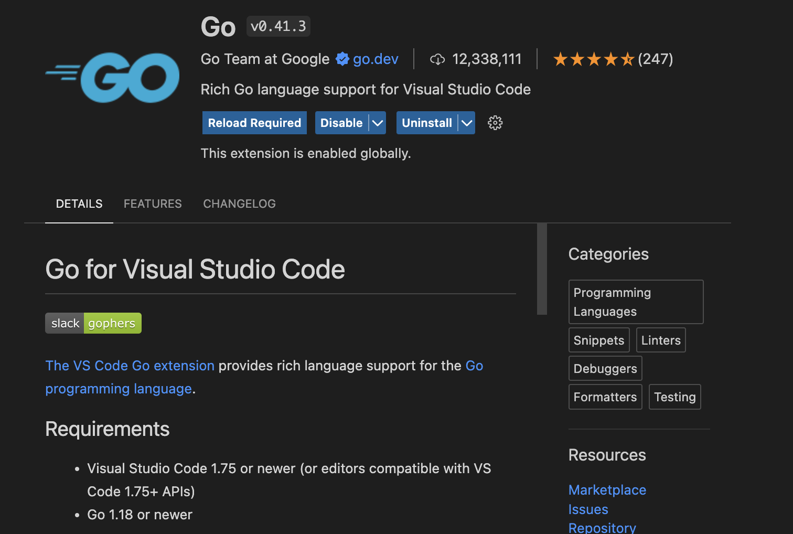

# 如何安装

​	版本下载：[Go All Releases](https://go.dev/dl/)

​	如果是Mac系统下载之后是一个.dmg文件，默认会安装在/usr/local/go路径下。

​	配置环境变量：

```shell
> vim ~/.bashrc

export PATH=$PATH:/usr/local/go/bin

> source ~/.bashrc
```

​	查看版本如果正常输出说明安装无误。

```shell
> go version
go version go1.22.0 darwin/arm64
```

​	镜像加速：

```shell
go env -w GOPROXY="https://goproxy.cn"
```

​	关闭GOSUMDB:

```shell
go env -w GOSUMDB="off"
```

​	如果有其它配置需要修改的，在修改之后通过如下命令验证修改是否生效：

```shell
go env
```


# IDE如何选择？

​	可以选择VSCode或者[Goland](https://www.jetbrains.com/go/download)，如果选择的是VSCode需要安装Go插件，选择左侧工具栏【Extensions】搜索Go即可，如下图：


# 如何创建项目？

​	创建一个名称为go-test的项目：

```shell
mkdir go-test && cd go-test
go mod init go-test
```

​	创建一个hello.go文件，编写一个实例：

```go
package main

import "fmt"

func main() {
  fmt.Println("Hello World")
}
```

【调试运行】

```shell
go run main.go
```

【编译与运行】

​	打包编译并且运行（可以使用go clean将打包好的可执行文件清理）

```shell
go build && ./go-test
```


# 如下使用外部库？

​	例如：使用Gin框架启动http服务。

​	下载gin的外部库

```shell
go install github.com/gin-gonic/gin@latest
```

​	编写实例，代码如下：

```go
package main

import (
  "net/http"

  "github.com/gin-gonic/gin"
)

func main() {
  // 创建一个新的Gin引擎
  r := gin.Default()

  // 定义一个GET路由
  r.GET("/", func(c *gin.Context) {
    c.JSON(http.StatusOK, gin.H{
      "message": "Hello, this is a GIN based web service!",
    })
  })

  // 启动服务器监听8080端口
  r.Run(":8080")
}
```

