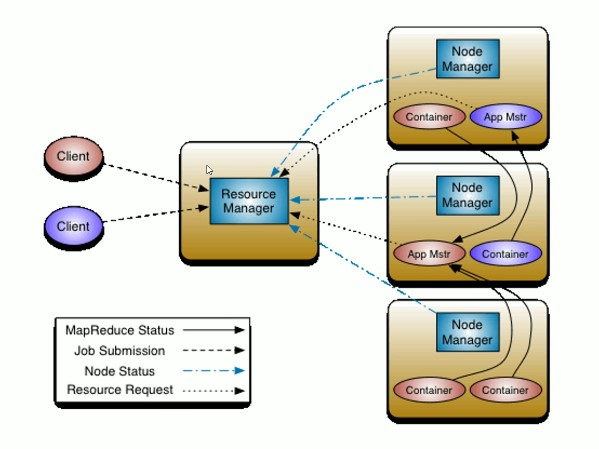
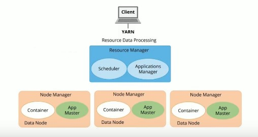
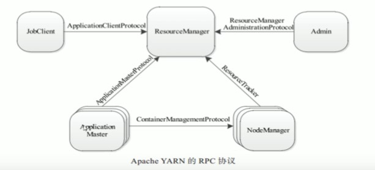
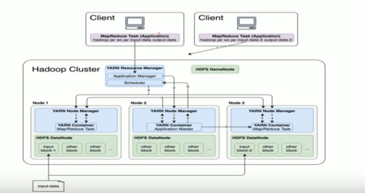

# 一.基础架构

​		

​		涉及到的概念如下：

​       （1）**ResourceManager**

​       （2）**NodeManager**

​       （3）**ApplicationMaster**（App Mstr）

​	   （4）**Client**

​       （5）**Container**容器（资源抽象）

​         核心交互流程如下：

​        （1）**MR作业状态汇报**：Container（Map | Reduce Task） -> Container（MrAppMaster）

​		（2）**MR作业提交**：Client -> RM

​		（3）**节点状态汇报**：NM -> RM

​		（4）**资源申请**：MrAppMaster -> RM

# 二.集群角色

## 1.ResourceManager

​		RM是Yarn中的主控节点，决定系统中所有应用程序之间资源分配的最终权限，即最终仲裁者。

​		RM接受用户的作业提交，并通过NodeManager分配，管理各个机器上的计算资源，这里的计算资源被抽象成Container。

​		RM也提供一个可插拔组件（Scheduler），负责为各种正在运行的应用程序分配资源，根据策略进行调度。

​		ResourceManager主要由如下两个组件构成：

​       （1）**调度器**（Scheduler）：根据容量，队列等限制条件将系统中的资源分配给各个正在运行的应用程序中。

​	   （2）**应用程序管理器**（Applications Manager）：负责管理整个系统中所有应用程序，包括应用程序提交，与调度器协商资源以启动ApplicationMaster，并监控ApplicationMaster运行状态并在失败时重启等。

​			

## 2.NodeManager

​		NM是Yarn中的从节点，一般一台机器上一个，负责管理本机的计算资源。NM会根据RM命令，启动Container容器，监视容器资源使用情况，并向RM主角色汇报资源使用情况。所以它的职责如下：

​      （1）定时向RM汇报本节点上的资源使用情况和各个Container的运行状态。

​      （2）接受并处理来自AM的Container启停等请求。

## 3.ApplicationMaster

​		用户提交的每个应用程序均包含一个AM。应用程序内的管理角色，负责程序内部各阶段的资源申请，监督程序的执行情况。主要职责如下：

​		（1）与RM调度器协商以获取资源（用Container表示）；将得到的任务进一步分配给内部任务。

​		（2）与NM通信以启停任务。

​		（3）监控所有任务运行状态，并在任务运行失败时重新为任务申请资源以重启任务。

​		

​		当前YARN自带了两个AM实现，分别是用于演示AM编写方法的程序distributedshell和运行MR应用程序的MRAppMaster。

# 三.容器

​		Container是YRAN中的**资源抽象**，它封装了某个节点上的多维度资源，如内存，CPU，磁盘，网络等。当AM向RM申请资源时，RM为AM返回的资源便是用Container表示的。Yarn会为每个任务分配一个Container，且该任务只能使用该Container中描述的资源。需要注意的是，Container不同于MRv1中的slot（槽位），它是一个动态资源划分单位，是根据应用程序的需求动态生成的。当前YARN仅支持CPU和内存两种资源，底层使用了轻量级资源隔离机制Cgroup进行资源隔离。大致如下图：

# 四.通信协议

​		Yarn底层使用**RPC**（Remote Procedure Call）协议实现通信。好处是基于RPC进行远程调用就像本地调度一样。在RPC协议中，通信双方有一端是Client，另一端为Server，且Client总是主动连接Server的。因此，Yarn采用的是拉（pull-based）通信模型。Yarn中主要的通信协议如下图：

​	①**ApplicationClientProtocol**

​		JobClient（作业提交客户端）与RM之间的协议。客户端通过该RPC协议提交应用程序，查询应用程序状态等。

​	②**ResourceManagerAdministrationProtocol**

​		Admin（管理员）与RM之间的通信协议。Admin通过该RPC协议更新YARN集群系统配置文件，比如节点黑白名单，用户队列权限等。

​	③**ApplicationMasterProtocol**

​		AM与RM之间的协议。AM通过该RPC协议向RM注册和撤销自己，并为各个任务申请资源。

​	④**ContainerManagementProtocol**

​		AM与NM之间的协议。AM通过该协议要求NM启动或者停止Container，获取各个Container的使用状态等信息。

​	⑤**ResourceTracker**

​		NM与RM之间的协议。NM通过该协议向RM注册，并定时发送心跳信息汇报当前节点的资源使用情况和Container运行情况。

# 五.执行流程

​		当用户想YARN中提交一个应用程序，YARN将分为如下两个阶段运行该应用：

​		（1）启动ApplicationMaster。

​		（2）由ApplicationMaster创建应用程序，为它申请资源并监控整个运行过程至运行完成。

​		 如下图：

## 		1.MR提交YARN交互流程

​			①用户向YARN中提交应用程序，其中包括ApplicationMaster程序，启动ApplicationMaster的命令，用户程序等。

​			②ResourceManager为该应用程序分配第一个Container，并与对应的NodeManager通信，要求它在这个Container中启动应用程序的ApplicationMaster。

​			③ApplicationMaster首先向ResourceManager注册，这样用户可以直接通过ResourceManager查看应用程序的运行状态，然后它将为各个任务申请资源，并监控它的运行状态至运行结束，即重复④~⑦。

​			④ApplicationMaster通过RPC协议向ResourceManage申请和领取资源。

​			⑤一旦ApplicationMaster申请到资源后，与对应的NodeManager通信，要求启动任务。

​			⑥NodeManager为任务设置好运行换环境（包括环境变量，JAR包，二进制程序等）后，将任务启动命令写到一个脚本中，并通过运行该脚本启动任务。

​			⑦各个任务通过某个RPC协议向ApplicationMaster汇报自己的状态的进度，以让ApplicationMaster随时掌握各个任务的运行状态，从而可以在任务失败时重启。在应用程序运行过程中，用户可以随时通过RPC向ApplicationMaster查询应用程序的当前状态。

​			⑧应用程序运行完成后，ApplicationMaster向ResourceManager注销并关闭自己。