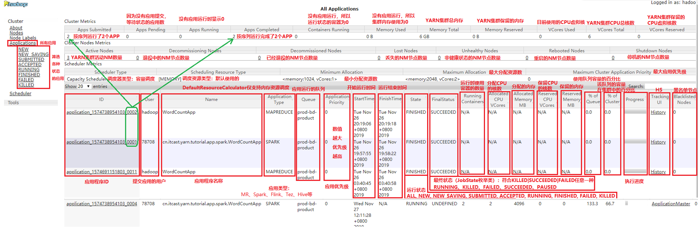

# 一.WebUI服务

​		默认情况下访问ResourceManager的8088端口可以访问该服务，该服务用于展示各种应用程序的运行状态等其他指标。涉及到yarn-site.xml参数如下：

```properties
yarn.resourcemanager.webapp.address=${yarn.resourcemanager.hostname}:8088
```

​		访问之后，如下图所见：



# 二.JobHistoryServer服务

​		默认情况下，YARN重启之后，已经完成的作业和正在执行的作业都会丢失。针对正在执行的作业如果需要在启动之后能够看到，需要开始RM重启机制来恢复（yarn.nodemanager.recovery.enabled）。

​		**JobHistoryServer服务可以存储已经运行完成的MR应用程序作业历史信息**。并不会存储其他类型的应用程序的作业历史信息。当启动该服务时，同时**建议开启日志聚合功能**，利于统一管理和分析分析，否则每个Container的运行日志是存储在NodeManager节点本地，查看日志时需要访问各个NodeManager节点。具体的配置方式涉及到两步：

​		【步骤一】在mapred-site.xml配置文件中添加如下配置项：

```xml
  <!-- jobhistory 服务RPC地址 -->
  <property>
    <name>mapreduce.jobhistory.address</name>
    <value>bigdata04:10020</value>
  </property>
  <!-- jobhistory web ui 访问端口 -->
  <property>
    <name>mapreduce.jobhistory.webapp.address</name>
    <value>bigdata04:19888</value>
  </property>
```

​		【步骤二】开启日志聚合

```xml
  <!-- 开启yarn日志聚集功能，收集每个容器的日志集中存储在一个地方，默认：false -->
  <property>
     <name>yarn.log-aggregation-enable</name>
     <value>true</value>
  </property>
  <!-- 日志保留时间设置为一个月 -->
  <property>
     <name>yarn.log-aggregation.retain-seconds</name>
     <value>2592000</value>
  </property>
  <property>
     <name>yarn.log.server.url</name>
     <value>http://bigdata04:19888/jobhistory/logs</value>
  </property>
```

​		配置完毕之后，运行如下命令启动历史服务器：

```shell
mr-jobhistory-daemon.sh start historyserver
```

```sgell
mapred --daemon start historyserver
```

​		启动之后查看进程名称为JobHistoryServer。启动之后访问默认19888端口可以查看历史运行的应用程序信息。


​		MR应用程序在运行时，是通过AM（**MRAppMaster**类）将日志写到HDFS中，会生成.jhist、.summary和_conf.xml文件。其中.jhist文件是MR程序的计数信息，.summary文件是作业的摘要信息，_conf.xml文件是MR程序的配置信息。

​		MR应用程序启动时，会把作业信息存储到**${yarn.app.mapreduce.am.staging-dir}/${user}/.staging/${job_id}**目录下，这里的yarn.app.mapreduce.am.staging-dir参数默认为/tmp/hadoop-yarn/staging。

​		MR应用程序运行完成后，作业信息会被临时移动到**${mapreduce.jobhistory.intermediate-done-dir}/${user}**目录下，  这里的mapreduce.jobhistory.intermediate-done-dir默认为${yarn.app.mapreduce.am.staging-dir}/history/done_intermediate。

​		等待${mapreduce.jobhistory.move.interval-ms}配置项的值（默认180000毫秒=3分钟）后，会把${mapreduce.jobhistory.intermediate-done-dir}/${user}下的作业数据移动到${mapreduce.jobhistory.done-dir}/${year}/${month}/${day}/${serialPart}目录下。此时**.summary**文件会被删除，因为**.jhist**文件提供了更详细的作业历史信息。

​		需要注意的是：历史服务中的作业历史信息不是永久存储的，在默认情况下，作业历史清理程序默认按照86400000毫秒（一天）的频率去检查要删除的文件，只有在文件早于mapreduce.jobhistory.max-age-ms（一天）时才进行删除。JHS的历史文件的移动和删除操作由HistoryFileManager类完成。

​		以上涉及的几个参数如下：

```properties
mapreduce.jobhistory.intermediate-done-dir：/mr-history/intermediate（配置）
mapreduce.jobhistory.intermediate-done-dir：/mr-history/done（配置）
mapreduce.jobhistory.cleaner.enable: true（默认）
mapreduce.jobhistory.cleaner.interval-ms: 86400000（1天）
mapreduce.jobhistory.max-age-ms: 86400000（1天）
```

​		生产环境上可以根据实际情况去配置。


​		整个历史服务器的执行过程大致梳理如下：

​		①客户端提交MR应用程序到RM；

​		②在/tmp/logs/<user>/logs/application_timestamp_xxxx中创建应用程序文件夹；

​		③MR作业在群集上的YARN中运行；

​		④MR作业完成，在提交作业的作业客户上报告作业计数器；

​		⑤将计数器信息（.jhist文件）和job_conf.xml文件写入/user/history/done_intermediate/<user>/job_timestamp_xxxx

​		⑥然后将.jist文件和job_conf.xml从/user/history/done_intermediate/<user>/移动到/user/history/done目录下；

​		⑦来自每个NM的Container日志汇总到/tmp/logs/<用户ID>/logs/application_timestamp_xxxx。


# 三.TimelineServer 服务

​		由于**Job History Server仅对MapReduce应用程序提供历史信息支持**，其他应用程序的历史信息需要分别提供单独的HistoryServer才能查询和检索。例如Spark的Application需要通过Spark自己提供的org.apache.spark.deploy.history.HistoryServer来解决应用历史信息。为了解决这个问题，YARN新增了**Timeline Server**（时间轴服务）组件，以通用的方式存储和检索应用程序当前和历史信息。

​		到目前为止，有V1、V1.5和V2共三个版本。V1基于LevelDB实现。V1.5在V1的基础上改进了扩展性。V2还处于alpha状态，实现了读写分离，后端依赖于HBase。

​		开启时间轴服务需要在yarn-site.xml上进行如下配置：

```xml
<!-- 开启时间轴服务 -->
<property>
	<name>yarn.timeline-service.enabled</name>
	<value>true</value>
</property>
<!-- 设置YARN Timeline服务地址 -->
<property>
	<name>yarn.timeline-service.hostname</name>
	<value>node2.itcast.cn</value>
</property>
<!-- 设置YARN Timeline服务启动RPC服务器的地址，默认端口10200 -->
<property>
	<name>yarn.timeline-service.address</name>
	<value>bigdata04:10200</value>
</property>
<!-- 设置YARN Timeline服务WebUI地址 -->
<property>
	<name>yarn.timeline-service.webapp.address</name>
	<value>bigdata04:8188</value>
</property>
<!-- 设置RM是否发布信息到Timeline服务器  -->
<property>
	<name>yarn.resourcemanager.system-metrics-publisher.enabled</name>
	<value>true</value>
</property>
<!-- 设置是否Timelinehistory-servic中获取常规信息,如果为否,则是通过RM获取 -->
<property>
	<name>yarn.timeline-service.generic-application-history.enabled</name>
	<value>true</value>
</property>
<!-- 设置http是否允许CORS跨域共享 -->
<property>
	<name>yarn.timeline-service.http-cross-origin.enabled</name>
	<value>true</value>
</property>
<!-- leveldb是用于存放Timeline历史记录的数据库,此参数控制leveldb文件存放路径所在 -->
<!-- 默认值:${hadoop.tmp.dir}/yarn/timeline,其中hadoop.tmp.dir在core-site.xml中设置 -->
<property>
    <name>yarn.timeline-service.leveldb-timeline-store.path</name>
    <value>${hadoop.tmp.dir}/yarn/timeline</value>
</property>
<!-- 设置leveldb中状态文件存放路径 -->
<!-- 默认值:${hadoop.tmp.dir}/yarn/timeline -->
<property>
    <name>yarn.timeline-service.leveldb-state-store.path</name>
    <value>${hadoop.tmp.dir}/yarn/timeline</value>
</property>
<!-- 启动Timeline数据自动过期清除 -->
<property>
    <name>yarn.timeline-service.ttl-enable</name>
    <value>true</value>
</property>
<!-- 设置Timeline数据过期时间,单位ms -->
<!-- 默认值:604800000,即7天 -->
<property>
    <name>yarn.timeline-service.ttl-ms</name>
    <value>604800000</value>
</property>
```

​		配置完毕在对应的节点启动时间轴服务，命令如下：

```shell
yarn --daemon start timelineserver
```

​		启动之后查看ApplicationHistoryServer进程是否正常。