# 一.基本介绍

## 1.调度器策略

​		YARN上主要支持三种调度器：**FIFO Scheduler**（先进先出），**Capacity Scheduler**（容量调度），**Fair Scheduler**（公平调度）。在Apache版本中默认使用容量调度。如果需要使用其他调度器，可以在yarn-site.xml中的**yarn.resourcemanager.scheduler.class**参数进行配置。

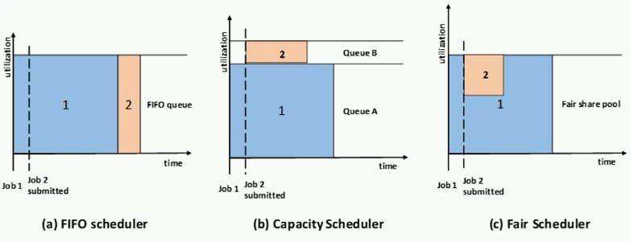

## 2.工作队列

​		工作队列（Queue）是从不同客户端收到的各种任务的集合。YARN默认只有一个可用于提交任务的队列default。当前用户也可以配置队列形成队列数结构。Scheduler的本质就是根据不同规则或者策略去分配资源给队列中的任务。

## 3.队列树

​		在YARN中，有**层级队列组织**方法。它们构成一个树形结构，而跟队列称之为root。所有的引用都运行在叶子队列中。对于任何一个应用都可以显示地指定它属于的队列，也可以不指定从而使用username或者default队列。

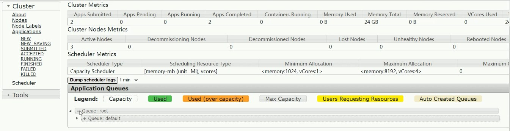

​	

# 二.FIFO Scheduler

## 1.设计思路

​		FIFO Scheduler是Hadoop1.x中JobTracker原有的调度器实现，次调度器在YARN中保存了下来。

​		该策略是**先进先出**的思想，即先提交的应用程序先运行。调度工作不考虑优先级和范围，适应于负载较低的小规模集群。当使用大型共享集群时，它的效率较低且会导致一些问题。

​		FIFO Scheduler拥有一个控制全局的队列queue，默认queue名称为default，该调度器会获取当前集群上所有的资源信息作用于这个全局的queue。

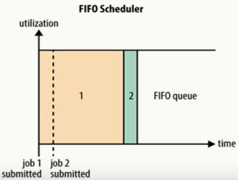

​		**优点**：无需配置，先到先得，易于执行。

​		**缺点**：任务优先级不会变高，因此高优先级作业需要等待，不合适共享集群。


## 2.配置方式

​		修改yarn-site.xml文件中，配置如下参数：

```xml
<property>
  <name>yarn.resourcemanager.scheduler.class</name>
  <value>org.apache.hadoop.yarn.server.resourcemanager.scheduler.fifo.FifoScheduler</value>
</property>
```


# 三.Capacity Scheduler

## 1.设计思路

​		Capacity Scheduler容量调度室Hadoop3.x默认的调度策略。该策略允许**多个组织共享整个集群资源**，每个组织可以获得集群的一部分计算能力。通过为每个组织分配专门的队列，然后再为每个队列分配一定的集群资源没这样整个集群就可以通过设置多个队列的方式给多个组织提供服务了。

​		Capacity可以理解成一一个个的资源队列，队列内部又可以垂直划分，这样一个组织内部的多个成员就可以共享这个队列资源了，在一个队列内部，资源的调度是采用的是先进先出的策略。

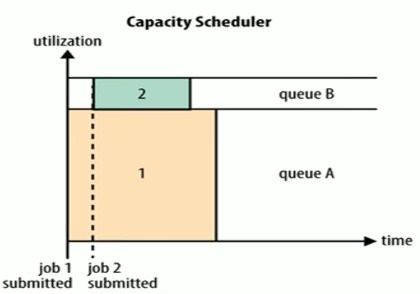

​		例如下面这个例子：

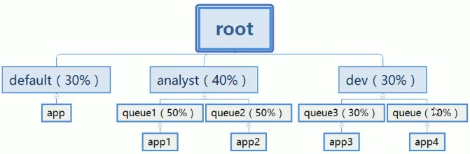

​		在这个例子中default队列占30%资源，analyst和dev分别占40%和30%资源。而analyst和dev各有两个子队列，子队列在父队列的基础上再分配资源。

​		每个队列里的应用以FIFO方式调度，每个队列可设定一定比例的资源最低保证和使用上限防止滥用。而当一个队列的资源有剩余时，可暂时将剩余资源共享给其他队列。

​		该策略有如下好处：

​		（1）**层次化的队列设计**：更容易，更合理分配和限制资源使用。

​		（2）**容量保证**：每个队列上都可以设置一个资源占比，保证每个队列都不会占用整个集群资源。

​		（3）**安全**：每个队列有严格的访问控制。用户只能向自己的队列里提交任务，而且不能修改或者访问其他队列的任务。

​		（4）**弹性分配**：空间资源可以被分配给任何队列。当对个队列出现争用时，则会按照权重比例进行平衡。

​		（5）**多租户租用**：通过队列的容量限制，多个用户就可以共享同一个集群，同时保证每个队列分配到自己的容量，提高利用率。

​		（6）**操作性**：YARN支持动态修改调整队列容量，权限等分配，可以在运行时直接修改。

​		（7）**基于用户/组的队列映射**：允许用户基于用户或者组去映射一个作业到特定队列。


​		Hadoop默认策略就是Capacity，因此官方自带默认配置HADOOP_CONF/capacity-scheduler.xml中的默认配置为只有一个队列default，并且占集群整体容量的100%。

```xml
   <property>
     <name>yarn.scheduler.capacity.root.queues</name>
     <value>default</value>
   </property>
   <property>
     <name>yarn.scheduler.capacity.root.default.capacity</name>
     <value>100</value>
   </property>
```

## 2.配置方式

​		首先需要开启调度器，需要在yarn-site.xml中配置如下参数，默认其实就是capacity策略。

```xml
<property>
     <name>yarn.resourcemanager.scheduler.class</name>
     <value>org.apache.hadoop.yarn.server.resourcemanager.scheduler.capacity.CapacityScheduler</value>
   </property>
```

​		然后capacity的核心就是队列的分配和使用，修改HADOOP_CONF/capacity-scheduler.xml文件，可以配置队列。默认有一个预定义的队列root，所有的队列都是它的子队列。队列分配支持层次化配置，同级之间使用逗号分隔，形如：yarn.scheduler.capacity.<queue-path>.queues。比如下面这个例子：

```xml
   <property>
     <name>yarn.scheduler.capacity.root.queues</name>
     <value>a,b,c</value>
   </property>
   <property>
     <name>yarn.scheduler.capacity.root.a.queues</name>
     <value>a1,a2</value>
   </property>
   <property>
     <name>yarn.scheduler.capacity.root.b.queues</name>
     <value>b1,b2</value>
   </property>
```

​		其他的一些核心参数如下：

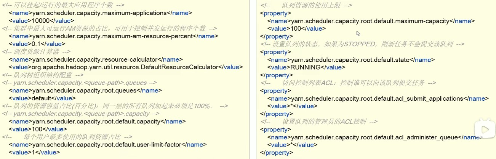

## 3.动态更新配置

​		修改完成capacity-scheduler.xml之后，可以执行如下命令让配置动态生效：

```shell
yarn rmadmin -refreshQueues
```

​		但是需要有如下几点要重点注意的：

​		（1）**队列不能被删除，只能新增**。

​		（2）更新队列配置需要是有效值。

​		（3）同层级队列容量限制相加需为100%。

## 4.实战案例

​		假设需要针对YARN设置如下层次的队列树，满足不同租户的需求。要求使用Capacity Scheduler调度策略记性配置。

```shell
root
  |-- prod            # 生产队列
  |-- dev             # 开发队列
        |-- eng       # 工程师队列
        |-- science   # 科学家队列
```

​		修改capacity-scheduler.xml文件，配置如下：

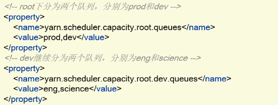

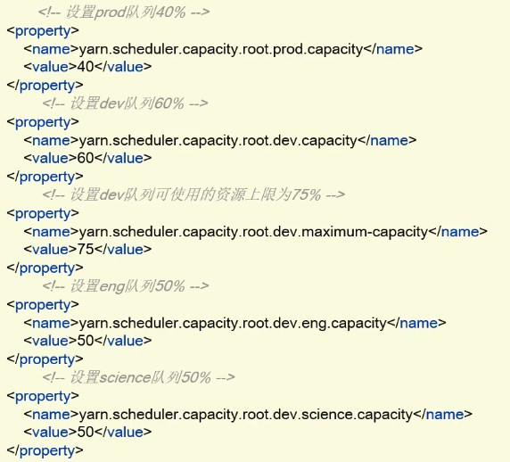

​		注意事项：

​		（1）这里我们设置prod为40%，dev为60%并不是分别资源上限最大分别为40%和60%，这里表示两者都繁忙的时候差不多配比为40：60。其实如果某一个方繁忙资源到达上限而不够，而另一方资源空闲，则繁忙的一方可以抢占资源。所以这个例子中配置dev队列可使用的资源上限最大为75%，这意味着最多抢占75%，而另外25%是无法抢占的。

​		（2）而prod由于没有设置maximum-capacity属性，它有可能会占用集群的全部资源。

​		（3）在采用该策略下，队列名必须是队列树中的叶子节点的名称，如果使用root.dev.eng是无效的。

​		（4）在提交MR程序时通过-Dmapreduce.job.queuename=prod来指定提交的队列。

​		最后达到的效果如下图：

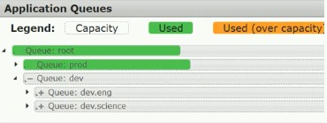


## 5.注意事项

### 资源计算器设置

​	在Spark on Yarn和Flink on Yarn下，特别需要调整资源计算器。这涉及到capacity-scheduler.xml中的yarn.scheduler.capacity.resource-calculator参数。默认的是org.[apache](https://so.csdn.net/so/search?q=apache&spm=1001.2101.3001.7020).hadoop.yarn.util.resource.DefaultResourseCalculator，只使用内存进行比较。应该配置为DominantResourceCalculator用Dominant-resource比较多维度资源，如内存，CPU等等。配置如下：

```xml
 <property>
    <name>yarn.scheduler.capacity.resource-calculator</name>
    <value>org.apache.hadoop.yarn.util.resource.DominantResourceCalculator</value>
    <!-- <value>org.apache.hadoop.yarn.util.resource.DefaultResourceCalculator</value> -->
    <description>
      The ResourceCalculator implementation to be used to compare
      Resources in the scheduler.
      The default i.e. DefaultResourceCalculator only uses Memory while
      DominantResourceCalculator uses dominant-resource to compare
      multi-dimensional resources such as Memory, CPU etc.
    </description>
  </property>
```

​		可以参考博客：https://blog.csdn.net/CPP_MAYIBO/article/details/100813294

# 四.Fair Scheduler

## 1.设计思路

​		Fair Scheduler提供了YARN应用程序**公平**地共享大型集群中资源的另一种方式。使所有应用在平均情况随着时间的流逝可以获得相等的资源份额。该策略的设计目标是为所有的应用分配公平的资源。公平调度可以在多个队列间工作，允许资源共享和抢占。

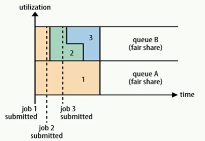

​	    那么如何理解公平调度呢？

​		假设有两个用户A和B，每个用户多有自己的队列。A启动一个作业，由于没有B的需求，它分配了集群所有可用的资源。然后B在A的作业运行时启动了一个作业，经过一段时间，A和B各自作业都使用了一半的资源。现在如果B用户在其它作业仍在运行时开始第二个作业，它将于B的另一个作业共享器资源，因此B的每个作业将拥有资源的1/4，而A继续将拥有一半的资源。结果是资源在用户之间公平地共享。

​		默认情况下，所有用户共享一个名为default的队列。可以在提交应用时指定队列，也可以通过配置根据请求包含的用户名或组来分配队列。在每个队列中，使用调度策略在运行的应用程序之间共享资源。默认设置是基于内存的公平共享。

​		公平调度的特点如下：

​		（1）**分层队列**：队列可以按层次结构排列以划分资源，并可以配置权重以按特定比例共享集群。

​		（2）**基于用户或组的队列映射**：可以根据提交任务的用户名或组来分配队列。如果任务指定了一个队列，则在该队列中提交任务。

​		（3）**资源抢占**：根据应用的配置，抢占和分配资源可以是友好的或者是强制的。默认不启用资源抢占。

​		（4）**保证最小配额**：可以设置队列最小资源，允许将保证的最小份额分配给队列，保证用户可以启动任务，当队列不能满足最小资源时，可以从其他队列抢占。当队列资源使用不完时，可以给其他队列使用。这对于确保某些用户，组或生产应用始终获得足够的资源。

​		（5）**允许资源共享**：即当一个应用运行时，如果其他队列没有任务执行，则可以使用其他队列，当其他队列有应用需要资源时再将占用的队列释放出来。所有的应用都从资源队列中分配资源。

​		（6）**默认不限制每个队列和用户可以同时运行应用数据**：可以配置来限制队列和用户并执行的应用数量。限制并行执行应用数据不会导致任务提交失败，超出的引用会在队列中等待。


## 2.配置方式

​		开启设置该策略通常涉及两个配置文件。

​		（1）在yarn-site.xml中开启该策略，并且制定资源配置文件路径，抢占功能等。

```xml
   <property>
     <name>yarn.resourcemanager.scheduler.class</name>
     <value>org.apache.hadoop.yarn.server.resourcemanager.scheduler.fair.FairScheduler</value>
   </property>
   <property>
     <name>yarn.scheduler.fair.allocation.file</name>
     <value>fair-scheduler.xml</value>
   </property>
```

​		核心的重要参数如下：

​		

​		（2）fair-scheduler.xml文件是用来进行资源分配的文件，用来列举存在的queues和他们相对应的weights和capacities。allocation文件每隔10秒加载一次。如果没有这个配置文件，调度器会在用户提交低于个应用时为其创建一个队列，队列名称就是用户名，所有的应用都会被分配到相应的用户队列中。

​		这个文件主要包括队列层次，调度策略，队列设置以及使用限制，抢占功能配置，最大最小资源，资源限制。更多的内容可以参考：https://hadoop.apache.org/docs/r2.10.1/hadoop-yarn/hadoop-yarn-site/FairScheduler.html


## 3.实战案例

​		通常在企业内部，会涉及到多个业务线，多个部门共享集群环境。如果不做资源管理和规划，整个YARN集群的资源容易被某一个用户提交的应用程序占满，其他任务只能等待，这种显示是不合理的。现在每个业务都有属于自己特定资源来运行任务，基于YARN中提供的公平调度来实现多租户资源合理。

​		（1）修改yarn-site.xml

​		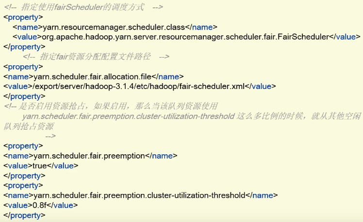

​				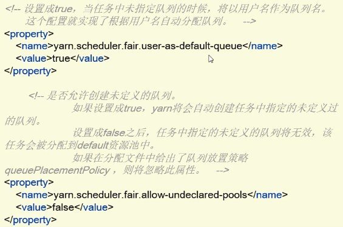

​     （2）配置fair-scheduler.xml

​	  			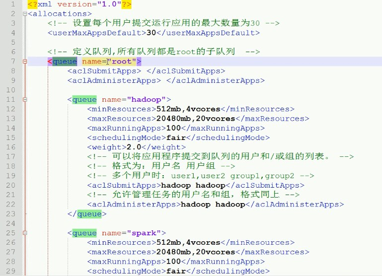

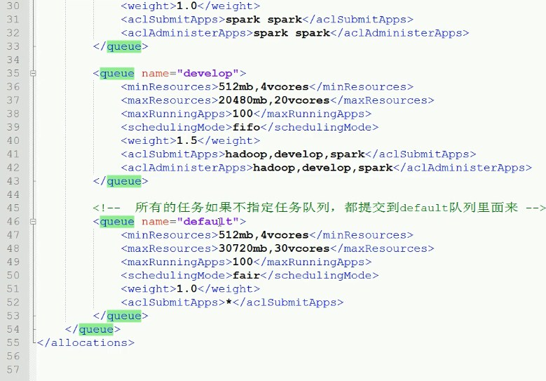

（3）重启YARN集群观察队列情况。

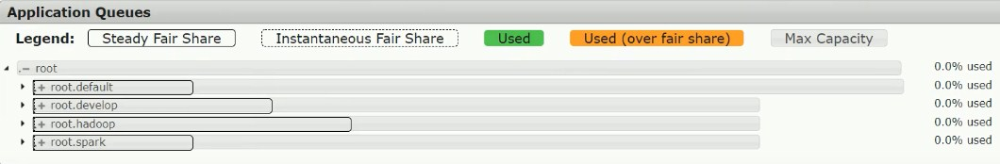

（4）创建普通用户，更新权限

```shell
useradd hadoop
passwd hadoop
groupadd supergroup
usermod -a -G supergroup hadoop
# 刷新用户组信息
hdfs dfsadmin -refreshUserToGroupsMappings
```

（5）此时通过hadoop运行一个MR程序，并且不指定队列。

```shell
yarn jar ${HADOOP_HOME}/share/hadoop/mapreduce/hadoop-mapreduce-2.10.1.jar pi 2 2
```

​		观察YARN WebUI队列中的抢占情况。

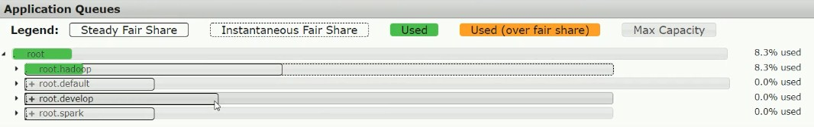

