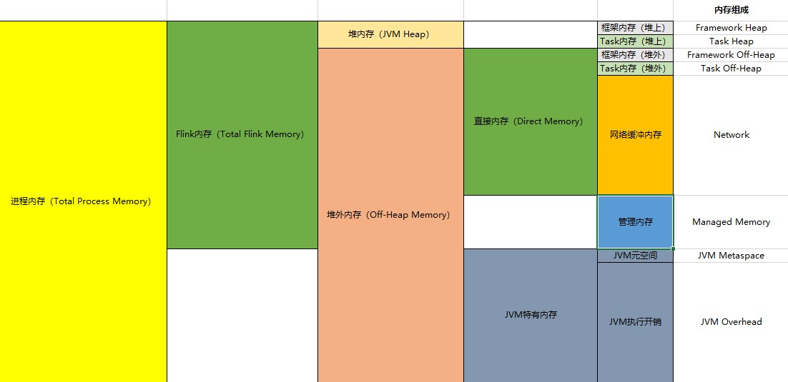
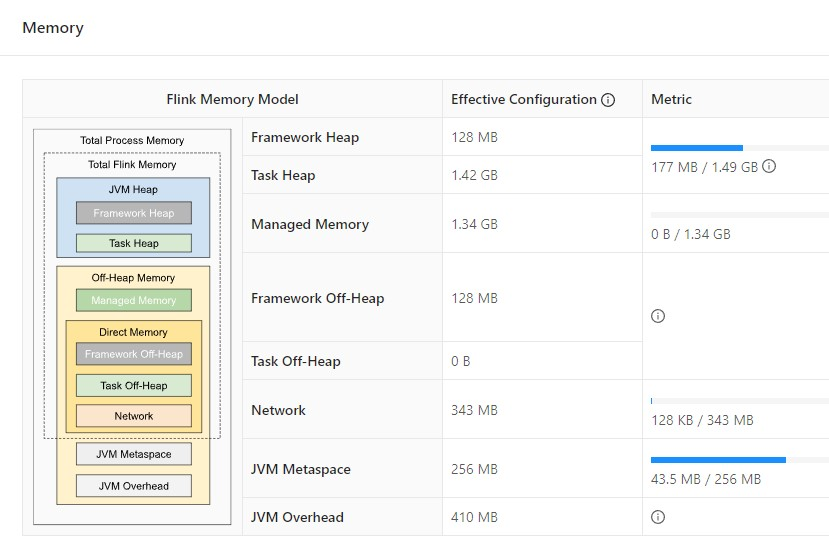

# 一.关于Flink On Yarn的几点说明

​		在Flink 1.11版本之前通过per-job模式提交应用程序至Yarn运行如下：

```shell
./flink run 
-m yarn-cluster \
-ys 1 \
-ynm flink_Filter_data \
-yjm 2G \
-ytm 2G \
-yqu default \
-p 2 \
${FLINK_HOME}/examples/streaming/TopSpeedWindowing.jar
```

​		从1.11 开始增加了通用客户端模式，参数使用-D<property=value>指定，命令如下：

```shell
./flink run -t yarn-per-job -d -p 5 \
-Dyarn.application.name=streaming-top-speed-windowing \
-Djobmanager.memory.process.size=2048mb \
-Dtaskmanager.memory.process.size=4096mb \
-Dtaskmanager.numberOfTaskSlots=2 \
${FLINK_HOME}/examples/streaming/TopSpeedWindowing.jar
```

​		

# 二.TaskManager内存模型

​		Flink1.10之后对TaskManager内存布局做了重大改动，具体可以分为如下部分：



​		各个内存区域的解释和参数如下：


# 三.合理配置内存资源与实践

​	如果我们配置了taskmanager.memory.process.size=4G，其余参数不变，计算和验证各个内存区域是否和预期一致。

​	①计算JVM Metaspace

​		JVM Metaspace=4G*0.1=406.9MB，该值介于[192MB,1024MB]，所以JVM Metaspace=406.9MB

​	②计算Flink内存

​		taskmanager.memory.flink.size=4G-406.9MB-256MB=3430.4MB

​	③计算network

​		network=3430.4MB*0.1=343.04MB，该值介于[64MB,1024MB]，所以network=343.04MB

​	④计算Managed Memory

​		Managed Memory=3430.4MB*0.4=1372.16MB

​	⑤计算Task Heap

​		Task Heap=3430.4MB-128MB-128MB-343.04MB-1372.16MB=1459.2MB

​	⑥验证

​		提交如下应用：

```shell
./flink run -t yarn-per-job -d \
-Dyarn.application.name=streaming-top-speed-windowing \
-Djobmanager.memory.process.size=2048mb \
-Dtaskmanager.memory.process.size=4096mb \
${FLINK_HOME}/examples/streaming/TopSpeedWindowing.jar
```

​		查看WebUI，如下图：



​		通过JobManager打印的日志，可以查看JVM参数以及各个部分内存占比。


​		所以进程内存给多大，每一部分内存需不需要调整，可以看内存的使用率来调整。生产中的最佳实践如下：

​		（1）jobmanager.memory.process.size一般配置2~4G足够。

​		（2）taskmanager.memory.process.size一般配置2~8G足够，具体根据实际情况来看。

# 四.合理配置CPU资源与实践

​		这里我们主要研究下关于Flink On Yarn的资源配置。Yarn 的容量调度器默认情况下是使用DefaultResourceCalculator策略计算资源，这种策略只考虑内存维度，所以在 Yarn 的资源管理页面上看到每个容器的 vcore 个数是 1。另外还支持DominantResourceCalculator策略，该策略会综合考虑内存和资源两个维度。修改方式在$HADOOP_HOME/etc/hadoop/capacity-scheduler.xml配置文件中修改yarn.scheduler.capacity.resource-calculator参数即可。

## 1.采用DefaultResourceCalculator策略

​		该策略下只参考内存维度，不参考CPU维度，默认每个容器只考虑最小核心数，即为1。提交命令如下：

```shell
./flink run -t yarn-per-job -d -p 5 \
-Dyarn.application.name=streaming-top-speed-windowing \
-Djobmanager.memory.process.size=1024mb \
-Dtaskmanager.memory.process.size=4096mb \
-Dtaskmanager.numberOfTaskSlots=2 \
${FLINK_HOME}/examples/streaming/TopSpeedWindowing.jar
```

​		如下图：


## 2.采用DominantResourceCalculator策略

​		提交命令如下：

```shell
./flink run -t yarn-per-job -d -p 5 \
-Dyarn.application.name=streaming-top-speed-windowing \
-Djobmanager.memory.process.size=1024mb \
-Dtaskmanager.memory.process.size=4096mb \
-Dtaskmanager.numberOfTaskSlots=2 \
${FLINK_HOME}/examples/streaming/TopSpeedWindowing.jar
```

​		这里每个TaskManager中配置2个slot，可以理解为一个TaskManager承载2个Core，然后配置了5个并行度，观察Yarn中该任务状态，如下：


​		（1）TaskManager个数计算

​		由于配置了5个并行，每个TaskManager中配置2个slot，这里需要3个TaskManager，其中两个TaskManager每个承载2个Core，另外一个TaskManager也承载2个Core，只不过其中一个Core空转。

​		（2）Container个数计算

​		一个TaskManager在一个Container里面，另外JobManager在一个Container里面，所以一共需要4个Container。

​		（3）Allocated CPU VCores计算

​		3个TaskManager，每个TaskManager承载2个Core，默认JobManager承载一个Core，所以2*3+1=7个Core。因为默认单个容器的vcore数=单TM的slot 数。


## 3.采用DominantResourceCalculator并指定容器vcore数

​	 	由yarn.containers.vcores强制指定Container所需要的核心数，此时可以通过这个参数来控制CPU核心数和Slot数不是默认的是1:1方式，这样可以提高CPU利用率，通过这种方式可以调整线程数，主要原因是slot只隔离内存，不隔离CPU，通过这个参数允许一个slot可以运行多个task。指定提交命令如下：

```shell
./flink run -t yarn-per-job -d -p 5 \
-Dyarn.application.name=streaming-top-speed-windowing \
-Djobmanager.memory.process.size=1024mb \
-Dtaskmanager.memory.process.size=4096mb \
-Dtaskmanager.numberOfTaskSlots=2 \
-Dyarn.containers.vcores=3 \
${FLINK_HOME}/examples/streaming/TopSpeedWindowing.jar
```

​		观察Yarn中该任务状态，如下：


# 五.并行度设置

​		Flink中配置并行度的方法有如下几种：

​		①flink-conf.yaml配置文件中设置parallelism.default参数。

​		②flink run提交应用程序时通过-p参数进行配置。

​		③代码中通过StreamExecutionEnvironment类的setParallelism方法进行指定。

​		④在Flink算子操作后通过setParallelism方法进行指定。

​		以上4种方法的优先级为：④>③>②>①。

## 1.全局并行度计算

​		当Flink作业开发完成之后先进行测试，可以考虑给定10以下的并行度，逐步测试单个并行度的处理上线（测试直到反压出现，观察source端出现反压的任务能够接受多少数据）。然后总QPS/单并行度的处理能力 = 并行度。

​		Flink作为实时流处理一般的数据来源于消息队列，压测时可以考虑在消息队列中模拟积压足够多的数据，然后开启Flink任务直至出现反压即为就是处理瓶颈。当然也不能只从QPS去得出并行度，因为有些数据字段少、逻辑简单任务，单并行度每秒就可以处理万条数据。而有些数据字段多，处理逻辑复杂，单并行度每秒只能处理几千条数据。建议根据高峰期的QPS进行压测，**并行度设置为1.2倍富余一些资源**。

​		例如保守估计百万日活业务的中小型公司，每天可以产生大约1亿条数据，粗略估计平均每秒1千条数据，高峰期可以考虑是平均值的20倍，大约为每秒2w条数据。如果在测试时观察出现反压时的source端单并行度的处理能力为每秒5千条，则并行度为2w/5k=4，为了富余一些资源可以设置为5~6。

【PS】如何判断反压？

​		①查看Source端算子中的Backpressured（max）百分比。


​		②估计source每个task处理数据的QPS，可以通过Metric指标。如下图：


​		其中numRecordsOutPerSecond代表当前算子下发数据的每秒QPS，前面的编号代表SubTask的编号，这里的图标可以查看一段时间内QPS的变化。当然可以多观察下其他几个SubTask的QPS指标，大约是7700左右，如下图：


​		③如果生产环境中高峰流量为3w/s，所以大约并行度为：3w/7k*1.2=5~6。

## 2.Source端并行度配置

​		一般来说数据源端是Kafka，Source并行度设置为Kafka对应Topic分区数。如果已经等于Kafka分区数，消费速度仍跟不上数据生产速度，可以考虑将Kafka扩大分区，同时调大并行度等于分区数。Flink的一个并行度可以处理一至多个分区的数据，但是如果并行度多于Kafka 分区数，那么可能会造成有的并行度空闲造成浪费资源。

## 3.Transform端并行度配置

​		①**聚合之前的算子**

​		这些算子一般不会做非常复杂的操作，并行度可以和source端的并行度保持一致。

​		②**聚合之后的算子**

​		如果并发较大，建议设置并行度为2的整数次幂，例如：128、256、512等。小并发任务的并行度不一定需要设置成2的整数次幂。

## 4.Sink端并行度的配置

​		因为sink端是数据流出的地方，可以根据sink端的数据量及下游的服务抗压性进行行评估。如果sink端是kafka，可以设为kafka对应topic的分区数。

​		在实际场景中，sink端数据量小，比如实时告警的场景，并行度可以设置的小一些。如果source端的数据量是最小的，拿到source端流过来的数据后做了细粒度的拆分，数据量不断的增加，到sink端的数据量就非常大。那么在sink到下游的存储中间件的时候就需要提高并行度。

​		如果在sink端数据量过大，且sink并行度也设置的很大，但下游的服务完全撑不住这样的并发写入，可能会造成下游服务直接崩溃，所以最终还是要在sink处的并行度做一定的权衡。