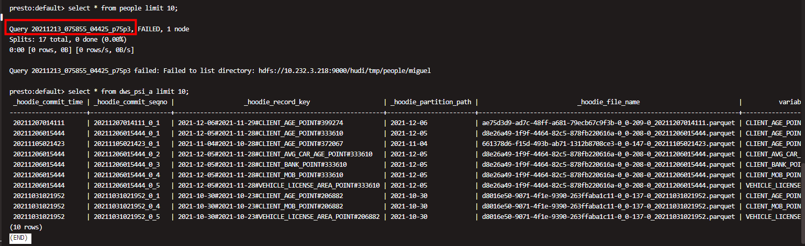

## 一.节点规划

|                            | Coordinator | worker |
| -------------------------- | ----------- | ------ |
| 10.232.3.218（bigdata02）  | √           |        |
| 10.232.3.215（bigdata07）  |             | √      |
| 10.232.3.220 （bigdata04） |             | √      |
| 10.232.3.216（bigdata08）  |             | √      |
| 10.232.3.213（bigdata06）  |             | √      |
| 10.232.3.219（bigdata03）  |             | √      |


## 二.安装部署

（1）下载安装包，并解压到指定目录PRESTO_HOME。

（2）配置presot运行参数。

​         $PRESTO_HOME/etc/config.properties配置如下：

```shell
http-server.http.port=8088
discovery-server.enabled=true
discovery.uri=http://bigdata02:8088
```

​          上述配置中，discover-server.enabled为true，代表当前节点为coordinator，如果设为false，代表当前节点为worker。

​          $PRESTO_HOME/etc/node.properties配置如下：

```shell
node.environment=production
node.id=1218
#node.data-dir=/workspace/opt/presto-server-0.248/data
node.data-dir=/workspace/opt/futureGuo/presto-server-0.260.2-SNAPSHOT/data
```

​         【注意】如果在多台服务器均安装了presto的worker节点，则需要保证每台work节点对应的node.id是不同的。

（3）配置presto连接器参数。

​         在$PRESTO_HOME/etc文件夹下创建catalog目录，在catalog目录下配置连接器。

​         $PRESTO_HOME/etc/hive.properties配置如下：

```shell
connector.name=hive-hadoop2
hive.metastore.uri=thrift://bigdata02:9083
hive.config.resources=/workspace/opt/futureGuo/presto-server-0.260.2-SNAPSHOT/etc/core-site.xml,/workspace/opt/futureGuo/presto-server-0.260.2-SNAPSHOT/etc/hdfs-site.xml,/workspace/opt/futureGuo/presto-server-0.260.2-SNAPSHOT/etc/hive-site.xml
hive.metastore-cache-ttl=0s
hive.metastore-refresh-interval=1s
hive.parquet.use-column-names=true
```

​         上述配置为hive连接器设置了必要的参数，hive.config.resources所指向的文件必须要已存在,最好在$PRESTO_HOME/etc目录下。

（4）如果使用presto查询hudi表需要使用到hive元数据服务，所以需要配置hive服务相关信息，在hive安装目录中的conf/hive-site.xml中，除hive运行的必要配置外，重点配置hive.aux.jars.path，配置hudi jar包路径。


## 三.运维操作

（1）各节点上启动presto

```shell
$PRESTO_HOME/bin/launcher start
```

（2）查看相关日志。

​        presto的相关日志默认存放在/var/log目录下，主要涉及到如下内容：

​        ①launcher.log : 记录服务初始化情况和一些 JVM 的诊断。

​        ②server.log: Presto的主要日志文件，会自动被压缩。

​        ③http-request.log : 记录HTTP请求，会自动被压缩。

（3）如果进入presto命令终端。

​         需要下载presto-cli-xxx-executable.jar依赖文件，建议重命名为presto，运行命令大致如下：

```shell
./presto --server localhost:8080 --catalog hive --schema default
```


## 四.使用案例

（1）查看正在运行中的应用,可以通过匹配唯一序列号来确定。如图所示：


（2）通过终端显示的序列号与WebUI界面上呈现的序列号一致,并且WebUI上具体参数信息如图所示，可以以此监控性能。




（3）点击唯一序列号，进入到下图所示界面.其中显示了一些具体的运行信息等。可以在此查看具体的执行时间、Session执行所在位置等内容。


## 五.问题指南

（1）如何连接到presto并查询数据？

​		登录10.232.3.218（bigdata02）服务器，zhongtai用户登录，使用如下命令进入presto的查询控制台，具体操作如下：

```shell
# 进入到presto-cli所在目录
 cd /workspace/userData/lyz/
# 连接到hive
 ./presto-cli --server localhost:8088 --catalog hive
# 查看hive的所有库
show schemas;
# 进入到default库
use default;
# 查询表
select * from dws_psi_a limit 10;
```

（2）Presto查询语法注意事项。

​        presto查询语法与标准的sql语句并无太大差别，需要注意的是presto不支持带limit .. offset关键字的分页查询。

（3）如何通过Presto创建Hive内部表。

​		可以参考如下这个例子：

```sql
CREATE TABLE hive.web.request_logs (
  request_time timestamp,
  url varchar,
  ip varchar,
  user_agent varchar
)
WITH (
  format = 'Parquet');
```

​		关于Presto和Hive集成可以查看：[Hive Connector](https://prestodb.io/docs/current/connector/hive.html)