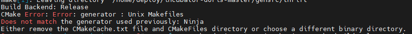
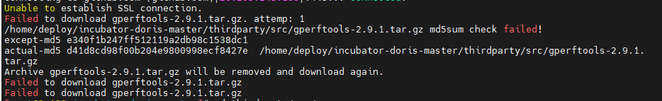

本小节主要介绍如何通过源码编译Doris

### 1）、使用Docker开发镜像编译

编译案例：镜像   apache/incubator-doris:build-env-for-0.15.0 来编译Doris0.15.0版本

#### 1、下载Docker镜像

```
docker pull apache/incubator-doris:build-env-for-0.15.0
```

检查镜像下载完成

```
docker images
REPOSITORY              TAG                 IMAGE ID            CREATED             SIZE
apache/incubator-doris  build-env-for-0.15.0    49f68cecbc1a     4 days ago      3.76GB
```

注1：针对不同的 Doris 版本，需要下载对应的镜像版本。从 Apache Doris 0.15 版本起，后续镜像版本号将与 Doris 版本号统一。比如可以使用 apache/incubator-doris:build-env-for-0.15.0 来编译 0.15.0 版本。

注2：apache/incubator-doris:build-env-latest 用于编译最新主干版本代码，会随主干版本不断更新。可以查看 docker/README.md 中的更新时间。

| 镜像版本                                    | commit id                                                    | doris 版本      |
| ------------------------------------------- | ------------------------------------------------------------ | --------------- |
| apache/incubator-doris:build-env            | before [ff0dd0d(opens new window)](https://github.com/apache/incubator-doris/commit/ff0dd0d2daa588f18b6db56f947e813a56d8ec81) | 0.8.x, 0.9.x    |
| apache/incubator-doris:build-env-1.1        | [ff0dd0d(opens new window)](https://github.com/apache/incubator-doris/commit/ff0dd0d2daa588f18b6db56f947e813a56d8ec81) | 0.10.x, 0.11.x  |
| apache/incubator-doris:build-env-1.2        | [4ef5a8c(opens new window)](https://github.com/apache/incubator-doris/commit/4ef5a8c8560351d7fff7ff8fd51c4c7a75e006a8) | 0.12.x - 0.14.0 |
| apache/incubator-doris:build-env-1.3.1      | [ad67dd3(opens new window)](https://github.com/apache/incubator-doris/commit/ad67dd34a04c1ca960cff38e5b335b30fc7d559f) | 0.14.x          |
| apache/incubator-doris:build-env-for-0.15.0 | [a81f4da (opens new window)](https://github.com/apache/incubator-doris/commit/a81f4da4e461a54782a96433b746d07be89e6b54)or later | 0.15.0          |
| apache/incubator-doris:build-env-latest     | trunk                                                        | trunk           |

#### 2、下载源码

```
wget https://dist.apache.org/repos/dist/dev/incubator/doris/xxx.tar.gz
```

建议直接下载好源码放入本地目录并解压

#### 3、运行镜像

```
docker run -it -v /root/.m2:/root/.m2 -v /home/deploy/apache-doris-0.15.0-incubating-src/:/home/deploy/apache-doris-0.15.0-incubating-src/ apache/incubator-doris:build-env-for-0.15.0
```

注1：建议将镜像中 maven 的 `.m2` 目录挂载到宿主机目录，以防止每次启动镜像编译时，重复下载 maven 的依赖库

`/your/local/incubator-doris-DORIS-x.x.x-release/`: 为本地源代码地址

`/root/incubator-doris-DORIS-x.x.x-release/ ` ： 挂载的镜像内地址

注2：从 build-env-1.3.1 的docker镜像起，同时包含了 OpenJDK 8 和 OpenJDK 11，并且默认使用 OpenJDK 11 编译。请确保编译使用的 JDK 版本和运行时使用的 JDK 版本一致，否则会导致非预期的运行错误。可以使用在进入编译镜像的容器后，使用以下命令切换默认 JDK 版本

切换到JDK8

```
$ alternatives --set java java-1.8.0-openjdk.x86_64
$ alternatives --set javac java-1.8.0-openjdk.x86_64
$ export JAVA_HOME=/usr/lib/jvm/java-1.8.0
```

切换到JDK11：

```
$ alternatives --set java java-11-openjdk.x86_64
$ alternatives --set javac java-11-openjdk.x86_64
$ export JAVA_HOME=/usr/lib/jvm/java-11
```

#### 4、编译Doris

进入镜像内源码目录然后启动编译脚本

```
sh build.sh
```

注：如果使用 `build-env-for-0.15.0` 或之后的版本，第一次编译的时候要使用如下命令：

```
sh build.sh --clean --be --fe --ui
```

这是因为 build-env-for-0.15.0 版本镜像升级了 thrift(0.9 -> 0.13)，需要通过 --clean 命令强制使用新版本的 thrift 生成代码文件，否则会出现不兼容的代码。

编译完成后，产出文件在 `output/` 目录中。

### 2）、直接编译Doris

#### 1、下载doris源码

```
wget https://mirrors.bfsu.edu.cn/apache/incubator/doris/0.13.0-incubating/apache-doris-0.15.0-incubating-src.tar.gz
```

建议直接下载好源码放入本地目录并解压

#### 2、升级GCC

```
yum install gcc-c++
wget http://ftp.tsukuba.wide.ad.jp/software/gcc/releases/gcc-7.3.0/gcc-7.3.0.tar.gz
tar zxvf tar zxvf gcc-7.3.0.tar.gz
cd gcc-7.3.0
yum install lbzip2
./contrib/download_prerequisites
mkdir build
cd build/
../configure --enable-checking=release --enable-languages=c,c++ --disable-multilib
make -j 40 && make install
```

#### 3、升级CMAKE

```
wget https://cmake.org/files/v3.6/cmake-3.6.2.tar.gz
tar xvf cmake-3.6.2.tar.gz && cd cmake-3.6.2/
./bootstrap
gmake -j 40 && gmake install
```

注：如遇到以下报错



则

```
rm -f CMakeCache.txt
yum -y install ncurses-devel
yum install openssl-devel
```

#### 4、升级flex（2.6.0版本以上）

```
https://github.com/westes/flex/releases
tar -zxvf *.tar.gz
cd *
./configure
make -j 40 && make install
```

#### 5、编译doris

```
sh build.sh
```

#### 6、手动编译过程中可能会遇到的问题

6.1. 报错下载jar失败



下载对应的jar包放入`/home/deploy/incubator-doris-master/thirdparty/src`目录下

6.2. 报错找不到libfl.so.2文件

执行命令：find / -name libfl.so.2

找到该文件所在位置后将该路径添加到/etc/ld.so.conf文件中

添加后执行：ldconfig

```
find / -name libfl.so.2
vim /etc/ld.so.conf
ldconfig
```


