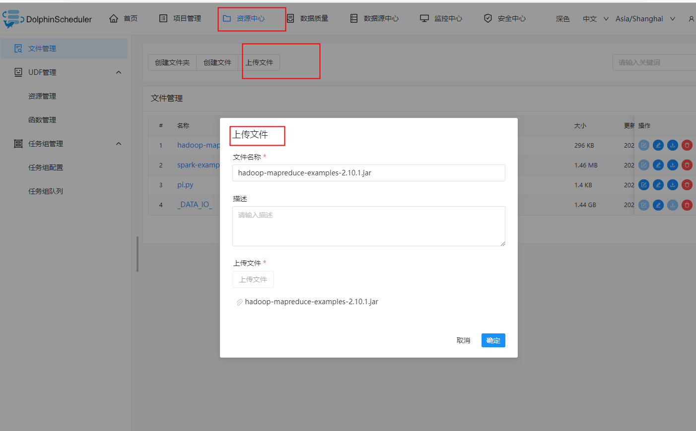
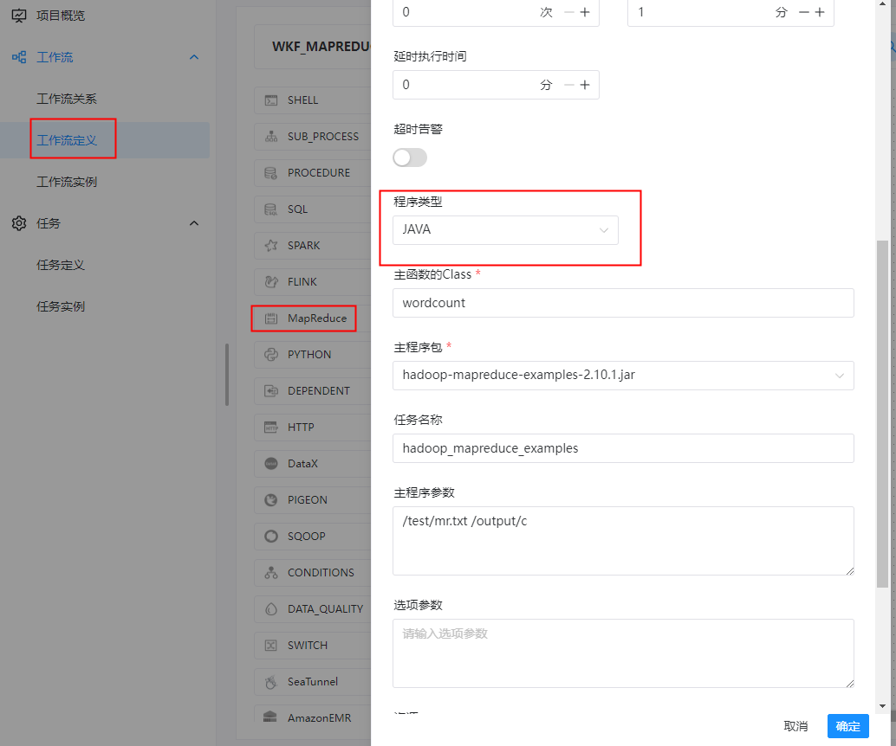

#  任务类型： MapReduce

## 综述

MapReduce(MR) 任务类型，用于执行 MapReduce 程序。对于 MapReduce 节点，worker 会通过使用 Hadoop 命令 `hadoop jar` 的方式提交任务。更多详情查看 [Hadoop Command Manual](https://hadoop.apache.org/docs/r3.2.4/hadoop-project-dist/hadoop-common/CommandsManual.html#jar)。

## 创建任务

### 任务参数

- 节点名称：设置任务的名称。一个工作流定义中的节点名称是唯一的。
- 运行标志：标识这个节点是否能正常调度,如果不需要执行，可以打开禁止执行开关。
- 描述：描述该节点的功能。
- 任务优先级：worker 线程数不足时，根据优先级从高到低依次执行，优先级一样时根据先进先出原则执行。
- Worker 分组：任务分配给 worker 组的机器执行，选择Default，会随机选择一台 worker 机执行。
- 环境名称：配置运行脚本的环境。
- 失败重试次数：任务失败重新提交的次数。
- 失败重试间隔：任务失败重新提交任务的时间间隔，以分为单位。
- 延迟执行时间：任务延迟执行的时间，以分为单位。
- 超时告警：勾选超时告警、超时失败，当任务超过"超时时长"后，会发送告警邮件并且任务执行失败。
- 资源：是指脚本中需要调用的资源文件列表，资源中心-文件管理上传或创建的文件。
- 自定义参数：是 MapReduce 局部的用户自定义参数，会替换脚本中以 ${变量} 的内容。
- 前置任务：选择当前任务的前置任务，会将被选择的前置任务设置为当前任务的上游。

#### JAVA/SCALA 程序

- 程序类型：选择 JAVA/SCALA 语言。
- 主函数的 Class：是 MapReduce 程序的入口 Main Class 的**全路径**。
- 主程序包：执行 MapReduce 程序的 jar 包。
- 任务名称（选填）：MapReduce 任务名称。
- 命令行参数：是设置 MapReduce 程序的输入参数，支持自定义参数变量的替换。
- 其他参数：支持 –D、-files、-libjars、-archives 格式。
- 资源： 如果其他参数中引用了资源文件，需要在资源中选择指定
- 自定义参数：是 MapReduce 局部的用户自定义参数，会替换脚本中以 ${变量} 的内容

#### Python 程序

- 程序类型：选择 Python 语言。
- 主 jar 包：是运行 MapReduce 的 Python jar 包。
- 其他参数：支持 –D、-mapper、-reducer、-input -output格式，这里可以设置用户自定义参数的输入，比如：
- -mapper "[mapper.py](http://mapper.py/) 1" -file [mapper.py](http://mapper.py/) -reducer [reducer.py](http://reducer.py/) -file [reducer.py](http://reducer.py/) –input /journey/words.txt -output /journey/out/mr/${currentTimeMillis}
- 其中 -mapper 后的 [mapper.py](http://mapper.py/) 1是两个参数，第一个参数是 [mapper.py](http://mapper.py/)，第二个参数是 1。
- 资源： 如果其他参数中引用了资源文件，需要在资源中选择指定。
- 自定义参数：是 MapReduce 局部的用户自定义参数，会替换脚本中以 ${变量} 的内容。

### 任务样例

#### 上传主程序包

在使用 MapReduce 任务节点时，需要利用资源中心上传执行程序的 jar 包。可参考[资源中心](https://dolphinscheduler.apache.org/zh-cn/docs/latest/user_doc/guide/resource/configuration.html)。

当配置完成资源中心之后，直接使用拖拽的方式，即可上传所需目标文件。




**java类型任务**

```shell
当前节点设置: mapreduce
节点名称:  TASK_MAPREDUCE_O
描述: 通过 MAPREDUCE 进行单词统计

程序类型: JAVA
主函数的Class: wordcount
主程序包: hadoop-mapreduce-examples-2.10.1.jar
任务名称: hadoop_mapreduce_examples
主程序参数: /test/mr.txt /output/c
````




**使用 Hadoop 命令 `hadoop jar` 的方式 执行 MapReduce 程序 **

```shell
./hadoop jar ../share/hadoop/mapreduce/hadoop-mapreduce-examples-2.10.1.jar wordcount /test/mr.txt /output/a

```


**工作流实例保存**

```shell
基本信息
工作流名称: WKF_MAPREDUCE_DEMO
描述： 通过 MAPREDUCE 进行单词统计
```