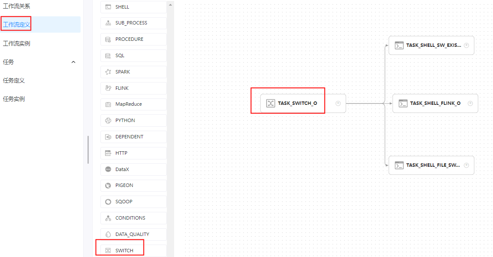
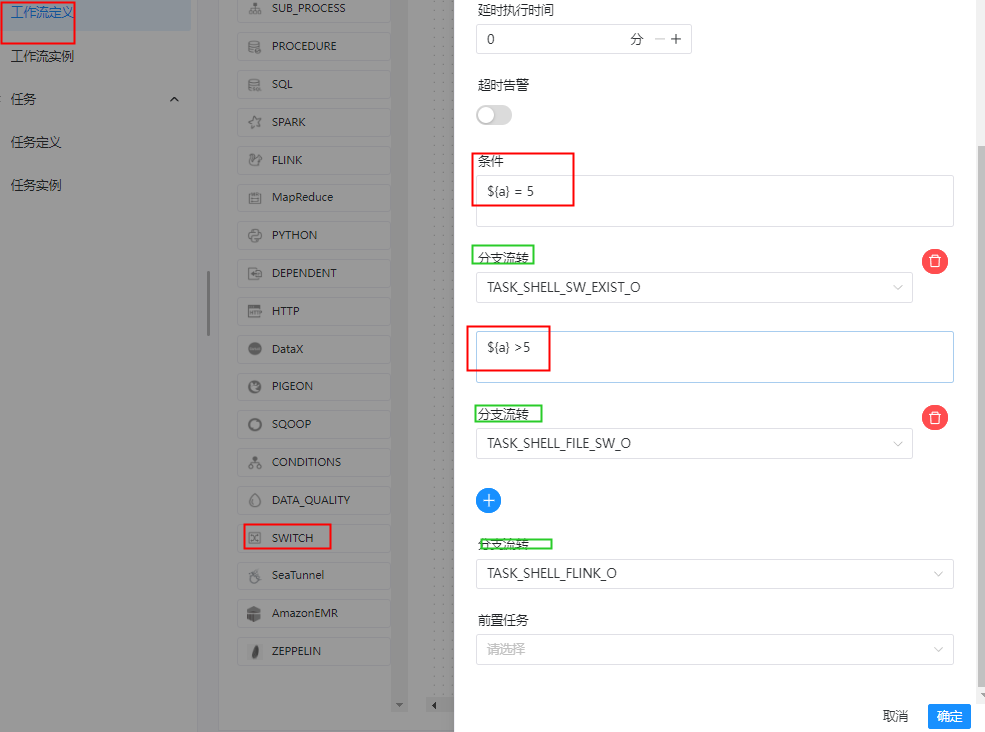

# 任务类型： Switch

## 综述

Switch 是一个条件判断节点，依据[全局变量](https://dolphinscheduler.apache.org/zh-cn/docs/latest/user_doc/guide/parameter/global.html)的值和用户所编写的表达式判断结果执行对应分支。 **注意**使用 javax.script.ScriptEngine.eval 执行表达式。

## 创建任务

### 任务参数

- 节点名称：一个工作流定义中的节点名称是唯一的。
- 运行标志：标识这个节点是否能正常调度,如果不需要执行，可以打开禁止执行开关。
- 描述信息：描述该节点的功能。
- 任务优先级：worker 线程数不足时，根据优先级从高到低依次执行，优先级一样时根据先进先出原则执行。
- Worker 分组：任务分配给 worker 组的机器机执行，选择 Default，会随机选择一台 worker 机执行。
- 环境名称：安全中心中配置的环境，不配置则不使用。
- 任务组名称：资源中心中配置的任务组，不配置则不使用。
- 失败重试次数：任务失败重新提交的次数，支持下拉和手填。
- 失败重试间隔：任务失败重新提交任务的时间间隔，支持下拉和手填。
- 延时执行时间：任务延迟执行的时间。
- 超时告警：勾选超时告警、超时失败，当任务超过"超时时长"后，会发送告警邮件并且任务执行失败。
- 条件：可以为 switch 任务配置多个条件，当条件满足时，就会执行指定的分支，可以配置多个不同的条件来满足不同的业务，使用字符串判断时需要使用""。
- 分支流转：默认的流转内容，当**条件**中的内容为全部不符合要求时，则运行**分支流转**中指定的分支。


### 任务样例

 **switch 任务创建后，要先配置上下游，才能配置任务分支的参数。**

**Switch 工作流任务结构 **



##### 1、switch任务

```shell
当前节点设置: switch 任务
节点名称:  TASK_SWITCH_O
描述: 依据全局变量的值和用户所编写的表达式判断结果执行对应分支
条件： 
${a} = 5 
（条件为true）分支流转：TASK_SHELL_SW_EXIST_O

${a} >5
（条件为true）分支流转：TASK_SHELL_FILE_SW_O

（条件为false）分支流转：TASK_SHELL_FLINK_O

````




##### 2、shell任务  执行条件 ${a} = 5

```shell
当前节点设置: 【分支任务】
任务类型： shell
节点名称:  TASK_SHELL_FILE_SW_O
描述: 
shell 脚本：使用 for 循环将字符串循环写入文件，循环次数为全局参数

脚本:
#!/bin/sh
cd /workspace/users/cxy
for ((i=1; i<=${a}; i++)); do
   echo "pname"$'\t'$i >> sw.txt
done

前置任务： TASK_SWITCH_O
```


##### 3、shell任务  执行条件 ${a} > 5

```shell
当前节点设置: 【分支任务】
任务类型： shell
节点名称:  TASK_SHELL_SW_EXIST_O
描述: 
shell 脚本：判断文件是否存在

脚本:
#!/bin/sh
cd /workspace/users/cxy
if [ -f "sw.txt" ]; then
 cat sw.txt
fi

前置任务： TASK_SWITCH_O
```


##### 4、shell任务  执行条件：上述条件都不成立

```shell
【分支任务】

节点名称:  TASK_SHELL_FLINK_O
描述: shell 脚本：通过 Flink 进行单词统计，将结果写入到指定的文件上。

脚本:
#!/bin/sh
cd /workspace/flink-1.13.1
bin/flink run -m yarn-cluster -ys 2 -ynm flink_wordcount -yjm 1G -ytm 2G -yqu default -p 1 -sae -c org.apache.flink.examples.java.wordcount.WordCount /workspace/flink-1.13.1/examples/batch/WordCount.jar --output /workspace/users/cxy/sw.txt

前置任务： TASK_SWITCH_O
```


**工作流实例保存**

```shell
基本信息
工作流名称: WKF_SWITCH_DEMO
描述： switch 任务类型测试工作流

全局变量：
a     5
```


### 注意：

- 设置条件：配置条件和默认分支，满足条件会走指定分支，都不满足则走默认分支。
- 条件使用了全局变量，请参考[全局变量](https://dolphinscheduler.apache.org/zh-cn/docs/latest/user_doc/guide/parameter/global.html)。
- Switch任务类通过设置条件进行多重分支判断。

