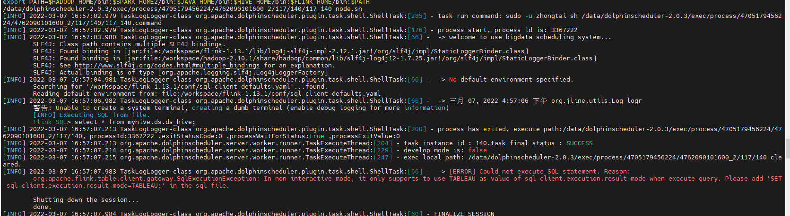

**Q**：2.0.3版本【安全中心】->【租户管理】创建租户，提示“创建租户失败”！

**A**：如果Hadoop集群是非高可用的，创建租户没有问题。如果Hadoop集群是高可用的，则需要将core-site.xml和hdfs-site.xml复制到conf根目录下。

------

**Q**：新创建的租户无法执行任务。

**A**：租户对应的是Linux的用户，用于worker提交作业所使用的用户。如果linux没有这个用户，则会导致任务运行失败。出现上述原因可能是没有开启work自动创建tenant功能，默认是关闭的。有如下两种方式：

【方法一】：如果没有执行install.sh脚本完成初始化，则可以直接修改conf/config/install_config.conf文件中如下配置：

```
# worker tenant auto create
workerTenantAutoCreate="true"
```

【方式二】：如果完成部署完成之后，则需要修改conf/worker.properties文件中的如下配置：

```
# worker tenant auto create
worker.tenant.auto.create=true
```

------

**Q**：2.0.3版本【数据源中心】创建MySQL的数据在点击测试连接时，提示“无法加载类”！

**A**：在创建MySQL数据源时，需要将mysql驱动JAR文件放置到lib目录下。可能是mysql驱动JAR版本不一致所导致。通过查看2.0.3源码的pom.xml文件发现如下：

```
<dependency>
    <groupId>mysql</groupId>
    <artifactId>mysql-connector-java</artifactId>
    <version>${mysql.connector.version}</version>
    <scope>compile</scope>
</dependency>

... 

<mysql.connector.version>8.0.16</mysql.connector.version>
```

​		建议采用和DS对齐的MySQL驱动版本。下载链接：https://downloads.mysql.com/archives/c-j/

------

**Q**：创建SQL任务，选择Hive数据源查询数据时，提示如下异常：

```
[ERROR] 2022-02-18 15:35:16.776 org.apache.hive.jdbc.HiveConnection:[600] - Error opening session
```

**A**：生产环境Hive为2.3.8，根据DS2.0.3源码pom.xml中有如下依赖：

```
<dependency>
    <groupId>org.apache.hive</groupId>
    <artifactId>hive-jdbc</artifactId>
    <version>${hive.jdbc.version}</version>
</dependency>

...

<hive.jdbc.version>2.1.0</hive.jdbc.version>
```

​		建议将DS中lib目录下的hive JAR文件与当前环境Hive一致。涉及到文件如下：

```
-rw-r--r-- 1 Dell 197121  384969  2月 18 15:52 hive-common-2.1.0.jar
-rw-r--r-- 1 Dell 197121  109678  2月 18 15:42 hive-jdbc-2.1.0.jar
-rw-r--r-- 1 Dell 197121 7771689  2月 18 15:52 hive-metastore-2.1.0.jar
-rw-r--r-- 1 Dell 197121  684736  2月 18 15:52 hive-orc-2.1.0.jar
-rw-r--r-- 1 Dell 197121  915583  2月 18 15:52 hive-serde-2.1.0.jar
-rw-r--r-- 1 Dell 197121  483319  2月 18 15:52 hive-service-2.1.0.jar
-rw-r--r-- 1 Dell 197121 1538459  2月 18 15:52 hive-service-rpc-2.1.0.jar
-rw-r--r-- 1 Dell 197121  109259  2月 18 15:52 hive-storage-api-2.1.0.jar
```

​		按需替换成如下：

```
ll hive-*
-rw-r--r-- 1 zhongtai zhongtai  437029 2月  18 15:55 hive-common-2.3.8.jar
-rw-r--r-- 1 zhongtai zhongtai  116357 2月  18 15:44 hive-jdbc-2.3.8.jar
-rw-r--r-- 1 zhongtai zhongtai 8196071 2月  18 15:56 hive-metastore-2.3.8.jar
-rw-r--r-- 1 root     root      684736 2月  18 16:03 hive-orc-2.1.0.jar
-rw-r--r-- 1 zhongtai zhongtai  916613 2月  18 15:58 hive-serde-2.3.8.jar
-rw-r--r-- 1 zhongtai zhongtai  527772 2月  18 15:59 hive-service-2.3.8.jar
-rw-r--r-- 1 zhongtai zhongtai 1549363 2月  18 16:00 hive-service-rpc-2.3.8.jar
-rw-r--r-- 1 zhongtai zhongtai  182539 2月  18 16:01 hive-storage-api-2.4.0.jar
```

------

**Q**：创建SQL任务，选择Hive数据源查询数据时，提示如下异常：

```
[ERROR] 2022-02-18 15:35:17.779 com.zaxxer.hikari.pool.HikariPool:[594] - HikariPool-3 - Exception during pool initialization.
java.sql.SQLException: Could not establish connection to jdbc:hive2://172.16.10.205:10000/db: Required field 'serverProtocolVersion' is unset! Struct:TOpenSessionResp(status:TStatus(statusCode:ERROR_STATUS, infoMessages:[*org.apache.hive.service.cli.HiveSQLException:Failed to open new session: java.lang.RuntimeException: org.apache.hadoop.ipc.RemoteException(org.apache.hadoop.security.authorize.AuthorizationException): User: zhongtai is not allowed to impersonate hive:14:13, org.apache.hive.service.cli.session.SessionManager:createSession:SessionManager.java:419, org.apache.hive.service.cli.session.SessionManager:openSession:SessionManager.java:362, org.apache.hive.service.cli.CLIService:openSessionWithImpersonation:CLIService.java:193, org.apache.hive.service.cli.thrift.ThriftCLIService:getSessionHandle:ThriftCLIService.java:440, org.apache.hive.service.cli.thrift.ThriftCLIService:OpenSession:ThriftCLIService.java:322, org.apache.hive.service.rpc.thrift.TCLIService$Processor$OpenSession:getResult:TCLIService.java:1377, org.apache.hive.service.rpc.thrift.TCLIService$Processor$OpenSession:getResult:TCLIService.java:1362, org.apache.thrift.ProcessFunction:process:ProcessFunction.java:39, org.apache.thrift.TBaseProcessor:process:TBaseProcessor.java:39, org.apache.hive.service.auth.TSetIpAddressProcessor:process:TSetIpAddressProcessor.java:56, org.apache.thrift.server.TThreadPoolServer$WorkerProcess:run:TThreadPoolServer.java:286, java.util.concurrent.ThreadPoolExecutor:runWorker:ThreadPoolExecutor.java:1149, java.util.concurrent.ThreadPoolExecutor$Worker:run:ThreadPoolExecutor.java:624, java.lang.Thread:run:Thread.java:748, *java.lang.RuntimeException:java.lang.RuntimeException: org.apache.hadoop.ipc.RemoteException(org.apache.hadoop.security.authorize.AuthorizationException): User: zhongtai is not allowed to impersonate hive:22:8, org.apache.hive.service.cli.session.HiveSessionProxy:invoke:HiveSessionProxy.java:89, org.apache.hive.service.cli.session.HiveSessionProxy:access$000:HiveSessionProxy.java:36, org.apache.hive.service.cli.session.HiveSessionProxy$1:run:HiveSessionProxy.java:63, java.security.AccessController:doPrivileged:AccessController.java:-2, javax.security.auth.Subject:doAs:Subject.java:422, org.apache.hadoop.security.UserGroupInformation:doAs:UserGroupInformation.java:1926, org.apache.hive.service.cli.session.HiveSessionProxy:invoke:HiveSessionProxy.java:59, com.sun.proxy.$Proxy35:open::-1, org.apache.hive.service.cli.session.SessionManager:createSession:SessionManager.java:410, *java.lang.RuntimeException:org.apache.hadoop.ipc.RemoteException(org.apache.hadoop.security.authorize.AuthorizationException): User: zhongtai is not allowed to impersonate hive:29:7, org.apache.hadoop.hive.ql.session.SessionState:start:SessionState.java:610, org.apache.hadoop.hive.ql.session.SessionState:start:SessionState.java:548, org.apache.hive.service.cli.session.HiveSessionImpl:open:HiveSessionImpl.java:164, sun.reflect.NativeMethodAccessorImpl:invoke0:NativeMethodAccessorImpl.java:-2, sun.reflect.NativeMethodAccessorImpl:invoke:NativeMethodAccessorImpl.java:62, sun.reflect.DelegatingMethodAccessorImpl:invoke:DelegatingMethodAccessorImpl.java:43, java.lang.reflect.Method:invoke:Method.java:498, org.apache.hive.service.cli.session.HiveSessionProxy:invoke:HiveSessionProxy.java:78, *org.apache.hadoop.ipc.RemoteException:User: zhongtai is not allowed to impersonate hive:54:25, org.apache.hadoop.ipc.Client:getRpcResponse:Client.java:1549, org.apache.hadoop.ipc.Client:call:Client.java:1495, org.apache.hadoop.ipc.Client:call:Client.java:1394, org.apache.hadoop.ipc.ProtobufRpcEngine$Invoker:invoke:ProtobufRpcEngine.java:232, org.apache.hadoop.ipc.ProtobufRpcEngine$Invoker:invoke:ProtobufRpcEngine.java:118, com.sun.proxy.$Proxy30:getFileInfo::-1, org.apache.hadoop.hdfs.protocolPB.ClientNamenodeProtocolTranslatorPB:getFileInfo:ClientNamenodeProtocolTranslatorPB.java:800, sun.reflect.NativeMethodAccessorImpl:invoke0:NativeMethodAccessorImpl.java:-2, sun.reflect.NativeMethodAccessorImpl:invoke:NativeMethodAccessorImpl.java:62, sun.reflect.DelegatingMethodAccessorImpl:invoke:DelegatingMethodAccessorImpl.java:43, java.lang.reflect.Method:invoke:Method.java:498, org.apache.hadoop.io.retry.RetryInvocationHandler:invokeMethod:RetryInvocationHandler.java:422, org.apache.hadoop.io.retry.RetryInvocationHandler$Call:invokeMethod:RetryInvocationHandler.java:165, org.apache.hadoop.io.retry.RetryInvocationHandler$Call:invoke:RetryInvocationHandler.java:157, org.apache.hadoop.io.retry.RetryInvocationHandler$Call:invokeOnce:RetryInvocationHandler.java:95, org.apache.hadoop.io.retry.RetryInvocationHandler:invoke:RetryInvocationHandler.java:359, com.sun.proxy.$Proxy31:getFileInfo::-1, org.apache.hadoop.hdfs.DFSClient:getFileInfo:DFSClient.java:1673, org.apache.hadoop.hdfs.DistributedFileSystem$29:doCall:DistributedFileSystem.java:1524, org.apache.hadoop.hdfs.DistributedFileSystem$29:doCall:DistributedFileSystem.java:1521, org.apache.hadoop.fs.FileSystemLinkResolver:resolve:FileSystemLinkResolver.java:81, org.apache.hadoop.hdfs.DistributedFileSystem:getFileStatus:DistributedFileSystem.java:1521, org.apache.hadoop.fs.FileSystem:exists:FileSystem.java:1632, org.apache.hadoop.hive.ql.session.SessionState:createRootHDFSDir:SessionState.java:708, org.apache.hadoop.hive.ql.session.SessionState:createSessionDirs:SessionState.java:654, org.apache.hadoop.hive.ql.session.SessionState:start:SessionState.java:586], errorCode:0, errorMessage:Failed to open new session: java.lang.RuntimeException: org.apache.hadoop.ipc.RemoteException(org.apache.hadoop.security.authorize.AuthorizationException): User: zhongtai is not allowed to impersonate hive), serverProtocolVersion:null)
        at org.apache.hive.jdbc.HiveConnection.openSession(HiveConnection.java:601)
        at org.apache.hive.jdbc.HiveConnection.<init>(HiveConnection.java:172)
        at org.apache.hive.jdbc.HiveDriver.connect(HiveDriver.java:107)
        at com.zaxxer.hikari.util.DriverDataSource.getConnection(DriverDataSource.java:138)
        at com.zaxxer.hikari.pool.PoolBase.newConnection(PoolBase.java:364)
        at com.zaxxer.hikari.pool.PoolBase.newPoolEntry(PoolBase.java:206)
        at com.zaxxer.hikari.pool.HikariPool.createPoolEntry(HikariPool.java:476)
        at com.zaxxer.hikari.pool.HikariPool.checkFailFast(HikariPool.java:561)
        at com.zaxxer.hikari.pool.HikariPool.<init>(HikariPool.java:115)
        at com.zaxxer.hikari.HikariDataSource.getConnection(HikariDataSource.java:112)
        at org.springframework.jdbc.datasource.DataSourceUtils.fetchConnection(DataSourceUtils.java:159)
        at org.springframework.jdbc.datasource.DataSourceUtils.doGetConnection(DataSourceUtils.java:117)
        at org.springframework.jdbc.datasource.DataSourceUtils.getConnection(DataSourceUtils.java:80)
        at org.springframework.jdbc.core.JdbcTemplate.execute(JdbcTemplate.java:376)
        at org.springframework.jdbc.core.JdbcTemplate.execute(JdbcTemplate.java:431)
```

**A**：这里提示“User: zhongtai is not allowed to impersonate hive), serverProtocolVersion:null)”，这类问题基本是用户权限问题。对于DS来说，这里的zhongtai用户是deployUser，所以在core-site.xml配置文件中需要确保至少要有如下两个配置：

```
<property>
    <name>hadoop.proxyuser.zhongtai.hosts</name>
    <value>*</value>
</property>

<property>
    <name>hadoop.proxyuser.zhongtai.groups</name>
    <value>*</value>
</property>
```

------

**Q：**执行hive的插入操作时，提示如下异常：

```
java.sql.SQLException: org.apache.hive.service.cli.HiveSQLException: Error while processing statement: FAILED: Execution Error, return code 1 from org.apache.hadoop.hive.ql.exec.mr.MapRedTask. Permission denied: user=hive, access=EXECUTE, inode="/tmp/hadoop-yarn":zhongtai:supergroup:drwx------
        at org.apache.hadoop.hdfs.server.namenode.FSPermissionChecker.check(FSPermissionChecker.java:350)
        at org.apache.hadoop.hdfs.server.namenode.FSPermissionChecker.checkTraverse(FSPermissionChecker.java:311)
        at org.apache.hadoop.hdfs.server.namenode.FSPermissionChecker.checkPermission(FSPermissionChecker.java:238)
        at org.apache.hadoop.hdfs.server.namenode.FSPermissionChecker.checkPermission(FSPermissionChecker.java:189)
        at org.apache.hadoop.hdfs.server.namenode.FSDirectory.checkPermission(FSDirectory.java:1756)
        at org.apache.hadoop.hdfs.server.namenode.FSDirectory.checkPermission(FSDirectory.java:1740)
        at org.apache.hadoop.hdfs.server.namenode.FSDirectory.checkOwner(FSDirectory.java:1685)
        at org.apache.hadoop.hdfs.server.namenode.FSDirAttrOp.setPermission(FSDirAttrOp.java:64)
        at org.apache.hadoop.hdfs.server.namenode.FSNamesystem.setPermission(FSNamesystem.java:1805)
        at org.apache.hadoop.hdfs.server.namenode.NameNodeRpcServer.setPermission(NameNodeRpcServer.java:864)
        at org.apache.hadoop.hdfs.protocolPB.ClientNamenodeProtocolServerSideTranslatorPB.setPermission(ClientNamenodeProtocolServerSideTranslatorPB.java:476)
        at org.apache.hadoop.hdfs.protocol.proto.ClientNamenodeProtocolProtos$ClientNamenodeProtocol$2.callBlockingMethod(ClientNamenodeProtocolProtos.java)
        at org.apache.hadoop.ipc.ProtobufRpcEngine$Server$ProtoBufRpcInvoker.call(ProtobufRpcEngine.java:507)
        at org.apache.hadoop.ipc.RPC$Server.call(RPC.java:1034)
        at org.apache.hadoop.ipc.Server$RpcCall.run(Server.java:1003)
        at org.apache.hadoop.ipc.Server$RpcCall.run(Server.java:931)
        at java.security.AccessController.doPrivileged(Native Method)
        at javax.security.auth.Subject.doAs(Subject.java:422)
        at org.apache.hadoop.security.UserGroupInformation.doAs(UserGroupInformation.java:1926)
        at org.apache.hadoop.ipc.Server$Handler.run(Server.java:2854)

        at org.apache.hive.service.cli.operation.Operation.toSQLException(Operation.java:380)
        at org.apache.hive.service.cli.operation.SQLOperation.runQuery(SQLOperation.java:257)
        at org.apache.hive.service.cli.operation.SQLOperation.access$800(SQLOperation.java:91)
        at org.apache.hive.service.cli.operation.SQLOperation$BackgroundWork$1.run(SQLOperation.java:348)
        at java.security.AccessController.doPrivileged(Native Method)
        at javax.security.auth.Subject.doAs(Subject.java:422)
        at org.apache.hadoop.security.UserGroupInformation.doAs(UserGroupInformation.java:1926)
        at org.apache.hive.service.cli.operation.SQLOperation$BackgroundWork.run(SQLOperation.java:362)
        at java.util.concurrent.Executors$RunnableAdapter.call(Executors.java:511)
        at java.util.concurrent.FutureTask.run(FutureTask.java:266)
        at java.util.concurrent.ThreadPoolExecutor.runWorker(ThreadPoolExecutor.java:1149)
        at java.util.concurrent.ThreadPoolExecutor$Worker.run(ThreadPoolExecutor.java:624)
        at java.lang.Thread.run(Thread.java:748)
```

**A：**这里提示"zhongtai:supergroup:drwx------"这个问题是用户权限问题，需要把hdfs上的tmp目录修改权限

```
hdfs dfs -chmod -R /tmp
```

------

**Q**：执行flinkonyarn任务时，提示如下异常：

```
The program finished with the following exception:

        java.lang.IllegalStateException: No Executor found. Please make sure to export the HADOOP_CLASSPATH environment variable or have hadoop in your classpath. For more information refer to the "Deployment" section of the official Apache Flink documentation.
                at org.apache.flink.yarn.cli.FallbackYarnSessionCli.isActive(FallbackYarnSessionCli.java:41)
                at org.apache.flink.client.cli.CliFrontend.validateAndGetActiveCommandLine(CliFrontend.java:1236)
                at org.apache.flink.client.cli.CliFrontend.run(CliFrontend.java:234)
                at org.apache.flink.client.cli.CliFrontend.parseAndRun(CliFrontend.java:1054)
                at org.apache.flink.client.cli.CliFrontend.lambda$main$10(CliFrontend.java:1132)
                at org.apache.flink.runtime.security.contexts.NoOpSecurityContext.runSecured(NoOpSecurityContext.java:28)
                at org.apache.flink.client.cli.CliFrontend.main(CliFrontend.java:1132)
```

**A**：这里提示"No Executor found. Please make sure to export the HADOOP_CLASSPATH environment variable or have hadoop in your classpath. ",需要在/home/workspace/flink-1.13.1/bin中的flink添加如下操作：

```
vim ./flink
export HADOOP_CLASSPATH=`hadoop classpath`
```

------

**Q:**执行flink程序时，提示如下异常：

```
2022-03-02 17:51:03,834 main ERROR FileManager (/workspace/flink-1.13.1/log/flink-bigdata-client-2-123.log) java.io.FileNotFoundException: /workspace/flink-1.13.1/log/flink-bigdata-client-2-123.log (权限不够) java.io.FileNotFoundException: /workspace/flink-1.13.1/log/flink-bigdata-client-2-123.log (权限不够)
                at java.io.FileOutputStream.open0(Native Method)
                at java.io.FileOutputStream.open(FileOutputStream.java:270)
                at java.io.FileOutputStream.<init>(FileOutputStream.java:213)
                at org.apache.logging.log4j.core.appender.FileManager$FileManagerFactory.createManager(FileManager.java:433)
                at org.apache.logging.log4j.core.appender.FileManager$FileManagerFactory.createManager(FileManager.java:417)
                at org.apache.logging.log4j.core.appender.AbstractManager.getManager(AbstractManager.java:113)
                at org.apache.logging.log4j.core.appender.OutputStreamManager.getManager(OutputStreamManager.java:114)
                at org.apache.logging.log4j.core.appender.FileManager.getFileManager(FileManager.java:182)
                at org.apache.logging.log4j.core.appender.FileAppender$Builder.build(FileAppender.java:96)
                at org.apache.logging.log4j.core.appender.FileAppender$Builder.build(FileAppender.java:52)
                at org.apache.logging.log4j.core.config.plugins.util.PluginBuilder.build(PluginBuilder.java:122)
                at org.apache.logging.log4j.core.config.AbstractConfiguration.createPluginObject(AbstractConfiguration.java:1002)
                at org.apache.logging.log4j.core.config.AbstractConfiguration.createConfiguration(AbstractConfiguration.java:942)
                at org.apache.logging.log4j.core.config.AbstractConfiguration.createConfiguration(AbstractConfiguration.java:934)
                at org.apache.logging.log4j.core.config.AbstractConfiguration.doConfigure(AbstractConfiguration.java:552)
                at org.apache.logging.log4j.core.config.AbstractConfiguration.initialize(AbstractConfiguration.java:241)
                at org.apache.logging.log4j.core.config.AbstractConfiguration.start(AbstractConfiguration.java:288)
                at org.apache.logging.log4j.core.LoggerContext.setConfiguration(LoggerContext.java:579)
                at org.apache.logging.log4j.core.LoggerContext.reconfigure(LoggerContext.java:651)
                at org.apache.logging.log4j.core.LoggerContext.reconfigure(LoggerContext.java:668)
                at org.apache.logging.log4j.core.LoggerContext.start(LoggerContext.java:253)
                at org.apache.logging.log4j.core.impl.Log4jContextFactory.getContext(Log4jContextFactory.java:153)
                at org.apache.logging.log4j.core.impl.Log4jContextFactory.getContext(Log4jContextFactory.java:45)
                at org.apache.logging.log4j.LogManager.getContext(LogManager.java:194)
                at org.apache.logging.log4j.spi.AbstractLoggerAdapter.getContext(AbstractLoggerAdapter.java:138)
                at org.apache.logging.slf4j.Log4jLoggerFactory.getContext(Log4jLoggerFactory.java:45)
                at org.apache.logging.log4j.spi.AbstractLoggerAdapter.getLogger(AbstractLoggerAdapter.java:48)
                at org.apache.logging.slf4j.Log4jLoggerFactory.getLogger(Log4jLoggerFactory.java:30)
                at org.slf4j.LoggerFactory.getLogger(LoggerFactory.java:329)
                at org.slf4j.LoggerFactory.getLogger(LoggerFactory.java:349)
                at org.apache.flink.client.cli.CliFrontend.<clinit>(CliFrontend.java:89)
```

**A：**程序可以正常运行，但是会出现以上异常，"/workspace/flink-1.13.1/log/flink-bigdata-client-2-123.log (权限不够)"，这个问题是说flink中log的权限问题，DS中有多个用户，但是需要同一个用户组的不同用户访问就需要修改权限。

```
chmod -R 777 /home/workspace/flink-1.13.1
```

------

**Q**：通过shell任务运行FlinkSQL任务，显示如下异常：



**A**：出现这个问题的原因主要是FlinkSQL的执行cli有既定的模式，默认为表格模式，即相当于是在FlinkSQL脚本中执行如下语句：

```sql
SET sql-client.execution.result-mode=table;
```

​		这种模式会跳出到另外一个子cli命令窗口并进入阻塞，这会影响任务的调度，这里需要设置为tableau即可。
