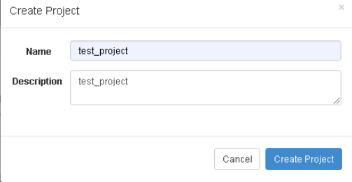
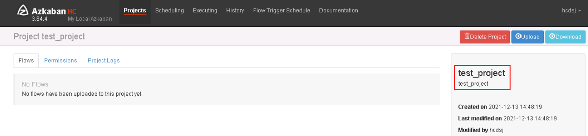
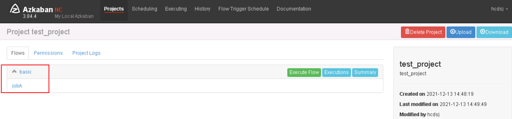
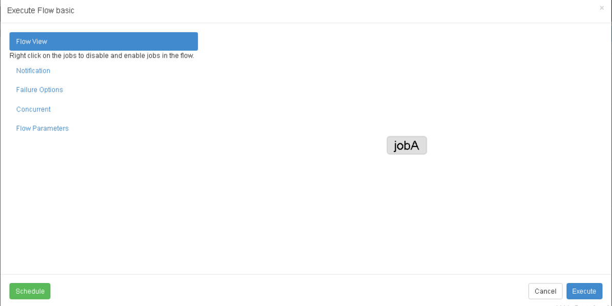
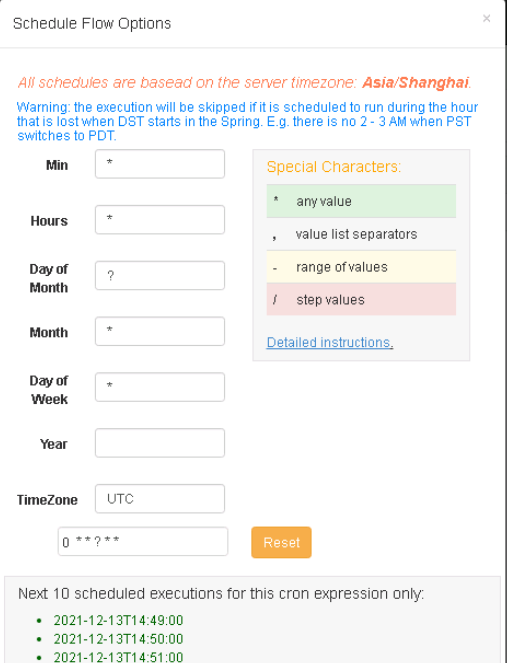
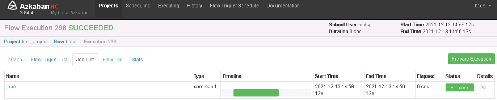
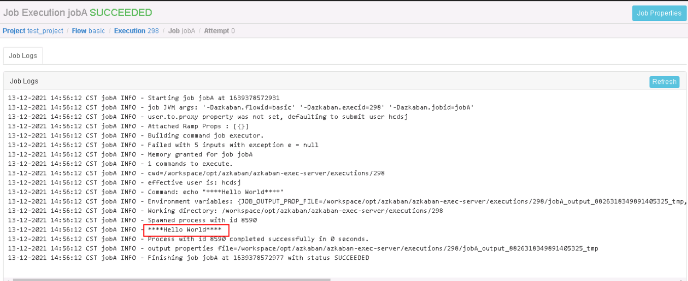

## 一.节点规划

|                           | AzkabanExecutorServer | AzkabanWebServer |
| ------------------------- | --------------------- | ---------------- |
| 10.232.3.218（bigdata02） | √                     | √                |


## 二.安装部署

（1）准备安装包。

```shell
mkdir -p /opt/azkaban
cd /opt/azkaban
ll
-rw-r--r--. 1 root root     6433 Jul 19 17:05 azkaban-db-3.84.4.tar.gz
-rw-r--r--. 1 root root 16175002 Jul 19 17:05 azkaban-exec-server-3.84.4.tar.gz
-rw-r--r--. 1 root root 20239974 Jul 19 17:05 azkaban-web-server-3.84.4.tar.gz
```

（2）MySQL配置。

​         登录MySQL客户端：

```shell
mysql -uroot -p
```

​         创建 Azkaban 数据库：

```sql
CREATE DATABASE azkaban DEFAULT CHARACTER SET utf8 DEFAULT COLLATE utf8_general_ci;
flush privileges;
show databases;
+--------------------+
| Database           |
+--------------------+
| information_schema |
| azkaban            |
| mysql              |
| performance_schema |
| sys                |
+--------------------+
```

​            创建 Azkaban 用户，任何主机都可以访问 Azkaban：

```sql
CREATE USER 'azkaban'@'%' IDENTIFIED BY '1qazXSW@';
```

​             赋予 Azkaban 用户增删改查权限：

```sql
GRANT SELECT,INSERT,UPDATE,DELETE ON azkaban.* to 'azkaban'@'%' WITH GRANT OPTION;
GRANT ALL PRIVILEGES ON azkaban.* TO 'azkaban'@'%' IDENTIFIED BY '1qazXSW';
GRANT ALL PRIVILEGES ON azkaban.* TO 'azkaban'@'localhost' IDENTIFIED BY '1qazXSW';
flush privileges;
```

​              创建 Azkaban 表，完成后退出 MySQL。

```sql
use azkaban;
source /opt/azkaban/azkaban-db/create-all-sql-3.84.4.sql;
show tables;
+-----------------------------+
| Tables_in_azkaban           |
+-----------------------------+
| QRTZ_BLOB_TRIGGERS          |
| QRTZ_CALENDARS              |
| QRTZ_CRON_TRIGGERS          |
| QRTZ_FIRED_TRIGGERS         |
| QRTZ_JOB_DETAILS            |
| QRTZ_LOCKS                  |
| QRTZ_PAUSED_TRIGGER_GRPS    |
| QRTZ_SCHEDULER_STATE        |
| QRTZ_SIMPLE_TRIGGERS        |
| QRTZ_SIMPROP_TRIGGERS       |
| QRTZ_TRIGGERS               |
| active_executing_flows      |
| active_sla                  |
| execution_dependencies      |
| execution_flows             |
| execution_jobs              |
| execution_logs              |
| executor_events             |
| executors                   |
| project_events              |
| project_files               |
| project_flow_files          |
| project_flows               |
| project_permissions         |
| project_properties          |
| project_versions            |
| projects                    |
| properties                  |
| ramp                        |
| ramp_dependency             |
| ramp_exceptional_flow_items |
| ramp_exceptional_job_items  |
| ramp_items                  |
| triggers                    |
| validated_dependencies      |
+-----------------------------+
35 rows in set (0.00 sec)
```

​         更改 MySQL 包大小；防止 Azkaban 连接 MySQL 阻塞。

```shell
sudo vim /etc/my.cnf
```

​          在[mysqld]下面加一行 max_allowed_packet=1024M。

```ini
...
[mysqld]
max_allowed_packet=1024M
...
```

​            重启 MySQL。

```shell
sudo systemctl restart mysqld
```

（3）Executor Server部署

​         Azkaban Executor Server 主要作用是处理工作流和作业的实际执行。具体步骤如下：

​         ①解压。

```shell
cd /opt/azkaban
tar -zxvf azkaban-exec-server-3.84.4.tar.gz
mv azkaban-exec-server-3.84.4 azkaban-exec-server
```

​         ②配置azkaban-exec-server/conf/azkaban.properties。

```shell
cd /opt/azkaban/azkaban-exec-server/conf/
vim azkaban.properties
```

​           修改如下配置：

```properties
# Azkaban Personalization Settings
azkaban.name=HC
azkaban.label=My Local Azkaban
azkaban.color=#FF3601
azkaban.default.servlet.path=/index
web.resource.dir=web/
default.timezone.id=Asia/Shanghai
# Azkaban UserManager class
user.manager.class=azkaban.user.XmlUserManager
user.manager.xml.file=conf/azkaban-users.xml
# Loader for projects
executor.global.properties=conf/global.properties
azkaban.project.dir=projects
# Velocity dev mode
velocity.dev.mode=false
# Azkaban Jetty server properties.
jetty.use.ssl=false
jetty.maxThreads=25
jetty.port=8081
# Where the Azkaban web server is located
azkaban.webserver.url=http://10.232.3.218:8081
executor.port=12321
executor.maxThreads=50
executor.flow.threads=30
# Azkaban mysql settings by default. Users should configure their own username and password.
database.type=mysql
mysql.port=3306
mysql.host=10.232.3.206
mysql.database=azkaban
mysql.user=azkaban
mysql.password=Abc@1234
mysql.numconnections=100
```

 【注意】

   <1> default.timezone.id参数指定时区，一定要修改！


   <2> azkaban.webserver.url用于配置azkaban中webserve组件的服务地址。


   <3> executor.port用于配置执行节点的ip，为了方便管理，建议修改为相同的IP，如果不配置，则会随机生成！

​        ③在每台服务器执行如下命令启动Executor Server。

```shell
cd /opt/azkaban/azkaban-exec-server/
bin/start-exec.sh
```

​         如果在/azkaban-exec-server目录下出现executor.port文件，说明启动成功！

​          ④激活 Executor Server，执行如下命令进行激活。

```shell
curl -G "10.232.3.218:12321/executor?action=activate" && echo
```

​          如果所有服务器都出现如下提示，则表示激活成功！

```shell
{"status":"success"}
```

（4）Web Server配置

​          Azkaban Web Server 处理项目管理，身份验证，计划和执行触发。主要步骤如下：

​          ①解压

```shell
cd /opt/azkaban
tar -zxvf azkaban-web-server-3.84.4.tar.gz
mv azkaban-web-server-3.84.4 azkaban-web-server
```

​           ②编辑 azkaban.properties。

```shell
cd /opt/azkaban/azkaban-web-server/conf
vim azkaban.properties
```

​              配置参数如下：

```properties
...
default.timezone.id=Asia/Shanghai
...
# Azkaban Jetty server properties.
jetty.use.ssl=false
jetty.maxThreads=25
jetty.port=8081
...
# Azkaban mysql settings by default. Users should configure their own username and password.
database.type=mysql
mysql.port=3306
mysql.host=10.232.3.206
mysql.database=azkaban
mysql.user=azkaban
mysql.password=Abc@1234
mysql.numconnections=100
#Multiple Executor
azkaban.use.multiple.executors=true
azkaban.executorselector.filters=StaticRemainingFlowSize,CpuStatus
azkaban.executorselector.comparator.NumberOfAssignedFlowComparator=1
azkaban.executorselector.comparator.Memory=1
azkaban.executorselector.comparator.LastDispatched=1
azkaban.executorselector.comparator.CpuUsage=1
```

​      【注意】

​			<1> StaticRemainingFlowSize：正在排队的任务数；

​            <2> CpuStatus：CPU 占用情况

​            <3> MinimumFreeMemory ：内存占用情况 。 测试环境， 必须将MinimumFreeMemory 删除掉， 否则它会认为集群资源不够，不执行。

​          ③修改 azkaban-users.xml 文件 添加hcdsj用户：

```xml
<azkaban-users>
  <user groups="azkaban" password="azkaban" roles="admin" username="azkaban"/>
  <user password="metrics" roles="metrics" username="metrics"/>
  <user password="hcdsj" roles="admin" username="hcdsj"/>

  <role name="admin" permissions="ADMIN"/>
  <role name="metrics" permissions="METRICS"/>
</azkaban-users>
```

​          ④启动 Web Server配置。

```shell
cd /opt/azkaban/azkaban-web-server/conf
bin/start-web.sh
```

​           此时访问http://10.232.3.218:8081 并用 hcdsj 用户登陆即可。


## 三.使用案例

本小节将介绍如果通过Azkaban调度任务，具体步骤如下：

（1）步骤一：编写任务描述文件。

  ①新建 azkaban.project 文件，编辑内容如下：

```shell
azkaban-flow-version: 2.0
```

【注意】：该文件作用是采用新的Flow-API方式解析flow文件。

  ②新建basic.flow文件，内容如下：

```yaml
nodes:
- name: jobA
  type: command
  config:
    command: echo "****Hello World"****"
```

​      该文件主要描述所执行的任务，执行我们通过shell方式打印一行文本。该文件中的重要字段解释如下：

   【Name】：job名称。


   【Type】：job类型，command表示需要执行作业的方式为命令。


   【Config】：job配置。


（2）步骤二：将步骤一中的azkaban.project和basic.flow文件压缩到一个.zip文件中，例如这里取名为test.zip，需要注意的是文件名称必须是英文。

（3）步骤三：登录Azkaban WebUI，点击【Create Project】 填写任务基本信息，如下图：



​        创建完毕之后进入该项目编辑页面，如下图：



  （4）步骤四：点击【Upload】上传之前制作好的zip文件。上传完毕之后如下图：



   （5）步骤五：点击【Execute Flow】执行工作流，进入任务执行页面，如下图：



  （6）步骤六：这里可以点击【Schedule】对该任务进行调度信息的设置，如下图：



​      这里不再累赘，我们点击【Execute】立即执行工作流，并且只执行一次。

  （7）步骤七：点击【Job List】查看工作流上每个任务状态，如下图：



​       点击【Log】查看每个任务的日志，如下图：



​    可以看到任务已经成功执行完毕。


## 四.运维命令

（1）启停Azkaban执行节点，命令如下：

```shell
/workspace/opt/azkaban/azkaban-exec-server/bin/shutdown-exec.sh
/workspace/opt/azkaban/azkaban-exec-server/bin/start-exec.sh
```

（2）查看Azkaban执行节点日志，命令如下：

```shell
 tail -600f /workspace/opt/azkaban/azkaban-exec-server/logs/azkaban-execserver.log
```

（3）启停Azkaban Web应用，命令如下：

```shell
/workspace/opt/azkaban/azkaban-web-server/bin/shutdown-web.sh
/workspace/opt/azkaban/azkaban-web-server/bin/start-web.sh
```

（4）查看Azkaban Web应用运行日志，命令如下：

```shell
tail -600f /workspace/opt/azkaban/azkaban-web-server/logs/azkaban-webserver.log
```


## 五.常见问题

（1）调度任务为什么没有可执行的节点？

​		  在部署完一个 Azkaban Executor Server执行节点之后，必须要对该节点手动激活，才可以称之为该节点为可执行节点。