## 一.节点规划

|                      | 10.232.3.217（bigdata01） | 10.232.3.219（bigdata03） | 10.232.3.220（bigdata04） | 10.232.3.221（bigdata05） |
| -------------------- | ------------------------- | ------------------------- | ------------------------- | ------------------------- |
| ApiApplicationServer | √                         |                           |                           |                           |
| MasterServer         | √                         |                           |                           |                           |
| AlertServer          | √                         |                           |                           |                           |
| WorkerServer         |                           | √                         | √                         | √                         |
| LoggerServer         |                           | √                         | √                         | √                         |


## 二.安装部署

​		DS集群搭建方式可以参照如下链接：https://dolphinscheduler.apache.org/zh-cn/docs/latest/user_doc/cluster-deployment.html

（1）解压安装包

```shell
cd /workspace/opt
tar -zxvf /tmp/apache-dolphinscheduler-1.3.6-bin.tar.gz -C .
```

（2）在所有部署调度的机器上创建部署用户，并且一定要配置 sudo 免密，这里部署用户为zhongtai，由于该用户之前已经创建，所以创建用户步骤忽略。

```shell
echo 'zhongtai  ALL=(ALL)  NOPASSWD: NOPASSWD: ALL' >> /etc/sudoers
sed -i 's/Defaults    requirett/#Defaults    requirett/g' /etc/sudoers
```

（3）配置hosts映射和ssh打通及修改目录权限。

（4）数据库初始化。

​		 进入数据库，默认数据库是 PostgreSQL，如选择 MySQL 的话，后续需要添加 mysql-connector-java 驱动包到 DolphinScheduler 的 lib 目录下。这里我们用的mysql-connect依赖是5.1.47版本。

```shell
cd /workspace/opt/
tar -zxvf mysql-connector-java-5.1.47.tar.gz
cd mysql-connector-java-5.1.47
cp ./mysql-connector-java-5.1.47.jar /workspace/opt/apache-dolphinscheduler-1.3.6-bin/lib/.
```

​		进入数据库命令行窗口后，执行数据库初始化命令，设置访问账号和密码。注: {user} 和 {password} 需要替换为具体的数据库用户名和密码。

```sql
mysql> CREATE DATABASE dolphinscheduler DEFAULT CHARACTER SET utf8 DEFAULT COLLATE utf8_general_ci;
mysql> GRANT ALL PRIVILEGES ON dolphinscheduler.* TO '{user}'@'%' IDENTIFIED BY '{password}';
mysql> GRANT ALL PRIVILEGES ON dolphinscheduler.* TO '{user}'@'localhost' IDENTIFIED BY '{password}';
mysql> flush privileges;
```

```shell
mysql> show databases;
+--------------------+
| Database           |
+--------------------+
| information_schema |
| dolphinscheduler   |
+--------------------+
2 rows in set (0.00 sec)
```

（5）创建表和导入基础数据。

​		①修改 conf 目录下 datasource.properties 中的下列配置。

```shell
vim conf/datasource.properties
```

```properties
# postgresql
#spring.datasource.driver-class-name=org.postgresql.Driver
#spring.datasource.url=jdbc:postgresql://127.0.0.1:5432/dolphinscheduler
#spring.datasource.username=test
#spring.datasource.password=test

# mysql
spring.datasource.driver-class-name=com.mysql.jdbc.Driver
spring.datasource.url=jdbc:mysql://10.232.3.206:3306/dolphinscheduler?useUnicode=true&characterEncoding=UTF-8&allowMultiQueries=true
spring.datasource.username=zhongtai
spring.datasource.password=Abc@1234
```

​		②修改并保存完后，执行 script 目录下的创建表及导入基础数据脚本。

```shell
./script/create-dolphinscheduler.sh
```

​		最后显示如下打印表示数据表创建成功。

```she
11:08:48.732 [main] INFO org.apache.dolphinscheduler.dao.upgrade.UpgradeDao - sqlSQLFilePath/workspace/opt/apache-dolphinscheduler-1.3.6-bin/sql/upgrade/1.3.6_schema/mysql/dolphinscheduler_dml.sql
11:08:48.737 [main] INFO org.apache.dolphinscheduler.dao.upgrade.shell.CreateDolphinScheduler - upgrade DolphinScheduler finished
11:08:48.737 [main] INFO org.apache.dolphinscheduler.dao.upgrade.shell.CreateDolphinScheduler - create DolphinScheduler success
```

​		查看数据表：

```shell
mysql> use dolphinscheduler
Database changed

mysql> show tables;
+--------------------------------+
| Tables_in_dolphinscheduler     |
+--------------------------------+
| QRTZ_BLOB_TRIGGERS             |
| QRTZ_CALENDARS                 |
| QRTZ_CRON_TRIGGERS             |
| QRTZ_FIRED_TRIGGERS            |
| QRTZ_JOB_DETAILS               |
| QRTZ_LOCKS                     |
| QRTZ_PAUSED_TRIGGER_GRPS       |
| QRTZ_SCHEDULER_STATE           |
| QRTZ_SIMPLE_TRIGGERS           |
| QRTZ_SIMPROP_TRIGGERS          |
| QRTZ_TRIGGERS                  |
| t_ds_access_token              |
| t_ds_alert                     |
| ...                            |
| t_ds_worker_group              |
| t_ds_worker_server             |
+--------------------------------+
38 rows in set (0.00 sec)
```

（6）修改运行参数。

​		①修改 conf/env 目录下的 dolphinscheduler_env.sh 环境变量(以相关用到的软件都安装在 /opt/soft 下为例)。

```shell
vim conf/env/dolphinscheduler_env.sh
```

```properties
export HADOOP_HOME=/workspace/opt/hadoop-2.10.1
export HADOOP_CONF_DIR=/workspace/opt/hadoop-2.10.1/etc/hadoop
export SPARK_HOME1=/opt/soft/spark1
export SPARK_HOME2=/workspace/opt/spark-3.1.1-bin-hadoop2.7
export PYTHON_HOME=/bin/python
export JAVA_HOME=/workspace/opt/jdk1.8.0_201
export HIVE_HOME=/workspace/opt/apache-hive-2.3.8-bin
export FLINK_HOME=/workspace/opt/flink-1.12.2
export DATAX_HOME=/opt/soft/datax

export PATH=$HADOOP_HOME/bin:$SPARK_HOME1/bin:$SPARK_HOME2/bin:$PYTHON_HOME:$JAVA_HOME/bin:$HIVE_HOME/bin:$FLINK_HOME/bin:$DATAX_HOME/bin:$PATH
```

​		②将 JDK 软链到 /usr/bin/java 下。

```shell
sudo ln -s /workspace/opt/jdk1.8.0_201/bin/java /usr/bin/java
```

​			如果已存在连接可以执行更新软连接的命令：

```shell
ln -snf /workspace/opt/jdk1.8.0_201/bin/java /usr/bin/java
```

​		③修改一键部署配置文件 conf/config/install_config.conf 中的各参数，特别注意以下参数的配置：

```shell
vim conf/config/install_config.conf
```

​		【数据库相关】

```properties
# postgresql or mysql
dbtype="mysql"

# db config
# db address and port
dbhost="10.232.3.206:3306"

# db username
username="zhongtai"

# database name
dbname="dolphinscheduler"

# db passwprd
# NOTICE: if there are special characters, please use the \ to escape, for example, `[` escape to `\[`
password="Abc@1234"
```

​		【zk相关】

```properties
# zk cluster
zkQuorum="10.232.3.217:2181,10.232.3.129:2181,10.232.3.220:2181"
```

​		【基础配置】

​		 将 DS 安装到哪个目录，如: /opt/soft/dolphinscheduler，不同于现在的目录。

```properties
installPath="/workspace/opt/apache-dolphinscheduler-1.3.6-bin-install"
```

​		使用哪个用户部署，使用第 2 步创建的用户。

```properties
deployUser="zhongtai"
```

​		【邮件服务配置】（略）

​		【HDFS存储相关】

```properties
# 业务用到的比如 sql 等资源文件上传到哪里，可以设置：HDFS,S3,NONE，单机如果想使用本地文件系统，请配置为 HDFS，因为 HDFS 支持本地文件系统；如果不需要资源上传功能请选择 NONE。强调一点：使用本地文件系统不需要部署 hadoop
resourceStorageType="HDFS"

# 如果上传资源保存想保存在 hadoop 上，hadoop 集群的 NameNode 启用了 HA 的话，需要将 hadoop 的配置文件 core-site.xml 和 hdfs-site.xml 放到安装路径的 conf 目录下，并配置 namenode cluster 名称；如果 NameNode 不是 HA，则只需要将 mycluster 修改为具体的 ip 或者主机名即可
# 这里我们采用的是Hadoop HA模式
defaultFS="hdfs://ns"

# 如果没有使用到 Yarn，保持以下默认值即可;
# 如果 ResourceManager 是 HA，则配置为 ResourceManager 节点的主备 ip 或者 hostname，比如 "192.168.xx.xx,192.168.xx.xx";如果是单 ResourceManager 请配置 yarnHaIps="" 即可
yarnHaIps="192.168.xx.xx,192.168.xx.xx"

# 如果 ResourceManager 是 HA 或者没有使用到 Yarn 保持默认值即可；如果是单 ResourceManager，请配置真实的 ResourceManager 主机名或者 ip
singleYarnIp="yarnIp1"

# 资源上传根路径，主持 HDFS 和 S3，由于 hdfs支持本地文件系统，需要确保本地文件夹存在且有读写权限
resourceUploadPath="/dolphinscheduler"

# 具备权限创建 resourceUploadPath的用户
hdfsRootUser="zhongtai"
```

​		【ds服务部署相关】

```properties
# 在哪些机器上部署 DS 服务，本机选 localhost
ips="10.232.3.217,10.232.3.219,10.232.3.220,10.232.3.221"

# ssh 端口，默认22
sshPort="43215"

# master 服务部署在哪台机器上
masters="10.232.3.217"

# worker 服务部署在哪台机器上，并指定此 worker 属于哪一个 worker 组，下面示例的 default 即为组名
workers="10.232.3.219:default,10.232.3.220:default,10.232.3.221:default"

# 报警服务部署在哪台机器上
alertServer="10.232.3.217"

# 后端 api 服务部署在在哪台机器上
apiServers="10.232.3.217"
```

（7）一键部署

​		切换到部署用户 dolphinscheduler，然后执行一键部署脚本。

```shell
./install.sh
```

​		脚本完成后，会启动以下 5 个服务，分别是：

​		①MasterServer：master服务；


​		②WorkerServer：worker服务；

​		③LoggerServer：logger服务；

​		④ApiApplicationServer：api服务；

​		⑤AlertServer：alert服务。


​		因为配置了alertServer和apiServers同为10.232.3.217，所以在10.232.3.217这台会启动ApiApplicationServer，AlertServer以及MasterServer这三个进程。在10.232.3.219,10.232.3.220,10.232.3.221这3台每台服务器中都会启动WorkerServer和LoggerServer两个进程。


​		因为配置了installPath=/workspace/opt/apache-dolphinscheduler-1.3.6-bin-install。所以需要到这个目录下的logs目录查看日志，检查各个进程是否启动正常。

（8）访问WebUI

​		访问如下地址进行登录：http://10.232.3.217:12345/dolphinscheduler。

​		默认DS管理员账号密码分别为：admin和dolphinscheduler123


## 三.运维操作

（1）一键启停集群所有服务。

```shell
/workspace/opt/apache-dolphinscheduler-1.3.6-bin-install/bin/stop-all.sh
/workspace/opt/apache-dolphinscheduler-1.3.6-bin-install/bin/start-all.sh
```

（2）启停Master。

```shell
${DOLPHINSCHEDULER_HOME}/bin/dolphinscheduler-daemon.sh start master-server
${DOLPHINSCHEDULER_HOME}/bin/dolphinscheduler-daemon.sh stop master-server
```

（3）启停 Worker。

```shell
${DOLPHINSCHEDULER_HOME}/bin/dolphinscheduler-daemon.sh start worker-server
${DOLPHINSCHEDULER_HOME}/bin/dolphinscheduler-daemon.sh stop worker-server
```

（4）启停 Api服务。

```shell
${DOLPHINSCHEDULER_HOME}/bin/dolphinscheduler-daemon.sh start api-server
${DOLPHINSCHEDULER_HOME}/bin/dolphinscheduler-daemon.sh stop api-server
```

（5）启停 Logger服务。

```shell
${DOLPHINSCHEDULER_HOME}/bin/dolphinscheduler-daemon.sh start logger-server
${DOLPHINSCHEDULER_HOME}/bin/dolphinscheduler-daemon.sh stop logger-server
```

（6）启停 Alert服务。

```shell
${DOLPHINSCHEDULER_HOME}/bin/dolphinscheduler-daemon.sh start alert-server
${DOLPHINSCHEDULER_HOME}/bin/dolphinscheduler-daemon.sh stop alert-server
```

（7）各服务日志查看。

```shell
tail -1000f ${DOLPHINSCHEDULER_HOME}/logs/dolphinscheduler-${server_name}.log
```


## 四.应用案例

​     本小节将介绍如果通过海豚调度来调度一个简单的任务。

（1）步骤一：登录dolphinscheduler WebUI，点击【创建项目】，这里取名为test，如下图：


（2）步骤二：进入项目工作区，如下图：

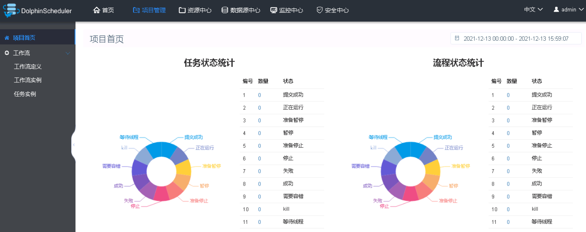

​		点击【工作流定义】->【创建工作流】，进入工作流画布，如下图：

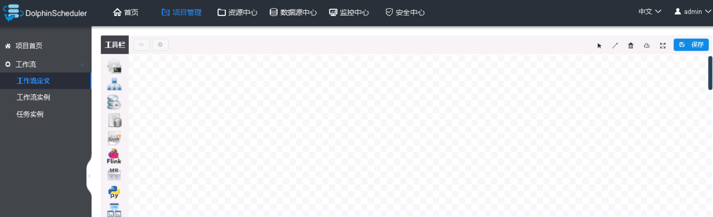

（3）步骤三：在工具栏中选择SHELL任务类型，如下图：

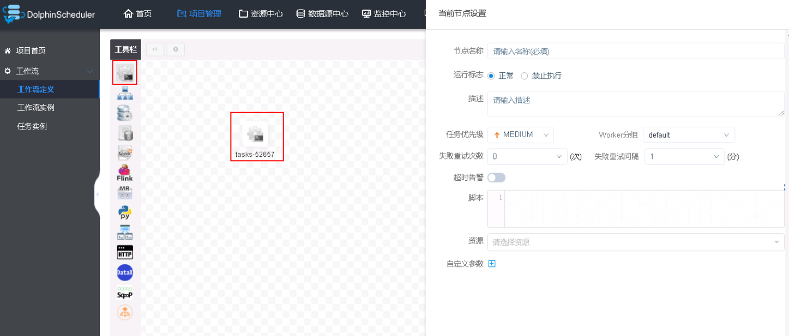

（4）步骤四：填写任务信息然后点击【确定添加】，这里实现一行文本的输出，如下图：

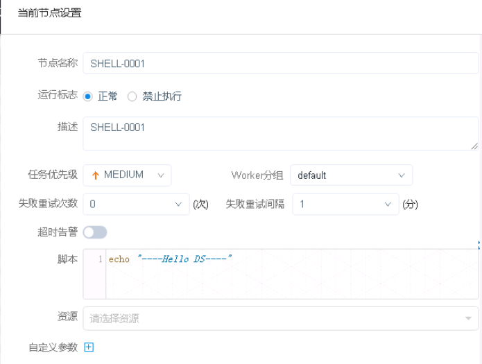

​		注意，必须点击任务流画布的右上角的【保存】按钮，如下图：

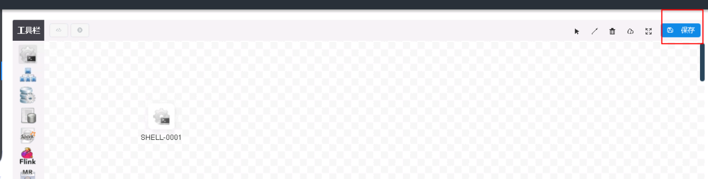

（5）步骤五：填写任务流基本信息然后点击【添加】，保存任务流信息，如下图：

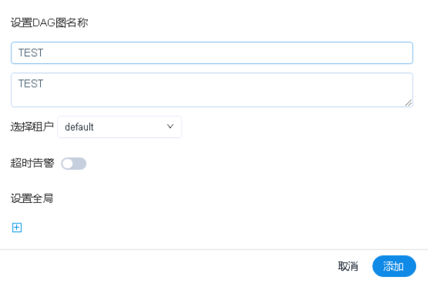

​		 保存之后，会自动跳转到【工作流定义】页面，如下图：

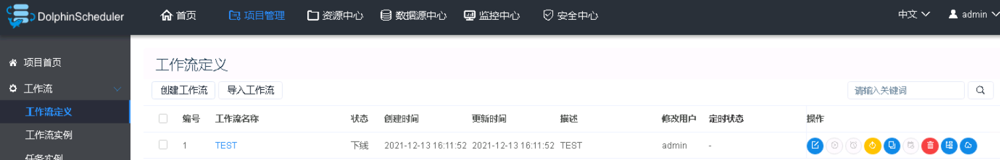

（6）步骤六：点击任务流中的【上线】按钮。

（7）步骤七：点击任务流中的【定时】按钮，设置任务定时，这里我们设置每秒执行一次，其他选项默认，然后点击【创建】。如下图：


（8）步骤八：继续点击【定时管理】->【上线】按钮，让定时状态变为上线，如下图：

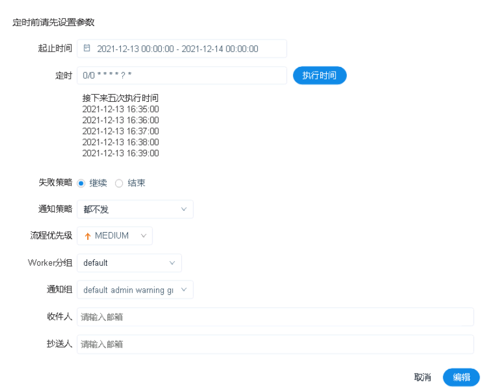


​		至此任务设置成功。

（9）点击【工作流实例】查看被调度的任务流记录，如下图：

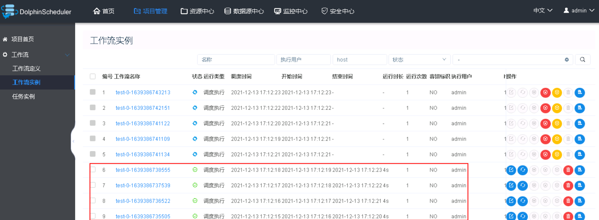

​		点击某一行任务流记录，进入任务流画布中，双击某个任务，点击右上角的【查看容志】，可以查看该任务具体的运行日志，如下图：

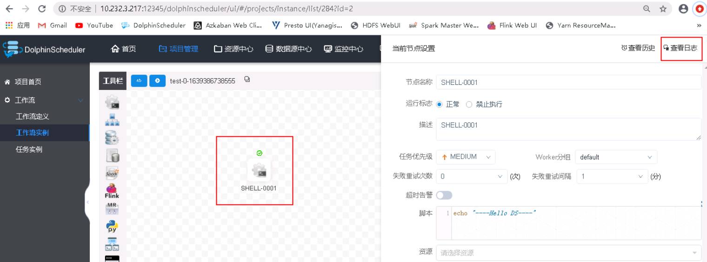

​		观察日志，可以发现输出任务结果，如下图：

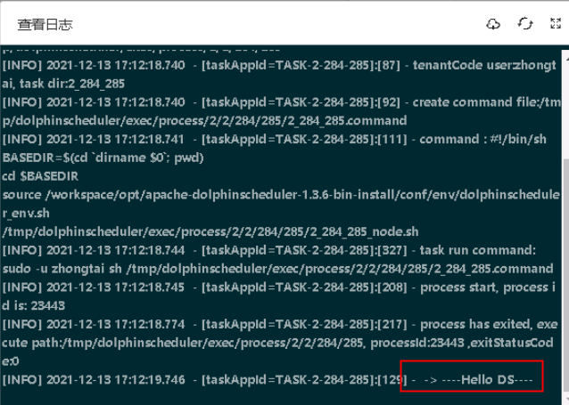


## 五.常见问题

​     更多问题可以参考DS的官方文档：https://dolphinscheduler.apache.org/zh-cn/docs/latest/user_doc/guide/quick-start.html。