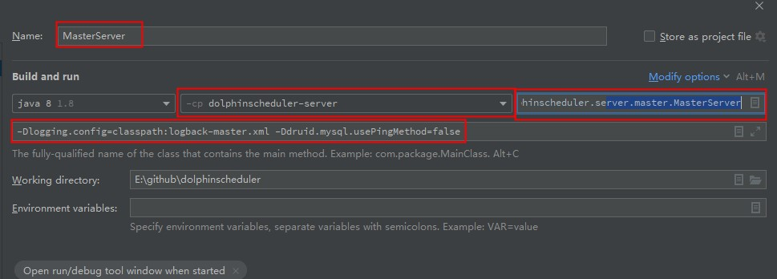
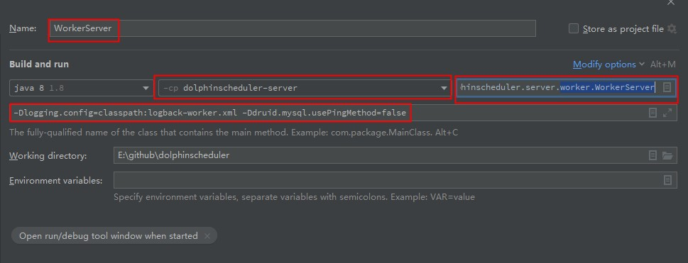
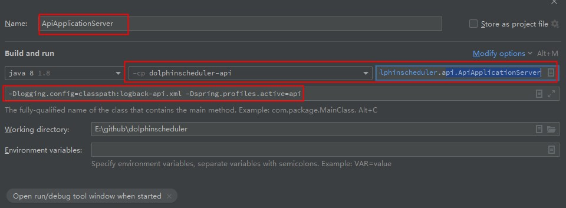

​		本文主要讨论如何通过dolphinscheduler源码进行本地调试和环境搭建，主要采用2.0.3-release版本进行说明。

## 一.Zookeeper环境搭建

​		安装包下载地址如下：

```shell
https://archive.apache.org/dist/zookeeper/
```

​		这里选择3.4.6版本，下载之后解压即可。

​		切换到zk根目录下创建data和logs两个文件夹用于存放数据和日志。进入conf目录复制zoo_sample.cfg文件并重命名为zoo.cfg，并打开文件添加如下两个配置。

```properties
dataDir=D:\\dev\\zookeeper-3.4.6\\data
dataLogDir=D:\\dev\\zookeeper-3.4.6\\logs
```

​		切换到bin目录下，双击zkServer.cmd可执行即可运行。			


## 二.初始化数据库

​		为了方便个人测试建议创建属于当前环境的数据库，这里选用MySQL，假设数据库的名字为dolphinschedulerAir。

​		然后进入打开dolphinscheduler的源码，将主模块的pom.xml中的mysql驱动依赖scope设置为compile。

​		进入dolphinscheduler-dao模块下的src/main/resources文件夹下修改application-mysql.yaml配置。具体配置如下：

```yaml
spring:
  datasource:
    driver-class-name: com.mysql.jdbc.Driver
    url: jdbc:mysql://172.16.2.120:3306/dolphinschedulerAir?useUnicode=true&characterEncoding=UTF-8
    username: root
    password: 123456
    hikari:
      connection-test-query: select 1
      minimum-idle: 5
      auto-commit: true
      validation-timeout: 3000
      pool-name: DolphinScheduler
      maximum-pool-size: 50
      connection-timeout: 30000
      idle-timeout: 600000
      leak-detection-threshold: 0
      initialization-fail-timeout: 1
```

​		配置完成之后，在同级目录下创建application.yaml文件配置spring.profiles.active=mysql用于激活上述配置，配置如下：

```yaml
spring:
  profiles:
    active: mysql
```

​		然后在该模块下直接运行org.apache.dolphinscheduler.dao.upgrade.shell.CreateDolphinScheduler类创建数据库表。


## 三.运行后端组件

### 1.配置zk相关参数

​		进入dolphinscheduler-service模块下src/main/resources目录，配置registry.properties文件，主要配置registry.servers参数用于指定zk连接信息。配置如下：

```properties
registry.plugin.name=zookeeper
registry.servers=127.0.0.1:2181
registry.namespace=dolphinscheduler
registry.base.sleep.time.ms=60
registry.max.sleep.ms=300
registry.max.retries=5
registry.session.timeout.ms=30000
registry.connection.timeout.ms=7500
registry.block.until.connected.wait=600
registry.digest=
```

### 2.运行MasterServer

​		进入dolphinscheduler-server模块下src/main/resources目录，配置logback-master.xml文件，加入如下参数为了让MasterServer服务运行日志在控制台中展示。

```xml
<root level="INFO">
    <appender-ref ref="STDOUT"/>
    <appender-ref ref="TASKLOGFILE"/>
    <appender-ref ref="MASTERLOGFILE"/>
</root>
```

​		在IDEA中配置参数如下图：



​		应用名称配置：MasterServer

​		所属模块配置：dolphinscheduler-server

​		运行入口类配置：org.apache.dolphinscheduler.server.master.MasterServer

​		运行参数配置为：-Dlogging.config=classpath:logback-master.xml -Ddruid.mysql.usePingMethod=false


### 3.运行WorkServer

​		进入dolphinscheduler-server模块下src/main/resources目录，配置logback-worker.xml文件，加入如下参数为了让WorkServer服务运行日志在控制台中展示。

```xml
<root level="INFO">
    <appender-ref ref="STDOUT"/>
    <appender-ref ref="TASKLOGFILE"/>
    <appender-ref ref="WORKERLOGFILE"/>
</root>
```

​		在IDEA中配置参数如下图：



​		应用名称配置：WorkerServer

​		所属模块配置：dolphinscheduler-server

​		运行入口类配置：org.apache.dolphinscheduler.server.worker.WorkerServer

​		运行参数配置为：-Dlogging.config=classpath:logback-worker.xml -Ddruid.mysql.usePingMethod=false


### 4.运行ApiServer

​		进入dolphinscheduler-api模块下src/main/resources目录，配置logback-api.xml文件，加入如下参数为了让ApiServer服务运行日志在控制台中展示。

```xml
<root level="INFO">
    <appender-ref ref="STDOUT"/>
    <appender-ref ref="APILOGFILE"/>
</root>
```

​		在IDEA中配置参数如下图：



​		应用名称配置：ApiApplicationServer

​		所属模块配置：dolphinscheduler-api

​		运行入口类配置：org.apache.dolphinscheduler.api.ApiApplicationServer

​		运行参数配置为：-Dlogging.config=classpath:logback-api.xml -Dspring.profiles.active=api

​		当该服务启动之后用户可以访问swagger文档方便查看系统所有API，地址为：http://localhost:12345/dolphinscheduler/doc.html。


### 5.运行LoggerServer

​		该服务主要涉及工作流实例运行之后的日志查看功能。不需要进行相关配置，直接启动类org.apache.dolphinscheduler.server.log.LoggerServer即可。


## 四.运行前端组件

​		通过Git Bash终端进入源码的dolphinscheduler-ui模块进行=前端组件的启动。命令如下：

```shell
# 安装相关依赖
npm install
# 启动前端服务
npm run start 
```

​		然后访问dolphinscheduler控制台即可，地址为：http://localhost:8888 ，用户名密码分别为admin和dolphinscheduler123。