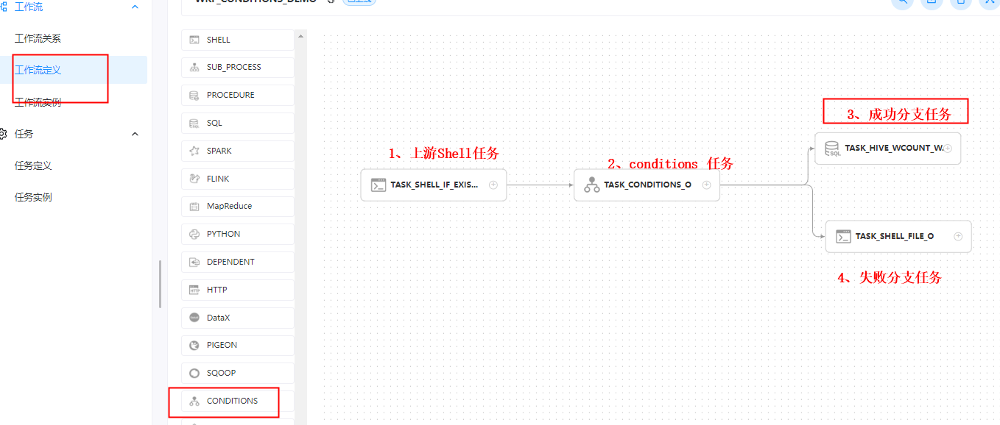
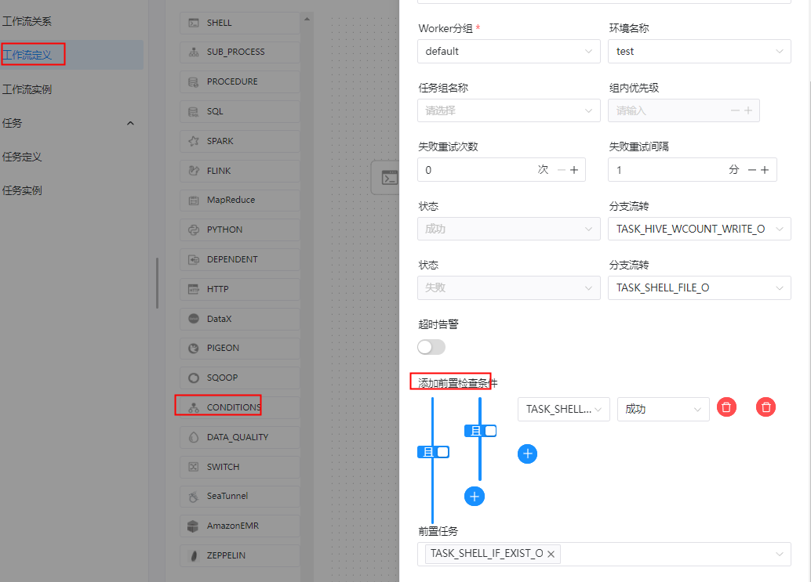
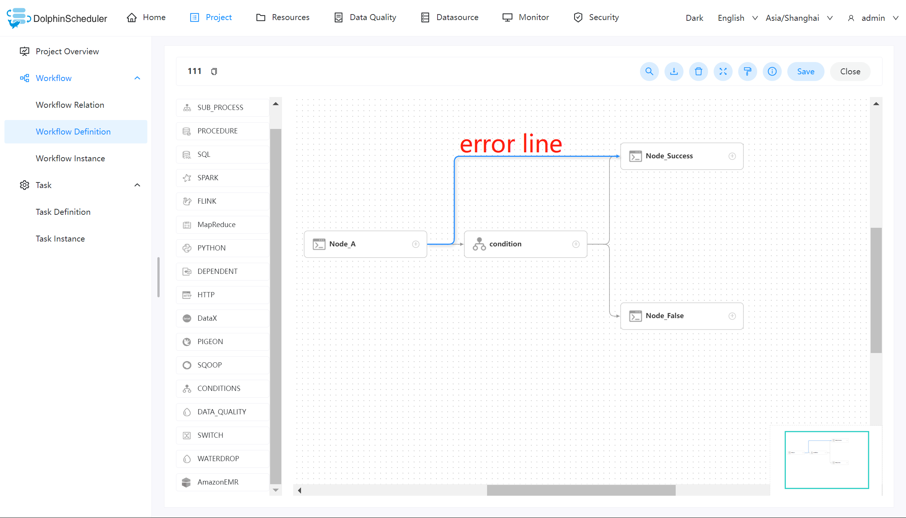
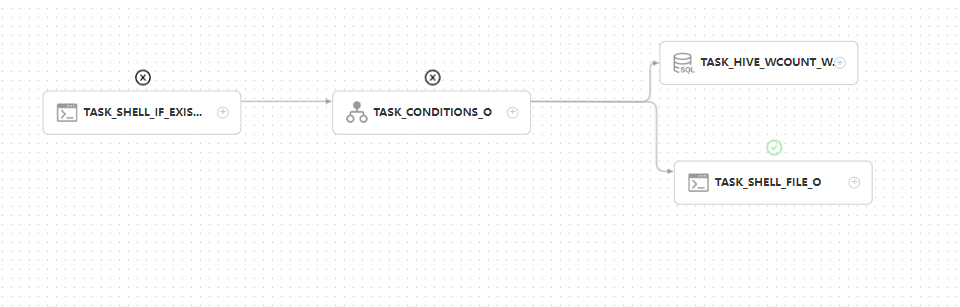

# 任务类型： Conditions

## 综述

Conditions 是一个条件节点，根据上游任务运行状态，判断应该运行哪个下游任务。截止目前 Conditions 支持多个上游任务，但只支持两个下游任务。当上游任务数超过一个时，可以通过`且`以及`或`操作符实现复杂上游依赖

## 创建任务

### 任务参数

- 节点名称：设置任务的名称，一个工作流定义中的节点名称是唯一的。
- 运行标志：标识这个节点是否能正常调度,如果不需要执行，可以打开禁止执行开关。
- 描述信息：描述该节点的功能。
- 任务优先级：worker 线程数不足时，根据优先级从高到低依次执行，优先级一样时根据先进先出原则执行。
- Worker 分组：任务分配给 worker 组的机器机执行，选择 Default，会随机选择一台 worker 机执行。
- 失败重试次数：任务失败重新提交的次数，支持下拉和手填。
- 失败重试间隔：任务失败重新提交任务的时间间隔，支持下拉和手填。
- 超时告警：勾选超时告警、超时失败，当任务超过"超时时长"后，会发送告警邮件并且任务执行失败.
- 下游任务选择：根据前置任务的状态来跳转到对应的分支，目前支持两个分支：成功、失败
  - 成功：当上游运行成功时，运行成功选择的分支
  - 失败：当上游运行失败时，运行失败选择的分支
- 上游条件选择：可以为 Conditions 任务选择一个或多个上游任务
  - 增加上游依赖：通过选择第一个参数选择对应的任务名称，通过第二个参数选择触发的 Conditions 任务的状态
  - 上游任务关系选择：当有多个上游任务时，可以通过`且`以及`或`操作符实现任务的复杂关系。

### 相关任务

`Condition`节点主要依据上游节点的执行状态（成功、失败）执行对应分支。

`Switch`节点主要依据全局变量的值和用户所编写的表达式判断结果执行对应分支。

## 任务样例



##### 1、上游shell任务

```shell
当前节点设置: 【conditions的前置任务】
任务类型： shell
节点名称:  TASK_SHELL_IF_EXIST_O
描述: shell 脚本：读取文件

脚本:
#!/bin/sh
cd /workspace/users/cxy
cat ctions.txt

````


#### 2、conditions 任务

```shell
当前节点设置: conditions 任务
任务类型： conditions
节点名称:  TASK_CONDITIONS_O
描述: 根据上游节点名称:  TASK_SHELL_IF_EXIST_O 任务运行状态，判断应该运行哪个下游任务

状态         分支流转   
成功        TASK_HIVE_WCOUNT_WRITE_O
失败        TASK_SHELL_FILE_O

添加前置检查条件
TASK_SHELL_IF_EXIST_O  成功

前置任务： TASK_SHELL_IF_EXIST_O
````




##### 3、成功分支任务

```shell
当前节点设置: 【分支任务】
任务类型： sql
节点名称:  TASK_HIVE_WCOUNT_WRITE_O
描述:  
脚本：文件存在就将数据导入hive 表 wcount 中

数据源类型： HIVE
数据源实例: 2-120_hive
SQL类型: 非查询
SQL语句：
load data local inpath '/workspace/users/cxy/ctions.txt' into table ds.wcount

前置任务: TASK_CONDITIONS_O
```


##### 4、失败分支任务

```shell
当前节点设置: 【分支任务】
任务类型： shell
节点名称:  TASK_SHELL_FILE_O
描述:  
shell 脚本：使用 for 循环将传入的参数和循环次数拼接，并写入脚本

脚本:
#!/bin/sh
cd /workspace/users/cxy
for ((i=1; i<=10; i++)); do
   echo hc$i$'\t'$i >> ctions.txt
done


前置任务: TASK_CONDITIONS_O
```


**工作流实例保存**

```shell
基本信息
工作流名称: WKF_CONDITIONS_DEMO
描述： CONDITIONS 任务类型测试工作流
```


## 注意事项

- Conditions 任务支持多个上游任务，但只支持两个下游任务。
- Conditions 任务以及包含该任务的工作流不支持复制操作。
- Conditions 的前置任务不能连接其分支节点，会造成逻辑混乱，不符合 DAG 调度。如下图所示的情况是**错误**的。



- Conditions 任务类似If-else结构，其中前置检查条件类似是if语句判断条件

  本例中当前置检查条件为`上游shell任务执行成功`,则工作流任务结构以if类比如下：

  if（`上游shell任务执行成功`）{

  `成功分支任务`

  } else {

  `失败分支任务`

  }

  所以当`上游shell任务执行成功`这个条件不成立即为`False`,走`失败分支任务`。

