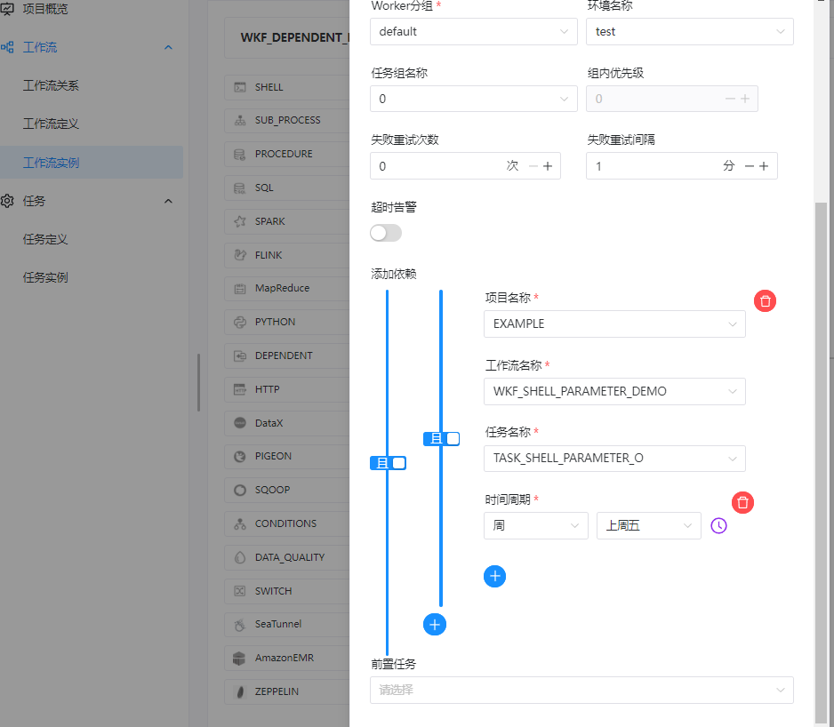
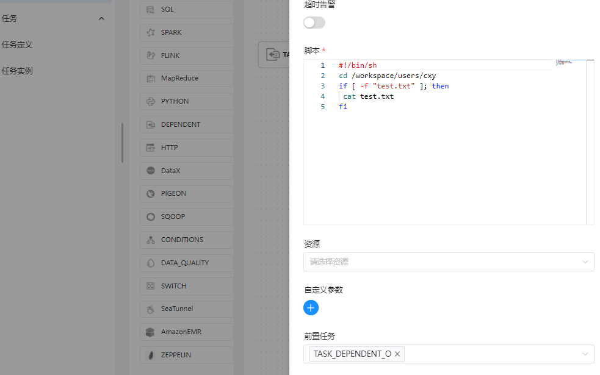
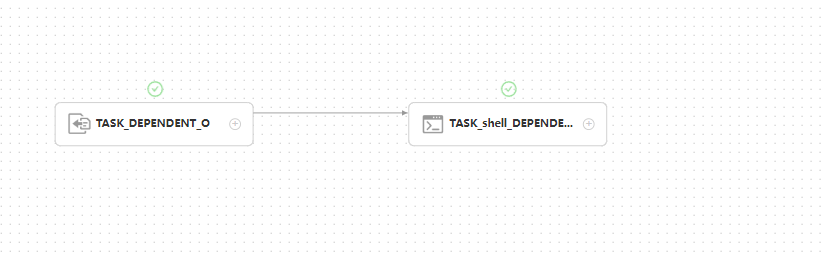
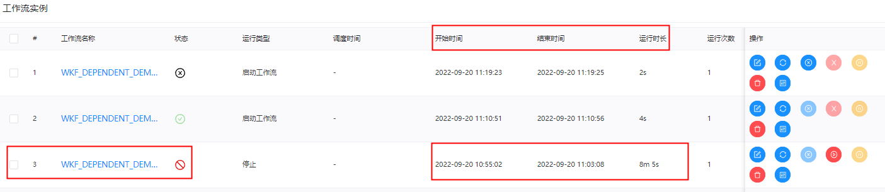
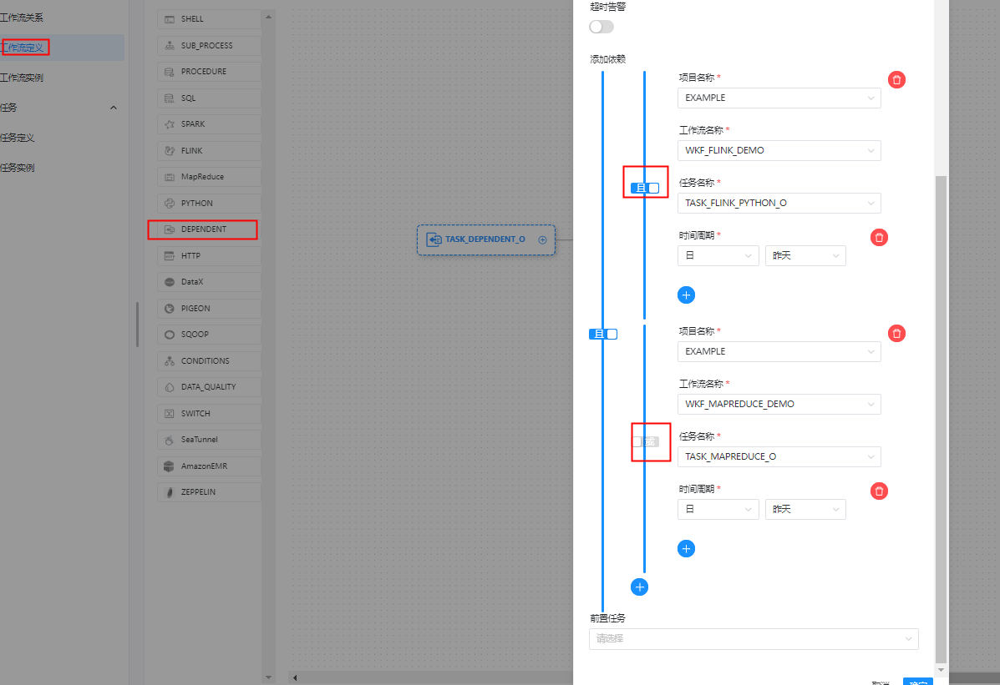

# 任务类型： Dependent

## 综述

Dependent 节点，就是**依赖检查节点**。比如 A 流程依赖昨天的 B 流程执行成功，依赖节点会去检查 B 流程在昨天是否有执行成功的实例。

## 创建任务

### 任务参数

- 节点名称：设置任务节点的名称。一个工作流定义中的节点名称是唯一的。
- 运行标志：标识这个结点是否能正常调度，如果不需要执行，可以打开禁止执行开关。
- 描述：描述该节点的功能。
- 任务优先级：worker 线程数不足时，根据优先级从高到低依次执行，优先级一样时根据先进先出原则执行。
- Worker 分组：任务分配给 worker 组的机器执行，选择 Default ，会随机选择一台 worker 机执行。
- 环境名称：配置运行脚本的环境。
- 失败重试次数：任务失败重新提交的次数。
- 失败重试间隔：任务失败重新提交任务的时间间隔，以分为单位。
- 超时警告：勾选超时警告、超时失败，当任务超过“超时时长”后，会发送告警邮件并且任务执行失败。
- 添加依赖：需要判断的依赖任务，可以是某一个项目中的工作流具体的任务执行情况。
- 前置任务：选择当前任务的前置任务，会将被选择的前置任务设置为当前任务的上游。


### 任务样例

Dependent 节点提供了逻辑判断功能，可以按照逻辑来检测所依赖节点的执行情况。

例如，A 流程为周报任务，B、C 流程为天任务，A 任务需要 B、C 任务在上周的每一天都执行成功，如图示：


```shell
当前节点设置: dependent
任务类型： dependent
节点名称: TASK_DEPENDENT_O
描述: 依赖于 WKF_SHELL_PARAMETER_DEMO 今日是否成功，TASK_shell_DEPENDENT_O

添加依赖:
EXTERNAL(项目名称)           WKF_SHELL_PARAMETER_DEMO(工作流名称)
TASK_SHELL_PARAMETER_O(节点名称)   时/日/周/月(周期时间单位) ： 周
具体时间：上周五
````




**后置任务：**

```shell
任务类型： shell
当前节点设置: 
节点名称:  TASK_shell_DEPENDENT_O
描述:  读取 WKF_SHELL_PARAMETER_DEMO 写入数据的文件
脚本:
#!/bin/sh
cd /workspace/users/cxy
if [ -f "test.txt" ]; then
 cat test.txt
fi

前置任务： TASK_DEPENDENT_O
````




**工作流实例保存**

```shell
基本信息
工作流名称: WKF_DEPENDENT_DEMO
描述： DEPENDENT任务类型测试工作流
```


### 注意：

1、`Dependent` 所依赖的任务状态对`Dependent`任务影响。

所依赖的任务条件：上述`WKF_SHELL_PARAMETER_DEMO`工作流中的`TASK_shell_DEPENDENT_O`任务在指定时间如`上周五`执行。

- 当`TASK_shell_DEPENDENT_O`任务在指定时间执行成功，则此`Dependent` 任务成功。



- 当`TASK_shell_DEPENDENT_O`任务在指定时间执行失败，则此`Dependent` 任务失败。


- 当`TASK_shell_DEPENDENT_O`任务没有在指定的时间即`上周五`执行，则此`Dependent` 任务宕住，需要手动停止




2、`Dependen`任务添加的依赖判断方式

- 当依赖是`且`连接，则判断所依赖的任务是否在指定时间执行成功，若都执行成功，才执行后置任务，等同于`&`。

  

- 当依赖是`或`连接，则判断所依赖的SHELL任务或MR任务在指定时间执行成功，若有一个任务执行成功，就可执行后置任务，等同于`|`

