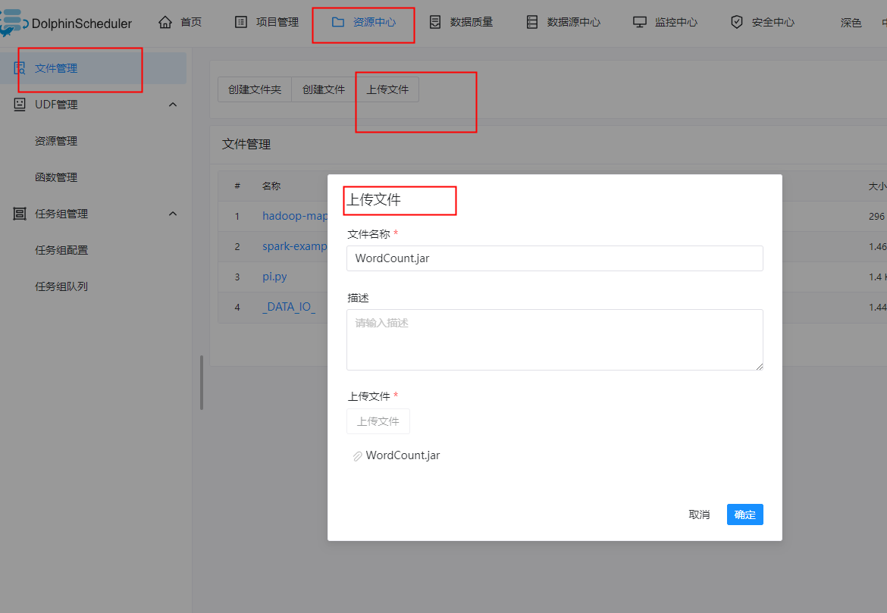
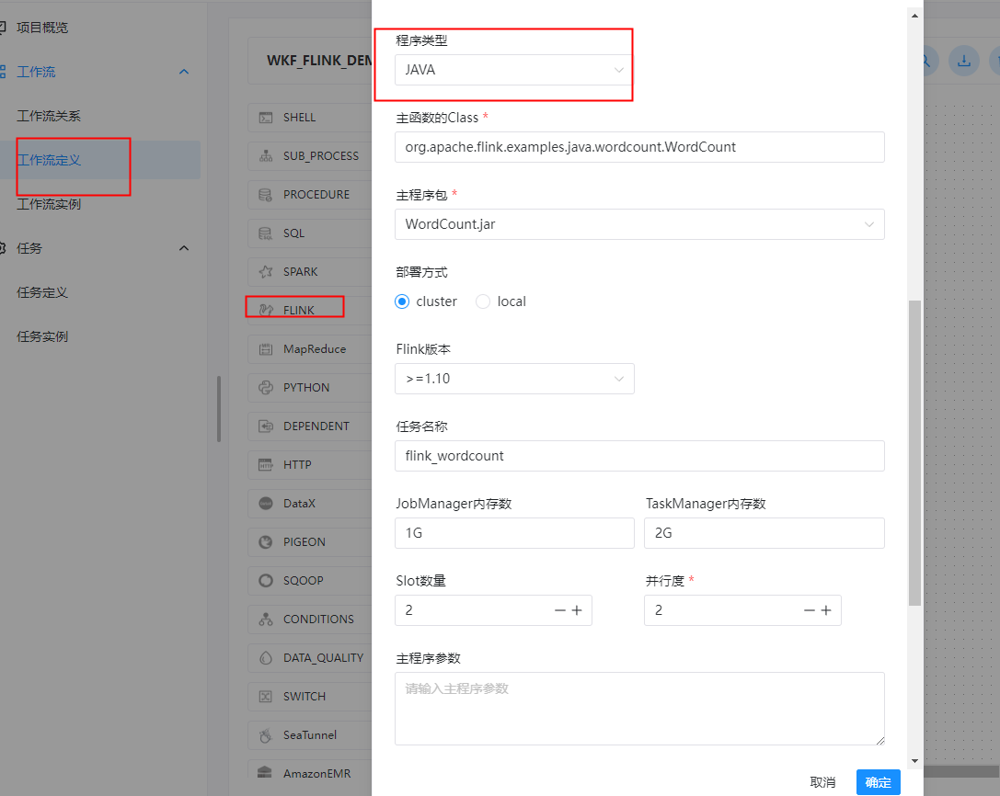

# 任务类型： Flink

## 综述

Flink 任务类型，用于执行 Flink 程序。对于 Flink 节点：

1. 当程序类型为 Java、Scala 或 Python 时，worker 使用 Flink 命令提交任务 `flink run`。更多详情查看 [flink cli](https://nightlies.apache.org/flink/flink-docs-release-1.14/docs/deployment/cli/) 。
2. 当程序类型为 SQL 时，worker 使用`sql-client.sh` 提交任务。更多详情查看 [flink sql client](https://nightlies.apache.org/flink/flink-docs-master/docs/dev/table/sqlclient/) 。

## 创建任务

### 任务参数

- 节点名称：设置任务的名称。一个工作流定义中的节点名称是唯一的。
- 运行标志：标识这个节点是否能正常调度,如果不需要执行，可以打开禁止执行开关。
- 描述：描述该节点的功能。
- 任务优先级：worker 线程数不足时，根据优先级从高到低依次执行，优先级一样时根据先进先出原则执行。
- Worker 分组：任务分配给 worker 组的机器执行，选择 Default，会随机选择一台 worker 机执行。
- 环境名称：配置运行脚本的环境。
- 失败重试次数：任务失败重新提交的次数。
- 失败重试间隔：任务失败重新提交任务的时间间隔，以分钟为单位。
- 延迟执行时间：任务延迟执行的时间，以分钟为单位。
- 超时告警：勾选超时告警、超时失败，当任务超过"超时时长"后，会发送告警邮件并且任务执行失败。
- 程序类型：支持 Java、Scala、 Python 和 SQL 四种语言。
- 主函数的 Class：Flink 程序的入口 Main Class 的**全路径**。
- 主程序包：执行 Flink 程序的 jar 包（通过资源中心上传）。
- 部署方式：支持 cluster 和 local 两种模式的部署。
- 初始化脚本：用于初始化会话上下文的脚本文件。
- 脚本：用户开发的应该执行的 SQL 脚本文件。
- Flink 版本：根据所需环境选择对应的版本即可。
- 任务名称（选填）：Flink 程序的名称。
- jobManager 内存数：用于设置 jobManager 内存数，可根据实际生产环境设置对应的内存数。
- Slot 数量：用于设置 Slot 的数量，可根据实际生产环境设置对应的数量。
- taskManager 内存数：用于设置 taskManager 内存数，可根据实际生产环境设置对应的内存数。
- taskManager 数量：用于设置 taskManager 的数量，可根据实际生产环境设置对应的数量。
- 并行度：用于设置执行 Flink 任务的并行度。
- 主程序参数：设置 Flink 程序的输入参数，支持自定义参数变量的替换。
- 选项参数：支持 `--jar`、`--files`、`--archives`、`--conf` 格式。
- 资源：如果其他参数中引用了资源文件，需要在资源中选择指定。
- 自定义参数：是 Flink 局部的用户自定义参数，会替换脚本中以 ${变量} 的内容
- 前置任务：选择当前任务的前置任务，会将被选择的前置任务设置为当前任务的上游。


### 任务样例

##### 1、Flink java/scala类型 批任务

**上传主程序包**

在使用 Flink 任务节点时，需要利用资源中心上传执行程序的 jar 包，可参考[资源中心](https://dolphinscheduler.apache.org/zh-cn/docs/latest/user_doc/guide/resource/configuration.html)。

当配置完成资源中心之后，直接使用拖拽的方式，即可上传所需目标文件。




```shell
当前节点设置: flink
节点名称:  TASK_FLINK_WORDCOUNT_O
描述: 通过 Flink 进行单词统计

程序类型: JAVA
主函数的Class: org.apache.flink.examples.java.wordcount.WordCount
主程序包: WordCount.jar
部署方式: cluster
Flink 版本： >=1.10
任务名称: flink_wordcount
````




使用 Flink 命令提交任务：

```shell
./flink run -m yarn-cluster -ys 2 -ynm flink_wordcount -yjm 1G -ytm 2G -yqu default -p 1 -sae -c org.apache.flink.examples.java.wordcount.WordCount /workspace/flink-1.13.1/examples/batch/WordCount.jar
```


##### 2、Flink java/scala类型 流任务

```shell
当前节点设置: flink
节点名称:  TASK_FLINK_STREAMING_O
描述: 通过 Flink 进行流任务测试

程序类型: JAVA
主函数的Class: org.apache.flink.streaming.examples.windowing.TopSpeedWindowing
主程序包: TopSpeedWindowing.jar
部署方式: cluster
Flink 版本： >=1.10
任务名称: streaming-top-speed-windowing
````

使用 Flink 命令提交任务：

```shell
$FLINK_HOME/bin/flink run \
-m yarn-cluster \
-ys 1 \
-ynm streaming-top-speed-windowing \
-yjm 1G \
-ytm 1G \
-yqu default \
-p 2 \
/workspace/flink-1.13.1/examples/streaming/TopSpeedWindowing.jar
```


##### 3、Flink PYTHON类型任务

```shell
当前节点设置: flink
节点名称:  TASK_FLINK_PYTHON_O
描述: 通过 Flink 进行 PYTHON 任务测试

程序类型: PYTHON
主程序包: word_count.py
任务名称: flink_wordcount
选项参数: -py
````


使用 Flink 命令提交任务：

```shell
${FLINK_HOME}/flink run -m yarn-cluster -ys 2 -ynm flink_wordcount -yjm 1G -ytm 2G -yqu default -p 1 -py examples/python/table/batch/word_count.py
```


##### 4、Flink SQL类型任务

```shell
当前节点设置: flink
节点名称:  TASK_FLINK_SQL_O
描述: 通过 Flink 进行 SQL 流式任务测试

程序类型: SQL
部署方式：cluster
初始化脚本: 
set sql-client.execution.result-mode=tableau;
脚本: 
create table test1 (
`id` INT,
`name` STRING
) with (
'connector' = 'mysql-cdc',
'hostname' = '172.16.2.120',
'port' = '3306',
'username' = 'root',
'password' = '123456',
'table-name' = 'test_stu',
'database-name' = 'ds_mysql',
'scan.incremental.snapshot.enabled' = 'false'
);

select * from test1;

任务名称: flinkSql_mysql
````

使用 Flink sql-client.sh 命令提交任务：

```shell
$FLINK_HOME/bin/sql-client.sh -f $FLINK_HOME/script/foo.sql
```

Flink SQL On Yarn 常用参数:

```shell
# 查询模式 execution.result-mode
set sql-client.execution.result-mode=tableau;
# 提交设置：Yarn 
set execution.target=yarn-per-job;
# 设置Yarn作业名称
set yarn.application.name=streaming-top-speed-windowing-sql;
# 指定Yarn队列
set yarn.application.queue=default;
# 指定JM的总进程大小 jobmanager.heap.size
set jobmanager.memory.process.size=1024mb;
# 指定每个TM的总进程大小 taskmanager.heap.size
set taskmanager.memory.process.size=4096mb;
# 指定每个TM slot数 taskmanager.numberOfTaskSlots
set taskmanager.numberOfTaskSlots=2;
# 指定并行度 parallelism.default
set parallelism.default=4;
# 执行模式 batch|streaming  execution.type
set execution.runtime-mode=streaming;
```


**工作流实例保存**

```shell
基本信息
工作流名称: WKF_FLINK_DEMO
描述： 测试 flink 任务工作流
```


## 注意事项：

- Java 和 Scala 只是用来标识，没有区别，如果是 Python 开发的 Flink 则没有主函数的 class，其余的都一样。
- 使用 SQL 执行 Flink SQL 任务，目前只支持 Flink 1.13及以上版本。


### FAQ：

**注：以下方法适用于Flink 1.13.1版本，其他版本未经测试。**

**Q**：执行Flink任务类型为python的任务时如果报如下错误：

```shell
[INFO] 2022-09-19 16:44:07.724 +0800 [taskAppId=TASK-20220919-6929690227040_7-5382-5238] TaskLogLogger-class org.apache.dolphinscheduler.plugin.task.flink.FlinkTask:[63] -  -> Traceback (most recent call last):
	  File "word_count.py", line 24, in <module>
	    from pyflink.table import BatchTableEnvironment, EnvironmentSettings
	  File "/workspace/flink-1.13.1/opt/python/pyflink.zip/pyflink/__init__.py", line 26, in <module>
	RuntimeError: Python versions prior to 3.6 are not supported for PyFlink [sys.version_info(major=2, minor=7, micro=5, releaselevel='final', serial=0)].
	org.apache.flink.client.program.ProgramAbortException: java.lang.RuntimeException: Python process exits with code: 1
		at org.apache.flink.client.python.PythonDriver.main(PythonDriver.java:134)
		at sun.reflect.NativeMethodAccessorImpl.invoke0(Native Method)
		at sun.reflect.NativeMethodAccessorImpl.invoke(NativeMethodAccessorImpl.java:62)
		at sun.reflect.DelegatingMethodAccessorImpl.invoke(DelegatingMethodAccessorImpl.java:43)
		at java.lang.reflect.Method.invoke(Method.java:498)
		at org.apache.flink.client.program.PackagedProgram.callMainMethod(PackagedProgram.java:355)
		at org.apache.flink.client.program.PackagedProgram.invokeInteractiveModeForExecution(PackagedProgram.java:222)
		at org.apache.flink.client.ClientUtils.executeProgram(ClientUtils.java:114)
```


**A**：通过 flink run 来提交 Python 任务时，Flink 会调用 “python” 命令，要求 python 的版本为 3.5, 3.6 或者 3.7 中的一个。如果没有在 DolphinScheduler 中 `bin/env/dolphinscheduler_env.sh`  里配置 Python环境，则默认使用系统默认的python2.7环境执行pyFlink。如果你不想修改DolphinScheduler 环境或系统默认环境，你可以这样解决：
在`con/flink-conf.yaml`下添加你自己的执行Python环境（注意冒号后有个空格）：

```shell
python.client.executable: /usr/bin/python3
```

