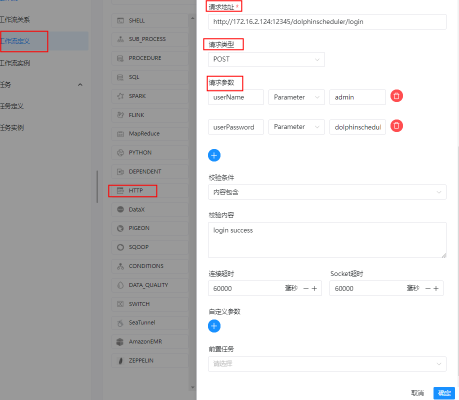

# 任务类型： HTTP

## 综述

该节点用于执行 http 类型的任务，例如常见的 POST、GET 等请求类型，此外还支持 http 请求校验等功能。

## 创建任务

### 任务参数

- 节点名称：设置任务的名称。一个工作流定义中的节点名称是唯一的。
- 运行标志：标识这个节点是否能正常调度,如果不需要执行，可以打开禁止执行开关。
- 描述：描述该节点的功能。
- 任务优先级：worker 线程数不足时，根据优先级从高到低依次执行，优先级一样时根据先进先出原则执行。
- Worker 分组：任务分配给 worker 组的机器机执行，选择 Default，会随机选择一台 worker 机执行。
- 环境名称：配置运行任务的环境。
- 失败重试次数：任务失败重新提交的次数，支持下拉和手填。
- 失败重试间隔：任务失败重新提交任务的时间间隔，支持下拉和手填。
- 延迟执行时间：任务延迟执行的时间，以分为单位。
- 超时告警：勾选超时告警、超时失败，当任务超过"超时时长"后，会发送告警邮件并且任务执行失败。
- 请求地址：http 请求 URL。
- 请求类型：支持 GET、POST、HEAD、PUT、DELETE。
- 请求参数：支持 Parameter、Body、Headers。
- 校验条件：支持默认响应码、自定义响应码、内容包含、内容不包含。
- 校验内容：当校验条件选择自定义响应码、内容包含、内容不包含时，需填写校验内容。
- 自定义参数：是 http 局部的用户自定义参数，会替换脚本中以 ${变量} 的内容。
- 前置任务：选择当前任务的前置任务，会将被选择的前置任务设置为当前任务的上游。

### 任务样例

HTTP 定义了与服务器交互的不同方法，最基本的方法有4种，分别是GET，POST，PUT，DELETE。这里我们使用 http 任务节点，演示使用 POST 向系统的登录页面发送请求，提交数据。

主要配置参数如下：

- URL：访问目标资源的地址，这里为系统的登录页面。
- HTTP Parameters
  - userName：用户名；
  - userPassword：用户登录密码。

```shell
任务类型： HTTP
节点名称:  TASK_HTTP_POST_O
描述: 
【任务目的】测试HTTP任务POST请求
【任务场景】检测登录是否成功

请求地址: http://172.16.2.124:12345/dolphinscheduler/login
请求类型: POST 
请求参数: userName         Parameter        admin
         userPassword     Parameter        dolphinscheduler123
校验条件: 内容包含
校验内容: login success
连接超时: 60000
Socket超时: 60000
````




```shell
任务类型： sql
节点名称:  TASK_HTTP_POST_PROCESS_O
描述: 【任务目的】在检测登录成功后模拟执行后续操作
数据源类型： POSTGRESQL
数据源实例: POSTGRESQL
SQL类型: 查询

SQL语句：
select t1.id as id,
       t1.name as name, 
       t1.age as age, 
       t1.address as address,
       t1.phone as phone,  
       t2.name as major_name,
       t3.name as course_name,
       t3.teacher_name as teacher_name,
       t3.teacher_phone as teacher_phone
  from t_student t1
  full outer join t_major t2
    on t1.major_id = t2.id
  full outer join t_course t3
    on t1.course_id = t3.id

前置任务： TASK_HTTP_POST_O
````


**工作流实例保存**

```shell
基本信息
工作流名称: WKF_TASK_HTTP_DEMO
描述： HTTP任务类型测试工作流
```