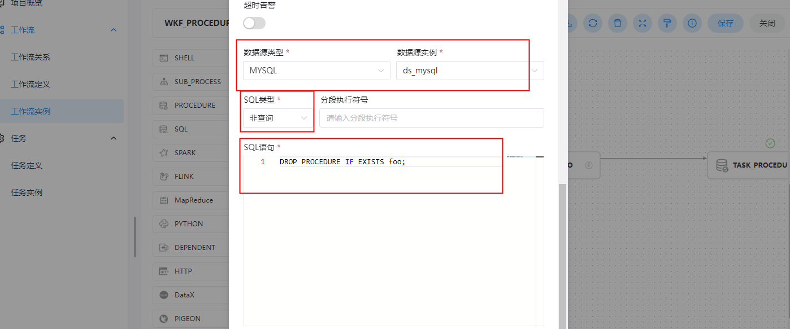
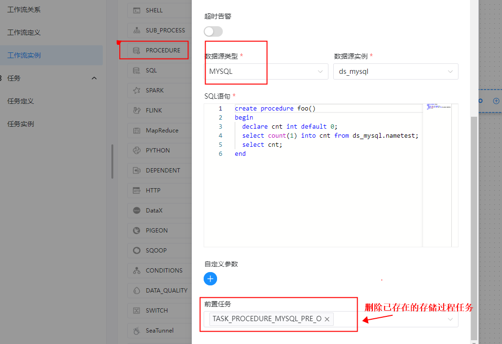
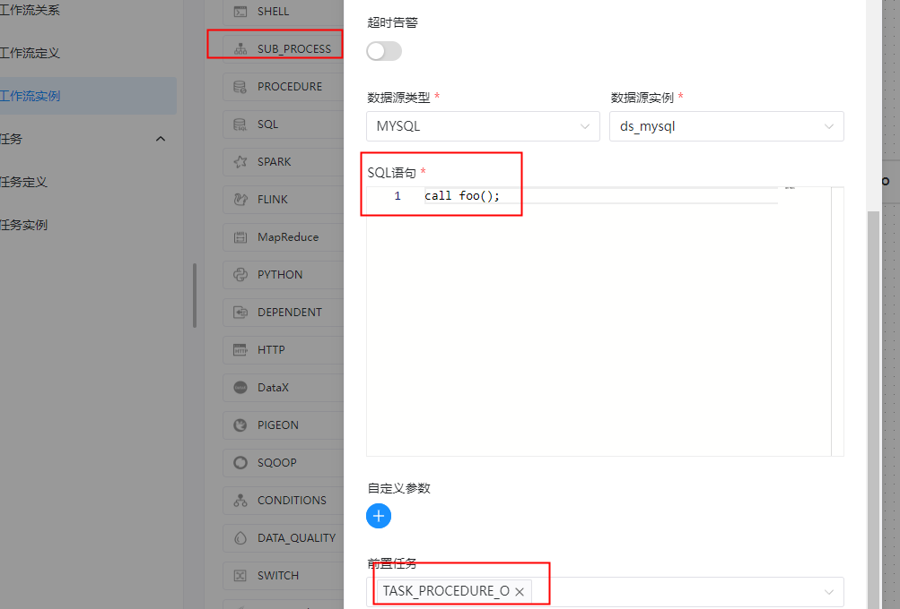
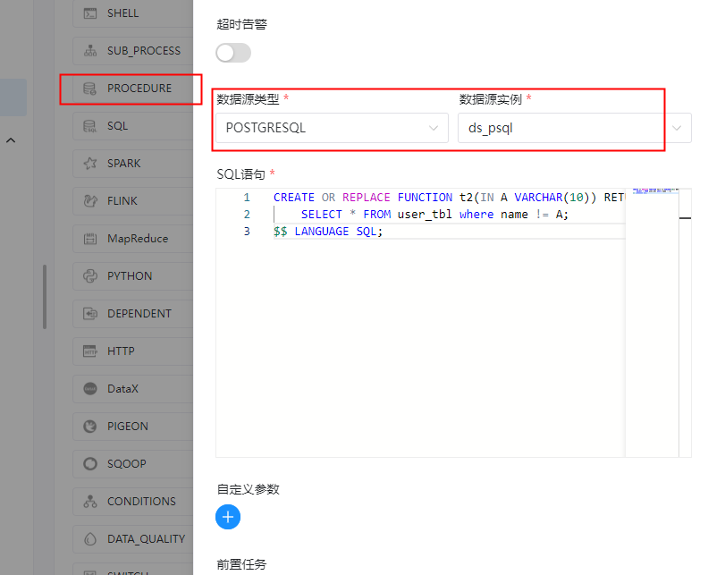
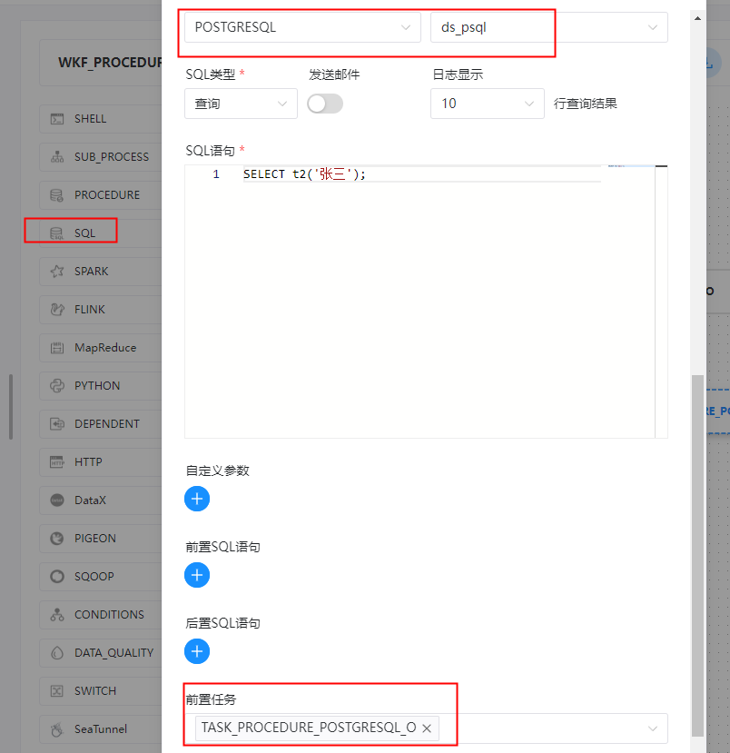

##  任务类型： PROCEDURE

### 综述

根据选择的数据源，执行存储过程。

### 创建任务

#### 任务参数

- 数据源：存储过程的数据源类型支持MySQL和POSTGRESQL两种，选择对应的数据源
- 方法：是存储过程的方法名称
- 自定义参数：存储过程的自定义参数类型支持IN、OUT两种，数据类型支持VARCHAR、INTEGER、LONG、FLOAT、DOUBLE、DATE、TIME、TIMESTAMP、BOOLEAN九种数据类型

#### 任务样例

##### mysql 存储过程

1、判断此存储过程是否存在，存在就删除

```shell
当前节点设置:  mysql 存储过程
任务类型： sql 任务
节点名称:  TASK_PROCEDURE_MYSQL_PRE_O
描述: 判断此存储过程是否存在，存在就删除
脚本:
DROP PROCEDURE IF EXISTS foo;
````

**删除mysql存储过程 需要创建sql任务来执行删除语句**



2、创建mysql 存储过程：查询表数据量

```shell
任务类型： PROCEDURE 任务
节点名称:  TASK_PROCEDURE_O
描述: 创建mysql 存储过程：查询表数据量
脚本:
create procedure foo()
begin
  declare cnt int default 0;
  select count(1) into cnt from ds_mysql.nametest;
  select cnt;
end

前置任务： TASK_SUB_SHELL_O
```



3、调用刚刚创建的mysql 存储过程 foo

```shell
任务类型： PROCEDURE 任务
节点名称:  TASK_PROCEDURE_CALL_O
描述: 调用刚刚创建的mysql 存储过程 foo
脚本:
call foo();

前置任务： TASK_PROCEDURE_MYSQL_O
```

**想要调用存储过程可以创建存储过程类型的任务**




##### postgres 存储过程

1、创建postgres存储过程

```shell
当前节点设置: postgres 存储过程
任务类型： PROCEDURE 任务
节点名称:  TASK_PROCEDURE_POSTGRESQL_O
描述: 【任务目的】创建postgres存储过程

脚本:
CREATE OR REPLACE FUNCTION t2(IN A VARCHAR(10)) RETURNS TABLE(col1 VARCHAR,col2 DATE) AS $$    
    SELECT * FROM user_tbl where name != A; 
$$ LANGUAGE SQL;
```



2、调用postgres存储过程

```shell
任务类型: sql 任务
节点名称:  TASK_PROCEDURE_POSTGRES_CALL_O
描述: 【任务目的】调用postgres存储过程

脚本:
SELECT t2('张三');

前置任务： TASK_PROCEDURE_POSTGRES_O
```

**调用Postgresql 存储过程需要创建SQL任务**




**工作流实例保存**

```shell
基本信息
工作流名称: WKF_PROCEDURE_DEMO
描述： 创建mysql 存储过程并调用
```

