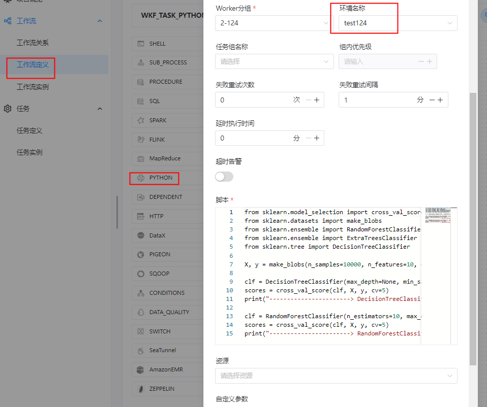
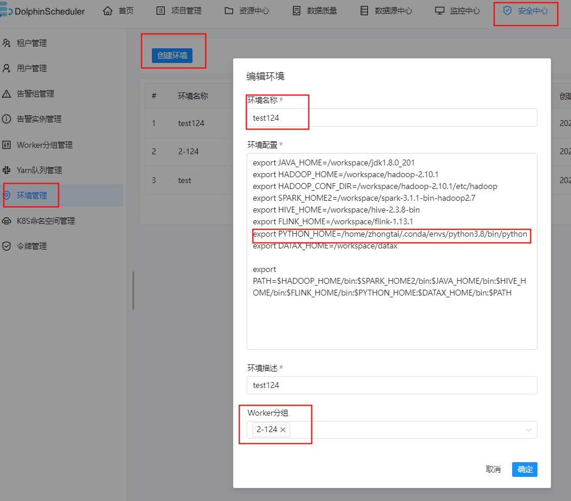

#  任务类型： Python

## 综述

Python 任务类型，用于创建 Python 类型的任务并执行一系列的 Python 脚本。worker 执行该任务的时候，会生成一个临时python脚本， 并使用与租户同名的 linux 用户执行这个脚本。

## 创建任务

### 任务参数

- 任务名称：设置任务的名称。一个工作流定义中的节点名称是唯一的。
- 运行标志：标识这个节点是否能正常调度,如果不需要执行，可以打开禁止执行开关。
- 描述：描述该节点的功能。
- 任务优先级：worker线程数不足时，根据优先级从高到低依次执行，优先级一样时根据先进先出原则执行。
- Worker分组：任务分配给worker组的机器机执行，选择Default，会随机选择一台worker机执行。
- 环境名称：配置运行脚本的环境。
- 失败重试次数：任务失败重新提交的次数，支持下拉和手填。
- 失败重试间隔：任务失败重新提交任务的时间间隔，支持下拉和手填。
- 超时告警：勾选超时告警、超时失败，当任务超过"超时时长"后，会发送告警邮件并且任务执行失败.
- 脚本：用户开发的PYTHON程序。
- 资源：是指脚本中需要调用的资源文件列表，资源中心-文件管理上传或创建的文件。
- 自定义参数：是PYTHON局部的用户自定义参数，会替换脚本中以${变量}的内容。
- 前置任务：选择当前任务的前置任务，会将被选择的前置任务设置为当前任务的上游。


### 任务样例


```shell
当前节点设置: python
节点名称:  TASK_PYTHON_RANDOM_FOREST_CLASSIFIER_TRAIN_O
描述: 
【任务目的】测试python任务
【任务场景】通过决策树和随机森林对模拟数据进行分类对比预测

任务优先级： LOWEST
Worker分组： python
环境名称： python

脚本：
from sklearn.model_selection import cross_val_score
from sklearn.datasets import make_blobs
from sklearn.ensemble import RandomForestClassifier
from sklearn.ensemble import ExtraTreesClassifier
from sklearn.tree import DecisionTreeClassifier

X, y = make_blobs(n_samples=10000, n_features=10, centers=100, random_state=0)

clf = DecisionTreeClassifier(max_depth=None, min_samples_split=2, random_state=0)
scores = cross_val_score(clf, X, y, cv=5)
print("-----------------------> DecisionTreeClassifier mean score: ", scores.mean())

clf = RandomForestClassifier(n_estimators=10, max_depth=None, min_samples_split=2, random_state=0)
scores = cross_val_score(clf, X, y, cv=5)
print("-----------------------> RandomForestClassifier mean score: ", scores.mean())

````




**工作流实例保存**

```shell
基本信息
工作流名称: WKF_TASK_PYTHON_DEMO
描述： 测试Python任务工作流
```


### 注意

- 上述例子中sklearn.model_selection 需要python3.6+,所以可以在 【安全中心】-【环境管理】中配置python3.6+的环境变量。

 