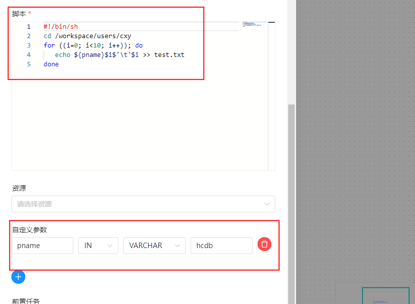

##  任务类型： SHELL

### 综述

Shell 任务类型，用于创建 Shell 类型的任务并执行一系列的 Shell 脚本。worker 执行该任务的时候，会生成一个临时 shell 脚本，并使用与租户同名的 linux 用户执行这个脚本。

### 创建任务

#### 任务参数

- 任务名称：设置任务的名称。一个工作流定义中的节点名称是唯一的。
- 运行标志：标识这个节点是否能正常调度,如果不需要执行，可以打开禁止执行开关。
- 描述：描述该节点的功能。
- 任务优先级：worker 线程数不足时，根据优先级从高到低依次执行，优先级一样时根据先进先出原则执行。
- Worker 分组：任务分配给 worker 组的机器机执行，选择 Default，会随机选择一台 worker 机执行。
- 环境名称：配置运行脚本的环境。
- 失败重试次数：任务失败重新提交的次数，支持下拉和手填。
- 失败重试间隔：任务失败重新提交任务的时间间隔，支持下拉和手填。
- 超时告警：勾选超时告警、超时失败，当任务超过"超时时长"后，会发送告警邮件并且任务执行失败.
- 脚本：用户开发的 SHELL 程序。
- 资源：是指脚本中需要调用的资源文件列表，资源中心-文件管理上传或创建的文件。
- 自定义参数：是 SHELL 局部的用户自定义参数，会替换脚本中以 `${变量}` 的内容。
- 前置任务：选择当前任务的前置任务，会将被选择的前置任务设置为当前任务的上游。


#### 任务样例

```shell
当前节点设置:
节点名称: TASK_SHELL_PARAMETER_O
描述: 
shell 脚本 使用自定义参数：设置自定义参数并传参，通过 for 循环将自定义参数的值和循环的变量值拼接，并写进文档中。

脚本:
#!/bin/sh
cd /workspace/users/cxy
for ((i=0; i<10; i++)); do
   echo ${pname}$i$'\t'$i >> test.txt
done

自定义参数:
pname IN   VARCHER  hcsdj
````




本例中，我们先在自定义脚本 中定义了参数 "pname"，并将他的值设置为 "hcdb"。接着在"脚本"中声明了 echo 命令，将参数 "param_key" 与循环次数拼接的字符串写入test.txt文档中。当我们保存 并运行任务后，在test.txt文档中会看到写入的数据。


**工作流实例保存**

```shell
基本信息
工作流名称: WKF_SHELL_PARAMETER_DEMO
描述： 测试shell 脚本使用自定义参数
```

