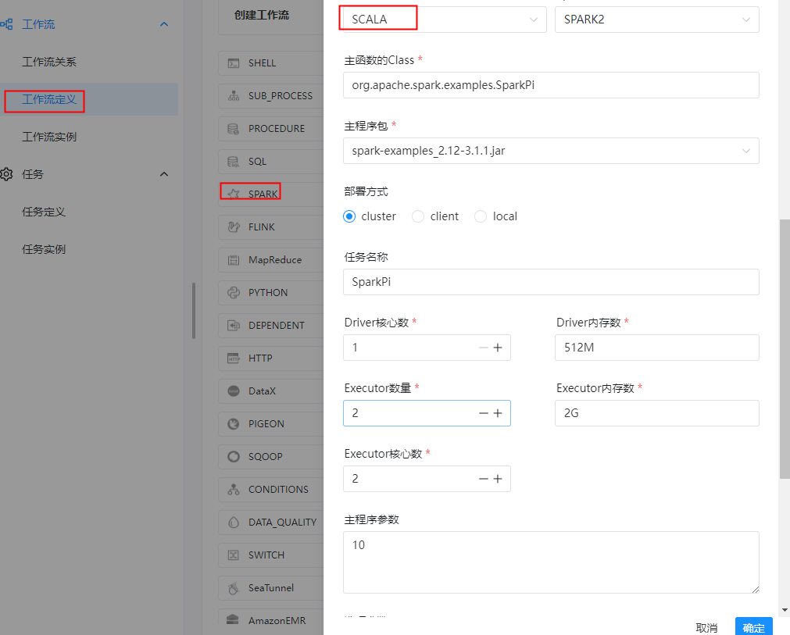
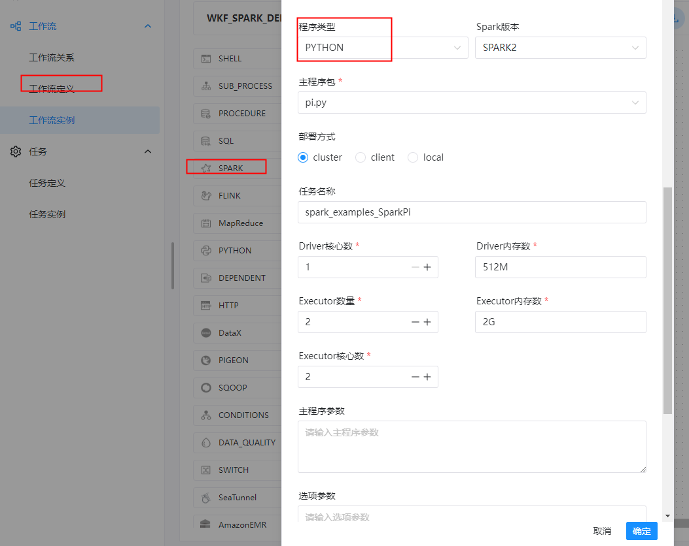
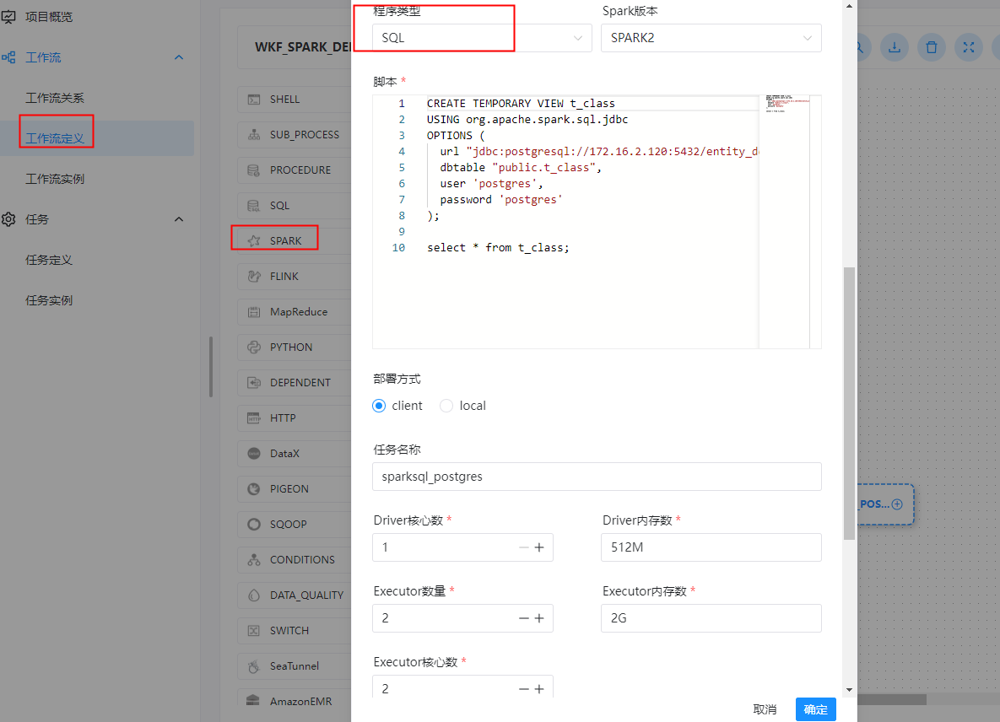

#  任务类型： spark

## 综述

Spark 任务类型用于执行 Spark 应用。对于 Spark 节点，worker 支持两个不同类型的 spark 命令提交任务：

(1) `spark submit` 方式提交任务。更多详情查看 [spark-submit](https://spark.apache.org/docs/3.2.1/submitting-applications.html#launching-applications-with-spark-submit)。

(2) `spark sql` 方式提交任务。更多详情查看 [spark sql](https://spark.apache.org/docs/3.2.1/sql-ref-syntax.html)。

## 创建任务

### 任务参数

- 节点名称：设置任务的名称。一个工作流定义中的节点名称是唯一的。
- 运行标志：标识这个节点是否能正常调度,如果不需要执行，可以打开禁止执行开关。
- 描述：描述该节点的功能。
- 任务优先级：worker 线程数不足时，根据优先级从高到低依次执行，优先级一样时根据先进先出原则执行。
- Worker 分组：任务分配给 worker 组的机器执行，选择 Default 会随机选择一台 worker 机执行。
- 环境名称：配置运行脚本的环境。
- 失败重试次数：任务失败重新提交的次数。
- 失败重试间隔：任务失败重新提交任务的时间间隔，以分为单位。
- 延迟执行时间：任务延迟执行的时间，以分为单位。
- 超时警告：勾选超时警告、超时失败，当任务超过“超时时长”后，会发送告警邮件并且任务执行失败。
- 程序类型：支持 Java、Scala、Python 和 SQL 四种语言。
- Spark 版本：支持 Spark1 和 Spark2。
- 主函数的 Class：Spark 程序的入口 Main class 的全路径。
- 主程序包：执行 Spark 程序的 jar 包（通过资源中心上传）。
- SQL脚本：Spark sql 运行的 .sql 文件中的 SQL 语句。
- 部署方式：(1) spark submit 支持 yarn-clusetr、yarn-client 和 local 三种模式。 (2) spark sql 支持 yarn-client 和 local 两种模式。
- 任务名称（可选）：Spark 程序的名称。
- Driver 核心数：用于设置 Driver 内核数，可根据实际生产环境设置对应的核心数。
- Driver 内存数：用于设置 Driver 内存数，可根据实际生产环境设置对应的内存数。
- Executor 数量：用于设置 Executor 的数量，可根据实际生产环境设置对应的内存数。
- Executor 内存数：用于设置 Executor 内存数，可根据实际生产环境设置对应的内存数。
- 主程序参数：设置 Spark 程序的输入参数，支持自定义参数变量的替换。
- 选项参数：支持 `--jar`、`--files`、`--archives`、`--conf` 格式。
- 资源：如果其他参数中引用了资源文件，需要在资源中选择指定。
- 自定义参数：是 Spark 局部的用户自定义参数，会替换脚本中以 ${变量} 的内容。
- 前置任务：选择当前任务的前置任务，会将被选择的前置任务设置为当前任务的上游。


### 任务样例

#### spark submit

##### 上传主程序包

在使用 Spark 任务节点时，需要利用资源中心上传执行程序的 jar 包，可参考[资源中心](https://dolphinscheduler.apache.org/zh-cn/docs/latest/user_doc/guide/resource/configuration.html)。

当配置完成资源中心之后，直接使用拖拽的方式，即可上传所需目标文件。


**1、Spark java/scala类型任务**

```shell
当前节点设置: spark
节点名称:  TASK_SPARK_EXAMPLES_SCALA_O
描述: 采用Spark计算圆周率（SPARK_PI）

程序类型: SCALA
Spark版本： SPARK2
主函数的Class: org.apache.spark.examples.SparkPi
主程序包: spark-examples_2.12-3.1.1.jar
任务名称: spark_examples_SparkPi
部署方式：cluster
任务名称：SparkPi
主程序参数: 10
````



spark submit 提交命令：

```shell
$SPARK_HOME/bin/spark-submit \
--master yarn \
--executor-memory 4g \
--driver-memory 4g \
--num-executors 4 \
--total-executor-cores 4 \
--class org.apache.spark.examples.SparkPi \
/workspace/spark-3.1.1-bin-hadoop2.7/examples/jars/spark-examples_2.12-3.1.1.jar 10
```


**2、Spark PYTHON类型任务**

```shell
当前节点设置: spark
节点名称:  TASK_SPARK_EXAMPLES_PYTHON_O
描述: 采用Spark计算圆周率（SPARK_PI）

程序类型: PYTHON
Spark版本： SPARK2
主程序包: pi.py
部署方式：cluster
任务名称: spark_examples_SparkPi
````



spark submit 提交命令：

```shell
$SPARK_HOME/bin/spark-submit \
--master yarn \
--executor-memory 4g \
--driver-memory 4g \
--num-executors 4 \
--total-executor-cores 4 \
/workspace/spark-3.1.1-bin-hadoop2.7/examples/src/main/python/pi.py
```


#### spark sql

**执行 DDL 和 DML 语句**

```shell
当前节点设置: spark
节点名称:  TASK_SPARK_SQL_POSTGRES_O
描述: 采用spark sql 连接postgres 创建临时视图

程序类型: SQL
Spark版本： SPARK2
脚本: 
CREATE TEMPORARY VIEW t_class
USING org.apache.spark.sql.jdbc
OPTIONS (
  url "jdbc:postgresql://172.16.2.120:5432/entity_demo",
  dbtable "public.t_class",
  user 'postgres',
  password 'postgres'
);

select * from t_class;

部署方式：cluster
任务名称: sparksql_postgres
```



Spark SQL操作Postgres命令：

```]shell
$SPARK_HOME/bin/spark-sql \
--master yarn \
--deploy-mode client \
--executor-memory 1g \
--driver-memory 2g \
--num-executors 2 \
--executor-cores 2 \
--name spark-sql-postgresql \
--jars $SPARK_HOME/jars/postgresql-42.2.8.jar \
--conf spark.serializer=org.apache.spark.serializer.KryoSerializer


-- 创建临时视图
CREATE TEMPORARY VIEW t_class
USING org.apache.spark.sql.jdbc
OPTIONS (
  url "jdbc:postgresql://172.16.10.72:5432/entity_demo",
  dbtable "public.t_class",
  user 'postgres',
  password 'postgres'
);

select * from t_class;
```


**工作流实例保存**

```shell
基本信息
工作流名称: WKF_SPARK_DEMO
描述： Spark 任务案例
```


## 注意事项：

- JAVA 和 Scala 只用于标识，使用 Spark 任务时没有区别。如果应用程序是由 Python 开发的，那么可以忽略表单中的参数**Main Class**。参数**SQL脚本**仅适用于 SQL 类型，在 JAVA、Scala 和 Python 中可以忽略。

- SQL 目前不支持 cluster 模式。