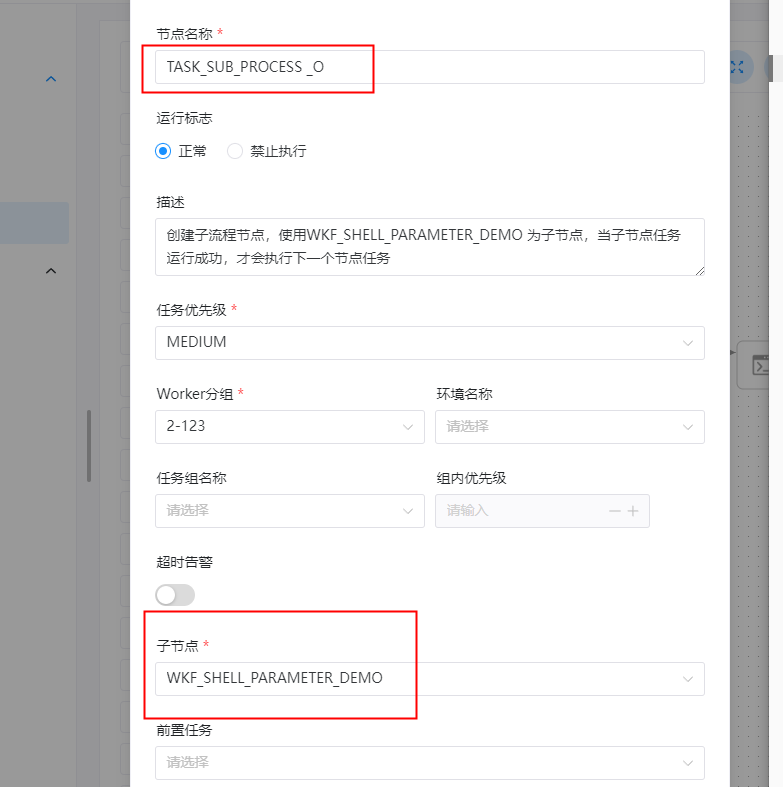
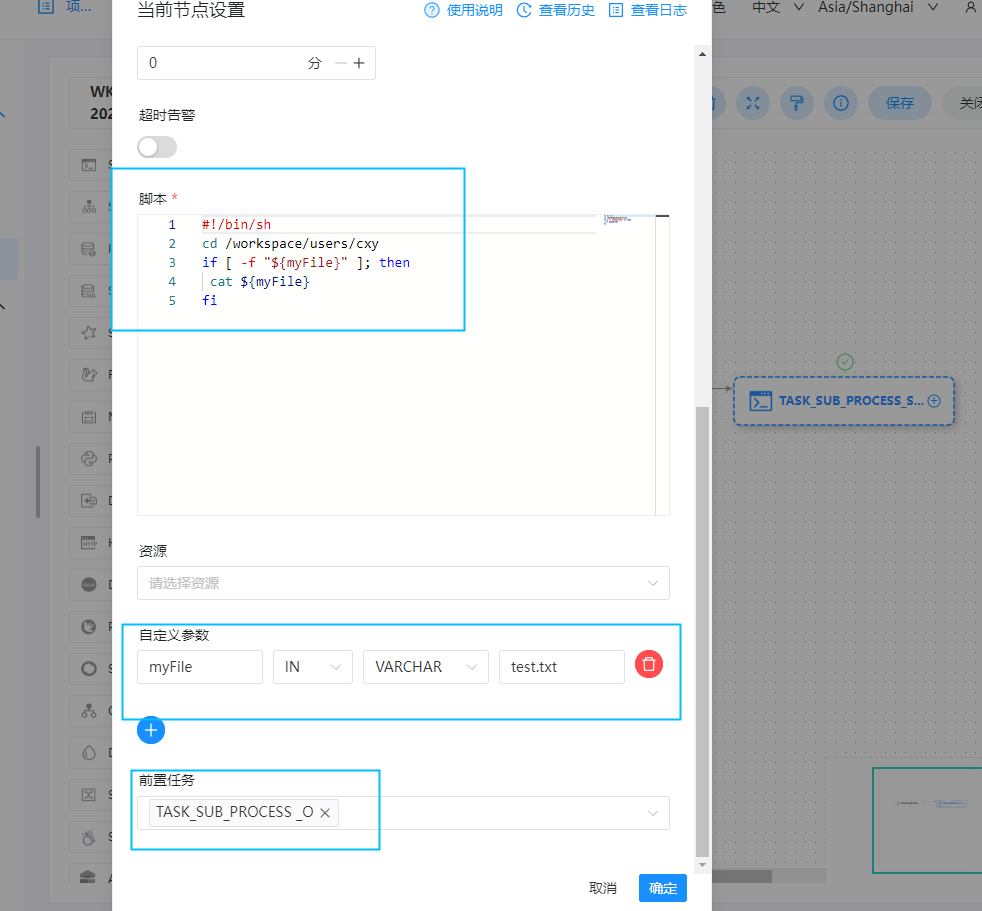
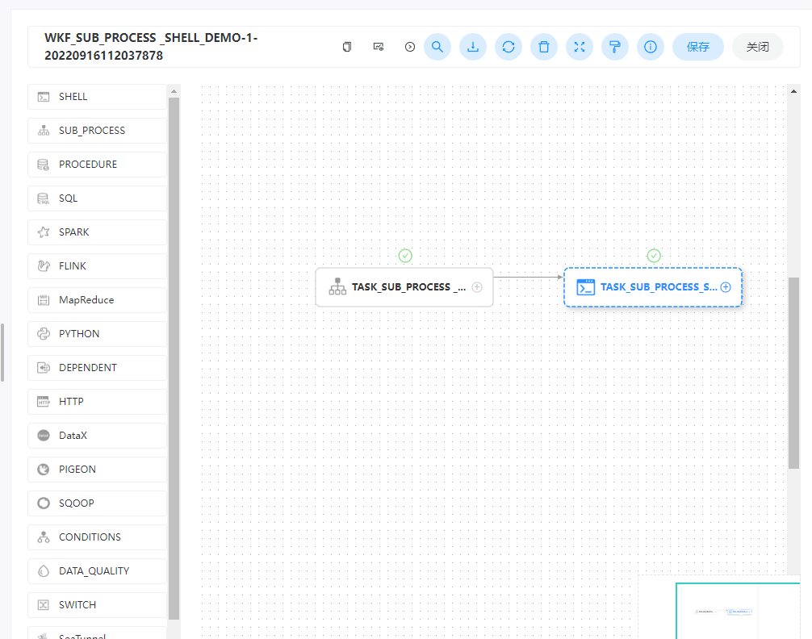
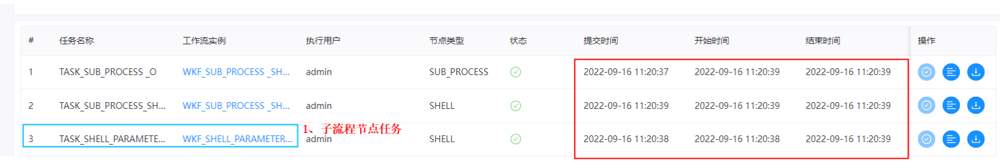

## 任务类型： SUB_PROCESS

### 综述

子流程节点，就是把外部的某个工作流定义当做一个节点去执行。

### 创建任务

#### 任务参数

- 节点名称：设置任务的名称。一个工作流定义中的节点名称是唯一的。
- 运行标志：标识这个节点是否能正常调度,如果不需要执行，可以打开禁止执行开关。
- 描述：描述该节点的功能。
- 任务优先级：worker 线程数不足时，根据优先级从高到低依次执行，优先级一样时根据先进先出原则执行。
- Worker 分组：任务分配给 worker 组的机器执行，选择 Default 会随机选择一台 worker 机执行。
- 环境名称：配置运行脚本的环境。
- 超时告警：勾选超时告警、超时失败，当任务超过"超时时长"后，会发送告警邮件并且任务执行失败.
- 子节点：是选择子流程的工作流定义，右上角进入该子节点可以跳转到所选子流程的工作流定义。
- 前置任务：选择当前任务的前置任务，会将被选择的前置任务设置为当前任务的上游。

#### 任务样例

该样例模拟了常见的任务类型，这里我们使用子结点任务调用 [Shell](https://dolphinscheduler.apache.org/zh-cn/docs/latest/user_doc/guide/task/shell.html) 循环将字符串写入文档。即将一个 shell 任务当作子结点来执行。

```shell
任务类型： SUB_PROCESS
当前节点设置:
节点名称: TASK_SUB_PROCESS _O
描述: 创建子流程节点，使用WKF_SHELL_PARAMETER_DEMO 为子节点，当子节点任务运行成功，才会执行下一个节点任务

子节点: WKF_SHELL_PARAMETER_DEMO
前置任务： TASK_SUB_SHELL_O
```




```shell
任务类型： shell
当前节点设置: 
节点名称:  TASK_SUB_PROCESS_SHELL _O
描述: SUB_PROCESS 子流程节点后续任务
脚本:
#!/bin/sh
cd /workspace/users/cxy
if [ -f "${myFile}" ]; then
 cat ${myFile}
fi

自定义参数:
myFile  IN   VARCHER  test.txt
```






**子节点任务也会再次**

**执行顺序： SUB_PROCESS子节点任务 > 后面连接的任务**




**工作流实例保存**


```shell
基本信息
工作流名称: WKF_SUB_PROCESS _SHELL_DEMO
描述： 创建 sub_process 任务 ：子节点为WKF_SHELL_PARAMETER_DEMO
```


### 注意事项

在使用 sub_process 调用子结点任务的时候，需要保证定义的子结点为上线状态，否则 sub_process 的工作流无法正常运行。