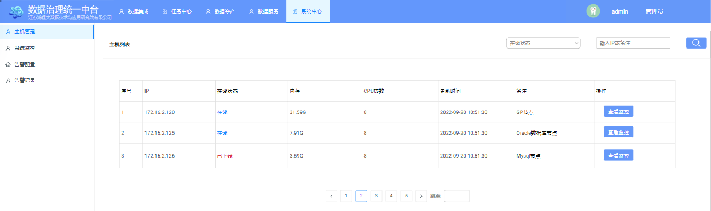
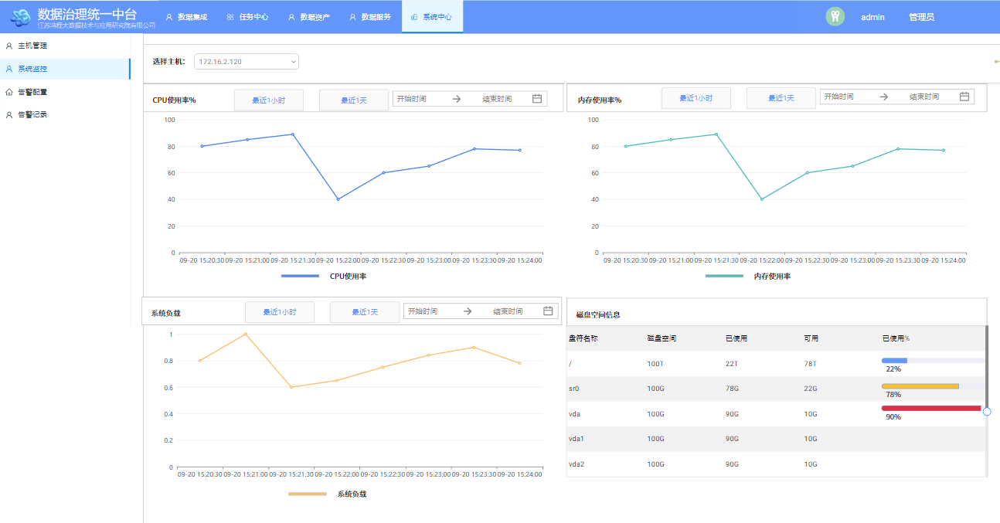
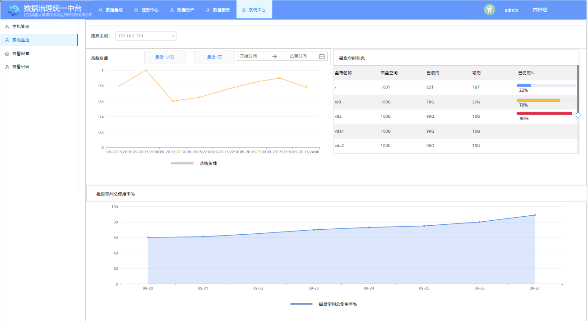

# Apache Dolphinschedule监控中心源码走读和二次开发


## 一、功能剖析

### 1.引导页面

​	点击【监控中心】->【服务管理】 标签，子菜单的Master/Worker/DB三个部分分别为监控Master Server、Worker Server以及后端数据库监控情况。

### 2.指标采集

| 监控对象 | 技术方案                                                     |
| -------- | ------------------------------------------------------------ |
| Master   | 通过oshi-core依赖（OSUtils）每10秒采集指标写入Zookeeper临时节点 |
| Worker   | 通过oshi-core依赖（OSUtils）每10秒采集指标写入Zookeeper临时节点 |
| DB       | 通过jdbc driver获取：<br/>（1）最大连接数：show max_connections；<br/>（2）当前连接数：select count(*) from pg_stat_activity；<br/>（3）当前活跃连接数： select count(*) from pg_stat_activity where state = 'active'； |

### 3.指标存储

#### 3.1 Master

​	存储在ZK中的节点内容如下：

```shell
[/dolphinscheduler/nodes/master/172.16.2.124:5678]
```

​	节点内容如下：

```shell
0.03,0.93,0.96,6.71,80.0,0.3,1663580459493,1664161820891,0,154185,0,0,0
```

​	上述字符串通过逗号分隔，第1至第3段是前端页面所展示的指标：分别如下：

​		①处理器使用量

​		②内存使用量

​		③平均负载量

#### 3.2 Worker

​	存储在ZK中的节点内容如下，可能有多个节点：

```shell
[/dolphinscheduler/nodes/worker/default/172.16.2.124:1234]
[/dolphinscheduler/nodes/worker/default/172.16.2.123:1234]
[/dolphinscheduler/nodes/worker/default/172.16.2.120:1234]
```

​	节点存储内容同Master。

#### 3.3 DB

​	这部分在前端页面展示的内容如下：

​		①健康状态

​		②最大连接数

​		③当前连接数

​		④当前活跃连接数

### 4.API

#### 	4.1 Master

​		**Request URL**：http://172.16.2.124:12345/dolphinscheduler/monitor/masters

​		**Request Method**：GET

​		**Response Body**：

```json
{
    "code":0,
    "msg":"成功",
    "data":[
        {
            "id":154185,
            "host":"172.16.2.124",
            "port":5678,
            "zkDirectory":"/nodes/master/172.16.2.124:5678",
            "resInfo":"{...}",
            "createTime":"2022-09-19 17:40:59",
            "lastHeartbeatTime":"2022-09-26 11:16:20"
        }
    ],
    "failed":false,
    "success":true
}
```

​		其中resInfo段为json字符串，格式化如下：

```json
{
  "startupTime": 1663580459493,
  "reportTime": 1664162180890,
  "cpuUsage": 0.03,
  "memoryUsage": 0.93,
  "loadAverage": 1.74,
  "availablePhysicalMemorySize": 6.67,
  "maxCpuloadAvg": 80.0,
  "reservedMemory": 0.3,
  "serverStatus": 0,
  "processId": 154185,
  "workerHostWeight": 0,
  "workerWaitingTaskCount": 0,
  "workerExecThreadCount": 0
}
```

​		前端页面展示的是cpuUsage/memoryUsage/loadAverage这三个段。

#### 	4.2 Worker

​		**Request URL**：http://172.16.2.124:12345/dolphinscheduler/monitor/workers

​		**Request Method**：GET

​		**Response Body**：

```json
{
  "code": 0,
  "msg": "成功",
  "data": [{
    "id": 154332,
    "host": "172.16.2.124",
    "port": 1234,
    "zkDirectories": ["/nodes/worker/default/172.16.2.124:1234"],
    "resInfo": "{\"startupTime\":1663580455964,\"reportTime\":1664162641838,\"cpuUsage\":0.03,\"memoryUsage\":0.93,\"loadAverage\":1.03,\"availablePhysicalMemorySize\":6.67,\"maxCpuloadAvg\":80.0,\"reservedMemory\":0.3,\"serverStatus\":0,\"processId\":154332,\"workerHostWeight\":100,\"workerWaitingTaskCount\":0,\"workerExecThreadCount\":100}",
    "createTime": "2022-09-19 17:40:55",
    "lastHeartbeatTime": "2022-09-26 11:24:01"
  }, {
    "id": 433525,
    "host": "172.16.2.123",
    "port": 1234,
    "zkDirectories": ["/nodes/worker/default/172.16.2.123:1234"],
    "resInfo": "{\"startupTime\":1663580455234,\"reportTime\":1664162641441,\"cpuUsage\":0.12,\"memoryUsage\":0.53,\"loadAverage\":11.73,\"availablePhysicalMemorySize\":43.61,\"maxCpuloadAvg\":80.0,\"reservedMemory\":0.3,\"serverStatus\":0,\"processId\":433525,\"workerHostWeight\":100,\"workerWaitingTaskCount\":0,\"workerExecThreadCount\":100}",
    "createTime": "2022-09-19 17:40:55",
    "lastHeartbeatTime": "2022-09-26 11:24:01"
  }, {
    "id": 1139613,
    "host": "192.168.1.120",
    "port": 1234,
    "zkDirectories": ["/nodes/worker/default/192.168.1.120:1234"],
    "resInfo": "{\"startupTime\":1663580450648,\"reportTime\":1664162635919,\"cpuUsage\":0.12,\"memoryUsage\":0.72,\"loadAverage\":3.95,\"availablePhysicalMemorySize\":26.21,\"maxCpuloadAvg\":80.0,\"reservedMemory\":0.3,\"serverStatus\":0,\"processId\":1139613,\"workerHostWeight\":100,\"workerWaitingTaskCount\":0,\"workerExecThreadCount\":100}",
    "createTime": "2022-09-19 17:40:50",
    "lastHeartbeatTime": "2022-09-26 11:23:55"
  }],
  "failed": false,
  "success": true
}
```

​		所展示的json段同Master。

#### 	4.3 DB

​		**Request URL**：http://172.16.2.124:12345/dolphinscheduler/monitor/databases

​		**Request Method**：GET

​		**Response Body**：

```json
{
  "code": 0,
  "msg": "成功",
  "data": [{
    "dbType": "POSTGRESQL",
    "state": "YES",
    "maxConnections": 1000,
    "maxUsedConnections": 0,
    "threadsConnections": 33,
    "threadsRunningConnections": 1,
    "date": "2022-09-26 11:29:12"
  }],
  "failed": false,
  "success": true
}
```


## 二、源码分析

### 	1.存储

​		入口主要涉及如下两个类：

```shell
org.apache.dolphinscheduler.server.master.MasterServer[dolphinscheduler-master]
org.apache.dolphinscheduler.server.worker.WorkerServer[dolphinscheduler-worker]
```

​		以master节点指标为例：

```shell
org.apache.dolphinscheduler.server.master.MasterServer#run[dolphinscheduler-master]
org.apache.dolphinscheduler.server.master.registry.MasterRegistryClient#start[dolphinscheduler-master]
org.apache.dolphinscheduler.server.master.registry.MasterRegistryClient#registry[dolphinscheduler-master]
  ~ HeartBeatTask heartBeatTask = new HeartBeatTask(...)
  ~ heartBeatExecutor.scheduleAtFixedRate(heartBeatTask, ...) // 每10秒进行心跳上报并写入zk临时节点
    |-- org.apache.dolphinscheduler.server.registry.HeartBeatTask#run[dolphinscheduler-server] 
          |-- org.apache.dolphinscheduler.service.registry.RegistryClient#persistEphemeral[dolphinscheduler-service]  
              |-- org.apache.dolphinscheduler.common.utils.HearBeat#encodeHeartBeat[dolphinscheduler-common]
                  org.apache.dolphinscheduler.common.utils.HearBeat#fillSystemInfo[dolphinscheduler-common]
                    |-- org.apache.dolphinscheduler.common.utils.OSUtils[dolphinscheduler-common]
```

### 	2.查询

​		API入口如下：

```shell
org.apache.dolphinscheduler.api.controller.MonitorController#listMaster[dolphinscheduler-api]
org.apache.dolphinscheduler.api.controller.NonitorController#listWorker[dolphinscheduler-api]
org.apache.dolphinscheduler.api.controller.MonitorController#queryDatabaseState[dolphinscheduler-api]
```

​		以worker节点指标为例：

```shell
org.apache.dolphinscheduler.api.controller.MonitorController#listWorker[dolphinscheduler-api]
  |-- org.apache.dolphinscheduler.api.service.impl.MonitorServiceImpl#queryWorker[dolphinscheduler-api]
      org.apache.dolphinscheduler.api.service.impl.MonitorServiceImpl#getServerListFromRegistry[dolphinscheduler-api]
        |-- org.apache.dolphinscheduler.service.registry.RegistryClient#getServerList[dolphinscheduler-service]  
            org.apache.dolphinscheduler.service.registry.RegistryClient#getServerMaps[dolphinscheduler-service] 
              |-- org.apache.dolphinscheduler.plugin.registry.zookeeper.ZookeeperRegistry#get[dolphinscheduler-registry-zookeeper]
```

​		已DB为例：

```shell
org.apache.dolphinscheduler.api.controller.MonitorController#queryDatabaseState[dolphinscheduler-api]
  |-- org.apache.dolphinscheduler.api.service.impl.MonitorServiceImpl#queryDatabaseState[dolphinscheduler-api]
        |-- org.apache.dolphinscheduler.dao.MonitorDBDao#queryDatabaseState[dolphinscheduler-dao]
            org.apache.dolphinscheduler.dao.MonitorDBDao#getCurrentDbPerformance[dolphinscheduler-dao]
              |-- org.apache.dolphinscheduler.dao.utils.PostgreSQLPerformance#getMonitorRecord[dolphinscheduler-dao]
```

### 	3.指标采集（探索）

​		在海豚调度中是通过**oshi-core**（OSUtils类）这个依赖库来完成系统指标的采集的。如果需要在自己的工程中使用这个库则需要引入Maven依赖如下：

```xml
<oshi.core.version>6.1.1</oshi.core.version>

...

<dependency>
    <groupId>com.github.oshi</groupId>
    <artifactId>oshi-core</artifactId>
    <version>${oshi-core.version}</version>
    <exclusions>
        <exclusion>
            <groupId>org.slf4j</groupId>
            <artifactId>slf4j-simple</artifactId>
        </exclusion>
        <exclusion>
            <groupId>org.junit.jupiter</groupId>
            <artifactId>junit-jupiter-api</artifactId>
        </exclusion>
        <exclusion>
            <groupId>org.hamcrest</groupId>
            <artifactId>hamcrest</artifactId>
        </exclusion>
    </exclusions>
</dependency>
```

​	**注意**：在集成时还需要jna-5.10.0.jar和jna-platform-5.10.0.jar两个JAR文件的支持。

​	下面我们重点研究下如何使用这个库的API来进行指标采集。我这里为了方便在线调试并且能够快速查看结果，采用Spark本地模式进行调试。启动命令如下：

```shell
$SPARK_HOME/bin/spark-shell \
--master local \
--name oshi \
--jars hdfs://ns/test_jars/oshi-core-6.1.1.jar,hdfs://ns/test_jars/jna-5.10.0.jar,hdfs://ns/test_jars/jna-platform-5.10.0.jar \
--conf spark.serializer=org.apache.spark.serializer.KryoSerializer
```

#### 3.1 处理器使用量

​		计算入口如下：

```shell
org.apache.dolphinscheduler.common.utils.OSUtils#cpuUsage[dolphinscheduler-common]
```

​		大致逻辑如下：

```scala
// 定义计算函数
def cpuUsage : java.lang.Double = {
import oshi._

val SI: SystemInfo = new SystemInfo();
val hal = SI.getHardware();
var prevTickTime: Long = 0L;
var prevTicks = new Array[Long](oshi.hardware.CentralProcessor.TickType.values().length);
var cpuUsage: java.lang.Double = 0.0D;

val processor = hal.getProcessor();

// Check if > ~ 0.95 seconds since last tick count.
val now = System.currentTimeMillis();
if (now - prevTickTime > 950) {
    // Enough time has elapsed.
    // attention
    cpuUsage =  processor.getSystemCpuLoadBetweenTicks(prevTicks);
    // attention
    prevTickTime = System.currentTimeMillis();
    prevTicks = processor.getSystemCpuLoadTicks();
}

if (java.lang.Double.isNaN(cpuUsage)) {
    return -1D;
}

val df = new java.text.DecimalFormat("0.00");
df.setRoundingMode(java.math.RoundingMode.HALF_UP);
return java.lang.Double.parseDouble(df.format(cpuUsage));
}

println(cpuUsage)
```

​		如果想获取CPU核心数，可以调用如下方法：

```scala
processor.getLogicalProcessorCount
```

​		关于CPU的计算也可以通过如下Linux命令查看：

```shell
# 观察%Cpu(s)中id代表有多少空闲
top
# 观察cpu id
vmstat       
# 观察idl
dstat -c      
# 最占cpu的进程获取
dstat --top-cpu 
```

#### 3.2 内存使用量

​		计算入口如下：

```shell
org.apache.dolphinscheduler.common.utils.OSUtils#memoryUsage[dolphinscheduler-common]
```

​		大致计算逻辑如下：

```scala
// 定义计算函数
def memoryUsage : java.lang.Double = {

import oshi._

val SI: SystemInfo = new SystemInfo();
val hal = SI.getHardware();

val memory = hal.getMemory();
val memoryUsage = (memory.getTotal() - memory.getAvailable()) * 1.0 / memory.getTotal();

val df = new java.text.DecimalFormat("0.00");
df.setRoundingMode(java.math.RoundingMode.HALF_UP);
return java.lang.Double.parseDouble(df.format(memoryUsage));
}

println(memoryUsage)
```

​		通过该API还可以获取如下指标：

```scala
// 总内存
memory.getTotal()
// 可用系统内存
memory.getAvailable()
// 可用虚拟内容
memory.getSwapTotal()
// 已用虚拟内存
memory.getSwapUsed()
```

​		也可以通过如下Linux命令查看：

```shell
# 观察KiB Mem中id代表有多少空闲
top  

free
```

#### 3.3 平均负载量

​		计算入口如下：

```shell
org.apache.dolphinscheduler.common.utils.OSUtils#loadAverage[dolphinscheduler-common]
```

​		大致逻辑如下：

```scala
// 定义计算函数
def loadAverage : java.lang.Double = {
import oshi._
var loadAverage : java.lang.Double = 0D;
val SI: SystemInfo = new SystemInfo();
val hal = SI.getHardware();
try {
    loadAverage = java.lang.management.ManagementFactory.getPlatformMXBean(classOf[java.lang.management.OperatingSystemMXBean]).getSystemLoadAverage();
} catch {
    case e: Exception => {
      loadAverage = hal.getProcessor().getSystemLoadAverage(1)(0);
      if (java.lang.Double.isNaN(loadAverage)) {
          return -1D;
      }
    }
}

val df = new java.text.DecimalFormat("0.00");
df.setRoundingMode(java.math.RoundingMode.HALF_UP);
return java.lang.Double.parseDouble(df.format(loadAverage));
}

println(loadAverage)
```

​		也可以通过如下Linux命令查看：

```shell
# 观察load average
top             
```

#### 3.4 磁盘空间信息（扩展）

​		主要涉及：涉及：盘符名称，磁盘空间，已使用空间，可用空间，使用率（%）等。在Linux环境可以通过如下命令进行查看：

```shell
df -h
```

​		大致逻辑如下：

```scala
import oshi._
val SI: SystemInfo = new SystemInfo();
val hal = SI.getHardware();
hal.getDiskStores

val os = SI.getOperatingSystem
os.getFileSystem.getFileStores

val osFileStores = os.getFileSystem.getFileStores

os.getFileSystem.getFileStores.get(5)
// getName()         // 磁盘名称
// getVolumn()       // 文件集（文件系统）
// getMount()        // 盘符（挂载点）
// getType()         // 类型：ext4/xfs
// getUsableSpace()  // 可用空间
// getTotalSpace()   //  总空间
// (getTotalSpace() - getFreeSpace()) / getTotalSpace() // 使用率
```

​		如何获取磁盘空间总使用率？/dev开头的盘符下：（总空间加总 - 空闲空间加总）/ 总空间加总。

​		大致逻辑如下：

```scala
import oshi._
import scala.collection.JavaConverters._

val SI: SystemInfo = new SystemInfo();
val hal = SI.getHardware();
hal.getDiskStores

val os = SI.getOperatingSystem
os.getFileSystem.getFileStores

val osFileStores = os.getFileSystem.getFileStores.asScala
val (free, total) = osFileStores.filter(_.getName.startsWith("/dev/")).map(e => (e.getFreeSpace, e.getTotalSpace)).reduce((a, b) => (a._1 + b._1, a._2 + b._2))
(total - free) * 1.0D / total
```

#### 3.5 IP相关（扩展）

​		Linux环境命令如下：

```shell
ip addr
```

​		大致逻辑如下：

```scala
import oshi._
import scala.collection.JavaConverters._

val SI: SystemInfo = new SystemInfo();
val os = SI.getOperatingSystem
os.getNetworkParams
// getDnsServers 获取域名地址
// getHostName 获取主机名

// 获取ip
java.net.InetAddress.getLocalHost().getHostAddress()

// 获取域名
java.net.InetAddress.getLocalHost().getHostName()
```

#### 3.6 进程（扩展）

​		Linux环境命令如下：

```shell
ps -ef
```

​		大致逻辑如下：

```scala
import oshi._
import scala.collection.JavaConverters._

val SI: SystemInfo = new SystemInfo();
val os = SI.getOperatingSystem
// 获取进程数目
os.getProcessCount
// 获取进程详情
os.getProcesses()

// getName()                     // 进程程序名称
// getPath()                     // 进程程序所在位置
// getCommandLine()              // 获取命令行
// getCurrentWorkingDirectory()  // 获取当前工作目录
// getUser()                     // 获取用户信息
// getUserID()                   // 获取用户id
// getGroup()                    // 获取组信息
// getGroupID()                  // 获取组id
// getState()                    // 状态
// getProcessID()                // 获取进程id
// getParentProcessID()          // 获取父进程id
// getThreadCount()              // 获取线程数
// getPriority()                 // 优先级
// getVirtualSize()              // 虚拟大小
// getResidentSetSize()          // 实际使用物理内存
// getKernelTime()               // 内核时间
// getUserTime()                 // 用户时间
// getUpTime()                   // 正常运行时间
// getStartTime()                // 开始时间
// getBytesRead()                // 读取字节
// getBytesWritten()             // 写入字节
// getOpenFiles()                // 打开文件数量
```


## 三、二次开发

#### 1.需求梳理

​		当前开源版本的海豚调度在系统监控方面存在如下缺陷：

​			①系统指标不够丰富；

​			②原生指标伴随着Worker Server节点的心跳（间隔10s）进行同步采集；

​			③系统指标更新覆盖，无法观察到变化趋势；

​			④系统指标存储在分布式协调的临时节点中，无法固化。

​		我司数据中台项目截止2022年11月版本由于重度耦合开源海豚调度，并且在此基础上进行轻度改造的情况下，需要借助该开源组件监控中心模块进行部分改造来达到监控服务器采集，监控以及显示等功能。我们希望服务器指标展示为如下图：

​	（1）**主机管理**



​	（2）**系统管理**

​		

​	

​			优化目标如下：

​				①在原有系统指标下新增其他系统指标；

​				②对部分指标进行持久化。

​			梳理之后和原生开源版本对比如下：

| 指标名称              | 当前版本 | 优化目标 | 持久化 | 备注                                                        |
| --------------------- | -------- | -------- | ------ | ----------------------------------------------------------- |
| CPU使用率（%）        | 仪表盘   | 趋势图   | √      | 近1小时，  更新频率30秒                                     |
| 内存使用率（%）       | 仪表盘   | 趋势图   | √      | 同上                                                        |
| 系统负载              | 数字面板 | 趋势图   | √      | 同上                                                        |
| 磁盘空间信息          |          | 表格     | ×      | 盘符名称，  磁盘空间，  已使用空间，可用空间，  使用率（%） |
| 磁盘空间总使用率（%） |          | 趋势图   | √      | 近7天                                                       |

#### 2.技术方案

​		为了达到上述监控功能的目标，从指标的采集，存储，查询，需要考虑如下难点：

​		①被监控的主机需要定时上报自己当前状态和节点基本信息（CPU、内存以及磁盘）。

​		②需要定时启动线程对当前的上报的状态进行检测，并对被监控的主机状态进行更新。

​		③需要定时启动线程对上报的数据进行过期处理来控制上报数据采集点数据的存储占用。

​		**注意**：被监控主机包括Master Server和Worker Server，当Master Server和Worker Server在同一台时需要确保不能重复上报等问题。

​		所以对于被监控主机涉及到的一些定时任务和大致逻辑梳理如下：

| 定时任务逻辑                                         | 定时间隔 | Master Server | Worker Server |
| ---------------------------------------------------- | -------- | ------------- | ------------- |
| 注册节点基本信息                                     | 30s      | √             | √             |
| 上报采集时点指标                                     | 30s      | √             | √             |
| 刷新节点状态（>默认10个心跳节点判定为下线）          | 10s      | √             |               |
| 过期采集时点历史数据（默认保留最近一个月的时点数据） | 1d       | √             |               |

#### 3.实现细节

##### 3.1 数据库设计

​	① t_ds_node_metrics：用于记录被监控主机基本信息和当前状态。

​	② t_ds_node_disk：用于记录被监控主机盘符挂载情况。

​	③ t_ds_node_metrics_snapshot：用于记录被监控主机时序指标变化。

​	详细表结构参考：[mysql表设计](https://github.com/AirToSupply/dolphinscheduler/blob/3.0.0-release-dev/dolphinscheduler-dao/src/main/resources/sql/dolphinscheduler_mysql.sql)

##### 3.2 API设计

​	① **查看主机列表**

| 请求类型 | API            |
| -------- | -------------- |
| GET      | /monitor/hosts |

​		**参数列表**：

| 参数名称 | 描述                       | 是否必填 |
| -------- | -------------------------- | -------- |
| pageNo   |                            | √        |
| pageSize |                            | √        |
| ip       | 主机IP（支持模糊）         |          |
| state    | 主机状态（1-在线；0-下线） |          |

​	② **查看CPU使用率（趋势图）**

| 请求类型 | API            |
| -------- | -------------- |
| GET      | /monitor/hosts |

​		**参数列表**：

| 参数名称  | 描述                              | 是否必填 |
| --------- | --------------------------------- | -------- |
| ip        | 主机IP                            | √        |
| startDate | 搜索开始时间（建议当前时间戳-1H） | √        |
| endDate   | 搜索结束时间（建议当前时间戳）    | √        |

​	③ **查看内存使用率（趋势图）**

| 请求类型 | API                   |
| -------- | --------------------- |
| GET      | /monitor/memory-usage |

​		**参数列表**：

| 参数名称  | 描述                              | 是否必填 |
| --------- | --------------------------------- | -------- |
| ip        | 主机IP                            | √        |
| startDate | 搜索开始时间（建议当前时间戳-1H） | √        |
| endDate   | 搜索结束时间（建议当前时间戳）    | √        |

​	④ **查看系统负载（趋势图）**

| 请求类型 | API                   |
| -------- | --------------------- |
| GET      | /monitor/load-average |

​		**参数列表**：

| 参数名称  | 描述                              | 是否必填 |
| --------- | --------------------------------- | -------- |
| ip        | 主机IP                            | √        |
| startDate | 搜索开始时间（建议当前时间戳-1H） | √        |
| endDate   | 搜索结束时间（建议当前时间戳）    | √        |

​	⑤ **查看磁盘空间总使用率（趋势图）**

| 请求类型 | API                 |
| -------- | ------------------- |
| GET      | /monitor/disk-usage |

​		**参数列表**：

| 参数名称  | 描述                              | 是否必填 |
| --------- | --------------------------------- | -------- |
| ip        | 主机IP                            | √        |
| startDate | 搜索开始时间（建议当前时间戳-1H） | √        |
| endDate   | 搜索结束时间（建议当前时间戳）    | √        |

​	⑥ **查看磁盘空间**	

| 请求类型 | API                  |
| -------- | -------------------- |
| GET      | /monitor/file-stores |

​		**参数列表**：

| 参数名称 | 描述   | 是否必填 |
| -------- | ------ | -------- |
| ip       | 主机IP | √        |

​	详细接口可参数：[**MonitorController.java**](https://github.com/AirToSupply/dolphinscheduler/blob/3.0.0-release-dev/dolphinscheduler-api/src/main/java/org/apache/dolphinscheduler/api/controller/MonitorController.java)

##### 3.3 内核改造

​		定时采集组件：

| 所属模块                | 类                 | 方法           | 功能                   |
| ----------------------- | ------------------ | -------------- | ---------------------- |
| dolphinscheduler-master | MasterNodeExporter | export()       | 上报Master节点时点指标 |
|                         |                    | renew()        | 注册Master节点基本信息 |
|                         |                    | stateChanged() | 刷新节点状态           |
|                         |                    | retention()    | 过期采集时点历史数据   |
| dolphinscheduler-worker | WorkerNodeExporter | export()       | 上报Worker节点时点指标 |
|                         |                    | renew()        | 注册Worker节点基本信息 |

​		Master节点监控组件启动入口如下：

```shell
org.apache.dolphinscheduler.server.master.MasterServer#run
  |-- org.apache.dolphinscheduler.server.master.metrics.MasterNodeExporter#start
```

​		Worker节点监控组件启动入口如下：

```shell
org.apache.dolphinscheduler.server.worker.WorkerServer#run[dolphinscheduler-worker]
  |-- org.apache.dolphinscheduler.server.master.metrics.WorkerNodeExporter#start
```

​		在指标采集工具类OSUtils.java需要新增如下方法：

| 方法名                              | 功能                        |
| ----------------------------------- | --------------------------- |
| ip()                                | 获取IP地址                  |
| localhost()                         | 获取本地地址                |
| hostname()                          | 获取域名                    |
| physicalMemorySize()                | 获取可用内存                |
| getFileStores()                     | 获取目录挂载情况            |
| getDiskStores()                     | 获取磁盘情况                |
| diskUsage()                         | 获取磁盘总使用率            |
| processCount()                      | 获取当前进程总数            |
| processes()                         | 获取所有进程情况            |
| process(int processeId)             | 根据进程pid获取进程情况     |
| processes(Collection<Integer> pids) | 根据进程pid列表获取进程情况 |

##### 3.4 启动参数

​	【Master侧】配置${DOLPHINSCHEDULER_HOME}/master-server/conf/application.yaml文件中关于master段相关参数，具体参数如下：

| 参数名称                      | 默认值   | 参数解释                                                     |
| ----------------------------- | -------- | ------------------------------------------------------------ |
| node-export-enable            | false    | 是否开启master节点指标采集                                   |
| node-export-interval          | 30s      | master节点指标采集时间间隔                                   |
| node-export-tick              | 10       | 节点状态监控间隔系统，节点失联时间超过node-export-interval*node-export-tick为下线状态 |
| node-export-retention-seconds | 2592000s | 节点采集数据保留时间                                         |

​	【Worker侧】配置${DOLPHINSCHEDULER_HOME}/worker-server/conf/application.yaml文件中关于worker段相关参数，具体参数如下：

| 参数名称             | 默认值 | 参数解释                   |
| -------------------- | ------ | -------------------------- |
| node-export-enable   | false  | 是否开启worker节点指标采集 |
| node-export-interval | 30s    | worker节点指标采集时间间隔 |

#### 4.实现骨架

​		具体修改骨架可以参考本人的github：[3.0.0-release-dev(node metrics monitor advanced)](https://github.com/AirToSupply/dolphinscheduler/commit/10c28f3545640cfdf5a4db73b6fde572d0846c50)

#### 5.如何部署

​		本次修改主要涉及如下模块：

```shell
dolphinscheduler-api
dolphinscheduler-common
dolphinscheduler-dao
dolphinscheduler-master
dolphinscheduler-worker
```

​		具体操作如下：

​		①根据需要修改master和worker端参数，具体如下两个配置文件：

```shell
${DOLPHINSCHEDULER_HOME}/master-server/conf/application.yaml
${DOLPHINSCHEDULER_HOME}/worker-server/conf/application.yaml
```

​		②替换如下jar文件：

```shell
${DOLPHINSCHEDULER_HOME}/api-server/libs/dolphinscheduler-api-<version>.jar
                                         dolphinscheduler-common-<version>.jar
                                         dolphinscheduler-dao-<version>.jar
                                         
${DOLPHINSCHEDULER_HOME}/master-server/libs/dolphinscheduler-api-<version>.jar
                                            dolphinscheduler-common-<version>.jar
                                            dolphinscheduler-dao-<version>.jar
                                            dolphinscheduler-master-<version>.jar

${DOLPHINSCHEDULER_HOME}/worker-server/libs/dolphinscheduler-api-<version>.jar
                                            dolphinscheduler-common-<version>.jar
                                            dolphinscheduler-dao-<version>.jar
                                            dolphinscheduler-worker-<version>.jar
                                            
${DOLPHINSCHEDULER_HOME}/alert-server/libs/dolphinscheduler-common-<version>.jar
                                           dolphinscheduler-dao-<version>.jar
                                           
${DOLPHINSCHEDULER_HOME}/tools/libs/dolphinscheduler-common-<version>.jar
                                    dolphinscheduler-dao-<version>.jar                           
```

​		③由于Master Server和Worker Server需要依赖dolphinscheduler-api模块，为了保证程序正常运行，需要将如下模块依赖包拷贝到这两个模块的libs目录下：

```shell
cd ${DOLPHINSCHEDULER_HOME}/api-server/libs/

cp classmate-1.5.1.jar                      ${DOLPHINSCHEDULER_HOME}/master-server/libs/
cp springfox-core-2.9.2.jar                 ${DOLPHINSCHEDULER_HOME}/master-server/libs/
cp springfox-schema-2.9.2.jar               ${DOLPHINSCHEDULER_HOME}/master-server/libs/
cp springfox-spi-2.9.2.jar                  ${DOLPHINSCHEDULER_HOME}/master-server/libs/
cp springfox-spring-web-2.9.2.jar           ${DOLPHINSCHEDULER_HOME}/master-server/libs/
cp springfox-swagger2-2.9.2.jar             ${DOLPHINSCHEDULER_HOME}/master-server/libs/
cp springfox-swagger-common-2.9.2.jar       ${DOLPHINSCHEDULER_HOME}/master-server/libs/
cp springfox-swagger-ui-2.9.2.jar           ${DOLPHINSCHEDULER_HOME}/master-server/libs/
cp spring-plugin-core-1.2.0.RELEASE.jar     ${DOLPHINSCHEDULER_HOME}/master-server/libs/
cp spring-plugin-metadata-1.2.0.RELEASE.jar ${DOLPHINSCHEDULER_HOME}/master-server/libs/
cp swagger-annotations-1.5.20.jar           ${DOLPHINSCHEDULER_HOME}/master-server/libs/
cp swagger-bootstrap-ui-1.9.3.jar           ${DOLPHINSCHEDULER_HOME}/master-server/libs/
cp swagger-models-1.5.24.jar                ${DOLPHINSCHEDULER_HOME}/master-server/libs/

cp classmate-1.5.1.jar                      ${DOLPHINSCHEDULER_HOME}/worker-server/libs/
cp springfox-core-2.9.2.jar                 ${DOLPHINSCHEDULER_HOME}/worker-server/libs/
cp springfox-schema-2.9.2.jar               ${DOLPHINSCHEDULER_HOME}/worker-server/libs/
cp springfox-spi-2.9.2.jar                  ${DOLPHINSCHEDULER_HOME}/worker-server/libs/
cp springfox-spring-web-2.9.2.jar           ${DOLPHINSCHEDULER_HOME}/worker-server/libs/
cp springfox-swagger2-2.9.2.jar             ${DOLPHINSCHEDULER_HOME}/worker-server/libs/
cp springfox-swagger-common-2.9.2.jar       ${DOLPHINSCHEDULER_HOME}/worker-server/libs/
cp springfox-swagger-ui-2.9.2.jar           ${DOLPHINSCHEDULER_HOME}/worker-server/libs/
cp spring-plugin-core-1.2.0.RELEASE.jar     ${DOLPHINSCHEDULER_HOME}/worker-server/libs/
cp spring-plugin-metadata-1.2.0.RELEASE.jar ${DOLPHINSCHEDULER_HOME}/worker-server/libs/
cp swagger-annotations-1.5.20.jar           ${DOLPHINSCHEDULER_HOME}/worker-server/libs/
cp swagger-bootstrap-ui-1.9.3.jar           ${DOLPHINSCHEDULER_HOME}/worker-server/libs/
cp swagger-models-1.5.24.jar                ${DOLPHINSCHEDULER_HOME}/worker-server/libs/
```

