# 为什么需要云服务？

通常如果没有自建大数据集群或者自建集群时间成本有限，可以通过购买亚马逊（或者阿里云）中的云服务快速启动大数据集群并且运行自己的业务，如果你觉得这种方式不错，那么Amazon EMR服务能够满足这个需求，链接如下：

```
https://aws.amazon.com/cn/
```

# 如何使用Amazon EMR

如何您是小白用户，想体验如何在云平台中测试运行大数据ETL任务，可以参考官方一站式教程，链接如下：

```
https://emr-etl.workshop.aws/
```

这里简单为大家介绍下重点的步骤：

（1）创建用户访问秘钥。点击【Services】搜索IAM服务，左侧工具栏点击【用户】，在右侧点击【安全证书】->【创建访问秘钥】。

**注意**：创建完毕之后会自动下载一个csv文件，其中记录了您的访问id和访问密码，这个密码仅在当前页面显示，后续打开该页面不会显示。如果密码丢失或者忘记可以重新创建秘钥对。

（2）创建EC2秘钥对。这一步主要是为了步骤三中的创建EMR集群所需要的。

点击【Services】搜索EC2服务，进入EC控制台。左侧工具栏点击【网络与安全】->【密钥对】，再次点击【创建秘钥对】，如下图：

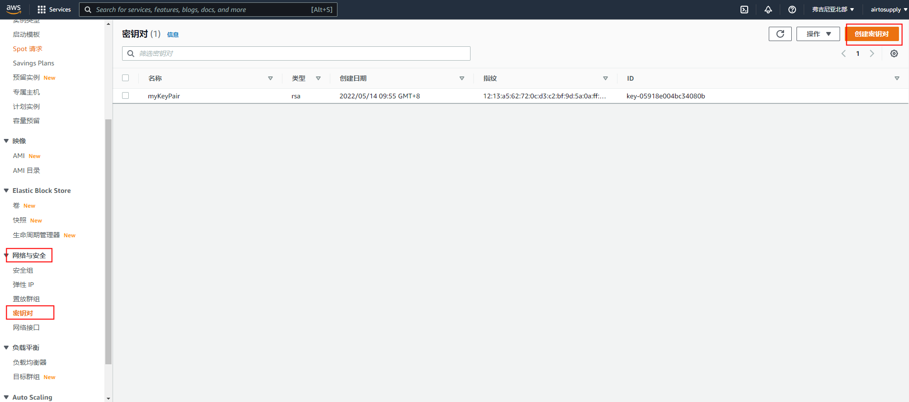

页面提示如下图，这里填写密钥对名称，因为是在MacOS或者Linux操作系统尝试所以【私钥文件格式】选择.pem；如果是在window下尝试需要选择.ppk格式。

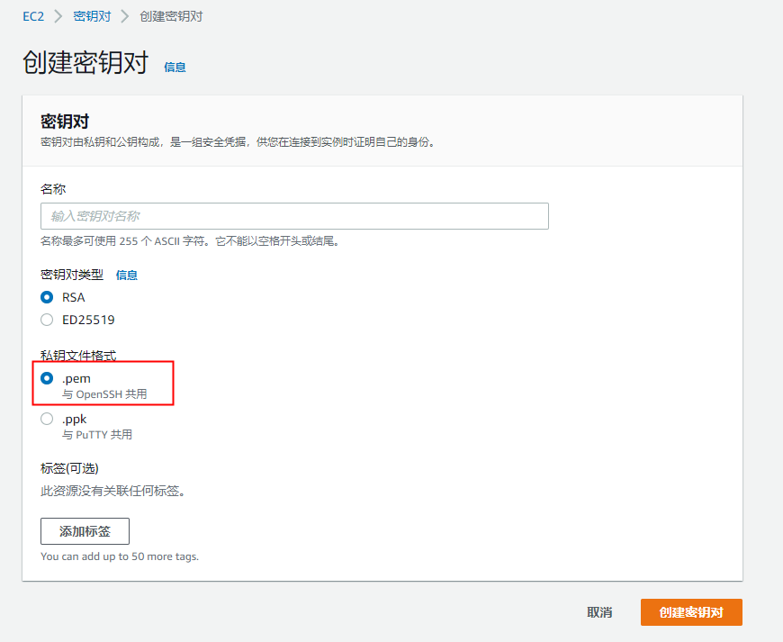

**注意**：创建完毕之后会自动下载一个.pem文件，需要保存好这个文件，方便后续连接云端终端。

（3）创建EMR集群。点击【Services】搜索EMR服务，进入EMR控制台。填写【集群名称】，选择【发行版】，应用程序这里选择Spark集群，如下图：

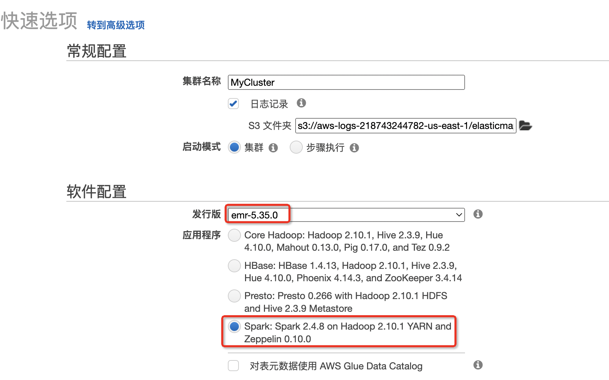

然后EC2键对下拉选择步骤一创建的秘钥对。如下图：

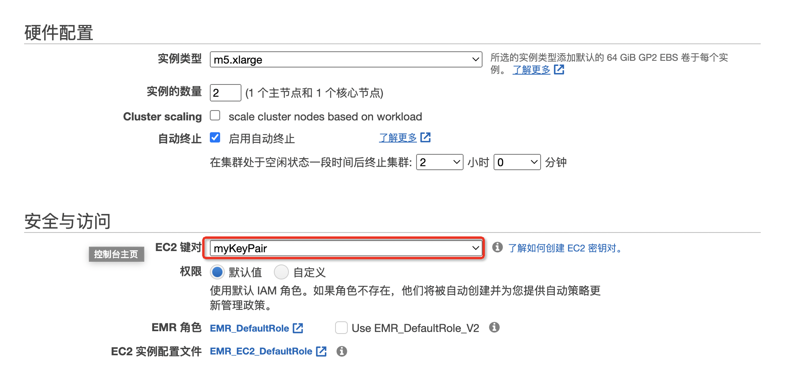

完成操作之后点击创建，需要等待一段时间即可。

（4）配置入栈规则。

为了后续开发机能够通过ssh协议直连云端终端，建议配置ssh和http入栈规则。点击【主节点的安全组】，如下图：

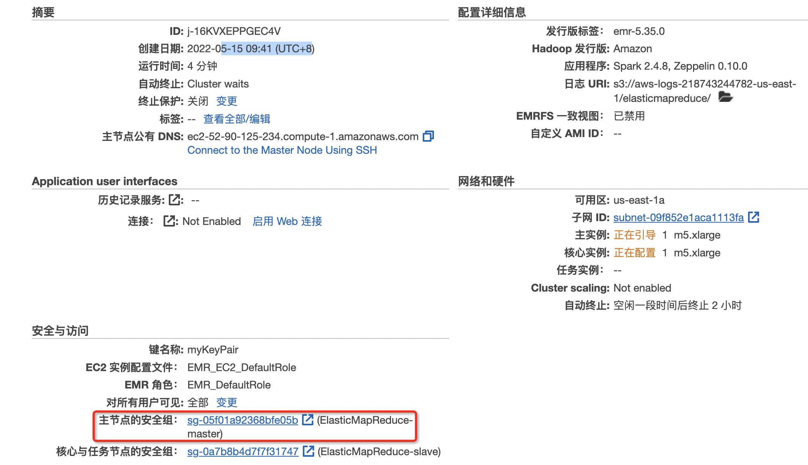

选择【安全组】表格中的安全组名称为ElasticMapReduce-master主控节点，点击【入站规则】，如下图：

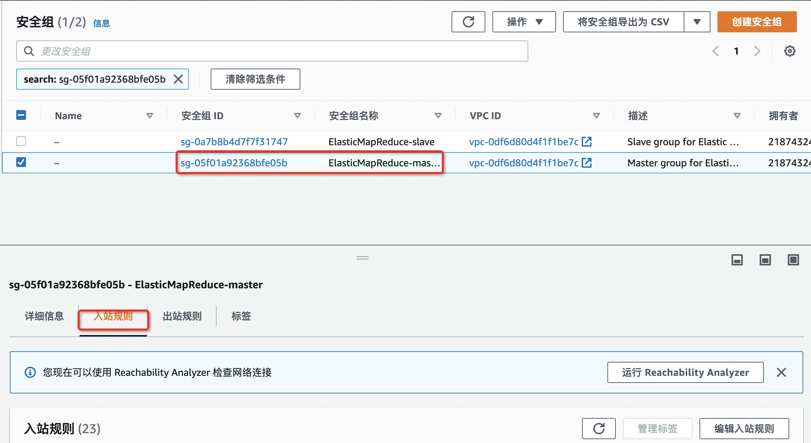

添加规则大致如下：

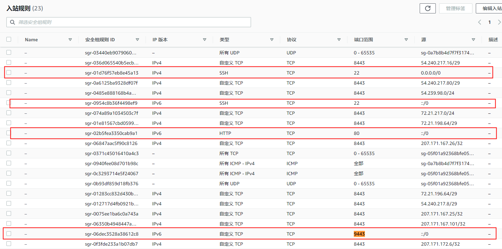

编辑入站规则之后保存规则。

（5）连接云端终端。返回刚刚创建的集群主页面，点击【摘要】中【主节点公有DBS】下方的Using SSH字样，如下图：

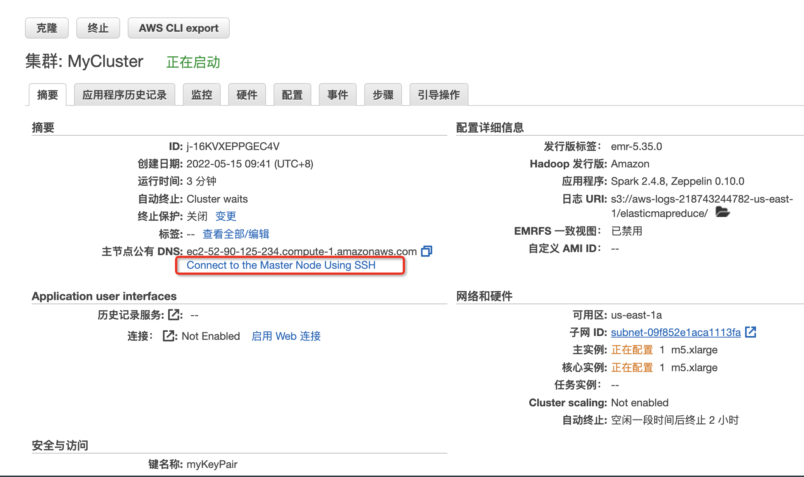

然后页面会提示如下操作步骤：

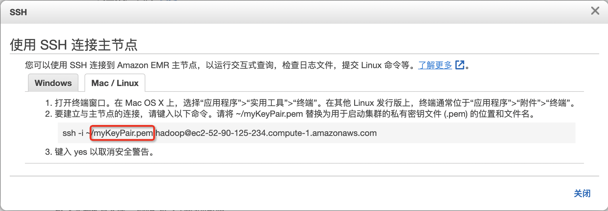

打开自己的终端按照上述提示去进行操作。最后连接成功如下图：

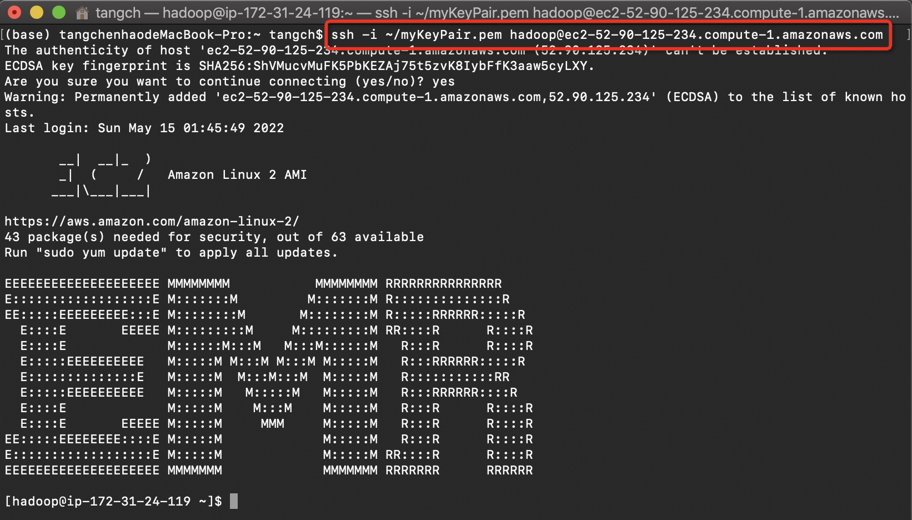

（6）在云终端运行一个Spark计算任务。

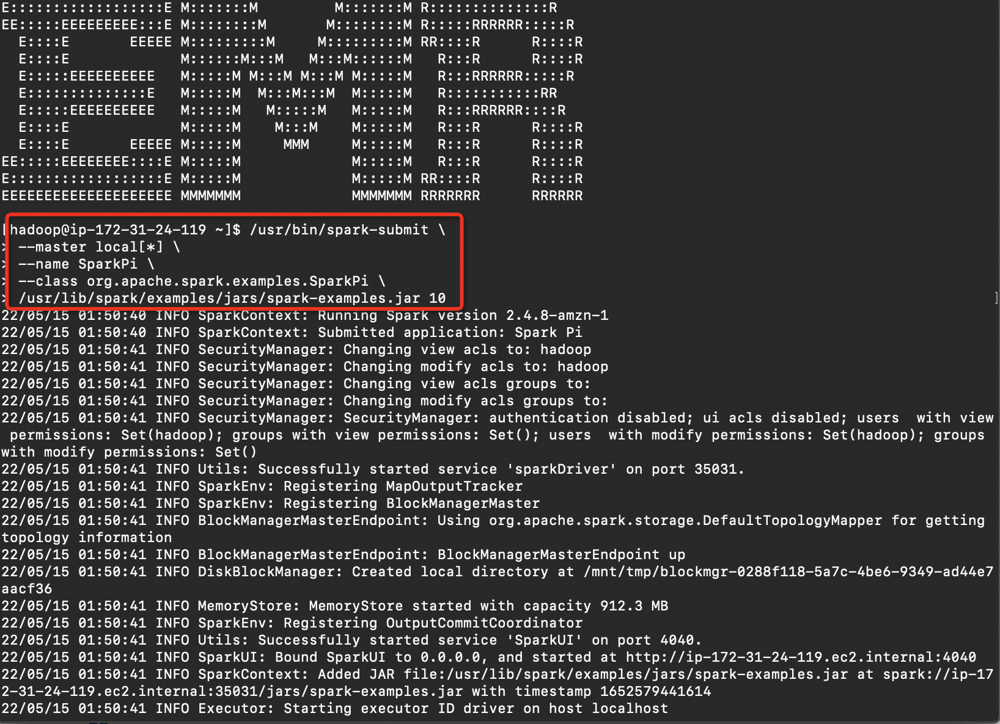


# 如何通过海豚调度Amazon EMR任务？

海豚调度在3.0.0已经提供了Amazon EMR任务的调度入口，官方文档如下：

```
https://dolphinscheduler.apache.org/zh-cn/docs/latest/user_doc/guide/task/emr.html
```

这里主要介绍下了基本操作：

（1）在海豚的common.properties配置文件中配置aws.*的相关参数：

```shell
aws.access.key.id=
aws.secret.access.key=
aws.region=
```

【注意】key.id和access.key为上述第二节的第一步中的用户访问秘钥对。region为您的账号所在的当前区域，通过EMR服务控制台右上角用户名左侧的区域可以获取。

（2）在海豚中创建EMR任务，重点在于请求JSON如何配置：

```json
{
  "Name": "SparkPi",
  "ReleaseLabel": "emr-5.35.0",
  "Applications": [
    {
      "Name": "Spark"
    }
  ],
  "Instances": {
    "InstanceGroups": [
      {
        "Name": "ElasticMapReduce-master",
        "InstanceRole": "MASTER",
        "InstanceType": "m5.xlarge",
        "InstanceCount": 1
      }
    ],
    "KeepJobFlowAliveWhenNoSteps": false,
    "TerminationProtected": false
  },
  "Steps": [
    {
      "Name": "calculate_pi",
      "ActionOnFailure": "CONTINUE",
      "HadoopJarStep": {
        "Jar": "command-runner.jar",
        "Args": [
          "/usr/lib/spark/bin/run-example",
          "SparkPi",
          "15"
        ]
      }
    }
  ],
  "JobFlowRole": "EMR_EC2_DefaultRole",
  "ServiceRole": "EMR_DefaultRole"
}
```

（3）调度之后，主要观察您的EMR集群。如下图表示正在自动启动集群：

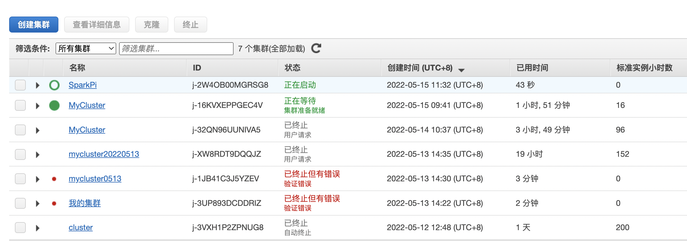

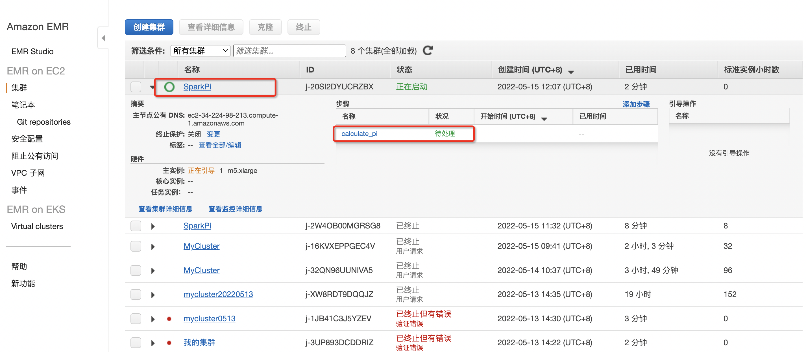

当集群启动之后，可以查看具体信息。并且能够看到具体任务的提交信息，如下图：

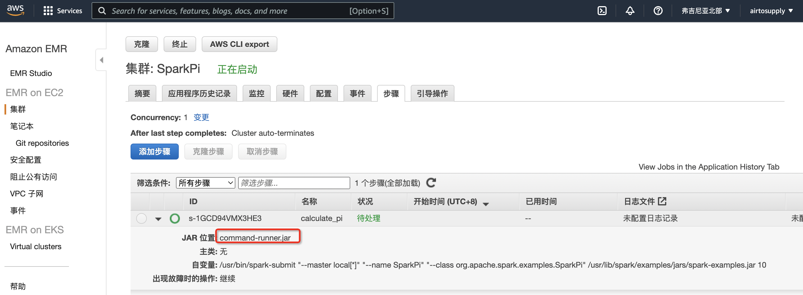

执行完成之后如下图，集群会自动关闭：

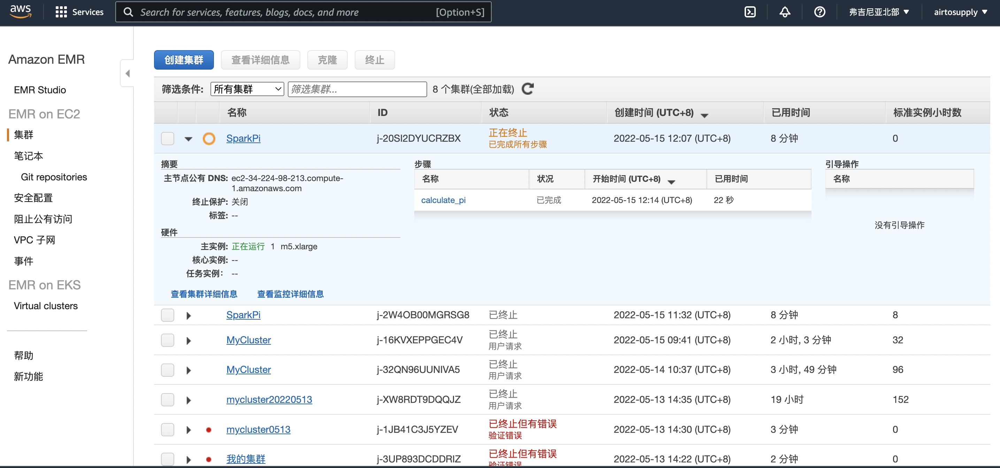

集群停止之后可以看到任务成功，如下图：

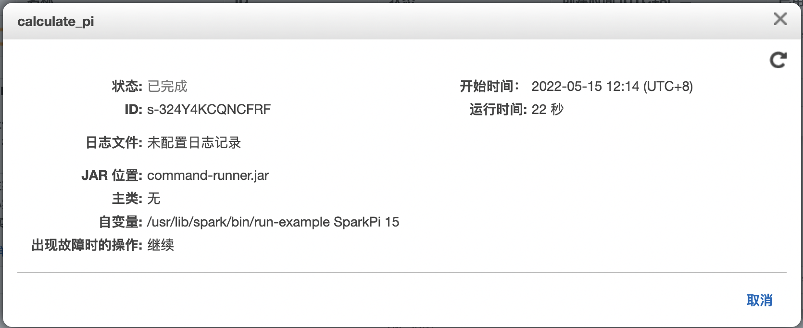

# 常见问题

（1）调度任务时访问云端未知主机异常。

```shell
[ERROR] 2022-05-14 14:12:19.800 [taskAppId=TASK-20220514-5513093890656_3-2928-3103] TaskLogLogger-class org.apache.dolphinscheduler.plugin.task.emr.EmrTask:[134] - emr task submit failed with error
com.amazonaws.dsemrtask.wrapper.SdkClientException: Unable to execute HTTP request: elasticmapreduce.us-east-1c.amazonaws.com
  at com.amazonaws.dsemrtask.wrapper.http.AmazonHttpClient$RequestExecutor.handleRetryableException(AmazonHttpClient.java:1216)
  at com.amazonaws.dsemrtask.wrapper.http.AmazonHttpClient$RequestExecutor.executeHelper(AmazonHttpClient.java:1162)
  at com.amazonaws.dsemrtask.wrapper.http.AmazonHttpClient$RequestExecutor.doExecute(AmazonHttpClient.java:811)
  at com.amazonaws.dsemrtask.wrapper.http.AmazonHttpClient$RequestExecutor.executeWithTimer(AmazonHttpClient.java:779)
  at com.amazonaws.dsemrtask.wrapper.http.AmazonHttpClient$RequestExecutor.execute(AmazonHttpClient.java:753)
  at com.amazonaws.dsemrtask.wrapper.http.AmazonHttpClient$RequestExecutor.access$500(AmazonHttpClient.java:713)
  at com.amazonaws.dsemrtask.wrapper.http.AmazonHttpClient$RequestExecutionBuilderImpl.execute(AmazonHttpClient.java:695)
  at com.amazonaws.dsemrtask.wrapper.http.AmazonHttpClient.execute(AmazonHttpClient.java:559)
  at com.amazonaws.dsemrtask.wrapper.http.AmazonHttpClient.execute(AmazonHttpClient.java:539)
  at com.amazonaws.dsemrtask.wrapper.services.elasticmapreduce.AmazonElasticMapReduceClient.doInvoke(AmazonElasticMapReduceClient.java:3669)
  at com.amazonaws.dsemrtask.wrapper.services.elasticmapreduce.AmazonElasticMapReduceClient.invoke(AmazonElasticMapReduceClient.java:3636)
  at com.amazonaws.dsemrtask.wrapper.services.elasticmapreduce.AmazonElasticMapReduceClient.invoke(AmazonElasticMapReduceClient.java:3625)
  at com.amazonaws.dsemrtask.wrapper.services.elasticmapreduce.AmazonElasticMapReduceClient.executeRunJobFlow(AmazonElasticMapReduceClient.java:3130)
  at com.amazonaws.dsemrtask.wrapper.services.elasticmapreduce.AmazonElasticMapReduceClient.runJobFlow(AmazonElasticMapReduceClient.java:3099)
  at org.apache.dolphinscheduler.plugin.task.emr.EmrTask.handle(EmrTask.java:120)
  at org.apache.dolphinscheduler.server.worker.runner.TaskExecuteThread.run(TaskExecuteThread.java:182)
  at java.util.concurrent.Executors$RunnableAdapter.call(Executors.java:511)
  at java.util.concurrent.FutureTask.run(FutureTask.java:266)
  at java.util.concurrent.ThreadPoolExecutor.runWorker(ThreadPoolExecutor.java:1149)
  at java.util.concurrent.ThreadPoolExecutor$Worker.run(ThreadPoolExecutor.java:624)
  at java.lang.Thread.run(Thread.java:748)
Caused by: java.net.UnknownHostException: elasticmapreduce.us-east-1c.amazonaws.com
  at java.net.InetAddress.getAllByName0(InetAddress.java:1281)
  at java.net.InetAddress.getAllByName(InetAddress.java:1193)
  at java.net.InetAddress.getAllByName(InetAddress.java:1127)
  at com.amazonaws.dsemrtask.wrapper.SystemDefaultDnsResolver.resolve(SystemDefaultDnsResolver.java:27)
  at com.amazonaws.dsemrtask.wrapper.http.DelegatingDnsResolver.resolve(DelegatingDnsResolver.java:38)
  at org.apache.http.impl.conn.DefaultHttpClientConnectionOperator.connect(DefaultHttpClientConnectionOperator.java:111)
  at org.apache.http.impl.conn.PoolingHttpClientConnectionManager.connect(PoolingHttpClientConnectionManager.java:353)
  at sun.reflect.NativeMethodAccessorImpl.invoke0(Native Method)
  at sun.reflect.NativeMethodAccessorImpl.invoke(NativeMethodAccessorImpl.java:62)
  at sun.reflect.DelegatingMethodAccessorImpl.invoke(DelegatingMethodAccessorImpl.java:43)
  at java.lang.reflect.Method.invoke(Method.java:498)
  at com.amazonaws.dsemrtask.wrapper.http.conn.ClientConnectionManagerFactory$Handler.invoke(ClientConnectionManagerFactory.java:76)
  at com.amazonaws.dsemrtask.wrapper.http.conn.$Proxy180.connect(Unknown Source)
  at org.apache.http.impl.execchain.MainClientExec.establishRoute(MainClientExec.java:380)
  at org.apache.http.impl.execchain.MainClientExec.execute(MainClientExec.java:236)
  at org.apache.http.impl.execchain.ProtocolExec.execute(ProtocolExec.java:184)
  at org.apache.http.impl.client.InternalHttpClient.doExecute(InternalHttpClient.java:184)
  at org.apache.http.impl.client.CloseableHttpClient.execute(CloseableHttpClient.java:82)
  at org.apache.http.impl.client.CloseableHttpClient.execute(CloseableHttpClient.java:55)
  at com.amazonaws.dsemrtask.wrapper.http.apache.client.impl.SdkHttpClient.execute(SdkHttpClient.java:72)
  at com.amazonaws.dsemrtask.wrapper.http.AmazonHttpClient$RequestExecutor.executeOneRequest(AmazonHttpClient.java:1343)
  at com.amazonaws.dsemrtask.wrapper.http.AmazonHttpClient$RequestExecutor.executeHelper(AmazonHttpClient.java:1154)
  ... 19 common frames omitted
```

【解决方案】 出现这个问题主要可能是aws.region参数配置错误，这个参数不能配置EMR集群的可用区（【集群】->【网络和硬件】->【可用区】）；具体如何配置可以参照第三小节的步骤1。

（2）调度云端任务没有权限。

```shell
[ERROR] 2022-05-15 10:00:18.125 [taskAppId=TASK-20220515-5513093890656_4-2929-3104] TaskLogLogger-class org.apache.dolphinscheduler.plugin.task.emr.EmrTask:[134] - emr task submit failed with error
com.amazonaws.dsemrtask.wrapper.services.elasticmapreduce.model.AmazonElasticMapReduceException: User: arn:aws:iam::218743244782:user/town is not authorized to perform: elasticmapreduce:RunJobFlow on resource: arn:aws:elasticmapreduce:us-east-1:218743244782:cluster/* because no identity-based policy allows the elasticmapreduce:RunJobFlow action (Service: AmazonElasticMapReduce; Status Code: 400; Error Code: AccessDeniedException; Request ID: 0afc88db-cade-4b8b-9d7a-0d0199056b0d; Proxy: null)
```

【解决方案】 这个问题主要可能是因为IAM缺少权限操作EMR资源权限。主要操作如下：

①点击【Service】搜索IAM进入控制台。点击【角色】->【创建角色】，如下图：

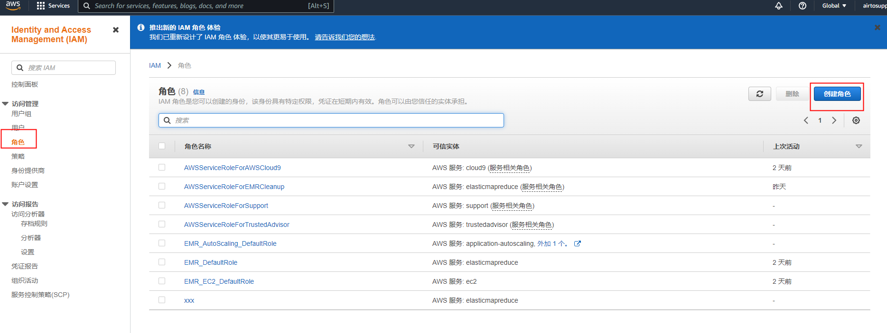

②按照如下步骤操作。

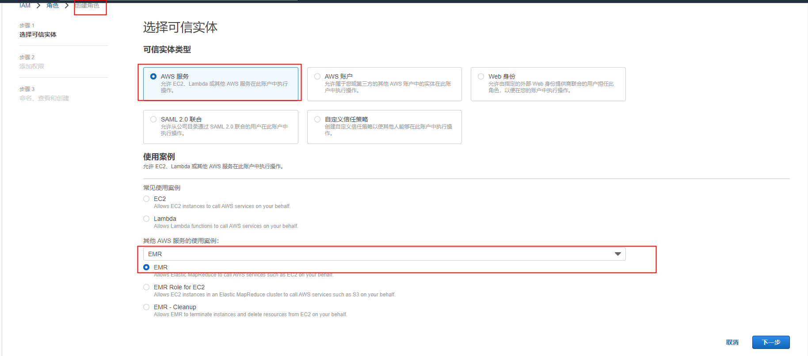

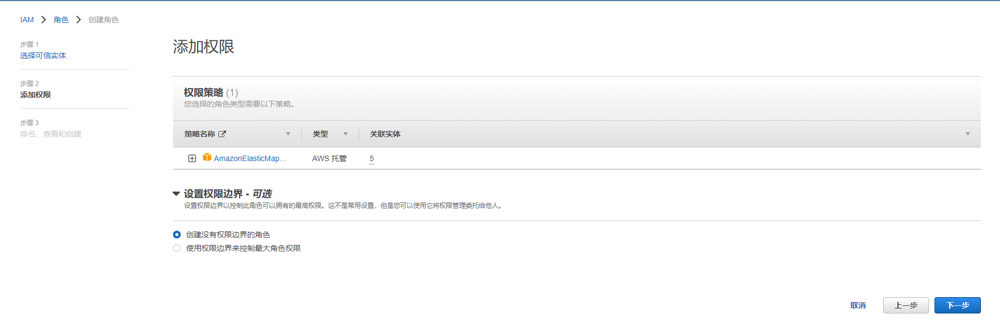

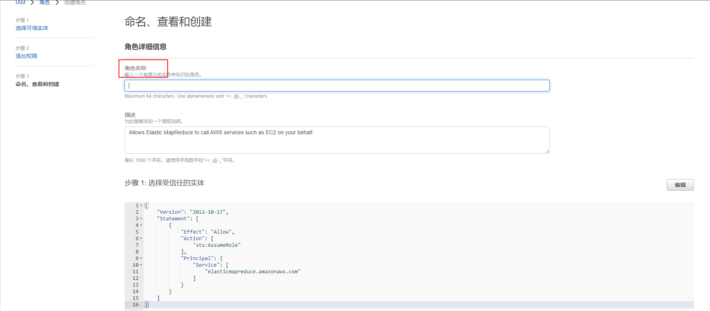

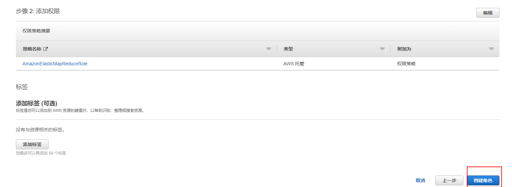

③ 创建完成之后在角色列表中可以看到，这样再次调用就是基本没有问题了。

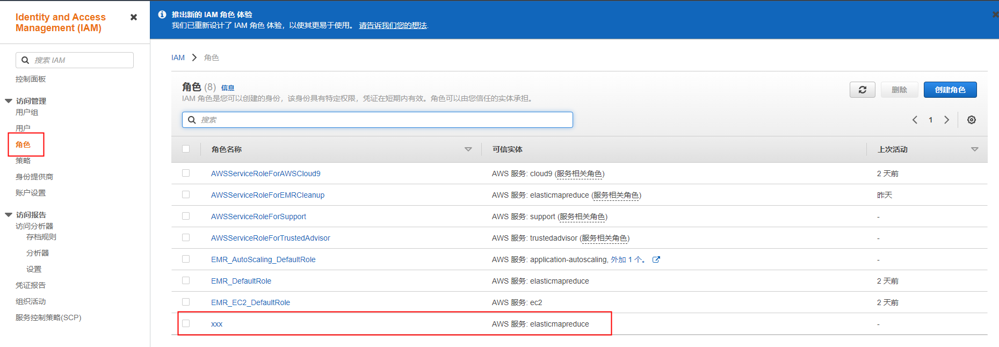