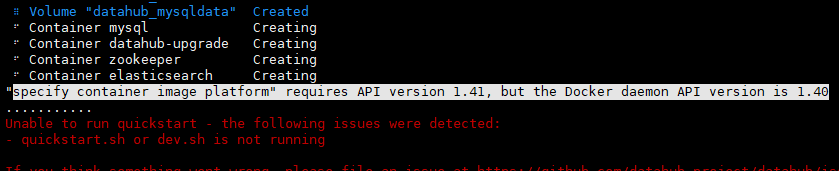

# DataHub Docker部署

## 一、安装 Docker

安装docker 可以参考 [Docker容器引擎离线部署 ](https://wiki.jshcbd.com.cn/pages/viewpage.action?pageId=19628874) 文档。

注意：datahub 中使用docker 的API version 版本最低要求是1.41。

```
[root@node111 ~]# docker version
Client: Docker Engine - Community
 Version:           24.0.0-beta.2
 API version:       1.43
 Go version:        go1.20.3
 Git commit:        67c4570
 Built:             Fri Apr 14 10:31:10 2023
 OS/Arch:           linux/amd64
 Context:           default

Server: Docker Engine - Community
 Engine:
  Version:          24.0.0-beta.2
  API version:      1.43 (minimum version 1.12)
  Go version:       go1.20.3
  Git commit:       5b1282c
  Built:            Fri Apr 14 10:28:36 2023
  OS/Arch:          linux/amd64
  Experimental:     false
 containerd:
  Version:          1.6.20
  GitCommit:        2806fc1057397dbaeefbea0e4e17bddfbd388f38
 runc:
  Version:          1.1.5
  GitCommit:        v1.1.5-0-gf19387a
 docker-init:
  Version:          0.19.0
  GitCommit:        de40ad0
[root@node111 ~]# 
```


## 二、环境准备

```shell
yum install -y gcc patch libffi-devel python-devel  zlib-devel bzip2-devel openssl-devel ncurses-devel sqlite-devel readline-devel tk-devel gdbm-devel db4-devel libpcap-devel xz-devel
```


## 三、安装Python3

1、进入python 的安装包目录即 /tmp/install 目录，没有解压执行命令进行解压。

```
[root@node111 install]# tar -zxvf Python-3.8.3.tgz 
......
Python-3.8.3/Objects/odictobject.c
Python-3.8.3/Objects/genobject.c
[root@node111 install]# ll
total 27076
drwxr-xr-x. 17 zhaojiujun zhaojiujun     4096 May 14  2020 Python-3.8.3
-rw-r--r--.  1 root       root       24067487 Apr 26 10:22 Python-3.8.3.tgz
-rw-r--r--.  1 root       root        3650564 May 16 14:26 yq_linux_amd64.tar.gz
```

随后进行Python3的编译

```
[root@node111 install]# mkdir /usr/local/python3
[root@node111 install]#cd Python-3.8.3
[root@node111 Python-3.8.3]#./configure --prefix=/usr/local/python3   #有如下显示证明安装成功。
.......
configure: creating ./config.status
config.status: creating Makefile.pre
config.status: creating Misc/python.pc
config.status: creating Misc/python-embed.pc
config.status: creating Misc/python-config.sh
config.status: creating Modules/ld_so_aix
config.status: creating pyconfig.h
creating Modules/Setup.local
creating Makefile


If you want a release build with all stable optimizations active (PGO, etc),
please run ./configure --enable-optimizations

[root@node111 Python-3.8.3]#make && make install           #有如下显示证明安装成功。
.......
Looking in links: /tmp/tmp7z7df_e9
Collecting setuptools
Collecting pip
Installing collected packages: setuptools, pip
Successfully installed pip-19.2.3 setuptools-41.2.0
[root@node111 Python-3.8.3]#ln -s /usr/local/python3/bin/python3 /usr/bin/python3
[root@node111 Python-3.8.3]#ln -s /usr/local/python3/bin/pip3 /usr/bin/pip3
#验证是否成功
[root@node111 Python-3.8.2]# python3 -V
Python 3.8.3
[root@node111 Python-3.8.2]# pip3 -V
pip 19.2.3 from /usr/local/python3/lib/python3.8/site-packages/pip (python 3.8)
```


```bash
pip3 install toml
```


## 四、安装 DataHub

**1、安装docker compose V2**

将 docker-compose-linux-x86_64 docker-compose 上传到/usr/local/bin 目录下，并改名为 docker-compose

```
[root@node111 bin]# mv docker-compose-linux-x86_64 docker-compose
[root@node111 bin]# ll
total 122076
-rwxr-xr-x. 1 root     root         6172 May  4 10:02 c_rehash
-rw-r--r--. 1 root     root     47706112 May 23 19:10 docker-compose
-rwxr-xr-x. 1 zhongtai zhongtai 76303720 Apr  6 12:24 juicefs
-rwxr-xr-x. 1 root     root       676288 May  4 10:02 openssl
-rwxr-xr-x. 1 root     root         2363 May  4 09:52 pcre-config
-rwxr-xr-x. 1 root     root       100480 May  4 09:52 pcregrep
-rwxr-xr-x. 1 root     root       200032 May  4 09:52 pcretest
[root@node111 bin]# chmod +x /usr/local/bin/docker-compose    # 赋予权限
[root@node111 bin]# ll
total 122076
-rwxr-xr-x. 1 root     root         6172 May  4 10:02 c_rehash
-rwxr-xr-x. 1 root     root     47706112 May 23 19:10 docker-compose
-rwxr-xr-x. 1 zhongtai zhongtai 76303720 Apr  6 12:24 juicefs
-rwxr-xr-x. 1 root     root       676288 May  4 10:02 openssl
-rwxr-xr-x. 1 root     root         2363 May  4 09:52 pcre-config
-rwxr-xr-x. 1 root     root       100480 May  4 09:52 pcregrep
-rwxr-xr-x. 1 root     root       200032 May  4 09:52 pcretest
[root@node111 bin]# docker-compose version  # docker-compose 版本查看
Docker Compose version v2.16.0
[root@node111 bin]# 
```


**2、下载源码的一个配置文件。**

配置文件名称：docker-compose-without-neo4j.quickstart.yml

注意：下载时注意版本

```
https://github.com/datahub-project/datahub/blob/v0.10.2/docker/quickstart/docker-compose-without-neo4j.quickstart.yml
```


**3、安装DataHub**

[官网下载命令](https://datahubproject.io/docs/quickstart) ：

```
python3 -m pip install --upgrade pip wheel setuptools
python3 -m pip install --upgrade acryl-datahub
datahub version
```


因为官网的镜像下载比较慢，而且出错，指定了国内的镜像；

命令如下：

```
python3 -m pip install --upgrade pip wheel setuptools -i http://pypi.douban.com/simple/ --trusted-host pypi.douban.com
python3 -m pip uninstall datahub acryl-datahub || true 
python3 -m pip install --upgrade acryl-datahub -i http://pypi.douban.com/simple/ --trusted-host pypi.douban.com
```


执行效果如下：

```
[root@node111 Python-3.8.3]# python3 -m pip install --upgrade pip wheel setuptools -i http://pypi.douban.com/simple/ --trusted-host pypi.douban.com
Looking in indexes: http://pypi.douban.com/simple/
Collecting pip
  Downloading http://pypi.doubanio.com/packages/08/e3/57d4c24a050aa0bcca46b2920bff40847db79535dc78141eb83581a52eb8/pip-23.1.2-py3-none-any.whl (2.1MB)
     |████████████████████████████████| 2.1MB 11.0MB/s 
Collecting wheel
  Downloading http://pypi.doubanio.com/packages/61/86/cc8d1ff2ca31a312a25a708c891cf9facbad4eae493b3872638db6785eb5/wheel-0.40.0-py3-none-any.whl (64kB)
     |████████████████████████████████| 71kB 65.7MB/s 
Collecting setuptools
  Downloading http://pypi.doubanio.com/packages/2f/8c/f336a966d4097c7cef6fc699b2ecb83b5fb63fd698198c1b5c7905a74f0f/setuptools-67.7.2-py3-none-any.whl (1.1MB)
     |████████████████████████████████| 1.1MB 59.8MB/s 
Installing collected packages: pip, wheel, setuptools
  Found existing installation: pip 19.2.3
    Uninstalling pip-19.2.3:
      Successfully uninstalled pip-19.2.3
  WARNING: The script pip3.10 is installed in '/usr/local/python3/bin' which is not on PATH.
  Consider adding this directory to PATH or, if you prefer to suppress this warning, use --no-warn-script-location.
  WARNING: The script wheel is installed in '/usr/local/python3/bin' which is not on PATH.
  Consider adding this directory to PATH or, if you prefer to suppress this warning, use --no-warn-script-location.
  Found existing installation: setuptools 41.2.0
    Uninstalling setuptools-41.2.0:
      Successfully uninstalled setuptools-41.2.0
Successfully installed pip-23.1.2 setuptools-67.7.2 wheel-0.40.0
[root@node111 Python-3.8.3]# 
```

检查环境

```
[root@node111 Python-3.8.3]# python3 -m pip uninstall datahub acryl-datahub || true  
WARNING: Skipping datahub as it is not installed.
WARNING: Skipping acryl-datahub as it is not installed.
WARNING: Running pip as the 'root' user can result in broken permissions and conflicting behaviour with the system package manager. It is recommended to use a virtual environment instead: https://pip.pypa.io/warnings/venv
```


安装datahub，此步骤时间较长，耐心等待。

```
[root@node111 Python-3.8.3]# python3 -m pip install --upgrade acryl-datahub -i http://pypi.douban.com/simple/ --trusted-host pypi.douban.com
```


查看datahub的版本情况。

```
[root@node111 install]# python3 -m datahub version
DataHub CLI version: 0.10.2.3
Python version: 3.8.3 (default, May 24 2023, 18:51:49) 
[GCC 4.8.5 20150623 (Red Hat 4.8.5-44)]
[root@node111 install]# 
```


启动datahub

```
[root@node111 datahub]# python3 -m datahub docker quickstart -f ./docker-compose-without-neo4j.quickstart.yml --mysql-port 53306 --zk-port 52181
.......
✔ DataHub is now running
Ingest some demo data using `datahub docker ingest-sample-data`,
or head to http://localhost:9002 (username: datahub, password: datahub) to play around with the frontend.
Need support? Get in touch on Slack: https://slack.datahubproject.io/
```


Datahub UI ： 在http://172.16.3.111:9002

用户名和密码：datahub/datahub


# FAQ:

1)  python3  找不到ssl模块问题

```
[root@node111 datahub]# python3
Python 2.7.15 (default, Oct 23 2018, 18:08:43)
[GCC 4.4.7 20120313 (Red Hat 4.4.7-23)] on linux2
Type "help", "copyright", "credits" or "license" for more information.
>>> import ssl
Traceback (most recent call last):
File "<stdin>", line 1, in <module>
File "/usr/local/python3/lib/python3/ssl.py", line 60, in <module>
import _ssl # if we can't import it, let the error propagate
ImportError: No module named _ssl
>>>
```

**解决方法：**
1.下载openssl

```
[root@node111 /]# cd /tmp/install/
[root@node111 install]# wget https://www.openssl.org/source/openssl-1.1.1n.tar.gz --no-check-certificate
```

2.解压并安装

```
[root@node111 install]# tar -zxvf openssl-1.1.1n.tar.gz 
[root@node111 install]# cd openssl-1.1.1n
[root@node111 openssl-1.1.1n]# ./config --prefix=/usr/local/openssl
[root@node111 openssl-1.1.1n]# make -j 2
[root@node111 openssl-1.1.1n]# make install
```

3.创建openssl的软连接（很重要）

```
[root@node111 openssl-1.1.1n]# ln -sf /usr/local/openssl/bin/openssl /usr/bin/openssl
```

修改vi /etc/ld.so.conf下的配置文件

```
> vim /etc/ld.so.conf

include ld.so.conf.d/*.conf              
/usr/local/openssl/lib      
```

5. 修改  ~/.bash_profile 下的配置文件

```
echo "export LD_LIBRARY_PATH=$LD_LIBRARY_PATH:/usr/local/openssl/lib" >> ~/.bash_profile
source ~/.bash_profile
```

6. 重新安装python3

   编译时指定 openssl ，编译命令如下：

   ```
   ./configure --prefix=/usr/local/python3 --with-openssl=/usr/local/openssl --with-openssl-rpath=auto
   ```


参考连接：https://blog.csdn.net/weixin_64079883/article/details/129352508


2)  datahub 启动报错，和 docker 的 API version 版本有关



解决方法：

升级 docker 的版本其 API version 不得低于 1.41


3） 默认情况下，快速入门部署需要在本地计算机上提供以下端口：

- 3306 for MySQL
- 9200 for Elasticsearch
- 9092 为 Kafka 经纪人
- 8081 用于架构注册表
- 2181 for ZooKeeper
- 9002 用于Datahub Web 应用程序（Datahub前端）
- 8080 用于Datahub元数据服务 （datahub-gms）

如果默认端口与您已经在计算机上运行的软件冲突，您可以通过将其他标志传递给`datahub docker quickstart`命令。
例如，要使用 53306（而不是默认的 3306）覆盖 MySQL 端口，您可以说：`datahub docker quickstart --mysql-port 53306`.用`datahub docker quickstart --help`以查看所有支持的选项。