## 导入示例元数据

```
[root@node111 /]# python3 -m datahub docker ingest-sample-data
......
Sink (datahub-rest) report:
{'total_records_written': 101,
 'records_written_per_second': 177,
 'warnings': [],
 'failures': [],
 'start_time': '2023-05-27 17:59:32.833138 (now)',
 'current_time': '2023-05-27 17:59:33.404772 (now)',
 'total_duration_in_seconds': 0.57,
 'gms_version': 'v0.10.2',
 'pending_requests': 0}

 Pipeline finished successfully; produced 101 events in 0.56 seconds.

```

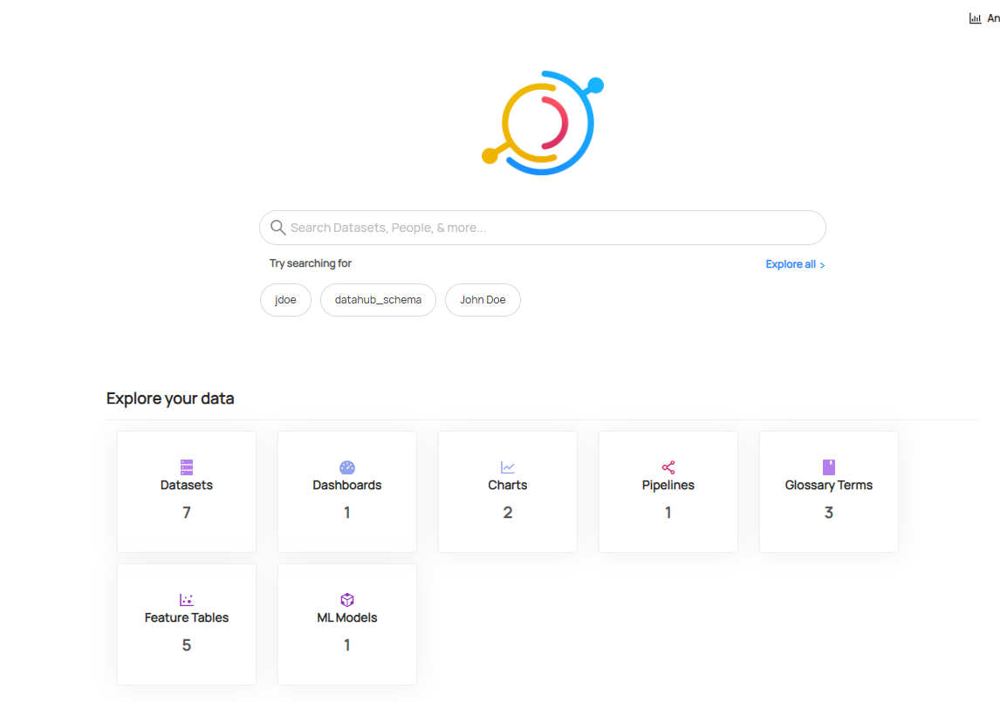

## UI 引入指南

web UI 操作指南参考：[UI Ingestion Guide | DataHub (datahubproject.io)](https://datahubproject.io/docs/ui-ingestion)

前置条件：元数据摄入使用的是插件架构，需要安装所需的插件，可以下面的查看mysql元数据摄入。

#### webUI 操作mysql 元数据


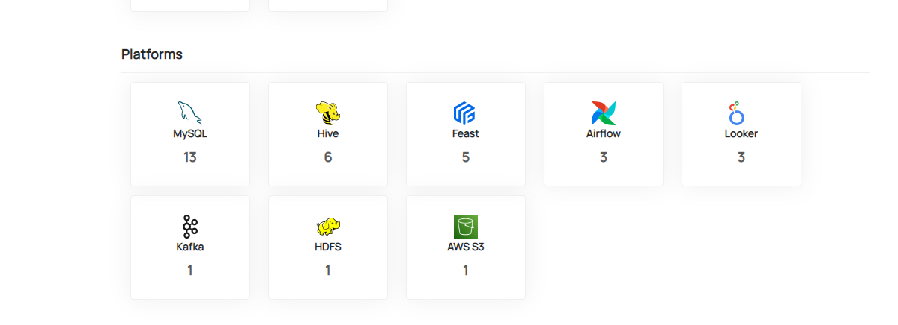

进入MySql 图标进入表中查看元数据的情况，展示数据库内表信息。


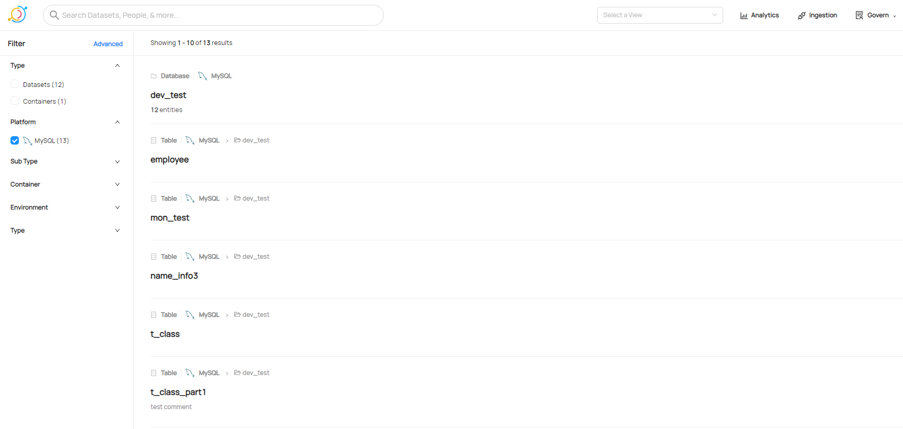


## 元数据摄入

元数据集成 datahub 支持 push-based 与 pull-based 两种方式：

- push-based : 直接是数据源系统在元数据发生变化时主动推送到datahub, 基于推送的集成示例包括
  ：[Airflow](https://datahubproject.io/docs/lineage/airflow) ，[Spark](https://datahubproject.io/docs/metadata-integration/java/spark-lineage) ，[Great Expects](https://datahubproject.io/docs/metadata-ingestion/integration_docs/great-expectations) 和 [Protobuf Schemas](https://datahubproject.io/docs/metadata-integration/java/datahub-protobuf) 。
- pull-based : 是连接到数据源通过批量或者增量的方式提取元数据的过程, 基于拉取的集成示例包括: BigQuery，Snowflake，Looker，Tableau等。

DataHub 中内置的基于拉取的元数据摄取系统希望将源系统的变化反映在datahub 中，可以安排摄取定期运行，例如使用 [using crontab ](https://datahubproject.io/docs/metadata-ingestion/schedule_docs/cron) 、 [using Airflow  ](https://datahubproject.io/docs/metadata-ingestion/schedule_docs/airflow) 、 [Using Kubernetes](https://datahubproject.io/docs/metadata-ingestion/schedule_docs/kubernetes) 。


元数据摄入使用的是插件架构，你仅需要安装所需的插件。

### 元数据摄入（mysql ）

这里安装两个插件：

源：mysql

汇：datahub-rest

```shell
[root@node111 ~]# pip3 install 'acryl-datahub[mysql]' -i  https://pypi.tuna.tsinghua.edu.cn/simple --trusted-host pypi.tuna.tsinghua.edu.cn
Looking in indexes: http://pypi.douban.com/simple/
...
  WARNING: The script great_expectations is installed in '/usr/local/python3/bin' which is not on PATH.
  Consider adding this directory to PATH or, if you prefer to suppress this warning, use --no-warn-script-location.
Successfully installed Ipython-8.12.2 Send2Trash-1.8.2 altair-4.2.0 anyio-3.6.2 argon2-cffi-21.3.0 argon2-cffi-bindings-21.2.0 asttokens-2.2.1 backcall-0.2.0 beautifulsoup4-4.12.2 bleach-6.0.0 cffi-1.15.1 colorama-0.4.6 cryptography-40.0.2 debugpy-1.6.7 decorator-5.1.1 defusedxml-0.7.1 executing-1.2.0 fastjsonschema-2.16.3 great-expectations-0.15.50 greenlet-2.0.2 importlib-metadata-6.6.0 ipykernel-6.17.1 ipython-genutils-0.2.0 ipywidgets-8.0.6 jedi-0.18.2 jinja2-3.1.2 jsonpatch-1.32 jsonpointer-2.3 jupyter-client-7.4.9 jupyter-core-4.12.0 jupyter-server-1.24.0 jupyterlab-pygments-0.2.2 jupyterlab-widgets-3.0.7 makefun-1.15.1 marshmallow-3.19.0 matplotlib-inline-0.1.6 mistune-2.0.5 nbclassic-1.0.0 nbclient-0.6.3 nbconvert-7.4.0 nbformat-5.8.0 nest-asyncio-1.5.6 notebook-6.5.4 notebook-shim-0.2.3 numpy-1.24.3 pandas-2.0.1 pandocfilters-1.5.0 parso-0.8.3 pexpect-4.8.0 pickleshare-0.7.5 prometheus-client-0.16.0 prompt-toolkit-3.0.38 ptyprocess-0.7.0 pure-eval-0.2.2 pycparser-2.21 pygments-2.15.1 pymysql-1.0.3 pyparsing-3.0.9 pyzmq-25.0.2 ruamel.yaml-0.17.17 ruamel.yaml.clib-0.2.7 scipy-1.10.1 sniffio-1.3.0 soupsieve-2.4.1 sqlalchemy-1.4.48 stack-data-0.6.2 terminado-0.17.1 tinycss2-1.2.1 toolz-0.12.0 tornado-6.3.1 tqdm-4.65.0 traitlets-5.2.1.post0 urllib3-1.26.15 wcwidth-0.2.6 webencodings-0.5.1 widgetsnbextension-4.0.7
WARNING: Running pip as the 'root' user can result in broken permissions and conflicting behaviour with the system package manager. It is recommended to use a virtual environment instead: https://pip.pypa.io/warnings/venv
```


检查安装的插件情况，Datahub是插件式的安装方式。可以检查数据源获取插件Source，转换插件transformer，获取插件Sink。

```shell
[root@node111 ~]# python3 -m datahub check plugins
Sources:
athena         (disabled)
azure-ad
bigquery       (disabled)
clickhouse     (disabled)
clickhouse-usage (disabled)
csv-enricher
datahub-business-glossary
datahub-lineage-file
dbt            (disabled)
dbt-cloud
delta-lake     (disabled)
demo-data
druid          (disabled)
elasticsearch  (disabled)
feast          (disabled)
file
gcs            (disabled)
glue           (disabled)
hana
hive           (disabled)
iceberg        (disabled)
json-schema
kafka          (disabled)
kafka-connect  (disabled)
ldap           (disabled)
looker         (disabled)
lookml         (disabled)
mariadb
metabase       (disabled)
mode           (disabled)
mongodb        (disabled)
mssql          (disabled)
mysql
nifi
okta           (disabled)
openapi
oracle         (disabled)
postgres       (disabled)
powerbi        (disabled)
powerbi-report-server (disabled)
presto         (disabled)
presto-on-hive (disabled)
pulsar
redash         (disabled)
redshift       (disabled)
redshift-legacy (disabled)
redshift-usage-legacy (disabled)
s3             (disabled)
sagemaker      (disabled)
salesforce     (disabled)
snowflake      (disabled)
sqlalchemy
starburst-trino-usage (disabled)
superset
tableau        (disabled)
trino          (disabled)
unity-catalog  (disabled)
vertica

Sinks:
blackhole
console
datahub-kafka  (disabled)
datahub-lite
datahub-rest
file

Transformers:
add_dataset_domain
add_dataset_ownership
add_dataset_properties
add_dataset_tags
add_dataset_terms
mark_dataset_status
pattern_add_dataset_domain
pattern_add_dataset_ownership
pattern_add_dataset_schema_tags
pattern_add_dataset_schema_terms
pattern_add_dataset_tags
pattern_add_dataset_terms
set_dataset_browse_path
simple_add_dataset_domain
simple_add_dataset_ownership
simple_add_dataset_properties
simple_add_dataset_tags
simple_add_dataset_terms
simple_remove_dataset_ownership

For details on why a plugin is disabled, rerun with '--verbose'
If a plugin is disabled, try running: pip install 'acryl-datahub[<plugin>]'
[root@node111 ~]# 
```


可见Mysql插件和Rest接口插件已经安装，下面配置从 MySQL 获取元数据使用 Rest 接口将数据存储 DataHub。

```
> vim mysql_to_datahub_rest.yml
# A sample recipe that pulls metadata from MySQL and puts it into DataHub
# using the Rest API.
source:
  type: mysql
  config:
    username: root
    password: root
    database: dev_test
    host_port: 172.16.3.111:3306

transformers:
  - type: "set_dataset_browse_path"
    config:
      path_templates:
        - /ENV/PLATFORM/DATASET_PARTS 

sink:
  type: "datahub-rest"
  config:
    server: "http://172.16.3.111:8080"

# datahub ingest -c mysql_to_datahub_rest.yml
```


[示例/配置](https://github.com/datahub-project/datahub/blob/master/metadata-ingestion/examples/recipes)目录中包含许多配方。有关每个源和接收器的完整信息和上下文，请参阅 [插件表中描述的](https://datahubproject.io/docs/cli#installing-plugins) 页面。

请注意，一个配置文件只能有 1 个源和 1 个接收器。如果你想要多个来源，那么你将需要多个配置文件。


运行此配置文件非常简单：

```shell
[root@node111 ~]# python3 -m  datahub ingest -c mysql_to_datahub_rest.yml
[2023-05-29 20:52:34,133] INFO     {datahub.cli.ingest_cli:173} - DataHub CLI version: 0.10.2.3
[2023-05-29 20:52:34,164] INFO     {datahub.ingestion.run.pipeline:204} - Sink configured successfully. DataHubRestEmitter: configured to talk to http://172.16.3.111:8080
[2023-05-29 20:52:34,615] INFO     {datahub.ingestion.run.pipeline:221} - Source configured successfully.
[2023-05-29 20:52:34,624] INFO     {datahub.cli.ingest_cli:129} - Starting metadata ingestion
-2023-05-29 20:52:34,642 INFO sqlalchemy.engine.Engine SELECT DATABASE()
[2023-05-29 20:52:34,642] INFO     {sqlalchemy.engine.Engine:1858} - SELECT DATABASE()
......
Sink (datahub-rest) report:
{'total_records_written': 52,
 'records_written_per_second': 49,
 'warnings': [],
 'failures': [],
 'start_time': '2023-05-29 20:52:34.162511 (1.05 seconds ago)',
 'current_time': '2023-05-29 20:52:35.214297 (now)',
 'total_duration_in_seconds': 1.05,
 'gms_version': 'v0.10.2',
 'pending_requests': 0}

 Pipeline finished successfully; produced 40 events in 0.86 seconds.                                                             [root@node111 metadata-configuration-file]# 
```

在此刷新datahub页面，mysql的元数据信息已经成功获取。


#### Sources

如果您想筛选每个来源提供的功能，请查看我们的[集成页面](https://datahubproject.io/integrations) 。

| Plugin Name                                                  | Install Command                                              | Provides                                |
| ------------------------------------------------------------ | ------------------------------------------------------------ | --------------------------------------- |
| [file](https://datahubproject.io/docs/generated/ingestion/sources/file) | *included by default*                                        | File source and sink                    |
| [athena](https://datahubproject.io/docs/generated/ingestion/sources/athena) | `pip install 'acryl-datahub[athena]'`                        | AWS Athena source                       |
| [bigquery](https://datahubproject.io/docs/generated/ingestion/sources/bigquery) | `pip install 'acryl-datahub[bigquery]'`                      | BigQuery source                         |
| [datahub-lineage-file](https://datahubproject.io/docs/generated/ingestion/sources/file-based-lineage) | *no additional dependencies*                                 | Lineage File source                     |
| [datahub-business-glossary](https://datahubproject.io/docs/generated/ingestion/sources/business-glossary) | *no additional dependencies*                                 | Business Glossary File source           |
| [dbt](https://datahubproject.io/docs/generated/ingestion/sources/dbt) | *no additional dependencies*                                 | dbt source                              |
| [druid](https://datahubproject.io/docs/generated/ingestion/sources/druid) | `pip install 'acryl-datahub[druid]'`                         | Druid Source                            |
| [feast](https://datahubproject.io/docs/generated/ingestion/sources/feast) | `pip install 'acryl-datahub[feast]'`                         | Feast source (0.26.0)                   |
| [glue](https://datahubproject.io/docs/generated/ingestion/sources/glue) | `pip install 'acryl-datahub[glue]'`                          | AWS Glue source                         |
| [hana](https://datahubproject.io/docs/generated/ingestion/sources/hana) | `pip install 'acryl-datahub[hana]'`                          | SAP HANA source                         |
| [hive](https://datahubproject.io/docs/generated/ingestion/sources/hive) | `pip install 'acryl-datahub[hive]'`                          | Hive source                             |
| [kafka](https://datahubproject.io/docs/generated/ingestion/sources/kafka) | `pip install 'acryl-datahub[kafka]'`                         | Kafka source                            |
| [kafka-connect](https://datahubproject.io/docs/generated/ingestion/sources/kafka-connect) | `pip install 'acryl-datahub[kafka-connect]'`                 | Kafka connect source                    |
| [ldap](https://datahubproject.io/docs/generated/ingestion/sources/ldap) | `pip install 'acryl-datahub[ldap]'` ([extra requirements](https://www.python-ldap.org/en/python-ldap-3.3.0/installing.html#build-prerequisites)) | LDAP source                             |
| [looker](https://datahubproject.io/docs/generated/ingestion/sources/looker) | `pip install 'acryl-datahub[looker]'`                        | Looker source                           |
| [lookml](https://datahubproject.io/docs/generated/ingestion/sources/looker#module-lookml) | `pip install 'acryl-datahub[lookml]'`                        | LookML source, requires Python 3.7+     |
| [metabase](https://datahubproject.io/docs/generated/ingestion/sources/metabase) | `pip install 'acryl-datahub[metabase]'`                      | Metabase source                         |
| [mode](https://datahubproject.io/docs/generated/ingestion/sources/mode) | `pip install 'acryl-datahub[mode]'`                          | Mode Analytics source                   |
| [mongodb](https://datahubproject.io/docs/generated/ingestion/sources/mongodb) | `pip install 'acryl-datahub[mongodb]'`                       | MongoDB source                          |
| [mssql](https://datahubproject.io/docs/generated/ingestion/sources/mssql) | `pip install 'acryl-datahub[mssql]'`                         | SQL Server source                       |
| [mysql](https://datahubproject.io/docs/generated/ingestion/sources/mysql) | `pip install 'acryl-datahub[mysql]'`                         | MySQL source                            |
| [mariadb](https://datahubproject.io/docs/generated/ingestion/sources/mariadb) | `pip install 'acryl-datahub[mariadb]'`                       | MariaDB source                          |
| [openapi](https://datahubproject.io/docs/generated/ingestion/sources/openapi) | `pip install 'acryl-datahub[openapi]'`                       | OpenApi Source                          |
| [oracle](https://datahubproject.io/docs/generated/ingestion/sources/oracle) | `pip install 'acryl-datahub[oracle]'`                        | Oracle source                           |
| [postgres](https://datahubproject.io/docs/generated/ingestion/sources/postgres) | `pip install 'acryl-datahub[postgres]'`                      | Postgres source                         |
| [redash](https://datahubproject.io/docs/generated/ingestion/sources/redash) | `pip install 'acryl-datahub[redash]'`                        | Redash source                           |
| [redshift](https://datahubproject.io/docs/generated/ingestion/sources/redshift) | `pip install 'acryl-datahub[redshift]'`                      | Redshift source                         |
| [sagemaker](https://datahubproject.io/docs/generated/ingestion/sources/sagemaker) | `pip install 'acryl-datahub[sagemaker]'`                     | AWS SageMaker source                    |
| [snowflake](https://datahubproject.io/docs/generated/ingestion/sources/snowflake) | `pip install 'acryl-datahub[snowflake]'`                     | Snowflake source                        |
| [sqlalchemy](https://datahubproject.io/docs/generated/ingestion/sources/sqlalchemy) | `pip install 'acryl-datahub[sqlalchemy]'`                    | Generic SQLAlchemy source               |
| [superset](https://datahubproject.io/docs/generated/ingestion/sources/superset) | `pip install 'acryl-datahub[superset]'`                      | Superset source                         |
| [tableau](https://datahubproject.io/docs/generated/ingestion/sources/tableau) | `pip install 'acryl-datahub[tableau]'`                       | Tableau source                          |
| [trino](https://datahubproject.io/docs/generated/ingestion/sources/trino) | `pip install 'acryl-datahub[trino]'`                         | Trino source                            |
| [starburst-trino-usage](https://datahubproject.io/docs/generated/ingestion/sources/trino) | `pip install 'acryl-datahub[starburst-trino-usage]'`         | Starburst Trino usage statistics source |
| [nifi](https://datahubproject.io/docs/generated/ingestion/sources/nifi) | `pip install 'acryl-datahub[nifi]'`                          | NiFi source                             |
| [powerbi](https://datahubproject.io/docs/generated/ingestion/sources/powerbi#module-powerbi) | `pip install 'acryl-datahub[powerbi]'`                       | Microsoft Power BI source               |
| [powerbi-report-server](https://datahubproject.io/docs/generated/ingestion/sources/powerbi#module-powerbi-report-server) | `pip install 'acryl-datahub[powerbi-report-server]'`         | Microsoft Power BI Report Server source |


#### Sinks

| Plugin Name                                                  | Install Command                              | Provides                   |
| ------------------------------------------------------------ | -------------------------------------------- | -------------------------- |
| [file](https://datahubproject.io/docs/metadata-ingestion/sink_docs/file) | *included by default*                        | File source and sink       |
| [console](https://datahubproject.io/docs/metadata-ingestion/sink_docs/console) | *included by default*                        | Console sink               |
| [datahub-rest](https://datahubproject.io/docs/metadata-ingestion/sink_docs/datahub) | `pip install 'acryl-datahub[datahub-rest]'`  | DataHub sink over REST API |
| [datahub-kafka](https://datahubproject.io/docs/metadata-ingestion/sink_docs/datahub) | `pip install 'acryl-datahub[datahub-kafka]'` | DataHub sink over Kafka    |


#### Transformations

[datahub 为数据集提供的转换器](https://datahubproject.io/docs/metadata-ingestion/docs/transformer/dataset_transformer)

| Dataset Aspect      | Transformer                                                  |
| ------------------- | ------------------------------------------------------------ |
| `status`            | - [Mark Dataset status](https://datahubproject.io/docs/metadata-ingestion/docs/transformer/dataset_transformer#mark-dataset-status) |
| `ownership`         | - [Simple Add Dataset ownership](https://datahubproject.io/docs/metadata-ingestion/docs/transformer/dataset_transformer#simple-add-dataset-ownership) - [Pattern Add Dataset ownership](https://datahubproject.io/docs/metadata-ingestion/docs/transformer/dataset_transformer#pattern-add-dataset-ownership) - [Simple Remove Dataset Ownership](https://datahubproject.io/docs/metadata-ingestion/docs/transformer/dataset_transformer#simple-remove-dataset-ownership) |
| `globalTags`        | - [Simple Add Dataset globalTags](https://datahubproject.io/docs/metadata-ingestion/docs/transformer/dataset_transformer#simple-add-dataset-globaltags) - [Pattern Add Dataset globalTags](https://datahubproject.io/docs/metadata-ingestion/docs/transformer/dataset_transformer#pattern-add-dataset-globaltags) - [Add Dataset globalTags](https://datahubproject.io/docs/metadata-ingestion/docs/transformer/dataset_transformer#add-dataset-globaltags) |
| `browsePaths`       | - [Set Dataset browsePath](https://datahubproject.io/docs/metadata-ingestion/docs/transformer/dataset_transformer#set-dataset-browsepath) |
| `glossaryTerms`     | - [Simple Add Dataset glossaryTerms](https://datahubproject.io/docs/metadata-ingestion/docs/transformer/dataset_transformer#simple-add-dataset-glossaryterms) - [Pattern Add Dataset glossaryTerms](https://datahubproject.io/docs/metadata-ingestion/docs/transformer/dataset_transformer#pattern-add-dataset-glossaryterms) |
| `schemaMetadata`    | - [Pattern Add Dataset Schema Field glossaryTerms](https://datahubproject.io/docs/metadata-ingestion/docs/transformer/dataset_transformer#pattern-add-dataset-schema-field-glossaryterms) - [Pattern Add Dataset Schema Field globalTags](https://datahubproject.io/docs/metadata-ingestion/docs/transformer/dataset_transformer#pattern-add-dataset-schema-field-globaltags) |
| `datasetProperties` | - [Simple Add Dataset datasetProperties](https://datahubproject.io/docs/metadata-ingestion/docs/transformer/dataset_transformer#simple-add-dataset-datasetproperties) - [Add Dataset datasetProperties](https://datahubproject.io/docs/metadata-ingestion/docs/transformer/dataset_transformer#add-dataset-datasetproperties) |
| `domains`           | - [Simple Add Dataset domains](https://datahubproject.io/docs/metadata-ingestion/docs/transformer/dataset_transformer#simple-add-dataset-domains) - [Pattern Add Dataset domains](https://datahubproject.io/docs/metadata-ingestion/docs/transformer/dataset_transformer#pattern-add-dataset-domains) |

数据中心为数据集提供的转换器是：

- [简单添加数据集所有权](https://datahubproject.io/docs/metadata-ingestion/docs/transformer/dataset_transformer#simple-add-dataset-ownership)
- [模式添加数据集所有权](https://datahubproject.io/docs/metadata-ingestion/docs/transformer/dataset_transformer#pattern-add-dataset-ownership)
- [简单删除数据集所有权](https://datahubproject.io/docs/metadata-ingestion/docs/transformer/dataset_transformer#simple-remove-dataset-ownership)
- [标记数据集状态](https://datahubproject.io/docs/metadata-ingestion/docs/transformer/dataset_transformer#mark-dataset-status)
- [简单添加数据集全局标记](https://datahubproject.io/docs/metadata-ingestion/docs/transformer/dataset_transformer#simple-add-dataset-globaltags)
- [模式添加数据集全局标记](https://datahubproject.io/docs/metadata-ingestion/docs/transformer/dataset_transformer#pattern-add-dataset-globaltags)
- [添加数据集全局标记](https://datahubproject.io/docs/metadata-ingestion/docs/transformer/dataset_transformer#add-dataset-globaltags)
- [设置数据集浏览路径](https://datahubproject.io/docs/metadata-ingestion/docs/transformer/dataset_transformer#set-dataset-browsepath)
- [简单添加数据集术语表](https://datahubproject.io/docs/metadata-ingestion/docs/transformer/dataset_transformer#simple-add-dataset-glossaryterms)
- [模式添加数据集词汇表术语](https://datahubproject.io/docs/metadata-ingestion/docs/transformer/dataset_transformer#pattern-add-dataset-glossaryterms)
- [模式添加数据集架构字段术语表](https://datahubproject.io/docs/metadata-ingestion/docs/transformer/dataset_transformer#pattern-add-dataset-schema-field-glossaryterms)
- [模式添加数据集架构字段全局标记](https://datahubproject.io/docs/metadata-ingestion/docs/transformer/dataset_transformer#pattern-add-dataset-schema-field-globaltags)
- [简单添加数据集属性](https://datahubproject.io/docs/metadata-ingestion/docs/transformer/dataset_transformer#simple-add-dataset-datasetproperties)
- [添加数据集数据集属性](https://datahubproject.io/docs/metadata-ingestion/docs/transformer/dataset_transformer#add-dataset-datasetproperties)
- [简单添加数据集域](https://datahubproject.io/docs/metadata-ingestion/docs/transformer/dataset_transformer#simple-add-dataset-domains)
- [模式添加数据集域](https://datahubproject.io/docs/metadata-ingestion/docs/transformer/dataset_transformer#pattern-add-dataset-domains)


### Datahub Actions

参考链接：[Act on Metadata Overview | DataHub (datahubproject.io)](https://datahubproject.io/docs/act-on-metadata)

DataHub的 Datahub Actions 是面向流的，这意味着元数据中的所有更改都会在几秒钟内在平台内传达和反映。

这为自动化数据治理和数据管理工作流提供了无限的机会，例如：

- 自动丰富或注释 DataHub 中的现有数据实体，即应用标记、术语、所有者等。
- 利用[操作框架](https://datahubproject.io/docs/actions)触发外部工作流或向外部系统发送警报，即在架构发生更改时向团队频道发送消息
- 主动确定哪些业务关键型数据资源将受到中断性架构更改的影响

Kafka 事件源是Datahub Actions 框架中使用的默认事件源。


**先决条件**

数据中心操作 CLI 命令是基本 CLI 命令的扩展。我们推荐 首先安装 CLI：

```shell
python3 -m pip install --upgrade pip wheel setuptools
python3 -m pip install --upgrade acryl-datahub
datahub --version
```

> 请注意，操作框架需要的版本为 >= v0.8.34`acryl-datahub`


#### 安装

接下来，只需从 PyPi 安装软件包：`acryl-datahub-actions`

```shell
python3 -m pip install --upgrade pip wheel setuptools
python3 -m pip install --upgrade acryl-datahub-actions
datahub actions version
```


#### 配置操作

操作是使用 YAML 文件配置的，与数据中心引入源的方式大致相同。操作配置文件包含以下内容

1. 操作管道名称（应是唯一且静态的）
2. 源配置
3. 转换 + 筛选器配置
4. 操作配置
5. 管道选项（可选）
6. 数据中心 API 配置（可选 - 选择操作需要）

每个组件都是可独立插拔和可配置的。

```yml
# 1. Required: Action Pipeline Name
name: <action-pipeline-name>

# 2. Required: Event Source - Where to source event from.
source:
  type: <source-type>
  config:
    # Event Source specific configs (map)

# 3a. Optional: Filter to run on events (map)
filter: 
  event_type: <filtered-event-type>
  event:
    # Filter event fields by exact-match
    <filtered-event-fields>

# 3b. Optional: Custom Transformers to run on events (array)
transform:
  - type: <transformer-type>
    config: 
      # Transformer-specific configs (map)

# 4. Required: Action - What action to take on events. 
action:
  type: <action-type>
  config:
    # Action-specific configs (map)

# 5. Optional: Additional pipeline options (error handling, etc)
options: 
  retry_count: 0 # The number of times to retry an Action with the same event. (If an exception is thrown). 0 by default. 
  failure_mode: "CONTINUE" # What to do when an event fails to be processed. Either 'CONTINUE' to make progress or 'THROW' to stop the pipeline. Either way, the failed event will be logged to a failed_events.log file. 
  failed_events_dir: "/tmp/datahub/actions"  # The directory in which to write a failed_events.log file that tracks events which fail to be processed. Defaults to "/tmp/logs/datahub/actions". 

# 6. Optional: DataHub API configuration
datahub:
  server: "http://localhost:8080" # Location of DataHub API
  # token: <your-access-token> # Required if Metadata Service Auth enabled
```


**示例：你好世界**

“Hello World”操作的简单配置文件（仅打印它收到的所有事件）是

```yml
# 1. Action Pipeline Name
name: "hello_world"
# 2. Event Source: Where to source event from.
source:
  type: "kafka"
  config:
    connection:
      bootstrap: ${KAFKA_BOOTSTRAP_SERVER:-localhost:9092}
      schema_registry_url: ${SCHEMA_REGISTRY_URL:-http://localhost:8081}
# 3. Action: What action to take on events. 
action:
  type: "hello_world"
```


#### 运行操作

要运行新操作，只需使用 CLI 命令`actions`

```text
datahub actions -c <config.yml>
```


操作运行后，您将看到

```text
Action Pipeline with name '<action-pipeline-name>' is now running.
```


### 元数据存储

datahub 架构

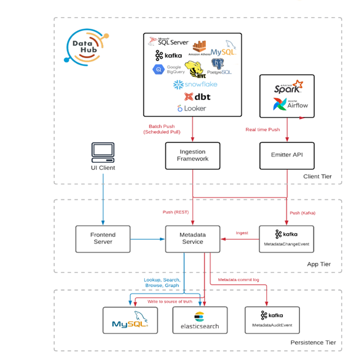


元数据存储负责存储构成元数据图的实体和方面。这包括公开用于摄取元数据的 API、通过主键获取元数据、搜索实体以及获取实体之间的关系。它由托管一组 Rest.li API 端点的 Spring Java 服务以及用于主存储和索引的 MySQL、Elasticsearch 和 Kafka 组成。

官网链接：[Components | DataHub (datahubproject.io)](https://datahubproject.io/docs/components#metadata-store)


### 元数据删除

1. 通过提供标识一组特定的 urn 或筛选器来删除附加到实体的元数据（删除 CLI）。

2. 删除由单个引入运行（回滚）创建的元数据。


1）查看最近一段时间运行的元数据摄取

```shell
[root@node111 ~]# python3 -m datahub ingest list-runs
+---------------------------+--------+---------------------------+
| runId                     |   rows | created at                |
+===========================+========+===========================+
| no-run-id-provided        |    145 | 2023-05-31 18:17:57 (CST) |
+---------------------------+--------+---------------------------+
| mysql-2023_05_30-13_38_16 |    326 | 2023-05-30 13:38:17 (CST) |
+---------------------------+--------+---------------------------+
| mysql-2023_05_29-20_52_34 |    102 | 2023-05-29 20:52:34 (CST) |
+---------------------------+--------+---------------------------+
| file-2023_05_27-17_59_32  |    346 | 2023-05-27 17:59:32 (CST) |
+---------------------------+--------+---------------------------+
[root@node111 ~]# 
```


2）查看某一次元数据摄取操作的数据

```shell
[root@node111 ~]# python3 -m datahub ingest show --run-id mysql-2023_05_30-13_38_16
+---------------------------------------------------------------------------------+----------------------+---------------------------+
| urn                                                                             | aspect name          | created at                |
+=================================================================================+======================+===========================+
| urn:li:container:2256f1a3bb1838f4c5b066306f6dd57e                               | containerProperties  | 2023-05-30 13:38:17 (CST) |
+---------------------------------------------------------------------------------+----------------------+---------------------------+
| urn:li:container:2256f1a3bb1838f4c5b066306f6dd57e                               | status               | 2023-05-30 13:38:17 (CST) |
+---------------------------------------------------------------------------------+----------------------+---------------------------+
| urn:li:container:2256f1a3bb1838f4c5b066306f6dd57e                               | containerKey         | 2023-05-30 13:38:17 (CST) |
+---------------------------------------------------------------------------------+----------------------+---------------------------+
| urn:li:container:2256f1a3bb1838f4c5b066306f6dd57e                               | browsePaths          | 2023-05-30 13:38:17 (CST) |
+---------------------------------------------------------------------------------+----------------------+---------------------------+
| urn:li:container:2256f1a3bb1838f4c5b066306f6dd57e                               | subTypes             | 2023-05-30 13:38:17 (CST) |
+---------------------------------------------------------------------------------+----------------------+---------------------------+
| urn:li:container:2256f1a3bb1838f4c5b066306f6dd57e                               | dataPlatformInstance | 2023-05-30 13:38:17 (CST) |
+---------------------------------------------------------------------------------+----------------------+---------------------------+
| urn:li:dataset:(urn:li:dataPlatform:mysql,ods.default_dev_test_string,PROD)     | subTypes             | 2023-05-30 13:38:17 (CST) |
+---------------------------------------------------------------------------------+----------------------+---------------------------+
......
+---------------------------------------------------------------------------------+----------------------+---------------------------+
| urn:li:dataset:(urn:li:dataPlatform:mysql,ods.orders_2,PROD)                    | datasetKey           | 2023-05-30 13:38:17 (CST) |
+---------------------------------------------------------------------------------+----------------------+---------------------------+
| urn:li:dataset:(urn:li:dataPlatform:mysql,ods.orders_2,PROD)                    | dataPlatformInstance | 2023-05-30 13:38:17 (CST) |
+---------------------------------------------------------------------------------+----------------------+---------------------------+
| urn:li:dataset:(urn:li:dataPlatform:mysql,ods.t5,PROD)                          | container            | 2023-05-30 13:38:17 (CST) |
+---------------------------------------------------------------------------------+----------------------+---------------------------+
| urn:li:dataset:(urn:li:dataPlatform:mysql,ods.t5,PROD)                          | status               | 2023-05-30 13:38:17 (CST) |
+---------------------------------------------------------------------------------+----------------------+---------------------------+
| urn:li:dataset:(urn:li:dataPlatform:mysql,ods.t5,PROD)                          | datasetProperties    | 2023-05-30 13:38:17 (CST) |
+---------------------------------------------------------------------------------+----------------------+---------------------------+
[root@node111 ~]# 

```

也可以使用如下命令：

```shell
python3 -m datahub ingest rollback --dry-run --run-id <run-id>
```


#### 软删除实体（默认）

默认情况下，delete 命令将执行软删除。

**软删除将**实体的“状态”方面设置为“已删除”，这将隐藏实体及其所有方面，使其不被 UI 返回。

```shell
# The `--soft` flag is redundant since it's the default.
python3 -m datahub delete --urn "<urn>" --soft
```

**软删除单个实体**

```shell
python3 -m datahub delete --urn "urn:li:dataset:(urn:li:dataPlatform:hive,fct_users_deleted,PROD)"
```


#### 硬删除实体

这将以物理方式删除实体所有方面的所有行。此操作无法撤消，因此请仅在确定要删除与此实体关联的所有数据后执行此操作。

```shell
python3 -m datahub delete --urn "<my urn>" --hard
# or using a filter
python3 -m datahub delete --platform snowflake --hard
```

**硬删除单个实体**

```shell
python3 -m datahub delete --urn "urn:li:dataset:(urn:li:dataPlatform:hive,fct_users_deleted,PROD)" --hard
```


最后，一旦您确定要永久删除此数据，请运行

```shell
datahub ingest rollback --run-id <run-id>
```

#### 硬删除时序方面

还可以删除实体的一系列时序方面数据，而无需删除整个实体。

对于这些删除，需要坡向和时间范围。您可以通过提供 来删除时间序列方面的所有数据。

```shell
datahub delete --urn "<my urn>" --aspect <aspect name> --start-time '-30 days' --end-time '-7 days'
# or using a filter
datahub delete --platform snowflake --entity-type dataset --aspect datasetProfile --start-time '0' --end-time '2023-01-01'
```


开始和结束时间字段根据时间序列方面的字段进行筛选。允许的开始和结束时间格式：`timestampMillis`

- `YYYY-MM-DD`：特定日期
- `YYYY-MM-DD HH:mm:ss`：特定的时间戳，除非另有说明，否则假定为 UTC 格式
- `+/-<number> <unit>`（例如）：相对时间，其中是整数，是 、 、`-7 days``<number>``<unit>``days``hours``minutes``seconds`
- `ddddddddd`（例如）：UNIX 时间戳`1684384045`
- `min`， ， ： 特殊关键字`max``now`


[参考文档：从数据中心删除元数据]([Removing Metadata from DataHub | DataHub (datahubproject.io)](https://datahubproject.io/docs/how/delete-metadata))


## 血缘

血缘用于捕获组织内的数据依赖项。它允许您跟踪从中派生数据资产的输入，以及下游依赖于它的数据资产。

如果使用支持提血缘的引入源（例如“血缘功能”），则可以自动提血缘信息。有关详细说明，请参阅您正在使用的源的源文档。如果不使血缘支持的引入源，可以通过 API 以编程方式在实体之间添加血缘关系。
DataHub 支持手动编辑实体之间血缘。数据专家可以在血缘可视化”屏幕以及实体页面上的血缘”选项卡中自由添加或删除上游和下游沿袭边缘。使用此功能可以补充自血缘提取或在不支持自动提取的源中建立重要的实体关系。数据集、图表、仪表板和数据作业支持手动编血缘。

### 血缘设置、先决条件和权限

若要编辑实体的血缘，需要以下[元数据权限](https://datahubproject.io/docs/authorization/policies)：

- 编辑血缘元数据权限以在实体级别**编辑血缘**

请务必知道，血缘受更改影响的所有实体都需要**“编辑血缘**”权限。例如，若要将“数据集 B”添加为“数据集 A”的上游依赖项，需要数据集 A 和数据集 B 的**“编辑血缘**”权限。


### 手动编辑血缘

#### WebUI 操作血缘

**从血缘图视图 进行编辑**

可以编辑实体血缘的第一个步是从“实体可视化”页面，单击实体配置文件右上角的“血缘系”按钮以访问”血缘可视化“页面。

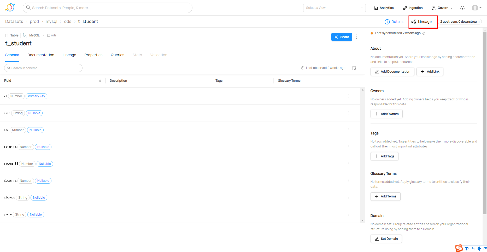

或者“实体可视化”页面 单机`Lineage`按钮 ，然后单机 `Visualize Lineage ` 按钮，进入”血缘可视化“页面。

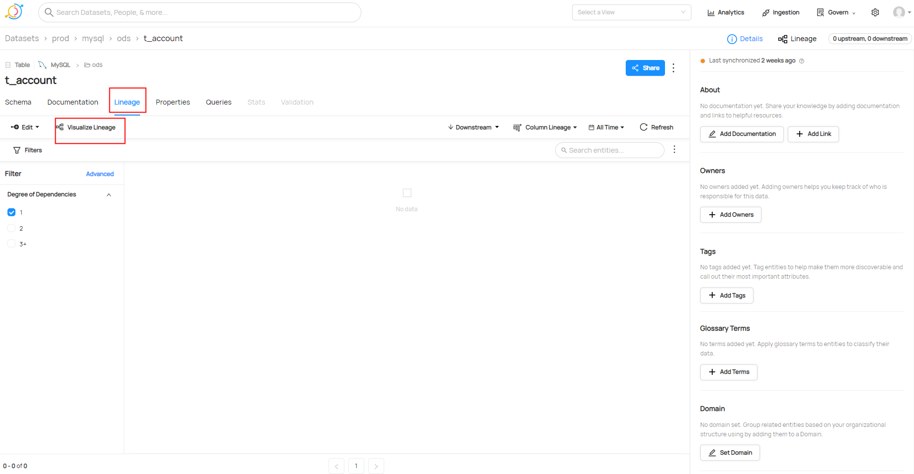


找到要编辑血缘的实体后，单击三点菜单下拉菜单以选择是要在上游方向还是下游方向编辑血缘。


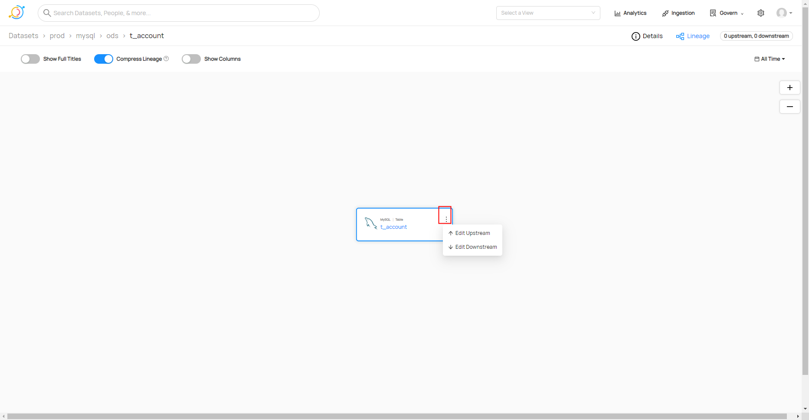


**添加血缘边缘**

单击“编辑上游”或“编辑下游”后，将打开一个弹窗，允许您在所选方向上管理所选实体的血缘。要将血缘边缘添加到新实体，请在提供的搜索栏中按名称搜索它并选择它。对添加的所有内容感到满意后，单击“保存更改”。如果您改变主意，可以随时取消或退出，而无需保存所做的更改。


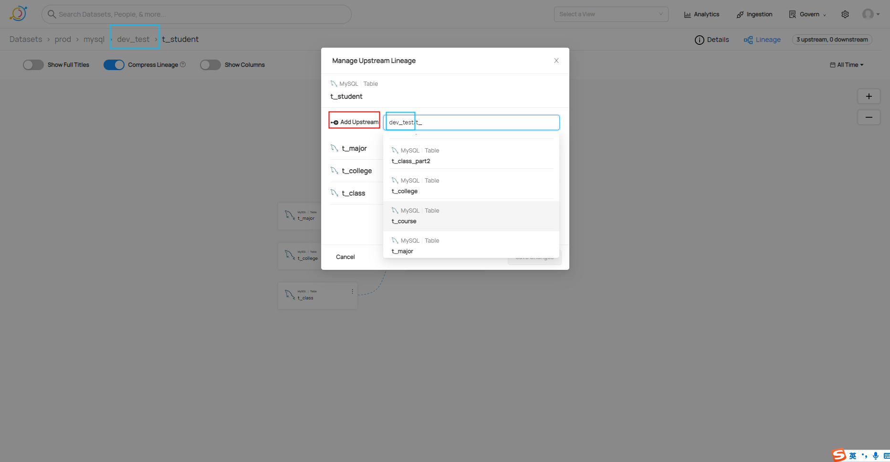


或者可以在 或者“实体可视化”页面 单机 `Edit` 按钮 单击“编辑上游”或“编辑下游”后 ,也会出现编辑 血缘边缘的弹框。

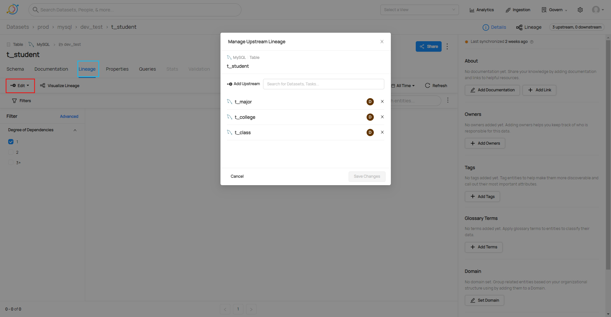


**删除血缘边缘**

您可以从用于添加血缘边缘的相同模式中删除血缘边缘。找到要删除的边缘，然后单击其右侧的“X”。就像添加一样，您需要单击“保存更改”进行保存，如果您退出而不保存，则不会应用您的更改。

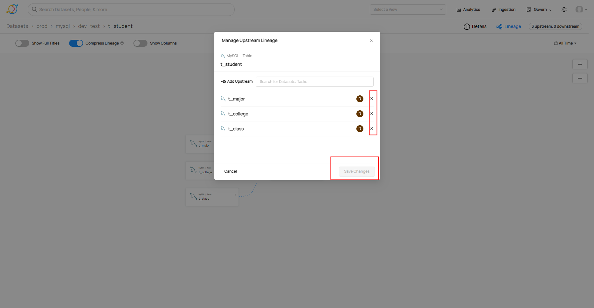


**查看更改**

每当手动编辑血缘时，我们都会跟踪谁进行了更改以及他们何时进行了更改。您可以在添加和删除边缘的模式中看到此信息。如果边是手动添加的，则用户头像将与添加的边对齐。您可以将鼠标悬停在此头像上，以查看谁添加了它以及何时添加。


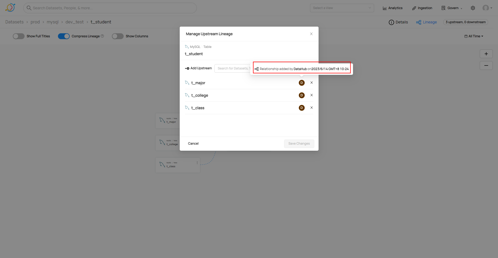


#### 通过 API 管理血缘


**使用数据集到数据集血缘**

此关系模型使用数据集 - 通过数据集实体中的上游世系方面>数据集连接。

下面是使用此类血缘的一些示例：

- [lineage_emitter_mcpw_rest.py](https://github.com/datahub-project/datahub/blob/master/metadata-ingestion/examples/library/lineage_emitter_mcpw_rest.py) - 通过 REST 作为 MetadataChangeProposalWrapper 发出简单的 bigquery 表到表（数据集到数据集）血缘。
- [lineage_emitter_rest.py](https://github.com/datahub-project/datahub/blob/master/metadata-ingestion/examples/library/lineage_emitter_rest.py) - 通过 REST 作为 MetadataChangeEvent 发出简单的数据集到数据集血缘。
- [lineage_emitter_kafka.py](https://github.com/datahub-project/datahub/blob/master/metadata-ingestion/examples/library/lineage_emitter_kafka.py) - 通过 Kafka 作为 MetadataChangeEvent 发出简单的数据集到数据集血缘。
- [lineage_emitter_dataset_finegrained.py](https://github.com/datahub-project/datahub/blob/master/metadata-ingestion/examples/library/lineage_emitter_dataset_finegrained.py) - 通过 REST 以 MetadataChangeProposalWrapper 的形式发出细粒度的数据集数据集血缘。
- Datahub Snowflake Lineage - 将 [Datahub 的 Snowflake Lineage](https://github.com/datahub-project/datahub/blob/master/metadata-ingestion/src/datahub/ingestion/source/snowflake/snowflake_lineage_v2.py) 作为 MetadataChangeProposalWrapper。
- [Datahub BigQuery Lineage - 将 Datahub](https://github.com/datahub-project/datahub/blob/3022c2d12e68d221435c6134362c1a2cba2df6b3/metadata-ingestion/src/datahub/ingestion/source/bigquery_v2/bigquery.py#L1028) 的 Bigquery 世系作为 MetadataChangeProposalWrapper。**使用修补程序功能添加而不是覆盖当前世系。**


**使用 dbt 血缘**

此模型捕获 dbt 特定节点（表、视图等）和

- 使用数据集作为基本实体类型，并且
- 为每个特定于 DBT 的概念扩展子类数据集，以及
- 将它们链接在一起以实现数据集到数据集的血缘

下面是此血缘的示例用法：

- [Datahub dbt Lineage - 将 Datahub 的 dbt](https://github.com/datahub-project/datahub/blob/a9754ebe83b6b73bc2bfbf49d9ebf5dbd2ca5a8f/metadata-ingestion/src/datahub/ingestion/source/dbt.py#L625,L630) 血缘作为 MetadataChangeEvent 发出。


**使用管道血缘**

此关系模型是通过 DataJob 实体中的 dataJobInputOutput 方面实现的数据作业到数据集。

对于 Airflow，使用 Airflow 的血缘后端支持此世系，该后端允许您指定该任务的输入和输出。

如果您在任务中对其进行注释，我们可以获取该信息并将其作为血缘边缘自动推送到数据中心。您可以从Airflow的天文学家市场安装此软件包 [这里](https://registry.astronomer.io/providers/datahub).

下面是使用此类血缘的一些示例：

- [lineage_dataset_job_dataset.py](https://github.com/datahub-project/datahub/blob/master/metadata-ingestion/examples/library/lineage_dataset_job_dataset.py) - 通过 REST 作为 MetadataChangeProposalWrapper 发出 mysql-to-airflow-to-kafka （dataset-to-job-to-dataset） 世系。
- [lineage_job_dataflow.py](https://github.com/datahub-project/datahub/blob/master/metadata-ingestion/examples/library/lineage_job_dataflow.py) - 通过 REST 以 MetadataChangeProposalWrapper 的形式发出作业到数据流的血缘。


**使用仪表板到图表的血缘**

此关系模型使用仪表板实体的 dashboardInfo 方面，并对仪表板和图表之间的显式边缘进行建模（以便图表可以附加到多个仪表板）。

下面是此血缘的示例用法：

- [lineage_chart_dashboard.py](https://github.com/datahub-project/datahub/blob/master/metadata-ingestion/examples/library/lineage_chart_dashboard.py) - 通过 REST 以 MetadataChangeProposalWrapper 的形式发出图表到仪表板的血缘。


**使用图表到数据集血缘**

此关系模型使用图表实体的图表信息方面。

下面是此血缘的示例用法：

- [lineage_dataset_chart.py](https://github.com/datahub-project/datahub/blob/master/metadata-ingestion/examples/library/lineage_dataset_chart.py) - 通过 REST 以 MetadataChangeProposalWrapper 的形式发出数据集到图表的血缘。


**案例：**

datahub 的 Rest API 支持数据血缘关系的写入。

```shell
# -*- coding: utf-8 -*-
from typing import List
import datetime
import datahub.emitter.mce_builder as builder
from datahub.emitter.mcp import MetadataChangeProposalWrapper
from datahub.emitter.rest_emitter import DatahubRestEmitter
from datahub.metadata.com.linkedin.pegasus2avro.dataset import (
    UpstreamLineage,
)
from datahub.metadata.schema_classes import *


def add_metadata_by_me(urn: str, desc: str, emitter: DatahubRestEmitter):
    # 构造一个数据集属性对象
    dataset_properties = DatasetPropertiesClass(description=desc)

    # 构造一个MetadataChangeProposalWrapper对象
    metadata_event = MetadataChangeProposalWrapper(
        entityType="dataset",
        changeType=ChangeTypeClass.UPSERT,
        entityUrn=urn,
        aspectName="datasetProperties",
        aspect=dataset_properties,
    )

    # emit 元数据,这是一个阻塞调用
    res = emitter.emit(metadata_event)
    print(res)

def add_data_lineage(src_urns: List[str], dest_urn: str, emitter: DatahubRestEmitter):
    # 构建数据血缘上流对象UpstreamClass实例
    upstream_tables: List[UpstreamClass] = []
    for urn in src_urns:
        upstream_tables.append(
            UpstreamClass(
                dataset=urn,
                type=DatasetLineageTypeClass.TRANSFORMED,
                auditStamp=AuditStampClass(
                    time= int(datetime.datetime.now().timestamp()*1000),
                    actor="urn:li:corpuser:datahub",
                ),
            )
        )
    # 构建上流数据血缘对象实例
    upstream_lineage = UpstreamLineage(upstreams=upstream_tables)

    # 构造一个MetadataChangeProposalWrapper对象
    lineage_mcp = MetadataChangeProposalWrapper(
        entityType="dataset",
        changeType=ChangeTypeClass.UPSERT,
        entityUrn=dest_urn,
        aspectName="upstreamLineage",
        aspect=upstream_lineage,
    )

    # emit 元数据,这是一个阻塞调用
    res = emitter.emit(lineage_mcp)
    print(res)


gms_server_url = "http://172.16.3.111:8080"

# 构建一个GMS REST API Emitter。
rest_emitter = DatahubRestEmitter(gms_server_url)

add_metadata_by_me(builder.make_dataset_urn("mysql", "ods.t_course"), "t_course", rest_emitter)
add_metadata_by_me(builder.make_dataset_urn("mysql", "ods.t_major"), "t_major", rest_emitter)
add_metadata_by_me(builder.make_dataset_urn("mysql", "ods.t_student"), "t_student", rest_emitter)

add_data_lineage(
    src_urns=[builder.make_dataset_urn("mysql", "ods.t_course"), builder.make_dataset_urn("mysql", "ods.t_major")],
    dest_urn=builder.make_dataset_urn("mysql", "ods.t_student"),
    emitter=rest_emitter
)
```

执行该Python 代码

```shell
[root@node111 metadata-configuration-file]# python3 ./lineage_tidb_ods_student.py 
(datetime.datetime(2023, 6, 14, 16, 36, 51, 514263), datetime.datetime(2023, 6, 14, 16, 36, 51, 523604))
(datetime.datetime(2023, 6, 14, 16, 36, 51, 523750), datetime.datetime(2023, 6, 14, 16, 36, 51, 531433))
(datetime.datetime(2023, 6, 14, 16, 36, 51, 531569), datetime.datetime(2023, 6, 14, 16, 36, 51, 538462))
(datetime.datetime(2023, 6, 14, 16, 36, 51, 538649), datetime.datetime(2023, 6, 14, 16, 36, 51, 547547))
[root@node111 metadata-configuration-file]# 
```


效果如下：

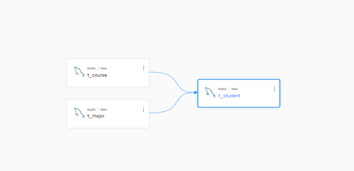


#### 列级血缘

[lineage_emitter_dataset_finegrained.py](https://github.com/datahub-project/datahub/blob/master/metadata-ingestion/examples/library/lineage_emitter_dataset_finegrained.py) - 通过 REST 以 MetadataChangeProposalWrapper 的形式发出细粒度的数据集数据集血缘。

注意事项：

- make_dataset_urn只是引用dataset数据集地址，如果dataset不存在，会默认创建只有数据集名的空数据集（字段名等信息为空）。
- 使用该脚本创建表级别前，建议先通过CLI、UI界面、Python Emitter等导入Dataset信息。
- 通过浏览器地址，获取已有元数据的 urn

参考链接：sqllineage解析sql列级血缘并提交到datahub   https://blog.csdn.net/LCriska/article/details/129329492

案例：

```shell
import datahub.emitter.mce_builder as builder
from datahub.emitter.mcp import MetadataChangeProposalWrapper
from datahub.emitter.rest_emitter import DatahubRestEmitter
from datahub.metadata.com.linkedin.pegasus2avro.dataset import (
    DatasetLineageType,
    FineGrainedLineage,
    FineGrainedLineageDownstreamType,
    FineGrainedLineageUpstreamType,
    Upstream,
    UpstreamLineage,
)


def datasetUrn(tbl):
    return builder.make_dataset_urn("mysql", tbl)


def fldUrn(tbl, fld):
    return builder.make_schema_field_urn(datasetUrn(tbl), fld)


# Lineage of fields in a dataset
# c1      <-- unknownFunc(bar2.c1, bar4.c1)
# c2      <-- myfunc(bar3.c2)
# {c3,c4} <-- unknownFunc(bar2.c2, bar2.c3, bar3.c1)
# c5      <-- unknownFunc(bar3)
# {c6,c7} <-- unknownFunc(bar4)

# note that the semantic of the "transformOperation" value is contextual.
# In above example, it is regarded as some kind of UDF; but it could also be an expression etc.

fineGrainedLineages = [
    FineGrainedLineage(
        upstreamType=FineGrainedLineageUpstreamType.FIELD_SET,
        upstreams=[fldUrn("ods.t_course", "id")],
        downstreamType=FineGrainedLineageDownstreamType.FIELD,
        downstreams=[fldUrn("ods.t_student", "course_id")],
    ),
    FineGrainedLineage(
        upstreamType=FineGrainedLineageUpstreamType.FIELD_SET,
        upstreams=[fldUrn("ods.t_major", "id")],
        downstreamType=FineGrainedLineageDownstreamType.FIELD,
        downstreams=[fldUrn("ods.t_student", "major_id") ],
    ),
]


# this is just to check if any conflicts with existing Upstream, particularly the DownstreamOf relationship
upstream1 = Upstream(dataset=datasetUrn("ods.t_course"), type=DatasetLineageType.TRANSFORMED)
upstream2 = Upstream(dataset=datasetUrn("ods.t_major"), type=DatasetLineageType.TRANSFORMED)

fieldLineages = UpstreamLineage(
    upstreams=[upstream1, upstream2], fineGrainedLineages=fineGrainedLineages
)

lineageMcp = MetadataChangeProposalWrapper(
    entityUrn=datasetUrn("ods.t_student"),
    aspect=fieldLineages,
)

# Create an emitter to the GMS REST API.
emitter = DatahubRestEmitter("http://172.16.3.111:8080")

# Emit metadata!
emitter.emit_mcp(lineageMcp)
```


效果如下：

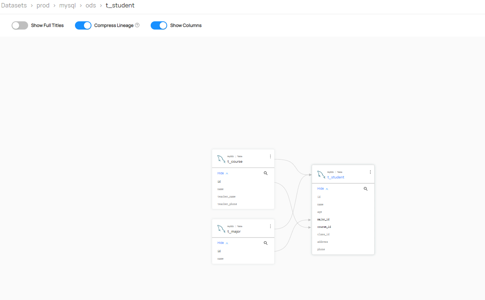


官网参考链接：[世系 |数据中心 (datahubproject.io)](https://datahubproject.io/docs/api/tutorials/lineage/)


## 认证和授权

#### 认证之生成邀请链接

如果您拥有[平台权限](https://datahubproject.io/docs/authorization/access-policies-guide)，则可以通过共享邀请链接来邀请新用户加入 DataHub。`Manage User Credentials`

为此，请导航到“设置”页面内的**“用户和组**”部分。在这里，您可以通过单击按钮生成可共享的邀请链接。如果你 如果没有邀请用户的正确权限，此按钮将被禁用。`Invite Users`

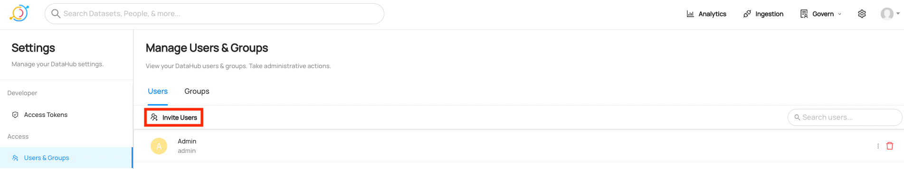


要邀请新用户，只需与组织内的其他人共享链接即可。

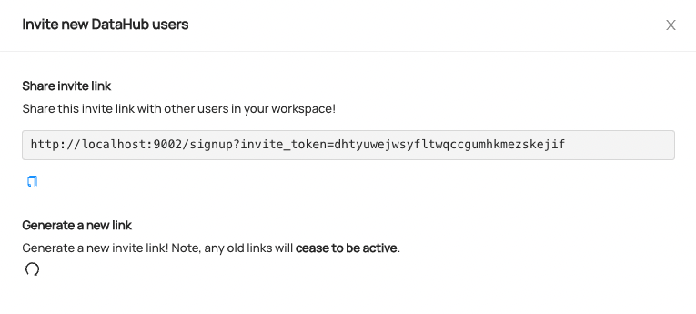

当新用户访问该链接时，他们将被定向到注册屏幕，他们可以在其中创建其 DataHub 帐户。


#### 认证之重置用户密码

要重置用户的密码，请导航到“用户和组”选项卡，找到需要重置密码的用户， ，然后单击右侧菜单下拉菜单中的**重置用户密码**。请注意，用户必须具有[平台权限](https://datahubproject.io/docs/authorization/access-policies-guide)才能重置密码。`Manage User Credentials`


要重置密码，只需与需要更改密码的用户共享密码重置链接。密码重置链接将在 24 小时后过期。

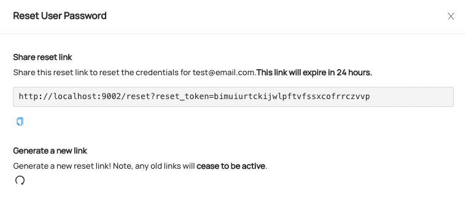

[将用户引导至数据中心]([Onboarding Users to DataHub | DataHub (datahubproject.io)](https://datahubproject.io/docs/authentication/guides/add-users))

#### 授权之策略指南

DataHub提供了通过UI和GraphQL API声明细粒度访问控制策略的能力。 数据中心中的访问策略定义谁可以对哪些资源执行哪些操作。一些简单的英语政策包括

- 应允许数据集所有者编辑文档，但不能编辑标记。
- 我们的数据管理员 Jenny 应该被允许编辑任何仪表板的标签，但不能编辑其他元数据。
- James是一名数据分析师，应该被允许编辑他作为下游使用者的特定数据管道的链接。
- 数据平台团队应该被允许管理用户和组，查看平台分析，并自行管理策略。

数据中心内有两种类型的策略：

1. 平台政策

2. 元数据策略


平台策略可以分为两部分：

1. **参与者**：策略适用于谁（用户或组）
2. 权限：应将哪些**权限**分配给Actor（例如“视图分析”）

请注意，平台策略不包括应用策略的特定“目标资源”。相反 它们仅用于为数据中心用户和组分配特定权限。

元数据策略确定谁可以对哪些**元数据**实体执行哪些操作。


#### 授权之管理策略

可以在“**设置”>“权限”>**“策略”页面上管理策略。该选项卡将仅 对具有该权限的用户可见。`Policies``Manage Policies`

开箱即用，DataHub 使用一组预烘焙策略进行部署。默认策略集在部署时创建 时间，可以在 中的文件中找到。这组策略服务于 以下目的：`policies.json``metadata-service/war/src/main/resources/boot`

1. 为 root 用户帐户分配不可变的超级用户权限（不可变）`datahub`
2. 默认情况下为所有用户分配所有平台权限（可编辑）

\#1 的原因是防止人们意外删除所有策略并被锁定（超级用户帐户可以作为备份） #2 的原因是允许管理员通过 OIDC 或 root 帐户以外的其他方式登录 当他们使用数据中心引导时。这样，那些设置数据中心的人可以毫无摩擦地开始管理策略。 请注意，这些权限*可以*并且可能*应该*在 UI 的**“策略**”页面中更改。`datahub``datahub`

> 专业提示：要使用帐户登录，只需导航到并输入 ， .请注意，密码可以为您的自定义 通过更改模块中的文件进行部署。请注意，必须启用 JaaS 身份验证。`datahub``<your-datahub-domain>/login``datahub``datahub``user.props``datahub-frontend`


#### 授权之配置

默认情况下，策略功能*处于启用状态*。这意味着部署将支持创建、编辑、删除和 最重要的是实施细粒度的访问策略。

在某些情况下，这些功能是不可取的。例如，如果你公司的用户已经习惯了自由统治，那么你 可能想保持这种状态。或者，也许只有您的数据平台团队积极使用 DataHub，在这种情况下，策略可能矫枉过正。

对于这些方案，我们提供了一个后门，用于在 DataHub 部署中禁用策略。这将完全隐藏 策略管理 UI 和默认情况下将允许平台上的所有操作。就好像 每个用户都拥有**平台**和**元数据**风格的*所有*权限。

要禁用策略，您只需为服务容器设置环境变量 自。例如，在您的 中，您将放置`AUTH_POLICIES_ENABLED``datahub-gms``false``docker/datahub-gms/docker.env`

```text
AUTH_POLICIES_ENABLED=false
```

[策略指南]([Policies Guide | DataHub (datahubproject.io)](https://datahubproject.io/docs/authorization/policies#configuration))


## FAQ:

### 1） 安装acryl-datahub[mysql]时报错

在使用 pip 安装 acry-datahubimysal ingestion 插件时，最后报:

```shell
Cannot uninstall 'ruamelyaml. lt is a distutils installed proiect
```

安装命令如下:

```shell
pip install acryl-datahub[mysql]
```


解决方案参见:

将安装命令调整为:

```shell
pip3 install 'acryl-datahub[mysql]' -i  https://pypi.tuna.tsinghua.edu.cn/simple --trusted-host pypi.tuna.tsinghua.edu.cn
```

