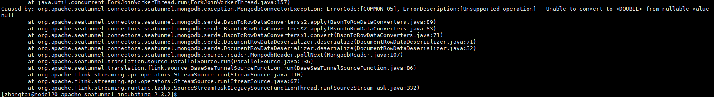

# Mongodb数据源集成测试

1、当数据有嵌套类型 array 和 row 时，可以设置为string 类型，注意目标表嵌套字段长度

```
env {
  execution.parallelism = 1
}
source {
    mongodb {
        uri = "mongodb://172.16.2.123:27017/demo"
        database = "demo"
        collection = "test_nesting"
        schema {
          fields {
            id = int
            resultcode = double
            reason = string
            result = string
            groupGoodsInfo = string
          }
       }
    }
}


sink {
    Jdbc {
        url = "jdbc:mysql://172.16.3.111:4000"
        driver = "com.mysql.cj.jdbc.Driver"
        connection_check_timeout_sec = 100
        user = "root"
        password = "4_fE^xv90-*8G31eKB"
        query = "insert into ods.test_mongo_nesting (id, resultcode, reason, result, groupGoodsInfo) values(?, ?, ?, ?, ?)"
    }
}
```


2、mongodb  同一集合内各文档的字段并不一定相同，或者是相同的字段在不同的文档里是不同类型时，可以使用 `flat.sync-string` 参数
```
env {
  execution.parallelism = 1
}
source {
    mongodb {
        uri = "mongodb://172.16.2.123:27017/demo"
        database = "demo"
        collection = "test_nesting"
        flat.sync-string = true
        schema {
          fields {
            data = string
          }
       }
    }
}


sink {
    Jdbc {
        url = "jdbc:mysql://172.16.3.111:4000"
        driver = "com.mysql.cj.jdbc.Driver"
        connection_check_timeout_sec = 100
        user = "root"
        password = "4_fE^xv90-*8G31eKB"
        query = "insert into ods.test_mongo_nesting_1 (data) values(?)"
    }
}
```

# FAQ

1） seatunnel 2.3.1 mongodb 无法抽取嵌套的数据

有如下报错：

```shell
......
org.apache.flink.client.program.ProgramInvocationException: The main method caused an error: the type[ARRAY] is not support
    at org.apache.flink.client.program.PackagedProgram.callMainMethod(PackagedProgram.java:372)
    at org.apache.flink.client.program.PackagedProgram.invokeInteractiveModeForExecution(PackagedProgram.java:222)
    at org.apache.flink.client.ClientUtils.executeProgram(ClientUtils.java:114)
    at org.apache.flink.client.cli.CliFrontend.executeProgram(CliFrontend.java:841)
    at org.apache.flink.client.cli.CliFrontend.run(CliFrontend.java:240)
    at org.apache.flink.client.cli.CliFrontend.parseAndRun(CliFrontend.java:1085)
    at org.apache.flink.client.cli.CliFrontend.lambda$main$10(CliFrontend.java:1163)
    at java.security.AccessController.doPrivileged(Native Method)
    at javax.security.auth.Subject.doAs(Subject.java:422)
    at org.apache.hadoop.security.UserGroupInformation.doAs(UserGroupInformation.java:1762)
    at org.apache.flink.runtime.security.contexts.HadoopSecurityContext.runSecured(HadoopSecurityContext.java:41)
    at org.apache.flink.client.cli.CliFrontend.main(CliFrontend.java:1163)
  Caused by: java.lang.UnsupportedOperationException: the type[ARRAY] is not support
```

错误原因：

seatunnel 2.3.1 mongodb source 无法识别嵌套类型 array 和 object 类型。


解决方法：

seatunnel dev  mongodb source 进行了更新，将嵌套类型抽取为String 类型即可。 **参考 测试用例1**


2）当mongodb 抽取的 同集合内的文档数据中schame 元数据不同，也无法读取。

报错如下：




报错原因：

mongodb 的特色造成mongodb 同一集合内的不同文档是独立的，也就是说各文档的字段并不一定相同，或者是相同的字段在不同的文档里是不同类型的。

但是 seatunnel 的mongodb source 是指定了本集合的 schema 元数据与类型，当 有文档的元数据或类型与指定配置不同，这就会导致读取报错。

**参考 测试用例2**


