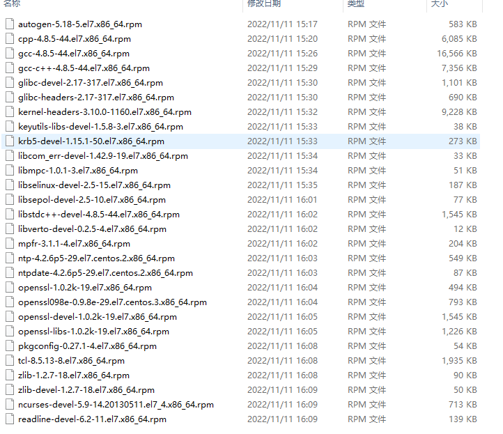

# 离线安装postgresql (linux )

## 一、下载离线安装包 postgresql 9.6.10或 postgres12.12

[PostgreSQL: File Browser](https://www.postgresql.org/ftp/source/)

下载：postgresql-9.6.10.tar.gz

下载：postgresql-12.12.tar.gz


## 二、下载gcc-c++和readline

[阿里云开源镜像站资源目录](http://mirrors.aliyun.com/centos/7/os/x86_64/Packages/)



## 三、安装

在根路径下创建data目录，作为我们得工作目录

### 1、gcc-c++环境检测

rpm -qa | grep gcc-c++

```shell
[root@bigdata01 data]# rpm -qa | grep gcc-c++
[root@bigdata01 data]# ll
```

###  2、gcc-c++环境安装

将下载好的gcc-c++放到data目录下（最好所有的gcc文件放一个单独文件夹）

执行命令：rpm -Uvh *.rpm --nodeps --force

```shell
[root@bigdata01 gcc]# rpm -Uvh *.rpm --nodeps --force
warning: autogen-5.18-5.el7.x86_64.rpm: Header V3 RSA/SHA256 Signature, key ID f4a80eb5: NOKEY
Preparing...                          ################################# [100%]
Updating / installing...
   1:zlib-1.2.7-18.el7                ################################# [  4%]
   2:pkgconfig-1:0.27.1-4.el7         ################################# [  7%]
   3:openssl-libs-1:1.0.2k-19.el7     ################################# [ 11%]
   4:mpfr-3.1.1-4.el7                 ################################# [ 14%]
   5:libmpc-1.0.1-3.el7               ################################# [ 18%]
   6:cpp-4.8.5-44.el7                 ################################# [ 21%]
   7:ntpdate-4.2.6p5-29.el7.centos.2  ################################# [ 25%]
   8:libcom_err-devel-1.42.9-19.el7   ################################# [ 29%]
   9:libsepol-devel-2.5-10.el7        ################################# [ 32%]
  10:libselinux-devel-2.5-15.el7      ################################# [ 36%]
  11:libverto-devel-0.2.5-4.el7       ################################# [ 39%]
  12:ncurses-devel-5.9-14.20130511.el7################################# [ 43%]
  13:zlib-devel-1.2.7-18.el7          ################################# [ 46%]
  14:libstdc++-devel-4.8.5-44.el7     ################################# [ 50%]
  15:keyutils-libs-devel-1.5.8-3.el7  ################################# [ 54%]
  16:krb5-devel-1.15.1-50.el7         ################################# [ 57%]
  17:kernel-headers-3.10.0-1160.el7   ################################# [ 61%]
  18:glibc-headers-2.17-317.el7       ################################# [ 64%]
  19:glibc-devel-2.17-317.el7         ################################# [ 68%]
  20:gcc-4.8.5-44.el7                 ################################# [ 71%]
  21:gcc-c++-4.8.5-44.el7             ################################# [ 75%]
  22:openssl-devel-1:1.0.2k-19.el7    ################################# [ 79%]
  23:readline-devel-6.2-11.el7        ################################# [ 82%]
  24:ntp-4.2.6p5-29.el7.centos.2      ################################# [ 86%]
  25:openssl-1:1.0.2k-19.el7          ################################# [ 89%]
  26:autogen-5.18-5.el7               ################################# [ 93%]
  27:openssl098e-0.9.8e-29.el7.centos.################################# [ 96%]
  28:tcl-1:8.5.13-8.el7               ################################# [100%]
```


### 3、查看安装结果

gcc -v

g++ -v

```shell
[root@bigdata01 gcc]# gcc -v
Using built-in specs.
COLLECT_GCC=gcc
COLLECT_LTO_WRAPPER=/usr/libexec/gcc/x86_64-redhat-linux/4.8.5/lto-wrapper
Target: x86_64-redhat-linux
Configured with: ../configure --prefix=/usr --mandir=/usr/share/man --infodir=/usr/share/info --with-bugurl=http://bugzilla.redhat.com/bugzilla --enable-bootstrap --enable-shared --enable-threads=posix --enable-checking=release --with-system-zlib --enable-__cxa_atexit --disable-libunwind-exceptions --enable-gnu-unique-object --enable-linker-build-id --with-linker-hash-style=gnu --enable-languages=c,c++,objc,obj-c++,java,fortran,ada,go,lto --enable-plugin --enable-initfini-array --disable-libgcj --with-isl=/builddir/build/BUILD/gcc-4.8.5-20150702/obj-x86_64-redhat-linux/isl-install --with-cloog=/builddir/build/BUILD/gcc-4.8.5-20150702/obj-x86_64-redhat-linux/cloog-install --enable-gnu-indirect-function --with-tune=generic --with-arch_32=x86-64 --build=x86_64-redhat-linux
Thread model: posix
gcc version 4.8.5 20150623 (Red Hat 4.8.5-44) (GCC)
[root@bigdata01 gcc]#  
[root@bigdata01 gcc]# 
[root@bigdata01 gcc]# 
[root@bigdata01 gcc]# g++ -v
Using built-in specs.
COLLECT_GCC=g++
COLLECT_LTO_WRAPPER=/usr/libexec/gcc/x86_64-redhat-linux/4.8.5/lto-wrapper
Target: x86_64-redhat-linux
Configured with: ../configure --prefix=/usr --mandir=/usr/share/man --infodir=/usr/share/info --with-bugurl=http://bugzilla.redhat.com/bugzilla --enable-bootstrap --enable-shared --enable-threads=posix --enable-checking=release --with-system-zlib --enable-__cxa_atexit --disable-libunwind-exceptions --enable-gnu-unique-object --enable-linker-build-id --with-linker-hash-style=gnu --enable-languages=c,c++,objc,obj-c++,java,fortran,ada,go,lto --enable-plugin --enable-initfini-array --disable-libgcj --with-isl=/builddir/build/BUILD/gcc-4.8.5-20150702/obj-x86_64-redhat-linux/isl-install --with-cloog=/builddir/build/BUILD/gcc-4.8.5-20150702/obj-x86_64-redhat-linux/cloog-install --enable-gnu-indirect-function --with-tune=generic --with-arch_32=x86-64 --build=x86_64-redhat-linux
Thread model: posix
gcc version 4.8.5 20150623 (Red Hat 4.8.5-44) (GCC)
```


### 4、安装[postgresql](https://so.csdn.net/so/search?q=postgresql&spm=1001.2101.3001.7020)

把postgresql安装包放到/software/postgres目录下进行解压：

```shell
tar -zxvf /software/postgres/postgresql-9.6.10.tar.gz
```

切换到解压目录下，执行安装命令：

```shell
cd /software/postgres/postgresql-9.6.10
./configure --prefix=/workspace/postgresql
```

postgresql安装完成。

进行编译：make

注：编译时间会较长，请耐心等待。

```shell
[root@bigdata01 postgresql-9.6.10]# make
......
cp ../../../contrib/spi/refint.so refint.so
cp ../../../contrib/spi/autoinc.so autoinc.so
make[2]: Leaving directory `/software/postgres/postgresql-9.6.10/src/test/regress'
make -C test/perl all
make[2]: Entering directory `/software/postgres/postgresql-9.6.10/src/test/perl'
make[2]: Nothing to be done for `all'.
make[2]: Leaving directory `/software/postgres/postgresql-9.6.10/src/test/perl'
make[1]: Leaving directory `/software/postgres/postgresql-9.6.10/src'
make -C config all
make[1]: Entering directory `/software/postgres/postgresql-9.6.10/config'
make[1]: Nothing to be done for `all'.
make[1]: Leaving directory `/software/postgres/postgresql-9.6.10/config'
All of PostgreSQL successfully made. Ready to install.
```

make install

```shell
[root@bigdata01 postgresql-9.6.10]#  make install
......
make[1]: Leaving directory `/software/postgres/postgresql-9.6.10/src'
make -C config install
make[1]: Entering directory `/software/postgres/postgresql-9.6.10/config'
/usr/bin/mkdir -p '/workspace/postgresql/lib/pgxs/config'
/usr/bin/install -c -m 755 ./install-sh '/workspace/postgresql/lib/pgxs/config/install-sh'
/usr/bin/install -c -m 755 ./missing '/workspace/postgresql/lib/pgxs/config/missing'
make[1]: Leaving directory `/software/postgres/postgresql-9.6.10/config'
PostgreSQL installation complete.
```


## 四、配置

### 1、创建postgresql用户

root用户不能启动postgresql，所以需要创建一个普通用户来启动数据库

创建用户：useradd postgres

设置密码：passwd postgres

### 2、 创建目录 和 log

创建目录 data(数据库存储) 和 log(日志存储)

将postgresql的目录权限全部赋予给postgres用户

```
mkdir -p /data/postgresql/data
mkdir -p /data/postgresql/log

chown -R postgres:postgres postgresql/
```

### 3、配置环境变量：

```shell
su - postgres

vim ~/.bashrc

export PGDATA=/data/postgresql/data
export PGHOME=/workspace/postgresql/
export PATH=$PGHOME/bin:$PATH

source ~/.bashrc
```

### 4、数据库初始化操作

```shell
# 将postgresql的权限全部赋予给postgres用户
[root@bigdata01 workspace]# chown -R postgres:postgres /workspace/postgresql/
[root@bigdata01 ~]# su - postgres
Last login: Sat Nov 12 11:15:33 CST 2022 on pts/6
[postgres@bigdata01 ~]$ cd /workspace/postgresql/bin/
[postgres@bigdata01 bin]$ initdb -D /data/postgresql/data -E UTF8 --locale=zh_CN.UTF-8 -U postgres -W
The files belonging to this database system will be owned by user "postgres".
This user must also own the server process.

The database cluster will be initialized with locale "en_US.UTF-8".
The default database encoding has accordingly been set to "UTF8".
The default text search configuration will be set to "english".

Data page checksums are disabled.

fixing permissions on existing directory /data/postgres ... ok
creating subdirectories ... ok
selecting default max_connections ... 100
selecting default shared_buffers ... 128MB
selecting dynamic shared memory implementation ... posix
creating configuration files ... ok
running bootstrap script ... ok
performing post-bootstrap initialization ... ok
syncing data to disk ... ok

WARNING: enabling "trust" authentication for local connections
You can change this by editing pg_hba.conf or using the option -A, or
--auth-local and --auth-host, the next time you run initdb.

Success. You can now start the database server using:

pg_ctl -D /data/postgresql/data -l logfile start
```

其中**启动命令**：

```shell
[postgres@bigdata01 bin]$ pg_ctl -D /data/postgresql/data -l logfile start
```


**postgres初始化编码指定中文**

在postgres用户下使用

`initdb -D /data/postgresql/data -E UTF8 --locale=zh_CN.UTF-8 -U postgres -W` 

- `-D /data/postgres`    数据库存储目录

- `-E UTF8 --locale=zh_CN.UTF-8`    指定的是编码以及排序等，

  默认使用本地locale,可以敲locale查看，在执行初始化之前，使用`locale -a`查看本地locale 编码语言是否存在 zh_CN 的 locale 支持 并 使用`env` 查看系统编码 `LANG`。如果本地locale 编码语言不是中文支持，则添加中文编码支持。本地locale添加中文支持参考文档：[04 Add Chinese environment.md](../../../06.devops/01.linux/04 Add Chinese environment.md)


- `-U postgres  `    指的是创建超级用户 postgres

- `-W`    指的是为超级用户创建密码


### 5、配置数据库

切换到postgresql下data目录下：

执行命令：vim pg_hba.conf

```shell
[postgres@bigdata01 bin]$ cd /data/postgres/data
[postgres@bigdata01 postgres]$ vim pg_hba.conf
......
# "local" is for Unix domain socket connections only
local   all             all                                     trust
# IPv4 local connections:
#host    all             all             127.0.0.1/32            trust
host    all             all             0.0.0.0/0            md5
# IPv6 local connections:
host    all             all             ::1/128                 trust
# Allow replication connections from localhost, by a user with the
# replication privilege.
#local   replication     postgres                                trust
#host    replication     postgres        127.0.0.1/32            trust
#host    replication     postgres        ::1/128                 trust
host    replication     postgres      0.0.0.0/0       md5
```

执行命令：vim postgresql.conf

```shell
[postgres@bigdata01 postgres]$ vim postgresql.conf
......
listen_addresses = '*'          # what IP address(es) to listen on;
                                        # comma-separated list of addresses;
                                        # defaults to 'localhost'; use '*' for all
                                        # (change requires restart)
port = 5432                            # (change requires restart)
max_connections = 1000                  # (change requires restart)
#superuser_reserved_connections = 3     # (change requires restart)
....

# - TCP Keepalives -
# see "man 7 tcp" for details

tcp_keepalives_idle = 7200              # TCP_KEEPIDLE, in seconds;
                                        # 0 selects the system default
tcp_keepalives_interval = 75            # TCP_KEEPINTVL, in seconds;
                                        # 0 selects the system default
tcp_keepalives_count = 9                # TCP_KEEPCNT;
                                        # 0 selects the system default
......


#------------------------------------------------------------------------------
# REPLICATION
#------------------------------------------------------------------------------

# - Sending Server(s) -

# Set these on the master and on any standby that will send replication data.

max_wal_senders = 20            # max number of walsender processes
                                # (change requires restart)
#wal_keep_segments = 0          # in logfile segments, 16MB each; 0 disables
#wal_sender_timeout = 60s       # in milliseconds; 0 disables

max_replication_slots = 20      # max number of replication slots
......

#------------------------------------------------------------------------------
# REPORTING AND LOGGING
#------------------------------------------------------------------------------

# - Where to Log -

#log_destination = 'stderr'             # Valid values are combinations of
                                        # stderr, csvlog, syslog, and eventlog,
                                        # depending on platform.  csvlog
                                        # requires logging_collector to be on.

# This is used when logging to stderr:
logging_collector = on          # Enable capturing of stderr and csvlog
                                        # into log files. Required to be on for
                                        # csvlogs.
                                        # (change requires restart)

# These are only used if logging_collector is on:
log_directory = 'pg_log'                # directory where log files are written,
                                        # can be absolute or relative to PGDATA
log_filename = 'postgresql-%Y-%m-%d_%H%M%S.log' # log file name pattern,
                                        # can include strftime() escapes
log_file_mode = 0600                    # creation mode for log files,
                                        # begin with 0 to use octal notation
log_truncate_on_rotation = off          # If on, an existing log file with the
                                        # same name as the new log file will be
                                        # truncated rather than appended to.
                                        # But such truncation only occurs on
                                        # time-driven rotation, not on restarts
                                        # or size-driven rotation.  Default is
                                        # off, meaning append to existing files
                                        # in all cases.
log_rotation_age = 1d                   # Automatic rotation of logfiles will
                                        # happen after that time.  0 disables.
log_rotation_size = 10MB                # Automatic rotation of logfiles will
                                        # happen after that much log output.
......
# - What to Log -

#debug_print_parse = off
#debug_print_rewritten = off
#debug_print_plan = off
#debug_pretty_print = on
#log_checkpoints = off
#log_connections = off
#log_disconnections = off
#log_duration = off
#log_error_verbosity = default          # terse, default, or verbose messages
#log_hostname = off
#log_line_prefix = ''                   # special values:
                                        #   %a = application name
                                        #   %u = user name
                                        #   %d = database name
                                        #   %r = remote host and port
                                        #   %h = remote host
                                        #   %p = process ID
                                        #   %t = timestamp without milliseconds
                                        #   %m = timestamp with milliseconds
                                        #   %n = timestamp with milliseconds (as a Unix epoch)
                                        #   %i = command tag
                                        #   %e = SQL state
                                        #   %c = session ID
                                        #   %l = session line number
                                        #   %s = session start timestamp
                                        #   %v = virtual transaction ID
                                        #   %x = transaction ID (0 if none)
                                        #   %q = stop here in non-session
                                        #        processes
                                        #   %% = '%'
                                        # e.g. '<%u%%%d> '
#log_lock_waits = off                   # log lock waits >= deadlock_timeout
log_statement = 'all'                   # none, ddl, mod, all
#log_replication_commands = off
#log_temp_files = -1                    # log temporary files equal or larger
                                        # than the specified size in kilobytes;
                                        # -1 disables, 0 logs all temp files
log_timezone = 'PRC'
......
# - Locale and Formatting -

datestyle = 'iso, ymd'
#intervalstyle = 'postgres'
timezone = 'PRC'
#timezone_abbreviations = 'Default'     # Select the set of available time zone
                                        # abbreviations.  Currently, there are
                                        #   Def:ault
                                        #   Australia (historical usage)
                                        #   India
                                        # You can create your own file in
                                        # share/timezonesets/.
#extra_float_digits = 0                 # min -15, max 3
#client_encoding = sql_ascii            # actually, defaults to database
                                        # encoding

# These settings are initialized by initdb, but they can be changed.
lc_messages = 'zh_CN.UTF-8'                     # locale for system error message
                                        # strings
lc_monetary = 'zh_CN.UTF-8'                     # locale for monetary formatting
lc_numeric = 'zh_CN.UTF-8'                      # locale for number formatting
lc_time = 'zh_CN.UTF-8'                         # locale for time formatting

# default configuration for text search
default_text_search_config = 'pg_catalog.simple'
.....
```


### 6、关闭防火墙

执行命令：systemctl status firewalld.service

查看防火墙是否关闭

关闭防火墙：systemctl stop firewalld.service

```shell
[postgres@bigdata01 postgres]$systemctl stop firewalld.service 
[postgres@bigdata01 postgres]$ systemctl status firewalld.service
● firewalld.service - firewalld - dynamic firewall daemon
   Loaded: loaded (/usr/lib/systemd/system/firewalld.service; enabled; vendor preset: enabled)
   Active: inactive (dead) since Sat 2022-11-12 09:33:25 CST; 5h 13min ago
     Docs: man:firewalld(1)
 Main PID: 889 (code=exited, status=0/SUCCESS)
[postgres@bigdata01 postgres]$
```


### 7、配置开机自启系统服务(root用户)

进入postgresql的解压目录(本文为 `/software/postgres/postgresql-9.6.10` )，执行命令 cp contrib/start-scripts/linux /etc/init.d/postgresql，然后 vim /etc/init.d/postgresql，进行配置修改

```shell
[root@bigdata01 postgresql-9.6.10]# cp contrib/start-scripts/linux /etc/init.d/postgresql
[root@bigdata01 postgresql-9.6.10]#
[root@bigdata01 postgresql-9.6.10]#  vim /etc/init.d/postgresql
......
# Original author:  Ryan Kirkpatrick <pgsql@rkirkpat.net>

# contrib/start-scripts/linux

## EDIT FROM HERE

# Installation prefix
prefix=/workspace/postgresql/

# Data directory
PGDATA="/data/postgres/data"

# Who to run the postmaster as, usually "postgres".  (NOT "root")
PGUSER=postgres

# Where to keep a log file
PGLOG="/workspace/postgresql/log"
```

然后使用命令 `chmod +x /etc/init.d/postgresql`，赋予该文件执行权限。

另外，还可以使用命令` chkconfig --add postgresql`，设置服务开机自启。

### 8、启动及连接数据库

pg_ctl start

#### 1、启停服务

```
[root@bigdata01 bin]$ su - postgres   

[postgres@bigdata01 bin]$ pg_ctl -D /data/postgres/data -l logfile start
```

pg_ctl start    #启动
pg_ctl stop     #停止
pg_ctl restart  #重启

可以通过 ps -ef|grep postgres，查看postgres相关进程。

#### 2、psql 连接

```
[postgres@bigdata01 ~]$ psql -h 172.16.10.59 -p 5432 -U postgres -d postgres
psql (9.6.10)
Type "help" for help.

postgres=# \l
                                                   List of databases
        Name         |      Owner       | Encoding |   Collate   |    Ctype    |           Access privileges
---------------------+------------------+----------+-------------+-------------+---------------------------------------
 dolphinscheduler300 | dolphinscheduler | UTF8     | zh_CN.utf8  | zh_CN.utf8  | =Tc/dolphinscheduler                 +
                     |                  |          |             |             | dolphinscheduler=CTc/dolphinscheduler
 postgres            | postgres         | UTF8     | en_US.UTF-8 | en_US.UTF-8 |
 template0           | postgres         | UTF8     | en_US.UTF-8 | en_US.UTF-8 | =c/postgres                          +
                     |                  |          |             |             | postgres=CTc/postgres
 template1           | postgres         | UTF8     | en_US.UTF-8 | en_US.UTF-8 | =c/postgres                          +
                     |                  |          |             |             | postgres=CTc/postgres
(4 rows)

postgres=# \q
[postgres@bigdata01 ~]$
```


### 9、编辑PostgreSQL的脚本

编辑PostgreSQL 启动、停止、重启、查看状态的脚本：

```shell
vim pgServer.sh

$PGHOME/bin/pg_ctl -D /data/postgresql-12.12/data $1
```


参考连接：

[ Linux下离线安装postgresql并进行主从配置](https://blog.csdn.net/qq_39980539/article/details/122835502)

[Linux CentOS7 离线安装PostgreSQL 9.6.10](https://www.dandelioncloud.cn/article/details/1525784094801936386)


## FAQ:

#### 1、修改密码psql登录

```SQL
psql -h 192.168.3.111 -p 5432 -U postgres -d postgres

ALTER USER postgres WITH PASSWORD 'postgres';

\q
```

[postgresql 安装使用修改密码psql登录](https://blog.csdn.net/qq_17693195/article/details/125504783)


#### 2、解决每次切换为postgres用户都需要`source ~/.bashrc`文件的问题:

```shell
vim ~/.bash_profile
```

在文件内部输入

```shell
# Get the aliases and functions
if test -f ~/.bashrc ; then
   source ~/.bashrc
fi
```

[解决.bashrc文件每次打开终端都需要source的问题](https://blog.csdn.net/qq_32146369/article/details/108839865)


#### 3、centos 切换用户postgres 显示bash-4.2$，不显示用户名路径

问题及原因：使用以下命令切换用户

```shell
sudo su - postgres
```

的时候却显示：

```shell
-bash-4.2$
```

出现 shell 显示-bash-4.2$不显示用户名路径的问题。

这是因为 PostgreSQL 安装时创建的 postgres 用户的配置文件缺少以下内容：

```shell
export PS1='[\u@\h \w]'
```


解决步骤：

在 -bash-4.2$ 状态下编辑配置文件：

```shell
vi ~/.bash_profile
      
export PS1='[\u@\h \w]'
      
source ~/.bash_profile      
```

案例：

```shell
[root@bigdata01 ~]# sudo su - postgres
Last login: Sat Apr 22 18:08:35 PDT 2022 on pts/1
-bash-4.2$ vi ~/.bash_profile
-bash-4.2$ source ~/.bash_profile
[postgres@bigdata01 ~]
```

参考案例：[centos 切换用户postgres 显示bash-4.2$，不显示用户名路径的问题](https://blog.csdn.net/u011417723/article/details/118633645)


#### 4、环境缺少 readline 和 zlib-devel

1、缺少 readline 包

```shell
......
checking for library containing readline... no
configure: error: readline library not found
If you have readline already installed, see config.log for details on the
failure.  It is possible the compiler isn't looking in the proper directory.
Use --without-readline to disable readline support.
[root@bigdata02 postgresql-12.12]# 
[root@bigdata02 postgresql-12.12]# rpm -qa | grep readline   -- 检查系统是否安装 readline 包
readline-6.2-11.el7.x86_64
[root@bigdata02 postgresql-12.12]# 
[root@bigdata02 postgresql-12.12]# yum search readline   --通过 yum 搜索相关的 readline 包
已加载插件：fastestmirror, langpacks, product-id, search-disabled-repos, subscription-manager
......
rakudo-Readline.x86_64 : Simple Perl 6 binding to GNU libreadline
readline-devel.i686 : Files needed to develop programs which use the readline library
readline-devel.x86_64 : Files needed to develop programs which use the readline library
readline-static.i686 : Static libraries for the readline library
readline-static.x86_64 : Static libraries for the readline library
tcl-tclreadline.x86_64 : GNU Readline extension for Tcl/Tk
......

-- 根据提示，有一个包引起了注意 "readline-devel", 猜想可能与这个包有关。

-- 安装 readline-devel 包
[root@bigdata02 postgresql-12.12]# yum -y install -y readline-devel
已加载插件：fastestmirror, langpacks, product-id, search-disabled-repos, subscription-manager

This system is not registered with an entitlement server. You can use subscription-manager to register.

......
```


2、缺少 zlib-devel 包

```
......
checking for library containing sched_yield... none required
checking for library containing gethostbyname_r... none required
checking for library containing shmget... none required
checking for library containing readline... -lreadline
checking for inflate in -lz... no
configure: error: zlib library not found
If you have zlib already installed, see config.log for details on the
failure.  It is possible the compiler isn't looking in the proper directory.
Use --without-zlib to disable zlib support.
[root@bigdata02 postgresql-12.12]# 
[root@bigdata02 postgresql-12.12]# 
[root@bigdata02 postgresql-12.12]# yum install zlib-devel;
已加载插件：fastestmirror, langpacks, product-id, search-disabled-repos, subscription-manager

This system is not registered with an entitlement server. You can use subscription-manager to register.

Repository base is listed more than once in the configuration
Loading mirror speeds from cached hostfile
 * base: ftp.sjtu.edu.cn
 * extras: mirrors.ustc.edu.cn
 * updates: mirrors.ustc.edu.cn
正在解决依赖关系
......


查看安装结果：
 ls -l /usr/include/ | grep zlib 
-rw-r--r--.  1 root root  66188 Feb 22  2013 zlib.h
```


#### 5、Flink CDC 连接 postgresql

1、更改 postgresql.conf

```shell
# 更改wal日志方式为logical
wal_level = logical            # minimal, replica, or logical
# 更改solts最大数量（默认值为10），flink-cdc默认一张表占用一个
max_replication_slots = 20           # max number of replication slots
# 更改wal发送最大进程数（默认值为10），这个值和上面的solts设置一样
max_wal_senders = 20    # max number of walsender processes
```


参考案例：[Flink CDC 连接 postgresql 遇到的问题](https://blog.csdn.net/H_X_P_/article/details/124036783)
