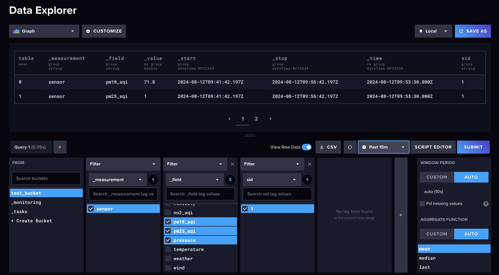

# Docker部署

​	Influxdb的官方镜像可参考：[Influxdb Docker Official Image](https://hub.docker.com/_/influxdb)。构建指令如下：

```shell
docker run -d -p 8086:8086 \
-v "/data/influxdb2/data:/var/lib/influxdb2" \
-v "/data/influxdb2/config:/etc/influxdb2" \
-e DOCKER_INFLUXDB_INIT_MODE=setup \
-e DOCKER_INFLUXDB_INIT_USERNAME=influxdb \
-e DOCKER_INFLUXDB_INIT_PASSWORD=influxdb \
-e DOCKER_INFLUXDB_INIT_ORG=org \
-e DOCKER_INFLUXDB_INIT_BUCKET=test_bucket \
influxdb:2
```

​	构建完毕后，访问`http://localhost:8066`即可进入Influxdb WebUI。可以通过[spark-connector-influxdb](https://github.com/AirToSupply/spark-connector-influxdb)库实时写入数据至时序库中，具体可以参考[FluxStreamSinkApplication](https://github.com/AirToSupply/spark-connector-influxdb/blob/master/examples/src/main/scala/org/apache/spark/sql/example/sink/FluxStreamSinkApplication.scala)这个测试用例。写入的数据可以通过Influxdb WebUI提供的`Data Explorer`进行数据探索，如下图：



# 附录

## 1.如何通过Spark实时流转数据时序库

​	参考笔者的开源项目：[spark-connector-influxdb](https://github.com/AirToSupply/spark-connector-influxdb)。