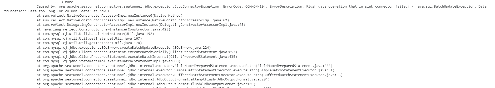

# 前言

​		tidb的单行和单列都是有限制的。我们在通过数据集成框架将MongoDB中的半结构化数据导入到tidb时，由于字段body太大导致出现如下异常：



​		具体配置优化方式可以查看tidb的官方文档：[单列的限制](https://docs.pingcap.com/zh/tidb/stable/tidb-limitations#%E5%8D%95%E5%88%97%E7%9A%84%E9%99%90%E5%88%B6)


# 最佳实践

## 1.txn-entry-size-limit

​		该参数是tidb组件的参数，该参数默认值为6MB，建议修改为120MB。有如下两种方式：

【方式一】在tidb的拓扑文件进行修改，通过tiup cluster edit-config命令在线修改之后，在通过tiup cluster reload进行重刷即可。

```yaml
...
server_configs:
  tidb:
    performance.txn-entry-size-limit: 125829120
...
```

【方式二】进入sql终端进行修改：

```sql
set config tidb `performance.txn-entry-size-limit`=125829120;
```

## 2.txn-total-size-limit

​		该参数是tidb组件的参数，该参数默认值为100M，建议修改为120MB。有如下两种方式：

【方式一】在tidb的拓扑文件进行修改，通过tiup cluster edit-config命令在线修改之后，在通过tiup cluster reload进行重刷即可。

```yaml
...
server_configs:
  tidb:
    performance.txn-total-size-limit: 125829120
...
```

【方式二】进入sql终端进行修改：

```sql
set config tidb `performance.txn-total-size-limit`=125829120;
```


## 3.raft-entry-max-size

​		该参数是tikv组件的参数，该参数默认值为8M，建议修改为120MB。有如下两种方式：

【方式一】在tidb的拓扑文件进行修改，通过tiup cluster edit-config命令在线修改之后，在通过tiup cluster reload进行重刷即可。

```yaml
...
server_configs:
  tikv:
    raftstore.raft-entry-max-size: 120MB
...
```

【方式二】进入sql终端进行修改：

```sql
set config tikv `raftstore.raft-entry-max-size`='120MB';
```

​		并且可以通过如下方式查看：

```sql
show config where name like '%raft-entry-max-size%'
```


## 4.max_allowed_packet

​		该参数是tidb的系统参数，该参数默认值为64M，建议修改为128MB。需要进入sql终端进行修改：

```sql
SET GLOBAL max_allowed_packet = '134217728';  
```
