# 一.如何使用Sysbench

​		具体请参考：[《Sysbench Install And Usage》](https://github.com/AirToSupply/odes-faq/blob/master/07.toolkits/03.sysbench/01-install-and-usage.md)。

# 二.测试方案构造

​		ReadySet服务作为代理数据库的查询缓存，重点关注读数据库和读缓存之间的对比，着重关注两个性能指标：**QPS**（每秒查询请求次数）和**TP95**（查询请求延时95%分位数）；**查询请求平均延时**作为特殊辅助性参考。		

​		由于Sysbench主要是偏向TP的性能测试，对于读测试提供的测试用例不够灵活也不够丰富，涉及主要的测试用例梳理大致如下：

| Sysbench读用例           | SQL                                                          | 查询类型             | 涉及对象 | 是否聚合 | 是否排序 |
| ------------------------ | ------------------------------------------------------------ | -------------------- | -------- | -------- | -------- |
| **oltp_point_select**    | SELECT c FROM sbtest1 WHERE id=1;                            | 点查                 | 主键     |          |          |
| **oltp_read_only**       | SELECT c FROM sbtest1 WHERE id=1;                            | 点查                 | 主键     |          |          |
|                          | SELECT c FROM sbtest1 WHERE id BETWEEN 1 AND 100;            | 范围查询（连续区间） | 主键     |          |          |
|                          | SELECT SUM(k) FROM sbtest1 WHERE id BETWEEN 1 AND 100;       | 范围查询（连续区间） | 主键     | ✅        |          |
|                          | SELECT c FROM sbtest1 WHERE id BETWEEN 1 AND 100 ORDER BY c; | 范围查询（连续区间） | 主键     | ✅        | ✅        |
|                          | SELECT DISTINCT c FROM sbtest1 WHERE id BETWEEN 1 AND 100 ORDER BY c; | 范围查询（连续区间） | 主键     | ✅        | ✅        |
| **select_random_points** | SELECT id, k, c, pad FROM sbtest1 WHERE k IN (?, ?);         | 范围查询（离散）     | 索引     |          |          |
| **select_random_ranges** | SELECT count(k) FROM sbtest1 WHERE k BETWEEN ? AND ? OR k BETWEEN ? AND ?; | 范围查询（连续区间） | 索引     | ✅        |          |

​		这里并不覆盖所有类型的查询，因为ReadySet并不支持所有类型的查询，这里主要重点关注如下：

​		（1）ReadySet读缓存是否支持上述提供的4大类测试用例。

​		（2）缓存代理上游数据库前后，QPS和TP95关键性能指标差异性。

​		（3）ReadySet读缓存在并发访问下的表现。

# 三.测试实验

## 3.1 代理PostgreSQL

### 3.1.1 环境说明

| 环境配置项目 | 关键信息                                                    | 备注                                                         |
| ------------ | ----------------------------------------------------------- | ------------------------------------------------------------ |
| 操作系统     | MacOS（2 GHz 双核Intel Core i5）                            |                                                              |
| 内存         | 8G                                                          |                                                              |
| 硬盘         | 250GB（HDD）                                                |                                                              |
| 数据库       | PostgreSQL 14+（Docker部署）                                | 开启binlog                                                   |
| 代理服务     | ReadySet Server main分支 和 beta-2023-07-26（源码编译部署） | 内核参数设置：</br>query-caching=async（自关闭按需缓存，对自动化测试友好）</br>eviction-policy=lru（开启内存最近最小使用策略，减小内存不足下测试指标来回震荡） |
| 网络环境     | 单节点本地                                                  | 代理服务访问容器中的数据库有网络损耗但可以忽略不计           |

### 3.1.2 数据集构造

​		这里对postgres数据库中testdb这个数据库下的1张1000w数据量的表进行连续60s读请求压力测试，同时通过分别通过1个并发，4个并发以及8个并发分别进行实验以及相关数据记录，并且不讨论随着并发数增加到拐点情况下的性能表现。

```shell
sysbench \
--db-driver=pgsql \
--time=60 \
--threads=10 \
--report-interval=1 \
--pgsql-host=127.0.0.1 \
--pgsql-port=5432 \
--pgsql-user=postgres \
--pgsql-password=readyset \
--pgsql-db=testdb \
--tables=1 \
--table_size=10000000 \
--db-ps-mode=disable \
oltp_point_select prepare
```

​		这里在数据准备阶段采用oltp_point_select进行数据初始化，因为第二章《**测试方案构造**》中涉及的4种测试用例构造的表结构都是相同的。

### 3.1.3 测试实验和数据记录

​		压测上游数据库服务结果如下：

| Test Point               | Thread | QPS     | TP95（ms） | TP50（ms） |
| ------------------------ | ------ | ------- | ---------- | ---------- |
| **oltp_point_select**    | 1      | 814.09  | 1.76       | -          |
|                          | 4      | 1698.02 | 4.41       | -          |
|                          | 8      | 1889.43 | 9.73       | -          |
| **oltp_read_only**       | 1      | 739.00  | 30.26      | -          |
|                          | 4      | 1527.45 | 61.08      | -          |
|                          | 8      | 1731.35 | 118.92     | -          |
| **select_random_points** | 1      | 65.39   | 1.94       | -          |
|                          | 4      | 456.07  | 5.99       | -          |
|                          | 8      | 1745.22 | 11.04      | -          |
| **select_random_ranges** | 1      | 40.93   | 3.12       | -          |
|                          | 4      | 947.14  | 78.74      | -          |
|                          | 8      | 999.43  | 16.41      | -          |

​		压测代理服务结果如下：

| Test Point               | Thread | QPS     | TP95（ms） | TP50（ms） |
| ------------------------ | ------ | ------- | ---------- | ---------- |
| **oltp_point_select**    | 1      | 2402.53 | 0.94       | -          |
|                          | 4      | 5355.02 | 1.55       | -          |
|                          | 8      | 6584.16 | 2.14       | -          |
| **oltp_read_only**       | 1      | 213.39  | 253.3      | 97.25      |
|                          | 4      | 584.86  | 287.38     | 109.38     |
|                          | 8      | 676.01  | 376.49     | 189.15     |
| **select_random_points** | 1      | 13.69   | 125.52     | -          |
|                          | 4      | 1531.72 | 4.33       | -          |
|                          | 8      | 1810.52 | 6.91       | -          |
| **select_random_ranges** | 1      | 340.16  | 20.74      | 11.75      |
|                          | 4      | 172.01  | 51.02      | 23.24      |
|                          | 8      | 180.67  | 123.28     | 44.25      |

### 3.1.4 测试结果解读和分析

​		为了使每个测试用例的具有相对的泛化性，减少资源因素下偶然性，需要在每个测试点位下多运行几次之后然后去除相对极端情况下的数据，这对于直接压测数据库本身还好，只要保证资源因素相对稳定。

​		对于缓存服务来说因为其本身具有内存敏感性，在冷启动下缓存数据需要进行“热身”，所以需要对这种结果进行消除，尽可能多次运行测试点位，在运行点位前后保证环境因素的相对稳定，可以让测试结果保持一定的客观性。

#### 3.1.4.1 oltp_point_select

<div align=center>
  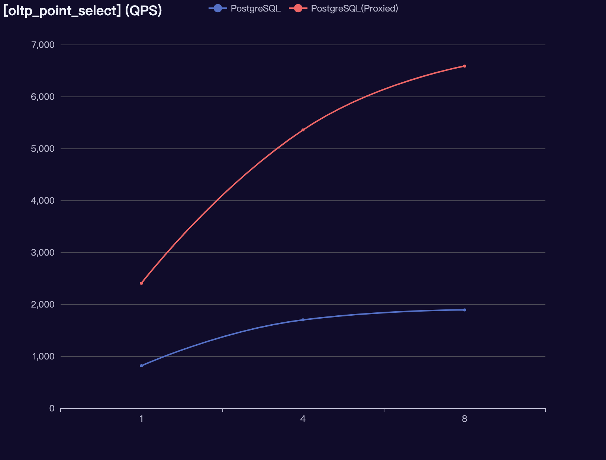
  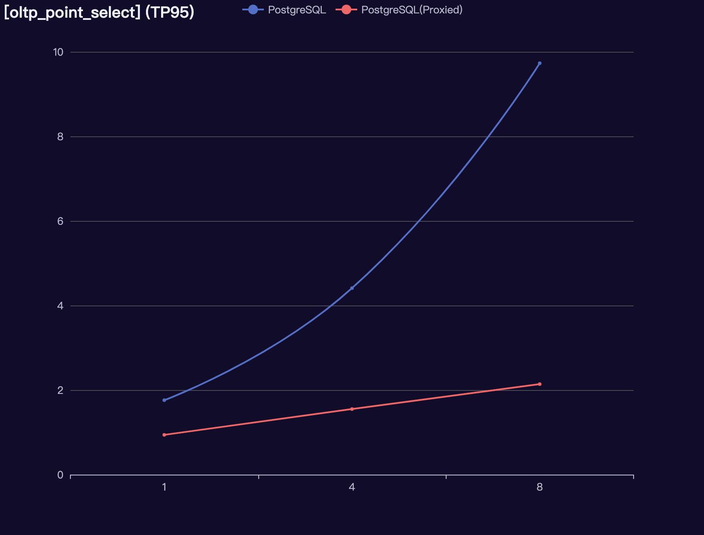</div>

<div align=right></div>

​		对于点查来说，当采用缓存服务代理上游数据库时，无论是QPS还是TP95指标都是碾压，那么基于数据库并且基于主键索引的点查本省就相对比较客观。随着并发数的增加，性能指标表现很好（本地测试由于环境受限，没有测试并发数的增加至拐点处的性能）。

#### 3.1.4.2 oltp_read_only

<div align=center>
  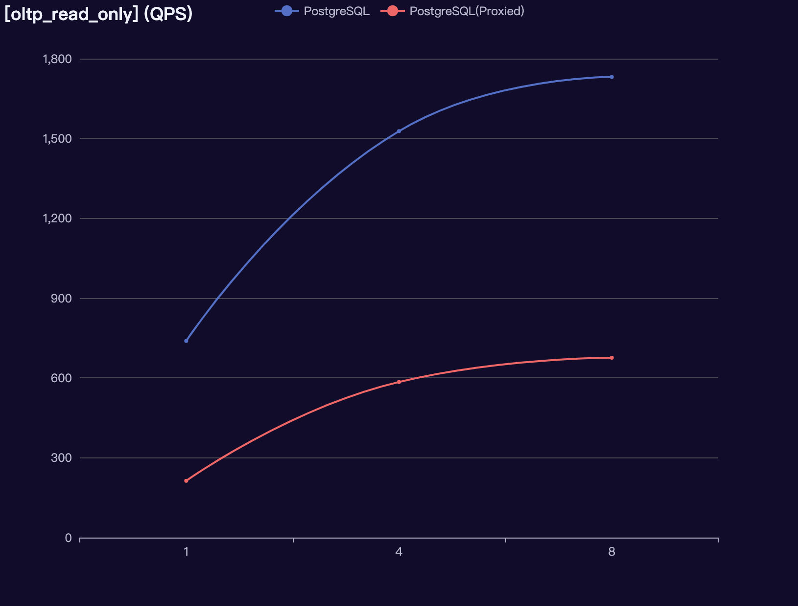
  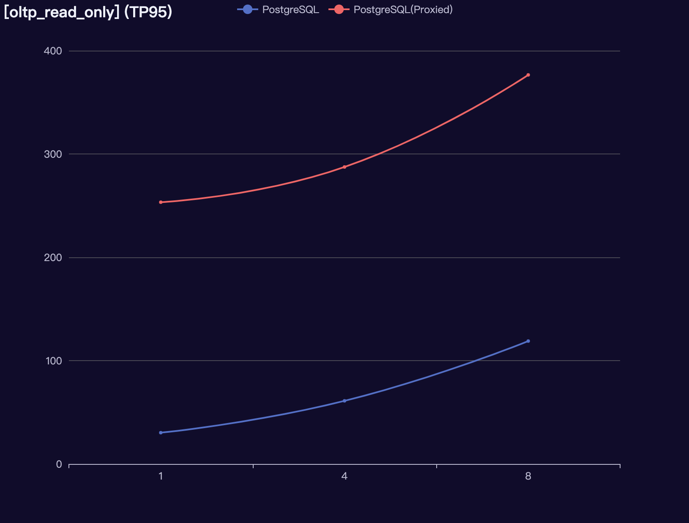
</div>

​		该测试用例主要包括：基于主键点查，基于主键范围查询（连续区间），基于主键下的范围查询（连续区间）聚合，基于主键下的范围查询（连续区间）排序和去重。对于第一种在oltp_point_select上已经讨论过，这里主要讨论后三种，对于后三种情况来说都是基于`BETWEEN ? AND ?`，这种情况和select_random_ranges类似，但是不同的是属于单路类型的范围查询（连续区间）。

​		对于ReadySet在当前`main`分支下的是不支持的，特别是这种`BETWEEN ? AND ?`查询。

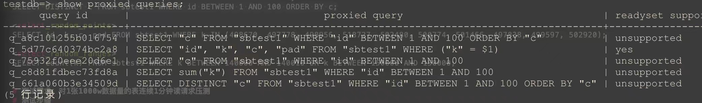

​		但是在ReadySet的`beta-2023-07-26`release tag版本支持的，可以连接缓存服务执行此类请求，然后通过`show proxied queries`指令查询如下：

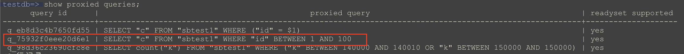

​		整体来说缓存服务下关键性能指标不及数据库自身，原因大致同select_random_ranges，可以参考《3.1.4.4 select_random_ranges》的分析。

#### 3.1.4.3 select_random_points

<div align=center>
  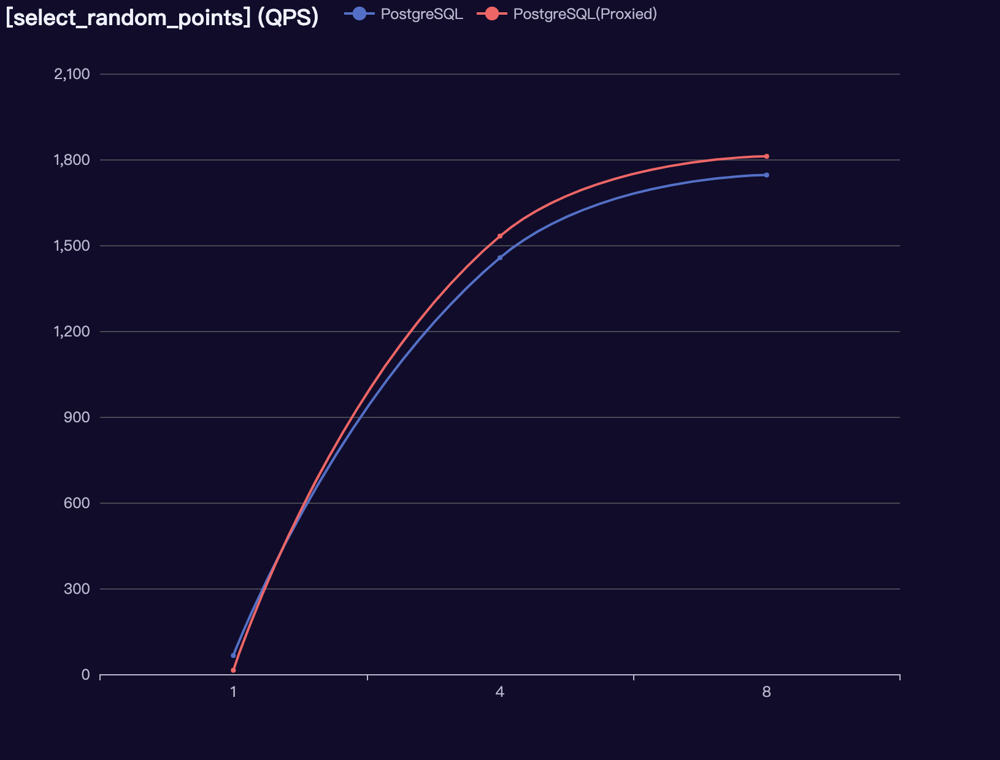
  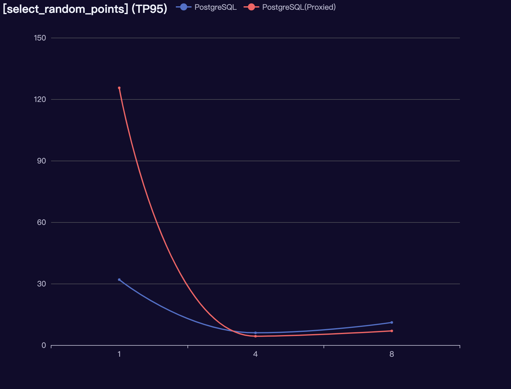
</div>

​		该部分主要考察的是对离散型范围查询，对于数据库而言，基于索引的离散型范围查询来说，只要离散型数量至是少量的基本表现良好，当时并发数增加TP95下降比较明显。

​		对于缓存服务来说，在单并发下表现不及数据库本身，特别是QPS相差较大；但是随着并发数的增加QPS基本可以持平，甚至表现稍好。在TP95方面同时逐步稍优于数据库本身，这主要是因为随着并发读请求的增加，不同查询之间的离散型点位可能会有重叠，会导致某些请求的数据本身就在内存中。理论上，如果内存足够大，内存驱逐发生概率越小，在缓存服务设置内存策略为lru的情况下，对于热点数据的访问效果会非常好。

#### 3.1.4.4 select_random_ranges

<div align=center>
  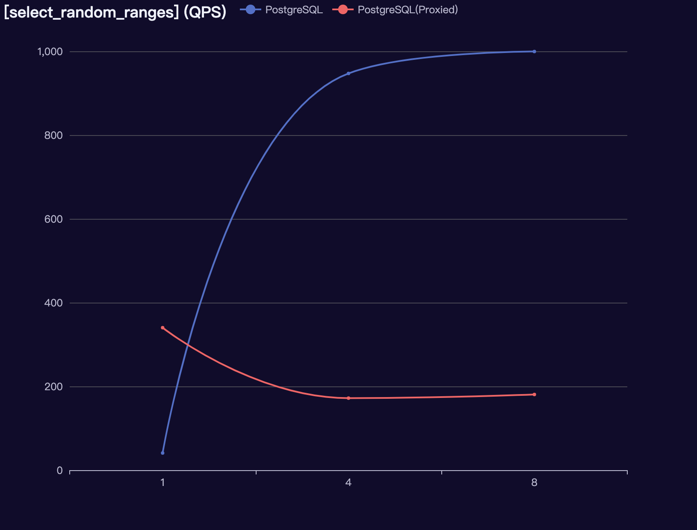
  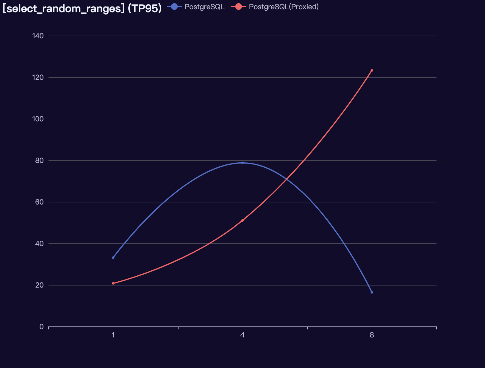
</div>

​		对于“多路条件或”类型的范围查询（连续区间）对于ReadySet在当前`main`分支下的是不支持的，当时通过缓存服务执行请求时，在ReadySet服务日志会有如下异常：

```shell
2023-08-10T08:04:31.438064Z  INFO migration_handler:prepare_select{statement_id=0 create_if_not_exist=true override_schema_search_path=Some([Tiny("postgres"), Tiny("public")])}: readyset_adapter::backend::noria_connector: adding parameterized query query=SELECT count("k") FROM "sbtest1" WHERE "k" BETWEEN 140000 AND 140010 OR "k" BETWEEN 150000 AND 150000 name=q_661a060b3e34509d

2023-08-10T08:04:31.441270Z ERROR migration_handler:prepare_select{statement_id=0 create_if_not_exist=true override_schema_search_path=Some([Tiny("postgres"), Tiny("public")])}: readyset_adapter::backend::noria_connector: add query failed error=Error during RPC (extend_recipe): Failed to plan migration: Operation unsupported: Creation of fully materialized query is forbidden
```

​		如果采用ReadySet的`beta-2023-07-26`release tag版本，是支持这种类似`BETWEEN ? AND ? OR BETWEEN ? AND ?`的查询。可以连接缓存服务执行此类请求，然后通过`show proxied queries`指令查询如下：

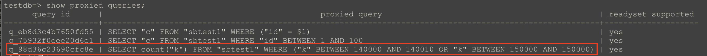

​		当时此类查询被缓存之后，会通过`show caches`命令发现查询的计划是`BETWEEN xxx AND xxx OR BETWEEN xxx AND xxx`，并不是我们所想的`BETWEEN ? AND ? OR BETWEEN ? AND ?`。这样的缺点是当每次执行“多路条件或”类型的范围查询（连续区间）时，这些连续区间如果都不是重合的话，会暂用大量的缓存数据；相反如果这些连续区间之间重合的多，缓存命中率自然也会越高，这增加了缓存指标的不确定性。

​		所以在单并发下，缓存服务表现稍好。随着并发数的增加QPS较数据库呈现下降趋势，TP95较数据库呈现上升趋势，整体性能不及数据库。同时另外一方面缓存服务下平均访问延时较数据库反而异常不算太大。这也说明这种随机型的“多路条件或”类型的范围查询（连续区间）的用例对于缓存时不太友好的，因为该测试用例关注是随机性，而随机性越不确定想对于缓存命中率会有很大影响，所以这里更多关注平均访问延时。

### 3.1.5 注意事项

​		在本地进行性能压测时建议不要将数据库服务和缓存服务分别通过Docker容器进行部署。下面是通过这种方式进行压测所提供的一组参考数据。

​		压测上游数据库服务结果如下：

| Test Point               | Thread | QPS     | TP95（ms） |
| ------------------------ | ------ | ------- | ---------- |
| **oltp_point_select**    | 1      | 648.70  | 2.91       |
|                          | 4      | 1367.30 | 6.21       |
|                          | 8      | 1583.73 | 12.30      |
| **oltp_read_only**       | 1      | 616.89  | 41.85      |
|                          | 4      | 1143.77 | 116.80     |
|                          | 8      | 1610.70 | 130.13     |
| **select_random_points** | 1      | 65.39   | 25.28      |
|                          | 4      | 1294.50 | 6.21       |
|                          | 8      | 1732.25 | 10.27      |
| **select_random_ranges** | 1      | 52.61   | 29.19      |
|                          | 4      | 845.54  | 11.04      |
|                          | 8      | 867.74  | 20.00      |

​		压测代理服务结果如下：

| Test Point               | Thread | QPS     | TP95（ms） |
| ------------------------ | ------ | ------- | ---------- |
| **oltp_point_select**    | 1      | 482.54  | 3.02       |
|                          | 4      | 1137.41 | 6.43       |
|                          | 8      | 1154.88 | 12.52      |
| **oltp_read_only**       | 1      | 377.20  | 61.08      |
|                          | 4      | 599.89  | 155.80     |
|                          | 8      | 614.25  | 297.92     |
| **select_random_points** | 1      | 65.39   | 25.21      |
|                          | 4      | 273.86  | 27.17      |
|                          | 8      | 288.33  | 55.82      |
| **select_random_ranges** | 1      | 36.07   | 36.24      |
|                          | 4      | 194.97  | 38.94      |
|                          | 8      | 234.34  | 56.84      |

​		数据表明方式压缩的结果下缓存服务各项指标相对数据库并没有优势，原因大概率来自容器间网络通信的损耗。