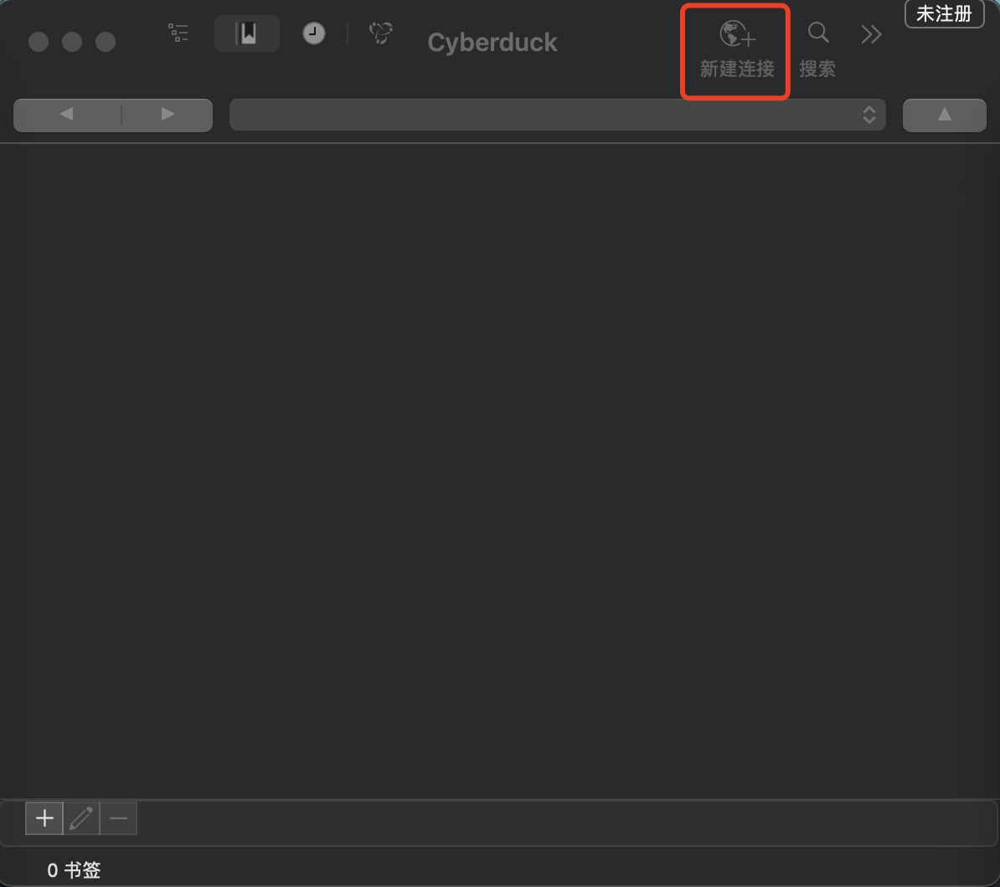
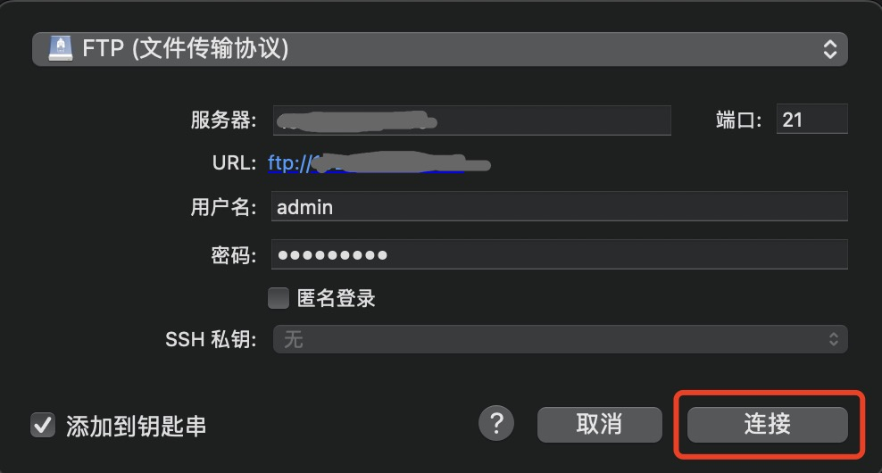
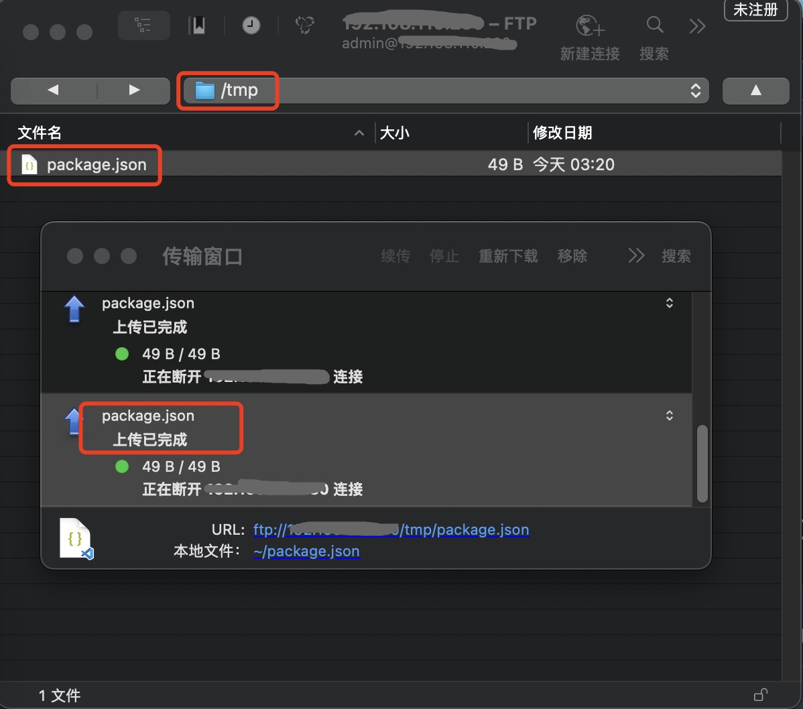
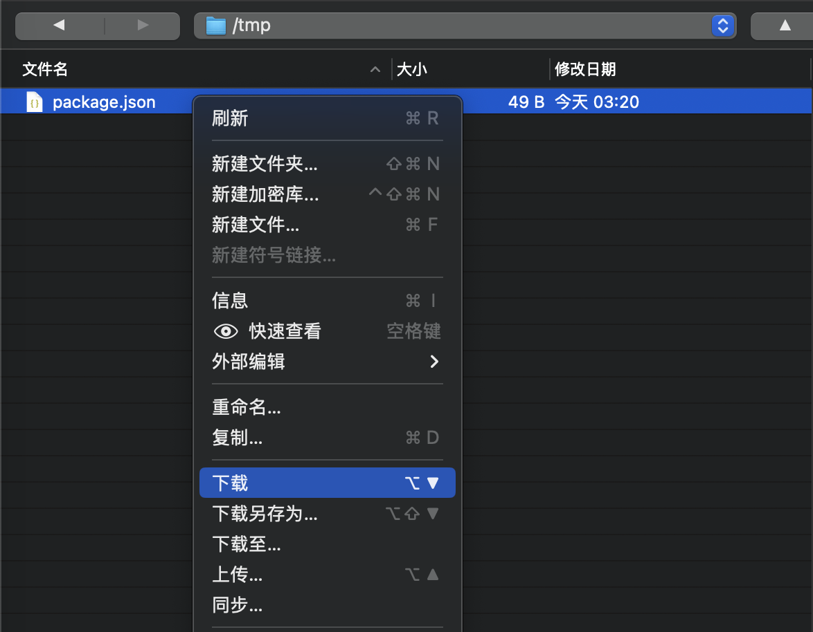
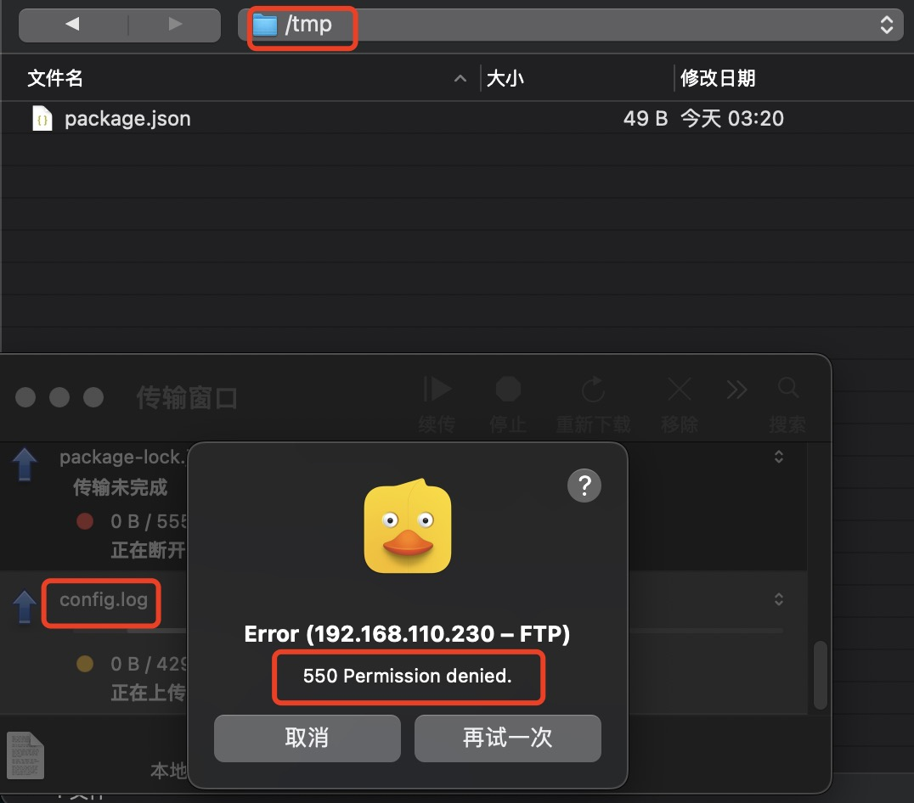

# 服务部署

> 该FTP服务部署主要基于Ubuntu操作系统，并且通过vsftpd完成服务搭建。

（0）安装依赖库

```shell
sudo apt install vsftpd
```

（1）创建账号和密码

​	vsftpd支持**匿名用户**、**系統用户**和**虛拟用户**三类账号登陆。

​	1⃣️ 匿名用户：不用登陆FTP服务器端即可访问其中资源，这种类型的账号登陆明显存在安全问题。

​	2⃣️ 系统用户（实际操作系统真实用户）：访问可以解决匿名用户带来的安全问题，但是系统用户通过系统账号和系统密码也可以登录操作系统，对操作系统依然存在安全隐患。

​	3⃣️ 虛拟用户：在实际生产环境中大多使用虛拟用户访问ftp服务器。

​	基于安全考虑通常采用虛拟用户方式的，通常是多个虚拟用户映射一个系统用户，虚拟用户和所映射的系统用户均不能登陆linux系统，用户只能通过虚拟用户登陆ftp服务器，这样大大提高了系统安全性。

​	本次搭建下面配置三个用户：

​	1⃣️ 管理员：可以添加、删除、下载和重命名FTP服务器端文件。

​	2⃣️ 普通用户：下载FTP服务端文件。

​	首先创建存储虚拟用户账号和密码的文件，并添加虛拟用户账号和密码。

```shell
tee /etc/vsftpd/virtusers <<-'EOF'
user1
user1@123
user2
user2@123
admin
admin@123
EOF
# cat /etc/vsftpd/virtusers
```

> 第一行用户名，第二行密码，以此类推，用户名不能使用root为用户名。

​	基于上面所创建的虚拟用户账号和密码的文件生成数据库文件，对该文件进行了hash加密。

```shell
sudo apt-get install db-util
db_load -T -t hash -f /etc/vsftpd/virtusers /etc/vsftpd/virtusers.db
```

> 创建完毕之后，/etc/vsftpd/virtusers文件可以删除。

​	清空/etc/pam.d/vsftpd内容，添加如下配置：

```shell
cat > /etc/pam.d/vsftpd << EOF
auth         required      pam_userdb.so db=/etc/vsftpd/virtusers
account      required      pam_userdb.so db=/etc/vsftpd/virtusers
EOF
# cat /etc/pam.d/vsftpd
```

（2）用户权限

​	给不同的虚拟用户创建指定各自权限。

​	创建文件目录

```shell
mkdir -p /etc/vsftpd/vconf
```

​	分别给三个用户创建各自权限文件。

```shell
# ######################
# 管理员权限（admin）
# ######################
tee /etc/vsftpd/vconf/admin <<-'EOF'
write_enable=YES
anon_world_readable_only=NO
download_enable=YES
anon_upload_enable=YES
anon_mkdir_write_enable=YES
anon_other_write_enable=YES
EOF
# cat /etc/vsftpd/vconf/admin

# ######################
# 普通用户权限（user1）
# ######################
tee /etc/vsftpd/vconf/user1 <<-'EOF'
anon_world_readable_only=NO
EOF
# cat /etc/vsftpd/vconf/user1

# ######################
# 普通用户权限（user2）
# ######################
tee /etc/vsftpd/vconf/user2 <<-'EOF'
anon_world_readable_only=NO
EOF
# cat /etc/vsftpd/vconf/user2
```

（3）系统用户

```shell
useradd ftpuser -d /home/share -s /sbin/nologin
# su - root
# mkdir /home/share
# chown -R ftpuser /home/share
```

​	这里的ftpuser为操作系统真实的用户名，该用户名就是多个虚拟用户所映射的系统用户账号，-d表示用于指定系统用户登入时的起始目录，这里为所有虛拟用户登陆ftp服务器的起始目录，即ftp上传下载根目录，-s用于设置该用户不可登录系统，因此无需为该用户设置密码；该命令执行后将创建/home/share目录，share文件夹所有者为ftpuser。

​	创建默认用户文件：

```shell
sudo touch /etc/vsftpd.user_list && sudo chmod 600 /etc/vsftpd.user_list
```

（4）配置文件

​	配置主要在/etc/vsftpd.conf，具体修改如下：

```shell
# [修改] 关闭匿名用户登录，不影向虚拟用户登陆
anonymous_enable=NO

# [修改] 允许登录用户是否有写杈限
write_enable=NO

# [修改] 是否允许匿名上传文件
anon_upload_enable=NO

# [修改] 是否允许匿名创建和删除目录
anon_mkdir_write_enable=No

# [添加] 是否允许匿名其他亏操作，如:文件重命名、文件删除和文件覆盖
anon_other_write_enable=NO

# [修改]
chown_uploads=NO

# [修改]
async_abor_enable=YES

# [修改]
ascii_upload_enable=YES

# [修改]
ascii_download_enable=YES

# [修改]
ftpd_banner=Welcome to blah FTP service.

# [修改]
ls_recurse_enable=NO

# [修改]
listen=YES

# [注释]
# 否则提示500 00PS: run two copies ofvsftpd for IPv4 and IPv6错误
# listen_ipv6=YES

# [修改] 
# 表示指定pam服务名，该名称对应于/etc/pam.d/vsftpd文件的文件名，登录FTP服务器时依据此文件的内容进行用户名和密码认证
pam_service_name=vsftpd

# [添加] vsftpd.user_1ist和ftpusers配置文件里的用户禁止访问ftp，恰称黑名单
userlist_enable=YES

# [添加] 是否开启限制IP登录功能
tcp_wrappers=YES

# [添加] 指定端口号
listen_port=21

# [添加] 指定虚拟用户配買文件所在目录
user_config_dir=/etc/vsftpd/vconf

# [添加] 开启虛拟用户
guest_enable=YES

# [添加] 指定虚拟用户所映射的系统用户
guest_username=ftpuser

# [添加] 在2.3.5版本之后增强了安全检查，如果系统用户只能访问ftp根目录及其子目录
allow_writeable_chroot=YES
```

（5）修改selinux策略

```shell
# sudo setenforce 0
setsebool -P ftpd_full_access 1
```

​	如果不修改，则会有如下错误：

```shell
SELinux is preventing vsftpd from using the dac_read_search capability.
```

（6）开放端口

​	推荐关闭防火墙。如果没有关闭防火墙需要开放FTP端口，默认情况下是21端口。

​	CentOS操作系统如下：

```shell
firewall-cmd --zone=public --add-port=21/tcp --permanent
firewall-cmd --reload
```

​	Ubuntu操作系统如下：

```shell
sudo ufw allow 21
# sudo ufw status
```

（7）启动服务

```shell
systemctl restart vsftpd.service
```

​	开启自启

```shell
systemctl enable vsftpd.service
```

​	查看状态

```shell
systemctl status vsftpd.service
```

```shell
● vsftpd.service - vsftpd FTP server
     Loaded: loaded (/lib/systemd/system/vsftpd.service; enabled; vendor preset: enabled)
     Active: active (running) since Mon 2024-05-06 08:22:02 UTC; 6min ago
   Main PID: 3028468 (vsftpd)
      Tasks: 1 (limit: 77009)
     Memory: 868.0K
        CPU: 6ms
     CGroup: /system.slice/vsftpd.service
             └─3028468 /usr/sbin/vsftpd /etc/vsftpd.conf
```

​	查看服务端口是否正常

```shell
netstat -anp | grep ":21"
```

# 客户端连接工具

## 如何连接？

​	这里采用[小黄鸭](https://cyberduck.io/)验证部署的FTP服务是否连通。点击右上角【新建连接】，如下图所示：

​	填写连接信息，选择【连接】，连接成功表示部署服务正常，如下图所示：

​	连接成功之后，文件导航栏的“/”表示所进入的目录则是被映射到系统用户所在的家目录下，对应本次部署中的/home/share目录。

## 权限验证

​	在本次部署中所创建的虚拟用户admin是FTP登录用户的管理员，联入后有权限创建目录并上传文件，如下图所示通过管理员用户创建tmp文件夹并上传文件。

​	通过普通用户user联入只可以下载文件，如下图所示：

​	但是普通用户user1无法上传文件，如下图所示：

​	