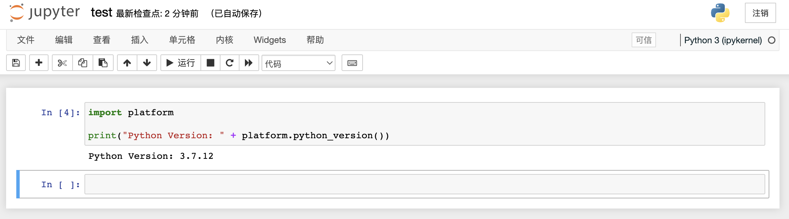

# 如何安装？

​		jupyter可以用作Python的交互式可视化编程平台。这里假定Anaconda已经安装成功，并且已经切换到自己创建的Python虚拟环境中，执行如下命令进行安装：

```shell
pip install jupyter
```

# 如何启动？

​		执行如下命令：

```shell
jupyter notebook		
```

```shell
  _   _          _      _
 | | | |_ __  __| |__ _| |_ ___
 | |_| | '_ \/ _` / _` |  _/ -_)
  \___/| .__/\__,_\__,_|\__\___|
       |_|

Read the migration plan to Notebook 7 to learn about the new features and the actions to take if you are using extensions.

https://jupyter-notebook.readthedocs.io/en/latest/migrate_to_notebook7.html

Please note that updating to Notebook 7 might break some of your extensions.

...

    To access the notebook, open this file in a browser:
        file:///Users/.../Library/Jupyter/runtime/nbserver-33319-open.html
    Or copy and paste one of these URLs:
        http://localhost:8888/?token=ebc6034c83e28782fe7c6ad95ed91cb51f528a8e35ec2211
     or http://127.0.0.1:8888/?token=ebc6034c83e28782fe7c6ad95ed91cb51f528a8e35ec2211
```

​		执行之后会在前台启动一个服务自动跳转到浏览器即可开始编码，注意此时不要关闭这个前台进程。

# 如何使用？

​		选择合适的路径，点击右上角的【新建】->【Python(ipykernel)】跳转到可视化编程页面进行代码编写，然后在需要运行代码的单元格按下`Enter+右Shift`执行代码，大致如下：		

​		执行的代码和结果可以持久化，通过`Ctrl+S`保存为一个*.ipynb的文件。

