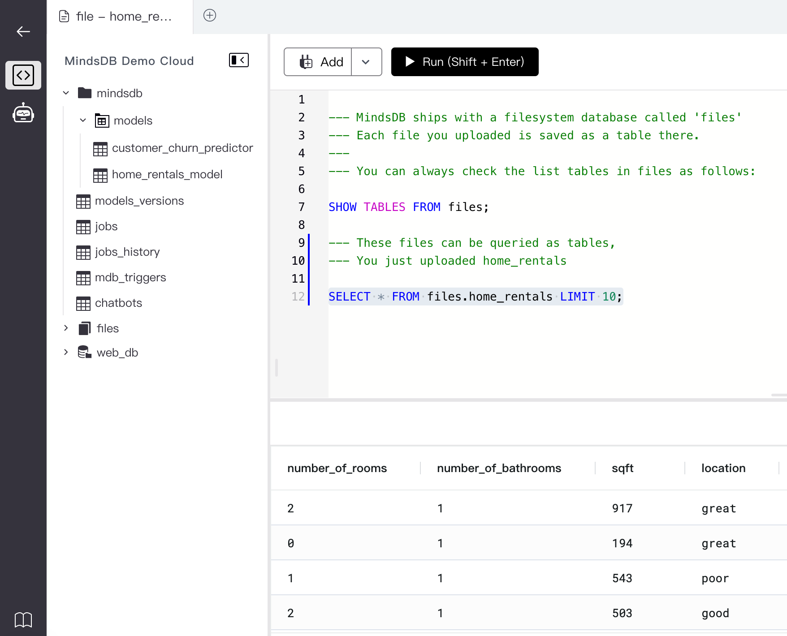

# 前置说明

​		本小节主要探寻如何在MacOS操作系统下通过**源码编译**的方式启动MindsDB服务，已经能够更好的观察该服务的在机器学习中的核心运作流程。

​		关于源码编译部分可以参考：[Setup for Source Code via pip](https://docs.mindsdb.com/setup/self-hosted/pip/source)

​		实验MindsDB版本为：`v23.8.3.0`

# 前置准备

​		【步骤一】安装`Anaconda`环境。（略）

​		【步骤二】安装`pip`环境。（略）

​		【步骤】安装libomp依赖并配置。

```shell
> brew install libomp
> vim ~/.basb_profile

export LDFLAGS="-L/usr/local/opt/libomp/lib"
export CPPFLAGS="-I/usr/local/opt/libomp/include"

> source ~/.basb_profile
```

​		【步骤四】安装libmagic依赖。

```shell
pip install python-magic-bin
brew install libmagic
```

# 源码编译

​		【步骤一】创建虚拟环境。

```shell
conda create -n mindsdb python==3.10.9
conda activate create
```

​		【步骤二】拉取源码。

```shell
git clone https://github.com/mindsdb/mindsdb.git
cd mindsdb
git tag
git checkout v23.8.3.0
```

​		【步骤三】安装相关依赖。

```shell
pip install -r requirements/requirements.txt
pip install --upgrade pip setuptools wheel
python setup.py develop
```

# 安装部署

```shell
export MINDSDB_STORAGE_DIR=/tmp/mindsdb && python -m mindsdb --api http,postgres
```

【注意】		

​	（1）MINDSDB_STORAGE_DIR为指定MindsDB的存储路径，更多的配置参数可以参考：[Environment Variables](https://docs.mindsdb.com/setup/environment-vars)。

​    （2） `--api`参数指定对外服务暴露的方式，这里指定http代表会打开web控制台，指定postgres则可以通过psql客户端工具进行访问。默认情况下是：`--api=http,mysql`。

​	（3）`--config`用来指定启动MindsDB服务所需要的配置文件。默认不配置的情况下，可以参考源码：mindsdb/utilities/config.py#93，大致配置如下：

```python
# ...
api_host = "127.0.0.1" if not self.use_docker_env else "0.0.0.0"
self._default_config = {
  'permanent_storage': {
    'location': 'local'
  },
  'storage_dir': os.environ['MINDSDB_STORAGE_DIR'],
  'paths': paths,
  'auth': {
    'http_auth_enabled': False,
    'username': 'mindsdb',
    'password': ''
  },
  "log": {
    "level": {
      "console": "INFO",
      "file": "DEBUG",
      "db": "WARNING"
    }
  },
  "gui": {
    "autoupdate": True
  },
  "debug": False,
  "environment": "local",
  "integrations": {},
  "api": {
    "http": {
      "host": api_host,
      "port": "47334"
    },
    "mysql": {
      "host": api_host,
      "password": "",
      "port": "47335",
      "database": "mindsdb",
      "ssl": True
    },
    "mongodb": {
      "host": api_host,
      "port": "47336",
      "database": "mindsdb"
    },
    "postgres": {
      "host": api_host,
      "port": "55432",
      "database": "mindsdb"
    }
  },
  "cache": {
    "type": "local"
  }
}
# ...
```

​		

​		成功启动之后，可以访问`http://127.0.0.1:47334/`进入MindsDB控制台，就像下面这个样子：



​		

​		另外一方面，可以通过数据库客户端连接服务端，这里采用psql尝试连接：

```shell
> psql -h localhost -p 55432 -d mindsdb -U mindsdb

mindsdb=> show databases;
      Database
--------------------
 information_schema
 mindsdb
 files
 web
(4 rows)

mindsdb=> show full databases;
      Database      |  TYPE   | ENGINE
--------------------+---------+--------
 information_schema | system  |
 mindsdb            | project |
 files              | data    | files
 web                | data    | web
(4 rows)
```

​		至此安装部署成功！


# 演示案例

​		MindDB可以集成非常多的数据源，为了方便起见，这里采用MindsDB Web控制台文件上传的功能准备训练数据集。点击左上角【Add】->【Upload File】，点击【Import a file】上传数据集，【Datasource name】填写数据集的名称。

​		通过文件上传的数据集会自动进入到MindsDB的files这个catalog下：

```shell
mindsdb=> show full databases;
      Database      |  TYPE   | ENGINE
--------------------+---------+--------
 information_schema | system  |
 mindsdb            | project |
 files              | data    | files
 web                | data    | web
(4 rows)

mindsdb=> use files;
use
mindsdb=> show full tables;
 Tables_in_files | Table_type
-----------------+------------
 home_rentals    | BASE TABLE
 customer_churn  | BASE TABLE
(2 rows)
```


## 回归任务

​		数据集：[home-rentals](./data/home-rentals)

​		数据解释：[home rentals understanding](https://docs.mindsdb.com/sql/tutorials/home-rentals#understanding-the-data)

​	【步骤一】探查数据。

```sql
SELECT * FROM files.home_rentals limit 10;
```

```shell
 number_of_rooms | number_of_bathrooms | sqft | location | days_on_market |  neighborhood  | rental_price
-----------------+---------------------+------+----------+----------------+----------------+--------------
 2               | 1                   | 917  | great    | 13             | berkeley_hills | 3901
 0               | 1                   | 194  | great    | 10             | berkeley_hills | 2042
 1               | 1                   | 543  | poor     | 18             | westbrae       | 1871
 2               | 1                   | 503  | good     | 10             | downtown       | 3026
 3               | 2                   | 1066 | good     | 13             | thowsand_oaks  | 4774
 3               | 2                   | 816  | poor     | 25             | westbrae       | 4382
 0               | 1                   | 461  | great    | 6              | berkeley_hills | 2269
 1               | 1                   | 333  | great    | 6              | south_side     | 2284
 3               | 2                   | 1124 | great    | 9              | south_side     | 5420
 3               | 2                   | 1204 | good     | 7              | downtown       | 5016
(10 rows)
```

​	【步骤二】训练数据生成模型。

```sql
CREATE MODEL mindsdb.home_rentals_model
FROM files
  (SELECT * FROM home_rentals)
PREDICT rental_price;
```

​	【步骤三】查看模型。

```sql
-- 方法一
DESCRIBE mindsdb.home_rentals_model;

-- 方法二
SHOW MODELS
FROM mindsdb
LIKE 'home_rentals_model';
-- WHERE status = 'complete';

-- 方法三
SELECT * FROM mindsdb.models where name = 'home_rentals_model';
```

```shell
        NAME        |  ENGINE   | PROJECT | VERSION |  STATUS  | ACCURACY |   PREDICT    | UPDATE_STATUS | MINDSDB_VERSION | ERROR |     SELECT_DATA_QUERY      |      TRAINING_OPTIONS      | CURRENT_TRAINING_PHASE | TOTAL_TRAINING_PHASES | TRAINING_PHASE_NAME | TAG | CREATED_AT | TRAINING_TIME
--------------------+-----------+---------+---------+----------+----------+--------------+---------------+-----------------+-------+----------------------------+----------------------------+------------------------+-----------------------+---------------------+-----+------------+---------------
 home_rentals_model | lightwood | mindsdb | 1       | complete | 0.999    | rental_price | up_to_date    | 23.8.3.0        |       | SELECT * FROM home_rentals | {'target': 'rental_price'} | 5                      | 5                     | Complete            |     | 2023-08-29 | 3.514
(1 row)
```

​		还可以通过如下方法，快速查看模型具体信息。

```sql
describe mindsdb.home_rentals_model.info;
describe mindsdb.home_rentals_model.features;
describe mindsdb.home_rentals_model.model;
describe mindsdb.home_rentals_model.jsonai;
```

​	【步骤四】模型预测（单条）。

```sql
SELECT 
  rental_price,
  rental_price_explain
FROM mindsdb.home_rentals_model
WHERE number_of_bathrooms = 2
AND sqft = 1000;
```

```shell
 rental_price |                                                             rental_price_explain
--------------+-----------------------------------------------------------------------------------------------------------------------------------------------
 6583         | {"predicted_value": 6583, "confidence": 0.99, "anomaly": null, "truth": null, "confidence_lower_bound": 6487, "confidence_upper_bound": 6679}
(1 row)
```

​	【步骤五】模型预测（批量）。

```sql
SELECT
  d.rental_price as y,
  m.rental_price as y_head,
  m.rental_price_explain
FROM mindsdb.home_rentals_model AS m
JOIN files.home_rentals AS d;
```


## 分类任务

​		数据集：[customer-churn](./data/customer-churn)

​		数据解释：[customer churn understanding](https://docs.mindsdb.com/sql/tutorials/customer-churn#understanding-the-data)

​	【步骤一】探查数据。

```sql
SELECT * FROM files.customer_churn LIMIT 10;
```

```shell
 customerid | gender | seniorcitizen | partner | dependents | tenure | phoneservice |  multiplelines   | internetservice | onlinesecurity | onlinebackup | deviceprotection | techsupport | streamingtv | streamingmovies |    contract    | paperlessbilling |       paymentmethod       | monthlycharges | totalcharges | churn
------------+--------+---------------+---------+------------+--------+--------------+------------------+-----------------+----------------+--------------+------------------+-------------+-------------+-----------------+----------------+------------------+---------------------------+----------------+--------------+-------
 7590-VHVEG | Female | 0             | Yes     | No         | 1      | No           | No phone service | DSL             | No             | Yes          | No               | No          | No          | No              | Month-to-month | Yes              | Electronic check          | $29.85         | $29.85       | No
 5575-GNVDE | Male   | 0             | No      | No         | 34     | Yes          | No               | DSL             | Yes            | No           | Yes              | No          | No          | No              | One year       | No               | Mailed check              | $56.95         | $1,889.50    | No
 3668-QPYBK | Male   | 0             | No      | No         | 2      | Yes          | No               | DSL             | Yes            | Yes          | No               | No          | No          | No              | Month-to-month | Yes              | Mailed check              | $53.85         | $108.15      | Yes
 7795-CFOCW | Male   | 0             | No      | No         | 45     | No           | No phone service | DSL             | Yes            | No           | Yes              | Yes         | No          | No              | One year       | No               | Bank transfer (automatic) | $42.30         | $1,840.75    | No
 9237-HQITU | Female | 0             | No      | No         | 2      | Yes          | No               | Fiber optic     | No             | No           | No               | No          | No          | No              | Month-to-month | Yes              | Electronic check          | $70.70         | $151.65      | Yes
 9305-CDSKC | Female | 0             | No      | No         | 8      | Yes          | Yes              | Fiber optic     | No             | No           | Yes              | No          | Yes         | Yes             | Month-to-month | Yes              | Electronic check          | $99.65         | $820.50      | Yes
 1452-KIOVK | Male   | 0             | No      | Yes        | 22     | Yes          | Yes              | Fiber optic     | No             | Yes          | No               | No          | Yes         | No              | Month-to-month | Yes              | Credit card (automatic)   | $89.10         | $1,949.40    | No
 6713-OKOMC | Female | 0             | No      | No         | 10     | No           | No phone service | DSL             | Yes            | No           | No               | No          | No          | No              | Month-to-month | No               | Mailed check              | $29.75         | $301.90      | No
 7892-POOKP | Female | 0             | Yes     | No         | 28     | Yes          | Yes              | Fiber optic     | No             | No           | Yes              | Yes         | Yes         | Yes             | Month-to-month | Yes              | Electronic check          | $104.80        | $3,046.05    | Yes
 6388-TABGU | Male   | 0             | No      | Yes        | 62     | Yes          | No               | DSL             | Yes            | Yes          | No               | No          | No          | No              | One year       | No               | Bank transfer (automatic) | $56.15         | $3,487.95    | No
(10 rows)
```

​	【步骤二】模型训练。

```sql
CREATE MODEL mindsdb.customer_churn_predictor
FROM files
  (SELECT * FROM customer_churn)
PREDICT churn;
```

​	【步骤三】查看模型。

```sql
DESCRIBE mindsdb.customer_churn_predictor;
```

```shell
           NAME           |  ENGINE   | PROJECT | ACTIVE | VERSION |   STATUS   | ACCURACY | PREDICT | UPDATE_STATUS | MINDSDB_VERSION | ERROR |      SELECT_DATA_QUERY       |  TRAINING_OPTIONS   | TAG
--------------------------+-----------+---------+--------+---------+------------+----------+---------+---------------+-----------------+-------+------------------------------+---------------------+-----
 customer_churn_predictor | lightwood | mindsdb | true   | 1       | generating |          | churn   | up_to_date    | 23.8.3.0        |       | SELECT * FROM customer_churn | {'target': 'churn'} |
(1 row)
```

​	【步骤四】模型预测（单条）。

```sql
SELECT churn, churn_confidence, churn_explain
FROM mindsdb.customer_churn_predictor
WHERE seniorcitizen=0
AND partner='Yes'
AND dependents='No'
AND tenure=1
AND phoneservice='No'
AND multiplelines='No phone service'
AND internetservice='DSL'
AND contract='Month-to-month'
AND monthlycharges=29.85
AND totalcharges=29.85
AND onlinebackup='Yes'
AND onlinesecurity='No'
AND deviceprotection='No'
AND techsupport='No'
AND streamingtv='No'
AND streamingmovies='No'
AND paperlessbilling='Yes'
AND paymentmethod='Electronic check';
```

```shell
 churn |  churn_confidence  |                                                                        churn_explain
-------+--------------------+--------------------------------------------------------------------------------------------------------------------------------------------------------------
 No    | 0.3465346534653465 | {"predicted_value": "No", "confidence": 0.3465346534653465, "anomaly": null, "truth": null, "probability_class_No": 0.5917, "probability_class_Yes": 0.4083}
(1 row)
```

​	【步骤五】模型预测（批量）。

```sql
SELECT 
  t.customerid, 
  t.contract, 
  t.monthlycharges, 
  t.churn as y, 
  m.churn as y_predict,
  m.churn_confidence
FROM mindsdb.customer_churn_predictor AS m
JOIN files.customer_churn AS t
LIMIT 5;
```

```shell
 customerid |    contract    | monthlycharges |  y  | y_predict |   churn_confidence
------------+----------------+----------------+-----+-----------+----------------------
 7795-CFOCW | One year       | $42.30         | No  | No        | 0.6534653465346535
 6388-TABGU | One year       | $56.15         | No  | No        | 0.801980198019802
 7469-LKBCI | Two year       | $18.95         | No  | No        | 0.8217821782178217
 3655-SNQYZ | Two year       | $113.25        | No  | No        | 0.7524752475247525
 8191-XWSZG | One year       | $20.65         | No  | No        | 0.8217821782178217
```

